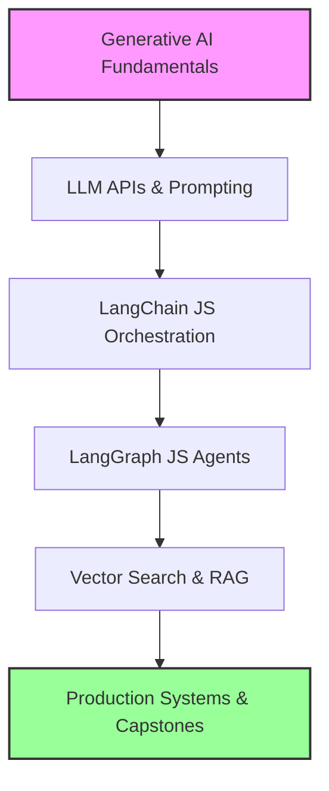

# Full-Stack AI Engineering for MERN Developers
### A Complete JS/TS Guide to Generative AI, LangChain, LangGraph, RAG, and Agents

Welcome to **Full-Stack AI Engineering for MERN Developers**. This course is specifically designed for intermediate-to-advanced JavaScript and TypeScript engineers who want to expand their capabilities from traditional web development (MERN stack) to building production-ready AI applications.

You will NOT need to learn Python. This course is taught entirely using **Node.js, TypeScript, React, and modern JS AI orchestration tools** (LangChain, LangGraph, pgvector, etc.).

---

## Course Overview

The GenAI landscape is shifting rapidly. While Python remains dominant in data science and model training, **JavaScript and TypeScript dominate application development**. As a MERN developer, you already possess 80% of the skills required to build production AI systems. This course covers the remaining 20%: orchestration, embeddings, vector databases, agentic design patterns, and deployment.

### Course Roadmap & Architecture



---

## Study Plan (8-Week Curriculum)

| Week | Chapters | Core Topic | Projects Built |
|---|---|---|---|
| **Week 1** | 1 - 5 | AI Core & Vector Mathematics | String Tokenizer, Distance Visualizer |
| **Week 2** | 6 - 8 | Models Control & MCP | Local File Context MCP Server |
| **Week 3** | 9 - 13 | LLM APIs & Prompting | SSE Streaming Server, Prompt Injection Shield |
| **Week 4** | 14 - 18 | LangChain JS Orchestration | Automated Article Generator Pipeline |
| **Week 5** | 19 - 22 | LangGraph Stateful Graphs | Customer Service Billing Stateful Bot |
| **Week 6** | 23 - 26 | Retrieval-Augmented Generation (RAG) | Local PDF Semantic Retriever |
| **Week 7** | 27 - 28 | Vector Databases | pgvector-based Document Store API |
| **Week 8** | 29 - 34 | Production Agents & Capstones | Dockerized API Server with Redis Semantic Cache |

---

## Detailed Course Syllabus (Module-Wise Summary)

Below is the complete module-wise breakdown. Each chapter lists its click-to-open file link along with a high-density revision checklist and code snippets.

---

### MODULE 1: Generative AI Fundamentals

#### ## 01. Introduction to AI Engineering
🔗 **Full Lesson:** [01_Introduction.md](./01_Introduction.md)

* **What**: Introduces the paradigm shift from traditional, deterministic programming (rules + data = answers) to probabilistic AI programming (data + answers = rules).
* **Why It Exists**: Helps developers understand that LLM systems behave probabilistically rather than deterministically, requiring guardrails, validators, and retry logic.
* **Key Concepts**:
  * **Probabilistic Execution**: Output tokens are generated based on probability distributions, which can lead to variance.
  * **Secure Proxy Pattern**: LLM APIs must be wrapped in a secure backend proxy to protect API keys from client-side exposure.
  * **Error and Variance Handling**: Introduces schemas like Zod to validate LLM outputs at runtime.

##### Key Commands / Code Example:
```typescript
// Raw Node fetch communication with OpenAI
const response = await fetch("https://api.openai.com/v1/chat/completions", {
  method: "POST",
  headers: {
    "Authorization": `Bearer ${process.env.OPENAI_API_KEY}`,
    "Content-Type": "application/json"
  },
  body: JSON.stringify({
    model: "gpt-4o-mini",
    messages: [{ role: "user", content: "Explain AI engineering in one sentence." }]
  })
});
const data = await response.json();
console.log(data.choices[0].message.content);
```

> [!IMPORTANT]
> Never call LLM APIs directly from the frontend; always proxy requests through a secure Node.js server.

---

#### ## 02. What is AI, ML, and DL?
🔗 **Full Lesson:** [02_What_is_AI_ML_DL.md](./02_What_is_AI_ML_DL.md)

* **What**: Explains deep learning from first principles, covering artificial neurons, weights, biases, and backpropagation.
* **Why It Exists**: Lays the foundation for how neural networks learn patterns and optimize parameters to predict outputs.
* **Key Concepts**:
  * **Neuron Architecture**: $Y = \text{Activation}(\sum(X_i \cdot W_i) + B)$.
  * **Gradient Descent**: Optimizes weights and biases by descending the error curve using calculated gradients.
  * **Loss Functions**: Calculates the distance between model predictions and actual ground truths.

##### Key Commands / Code Example:
```typescript
// Single Neuron Simulator in TypeScript
class Neuron {
  weight = 0.5;
  bias = 0.1;
  train(input: number, target: number, learningRate = 0.1) {
    const prediction = input * this.weight + this.bias;
    const error = target - prediction;
    // Update weights and biases based on direction of error
    this.weight += error * input * learningRate;
    this.bias += error * learningRate;
  }
}
```

> [!NOTE]
> Deep learning layers stack these basic calculations to form complex, non-linear representation spaces.

---

#### ## 03. Transformers and Attention
🔗 **Full Lesson:** [03_Transformers_and_Attention.md](./03_Transformers_and_Attention.md)

* **What**: Details the Transformer architecture, showing how Self-Attention processes relationships between tokens in a sequence.
* **Why It Exists**: Explains why Transformers replaced RNNs by enabling parallel training on large datasets without sequential bottlenecks.
* **Key Concepts**:
  * **Self-Attention**: Computes relationship scores between all tokens in a sequence.
  * **Q, K, V Vectors**: Queries (what I search for), Keys (what I contain), and Values (what I represent) vectors.
  * **Quadratic Scaling**: The attention matrix calculation scales quadratically ($O(N^2)$) with sequence length.

##### Key Commands / Code Example:
```typescript
// Simulating Q, K, V Attention Matrix Calculator
function calculateAttention(Q: number[], K: number[], V: number[]): number {
  // Dot product of Q and K
  const dotProduct = Q.reduce((sum, val, idx) => sum + val * K[idx], 0);
  const scale = Math.sqrt(Q.length);
  const score = Math.exp(dotProduct / scale); // Softmax exponent approximation
  return score * V[0]; // Weighted representation
}
```

> [!WARNING]
> Because self-attention complexity scales quadratically ($O(N^2)$), running long context prompts significantly increases latency and computational costs.

---

#### ## 04. Tokens and Tokenization
🔗 **Full Lesson:** [04_Tokens_and_Tokenization.md](./04_Tokens_and_Tokenization.md)

* **What**: Explains how Byte-Pair Encoding (BPE) splits text strings into numeric tokens before they are processed by LLMs.
* **Why It Exists**: Crucial for managing LLM context window limits, predicting API costs, and avoiding runtime context overflows.
* **Key Concepts**:
  * **BPE Algorithm**: Recursively merges the most frequent byte pairs to build a vocabulary.
  * **Token-to-Word Ratio**: 1 word is roughly equivalent to 1.3 tokens in English.
  * **Context Limits**: Prompt size + generation size must stay within the model's token limits.

##### Key Commands / Code Example:
```typescript
import { encodingForModel } from "js-tiktoken";
const encoder = encodingForModel("gpt-4o-mini");
const tokens = encoder.encode("Hello, full-stack AI engineer!");
console.log(`Tokens count: ${tokens.length}`);
console.log(`Tokens IDs: ${JSON.stringify(tokens)}`);
```

> [!IMPORTANT]
> Non-English characters and code syntax require more tokens per word, which can drain your token budget faster than standard English text.

---

#### ## 05. Embeddings and Vector Search
🔗 **Full Lesson:** [05_Embeddings_and_Vector_Search.md](./05_Embeddings_and_Vector_Search.md)

* **What**: Details how text snippets are converted into high-dimensional vector spaces to calculate semantic similarity.
* **Why It Exists**: Forms the foundation of Vector Search and Retrieval-Augmented Generation (RAG) systems.
* **Key Concepts**:
  * **Vector Embeddings**: Lists of numbers (e.g., 1536 dimensions) representing the semantic meaning of text.
  * **Cosine Similarity**: Measures the angle between two vectors, regardless of their magnitude: $\cos(\theta) = \frac{A \cdot B}{\|A\| \|B\|}$.
  * **Semantic Search**: Matches queries based on meaning rather than exact keywords.

##### Key Commands / Code Example:
```typescript
// Cosine Similarity Calculator in TypeScript
function cosineSimilarity(vecA: number[], vecB: number[]): number {
  let dotProduct = 0, normA = 0, normB = 0;
  for (let i = 0; i < vecA.length; i++) {
    dotProduct += vecA[i] * vecB[i];
    normA += vecA[i] * vecA[i];
    normB += vecB[i] * vecB[i];
  }
  return dotProduct / (Math.sqrt(normA) * Math.sqrt(normB));
}
```

> [!NOTE]
> Cosine similarity values range from -1 (opposite meaning) to 1 (identical meaning). Most embedding models return values between 0.0 and 1.0.

---

#### ## 06. Generation Control
🔗 **Full Lesson:** [06_Generation_Control.md](./06_Generation_Control.md)

* **What**: Explains how logits and parameters like Temperature and Top P control the randomness of token generation.
* **Why It Exists**: Crucial for configuring model outputs, from structured database writes (highly deterministic) to creative copywriting (highly creative).
* **Key Concepts**:
  * **Logits**: Raw, unnormalized prediction scores output by the model.
  * **Temperature**: Scales logit distributions before Softmax. Low temperature increases determinism, while high temperature increases randomness.
  * **Top P (Nucleus Sampling)**: Restricts token selections to the smallest set of tokens whose cumulative probability is $\ge P$.

##### Key Commands / Code Example:
```typescript
// Softmax Scaling simulation with Temperature
function softmaxWithTemp(logits: number[], temperature: number): number[] {
  const scaledLogits = logits.map(l => Math.exp(l / temperature));
  const sum = scaledLogits.reduce((s, v) => s + v, 0);
  return scaledLogits.map(v => v / sum);
}
```

> [!WARNING]
> Do not set both Temperature and Top P concurrently. Adjust one parameter and leave the other at its default value.

---

#### ## 07. Function Calling and Structured Outputs
🔗 **Full Lesson:** [07_Function_Calling_and_Structured_Outputs.md](./07_Function_Calling_and_Structured_Outputs.md)

* **What**: Shows how to construct JSON schemas to define tools and force models to output structured data.
* **Why It Exists**: Connects LLMs to databases, external APIs, and code systems using structured schemas.
* **Key Concepts**:
  * **Tool Binding**: Registering functions with descriptions so the model can choose when to run them.
  * **Structured Outputs**: Forcing the model to output data that matches a schema (e.g., Zod schema).
  * **JSON Mode**: Restricts outputs to valid JSON strings.

##### Key Commands / Code Example:
```typescript
import { z } from "zod";
// Define a schema for structured validation
const TicketSchema = z.object({
  urgency: z.enum(["LOW", "MEDIUM", "HIGH"]),
  summary: z.string(),
  tags: z.array(z.string())
});
// Example validating raw LLM response
const parsed = TicketSchema.parse(JSON.parse(rawLlmString));
```

> [!IMPORTANT]
> Function calling does not execute code; the model output contains a JSON string of arguments that you must parse and execute securely.

---

#### ## 08. Model Context Protocol (MCP)
🔗 **Full Lesson:** [08_Model_Context_Protocol_MCP.md](./08_Model_Context_Protocol_MCP.md)

* **What**: Introduces the open standard protocol created by Anthropic for connecting LLMs to data sources, filesystems, and tools.
* **Why It Exists**: Replaces custom, ad-hoc integrations with a unified Host-Client-Server communication standard.
* **Key Concepts**:
  * **Resources**: Read-only data sources (like database tables or local files).
  * **Prompts**: Built-in templates exposed by the server.
  * **Tools**: Executable functions exposed to the model.

##### Key Commands / Code Example:
```typescript
// Simple JSON-RPC protocol parser wrapper
interface JsonRpcRequest {
  jsonrpc: "2.0";
  method: string;
  params?: any;
  id: number;
}
function formatResponse(id: number, result: any) {
  return JSON.stringify({ jsonrpc: "2.0", result, id });
}
```

> [!IMPORTANT]
> MCP uses standard input/output (stdio) or SSE (HTTP) as transport layers to coordinate secure local tool executions.

---

### MODULE 2 & 3: Working with LLM APIs & Prompt Engineering

#### ## 09. LLM SDKs
🔗 **Full Lesson:** [09_LLM_SDKs.md](./09_LLM_SDKs.md)

* **What**: Details the integration patterns for OpenAI, Anthropic (Claude), and Google (Gemini) SDKs, building a provider-agnostic failover adapter.
* **Why It Exists**: Protects production applications from single-provider downtime or model rate limit blockages.
* **Key Concepts**:
  * **Official SDK Patterns**: Initializing clients and executing completion routines.
  * **Agnostic Mappings**: Wrapping proprietary request formats into a single input structure.
  * **Failover Logic**: Catching rate limits or network issues and falling back to alternative providers.

##### Key Commands / Code Example:
```typescript
class ProviderAdapter {
  async generate(prompt: string): Promise<string> {
    try {
      // Try primary model (OpenAI)
      return await callOpenAI(prompt);
    } catch (err) {
      console.warn("OpenAI failed. Falling back to Gemini...");
      return await callGemini(prompt);
    }
  }
}
```

> [!NOTE]
> Different providers map roles differently; for example, Claude uses `user` and `assistant`, while Gemini uses `user` and `model`.

---

#### ## 10. Streaming and SSE
🔗 **Full Lesson:** [10_Streaming_and_SSE.md](./10_Streaming_and_SSE.md)

* **What**: Configures real-time streaming interfaces using Server-Sent Events (SSE) in Express and Fastify backends.
* **Why It Exists**: Crucial for lowering Time-To-First-Token (TTFT) and providing a responsive user experience.
* **Key Concepts**:
  * **Chunk-by-Chunk Ingestion**: Models yield tokens incrementally using async generators.
  * **Content-Type headers**: Set to `text/event-stream` with caching disabled to prevent buffering.
  * **SSE Protocol format**: Messages must be formatted as `data: { ... }\n\n`.

##### Key Commands / Code Example:
```typescript
// Express handler with Server-Sent Events configuration
app.post("/api/stream", async (req, res) => {
  res.setHeader("Content-Type", "text/event-stream");
  res.setHeader("Cache-Control", "no-cache");
  res.setHeader("Connection", "keep-alive");

  const stream = await openai.chat.completions.create({
    model: "gpt-4o-mini",
    messages: [{ role: "user", content: req.body.prompt }],
    stream: true
  });

  for await (const chunk of stream) {
    const text = chunk.choices[0]?.delta?.content || "";
    res.write(`data: ${JSON.stringify({ text })}\n\n`);
  }
  res.end();
});
```

> [!IMPORTANT]
> Disable response compression (like Gzip/Brotli) in reverse proxies (like Nginx) for streaming endpoints, as compression buffers chunks and prevents real-time delivery.

---

#### ## 11. Multimodal Models
🔗 **Full Lesson:** [11_Multimodal_Models.md](./11_Multimodal_Models.md)

* **What**: Demonstrates how to send images, audios, and documents to multimodal models.
* **Why It Exists**: Expands model capabilities beyond simple text processing to support media analytics, OCR, and speech workflows.
* **Key Concepts**:
  * **Base64 Encoding**: Media assets must be read into buffer arrays and encoded as base64 strings.
  * **Mime-Types**: Images must include MIME headings (e.g. `data:image/jpeg;base64,`).
  * **Audio Processing**: High-fidelity transcriptions using specialized whisper-style APIs.

##### Key Commands / Code Example:
```typescript
import * as fs from "fs";
// Ingest local image and format payload
const fileBuffer = fs.readFileSync("./screenshot.jpg");
const base64Data = fileBuffer.toString("base64");

const payload = {
  role: "user",
  content: [
    { type: "text", text: "Describe this image." },
    { type: "image_url", image_url: { url: `data:image/jpeg;base64,${base64Data}` } }
  ]
};
```

> [!WARNING]
> High-resolution images consume a large number of tokens. Ingest downscaled or compressed assets whenever possible to control costs.

---

#### ## 12. Prompt Engineering Basics
🔗 **Full Lesson:** [12_Prompt_Engineering_Basics.md](./12_Prompt_Engineering_Basics.md)

* **What**: Teaches core structure formats, role configurations, system constraints, and few-shot formatting techniques.
* **Why It Exists**: Crucial for structuring LLM tasks and improving output reliability without updating model weights.
* **Key Concepts**:
  * **Role Prompting**: Directs the model's tone and domain scope (e.g., "Act as a Senior Database Administrator").
  * **Few-Shot Examples**: Providing input-output examples inside the prompt to guide output formats.
  * **Negative Constraints**: Specifying behaviors to avoid (e.g., "Do not use Python").

##### Key Commands / Code Example:
```typescript
const systemPrompt = `You are a translator. Translate English text into French.
Examples:
Input: Hello -> Output: Bonjour
Input: Goodbye -> Output: Au revoir`;

const userPrompt = "Input: How are you?";
```

> [!NOTE]
> System prompts establish the global rules, context, and guardrails, while user prompts contain the dynamic input.

---

#### ## 13. Prompt Engineering Advanced
🔗 **Full Lesson:** [13_Prompt_Engineering_Advanced.md](./13_Prompt_Engineering_Advanced.md)

* **What**: Covers advanced reasoning schemas (Chain-of-Thought, ReAct loops) and security layers to prevent prompt injections.
* **Why It Exists**: Crucial for handling multi-step reasoning tasks and protecting models from unauthorized system operations.
* **Key Concepts**:
  * **Chain-of-Thought (CoT)**: Directs models to output their step-by-step reasoning process before providing the final answer.
  * **XML Tag Escaping**: Wraps user inputs in XML tags (e.g. `<user_input>`) to prevent prompt injections.
  * **ReAct Framework**: Guides the model to reason, choose a tool, inspect the tool's output, and repeat until the task is complete.

##### Key Commands / Code Example:
```typescript
// Prompt injection XML validation scanner
function validateInput(userInput: string): boolean {
  // Check for malicious XML escapes
  if (userInput.includes("</user_input>") || userInput.toLowerCase().includes("ignore previous instructions")) {
    return false; // Reject execution
  }
  return true;
}
```

> [!IMPORTANT]
> The primacy/recency effect means that models pay the most attention to instructions placed at the absolute start or end of prompts.

---

### MODULE 4: LangChain JS Deep Dive

#### ## 14. LangChain Intro and LCEL
🔗 **Full Lesson:** [14_LangChain_Introduction_and_LCEL.md](./14_LangChain_Introduction_and_LCEL.md)

* **What**: Introduces LangChain Expression Language (LCEL) to pipe prompts, models, and output parsers together.
* **Why It Exists**: Replaces custom pipeline code with standardized, reusable runnables that support streaming, batching, and async executions.
* **Key Concepts**:
  * **LCEL Piping**: Chains components together using the `.pipe()` method.
  * **Runnable Interfaces**: Standardizes inputs and outputs across all LangChain modules.
  * **Parallel Execution**: Executes multiple runnables concurrently using `RunnableParallel`.

##### Key Commands / Code Example:
```typescript
import { ChatOpenAI } from "@langchain/openai";
import { ChatPromptTemplate } from "@langchain/core/prompts";
import { StringOutputParser } from "@langchain/core/output_parsers";

const prompt = ChatPromptTemplate.fromTemplate("Explain {topic} in one sentence.");
const model = new ChatOpenAI({ modelName: "gpt-4o-mini" });
const parser = new StringOutputParser();

// LCEL pipeline
const chain = prompt.pipe(model).pipe(parser);
const output = await chain.invoke({ topic: "Docker" });
```

> [!NOTE]
> LCEL chains automatically expose streaming (`.stream()`), batching (`.batch()`), and async (`.invoke()`) APIs without requiring refactoring.

---

#### ## 15. Output Parsers and Memory
🔗 **Full Lesson:** [15_LangChain_Output_Parsers_and_Memory.md](./15_LangChain_Output_Parsers_and_Memory.md)

* **What**: Details LangChain's output formatting tools and chat history memory state managers.
* **Why It Exists**: Replaces hand-coded string parsing with structured Zod schema validators and handles session persistence across requests.
* **Key Concepts**:
  * **Structured Output Parsers**: Formats outputs into structured JSON and validates schemas at runtime.
  * **ChatMessageHistory**: Stores conversation history in-memory or in external databases like Redis or PostgreSQL.
  * **Buffer Window Memory**: Keeps only the last $N$ turns in the prompt to prevent token limit overflows.

##### Key Commands / Code Example:
```typescript
import { ChatMessageHistory } from "langchain/stores/message/in_memory";

const history = new ChatMessageHistory();
await history.addUserMessage("My name is John.");
await history.addAIChatMessage("Hello John, how can I help you?");

const messages = await history.getMessages(); // Retrieve message array
```

> [!IMPORTANT]
> If a state property lacks a custom reducer inside `Annotation.Root()`, LangGraph node outputs will completely overwrite the property values.

---

#### ## 16. Document Loaders and Splitters
🔗 **Full Lesson:** [16_LangChain_Document_Loaders_and_Splitters.md](./16_LangChain_Document_Loaders_and_Splitters.md)

* **What**: Ingests raw data files (PDFs, Markdown, CSVs) and splits them into clean, overlapping text chunks.
* **Why It Exists**: Prepares raw documents for embedding extraction, ensuring text chunks fit within context window limits.
* **Key Concepts**:
  * **Document Loaders**: Connect to file directories or web servers to extract text.
  * **Recursive Character Splitter**: Recursively splits text by paragraph, sentence, and word boundary symbols to maintain context.
  * **Chunk Overlap**: Overlaps chunk boundaries to prevent semantic details from being lost at split points.

##### Key Commands / Code Example:
```typescript
import { RecursiveCharacterTextSplitter } from "langchain/text_splitter";

const splitter = new RecursiveCharacterTextSplitter({
  chunkSize: 500,
  chunkOverlap: 50
});

const docs = await splitter.createDocuments(["A very long document text content here..."]);
```

> [!NOTE]
> Set chunk overlaps to 10%–20% of your chunk size (e.g. 500-token chunk size, 50-token overlap) to maintain context across chunk boundaries.

---

#### ## 17. Retrievers and Tools
🔗 **Full Lesson:** [17_LangChain_Retrievers_and_Tools.md](./17_LangChain_Retrievers_and_Tools.md)

* **What**: Details how to search vector stores and bind execution tools to LangChain agents.
* **Why It Exists**: Connects static LLMs to dynamic external databases and APIs.
* **Key Concepts**:
  * **Retrievers**: Interfaces that search vector databases and return matching documents.
  * **Dynamic Tools**: Wraps custom JavaScript functions so agents can call them.
  * **AgentExecutor**: The runtime engine that manages the agent's reason-and-act loops.

##### Key Commands / Code Example:
```typescript
import { tool } from "@langchain/core/tools";
import { z } from "zod";

// Define an executable tool
const additionTool = tool(
  async ({ a, b }) => (a + b).toString(),
  {
    name: "addition",
    description: "Adds two numbers together.",
    schema: z.object({ a: z.number(), b: z.number() })
  }
);
```

> [!IMPORTANT]
> Ensure all tool description fields are extremely clear; LLMs use these description strings to decide which tool to call.

---

#### ## 18. Callbacks and LangSmith
🔗 **Full Lesson:** [18_LangChain_Callbacks_and_LangSmith.md](./18_LangChain_Callbacks_and_LangSmith.md)

* **What**: Details how to track LLM costs, monitor latency, and debug prompt chains using callback hooks and LangSmith.
* **Why It Exists**: Crucial for debugging prompt routing, monitoring api costs, and tracking execution speeds in production.
* **Key Concepts**:
  * **Callbacks Manager**: Attaches lifecycle hooks (e.g. `handleLLMStart`, `handleLLMEnd`) to chains.
  * **Token Counters**: Tracks the exact number of tokens consumed by each API call.
  * **LangSmith Tracing**: Generates visualization maps showing latency and costs for every step in your chain.

##### Key Commands / Code Example:
```typescript
// Custom Callback Logger
const handler = {
  handleLLMStart: async (llm: any, prompts: string[]) => {
    console.log(`[LLM Triggered] Prompt: ${prompts[0]}`);
  },
  handleLLMEnd: async (output: any) => {
    const tokens = output.llmOutput?.tokenUsage;
    console.log(`[LLM End] Cost tokens: ${JSON.stringify(tokens)}`);
  }
};
```

> [!NOTE]
> Enable LangSmith tracing globally in production by setting the environment variables: `LANGCHAIN_TRACING_V2=true` and `LANGCHAIN_API_KEY=your_key`.

---

### MODULE 5: LangGraph JS Orchestration

#### ## 19. Nodes and Edges
🔗 **Full Lesson:** [19_LangGraph_Core_Nodes_and_Edges.md](./19_LangGraph_Core_Nodes_and_Edges.md)

* **What**: Covers stateful agent graph orchestrations, declaring state schemas, node functions, and execution paths.
* **Why It Exists**: Replaces linear agent pipelines with complex, looping workflows.
* **Key Concepts**:
  * **State Annotations**: The global state object passed between graph nodes.
  * **Nodes**: Standard JavaScript functions that receive the current state and return state updates.
  * **Edges**: Define execution transitions between nodes.

##### Key Commands / Code Example:
```typescript
import { Annotation, StateGraph, START, END } from "@langchain/langgraph";

const GraphState = Annotation.Root({
  status: Annotation<string>({ reducer: (x, y) => y })
});

const myGraph = new StateGraph(GraphState)
  .addNode("first", async (state) => ({ status: "processed" }))
  .addEdge(START, "first")
  .addEdge("first", END)
  .compile();
```

> [!IMPORTANT]
> Graph nodes should return state update objects, not modify the state parameter directly.

---

#### ## 20. Reducers and Routing
🔗 **Full Lesson:** [20_LangGraph_Reducers_and_Routing.md](./20_LangGraph_Reducers_and_Routing.md)

* **What**: Implements custom state merges (reducers) and conditional execution paths (routing).
* **Why It Exists**: Crucial for tracking message histories and building dynamic decision loops.
* **Key Concepts**:
  * **Reducers**: Functions that define how to merge node outputs into the global state (e.g. appending messages to an array).
  * **Conditional Edges**: Dynamic routing links that evaluate current state values to determine the next node.
  * **State Merging**: Prevents node outputs from overwriting historical chat records.

##### Key Commands / Code Example:
```typescript
import { Annotation } from "@langchain/langgraph";

// Reducer appending messages instead of overwriting
const StateWithReducers = Annotation.Root({
  messages: Annotation<string[]>({
    reducer: (oldVal, newVal) => oldVal.concat(newVal),
    default: () => []
  })
});
```

> [!NOTE]
> Always define custom list reducers (like `.concat()`) for message arrays to prevent nodes from overwriting the entire chat history.

---

#### ## 21. Human-in-the-Loop
🔗 **Full Lesson:** [21_LangGraph_Human_in_the_Loop.md](./21_LangGraph_Human_in_the_Loop.md)

* **What**: Pauses graph execution for manual review or approvals before running high-risk tools.
* **Why It Exists**: Prevents agents from running dangerous operations (e.g., executing writes, issuing refunds) without human confirmation.
* **Key Concepts**:
  * **Checkpointers**: Memory systems that save graph execution state to database tables.
  * **Breakpoints**: Tells the graph compiler to pause execution before running a specific node.
  * **State Resumption**: Resumes a paused graph from its saved checkpoint.

##### Key Commands / Code Example:
```typescript
import { MemorySaver } from "@langchain/langgraph";

const checkpointer = new MemorySaver();
// Compile graph with checkpoints and breakpoints
const app = workflow.compile({
  checkpointer,
  interruptBefore: ["high_risk_action_node"]
});
```

> [!IMPORTANT]
> Use breakpoints to pause execution before running nodes that perform state writes or external API calls, keeping read-only nodes unblocked.

---

#### ## 22. Multi-Agent Design
🔗 **Full Lesson:** [22_LangGraph_Multi_Agent_Design.md](./22_LangGraph_Multi_Agent_Design.md)

* **What**: Details multi-agent architectures, including Supervisor-Worker and Peer-to-Peer designs.
* **Why It Exists**: Breaks complex objectives down by delegating tasks to specialized, focused agents.
* **Key Concepts**:
  * **Supervisor Node**: An LLM agent that routes tasks to workers and determines the next step.
  * **Worker Nodes**: Specialized agents focused on a single domain (e.g., coding, research).
  * **Shared State Schema**: The unified state context passed between the supervisor and workers.

##### Key Commands / Code Example:
```typescript
// Routing logic for a Supervisor agent node
function supervisorRoute(state: any): string {
  if (state.needsResearch) return "researcher_agent";
  if (state.needsCode) return "coder_agent";
  return END;
}
```

> [!NOTE]
> Multi-agent systems reduce prompt noise and control latency by routing tasks to specialized agents with minimal prompts.

---

### MODULE 6 & 7: RAG & Vector Databases

#### ## 23. RAG Ingestion
🔗 **Full Lesson:** [23_RAG_Ingestion_and_Chunking.md](./23_RAG_Ingestion_and_Chunking.md)

* **What**: Details text preparation strategies, including Jaccard-distance semantic splitters.
* **Why It Exists**: Ingests document content cleanly to avoid losing semantic details at chunk boundaries.
* **Key Concepts**:
  * **Jaccard Distance**: Measures similarity between token sets: $1 - \frac{|A \cap B|}{|A \cup B|}$.
  * **Fixed Chunking**: Splitting text into arbitrary chunks, which can cut off sentences.
  * **Semantic Chunking**: Identifies changes in topic or meaning to determine chunk split points.

##### Key Commands / Code Example:
```typescript
// Jaccard similarity calculator for semantic chunking
function calculateJaccard(setA: Set<string>, setB: Set<string>): number {
  const intersection = new Set([...setA].filter(x => setB.has(x)));
  const union = new Set([...setA, ...setB]);
  return intersection.size / union.size;
}
```

> [!WARNING]
> Simple fixed-size chunking without sentence boundary checks can split key details across chunks, reducing search accuracy.

---

#### ## 24. RAG Advanced Retrieval
🔗 **Full Lesson:** [24_RAG_Advanced_Retrieval.md](./24_RAG_Advanced_Retrieval.md)

* **What**: Implements advanced search architectures, including Parent-Child indexing.
* **Why It Exists**: Resolves the trade-off between small vectors (which capture specific details) and large documents (which provide complete context).
* **Key Concepts**:
  * **Parent-Child Indexing**: Splits documents into small child chunks for precise vector matches, but returns the larger parent document to the LLM.
  * **Multi-Query Expansion**: Rewrites user queries from multiple perspectives to improve search recall.
  * **Dynamic Prompt Contexts**: Pruning retrieved documents based on token constraints.

##### Key Commands / Code Example:
```typescript
interface ParentChildMap {
  childId: string;
  parentId: string; // References the larger context document
  childText: string;
}
// Retrieval step: match child chunk, but return parent ID for context retrieval
```

> [!NOTE]
> Embedding models process short text snippets (50-200 tokens) more accurately than long documents (1000+ tokens).

---

#### ## 25. Corrective RAG and Self-RAG
🔗 **Full Lesson:** [25_RAG_Corrective_and_Self_RAG.md](./25_RAG_Corrective_and_Self_RAG.md)

* **What**: Implements corrective workflows (CRAG) that evaluate the quality of retrieved documents before generating answers.
* **Why It Exists**: Prevents the model from generating answers based on irrelevant retrieved search results.
* **Key Concepts**:
  * **Retrieval Grader**: An LLM agent that scores the relevance of retrieved documents.
  * **Web Search Fallback**: If retrieved documents are irrelevant, the agent routes to a search tool.
  * **Self-Correction Loop**: Validates model answers for accuracy and relevance.

##### Key Commands / Code Example:
```typescript
// Mock grading node logic
async function gradeDocumentsNode(state: any) {
  const isRelevant = state.docs.some((d: any) => d.content.includes(state.query));
  return {
    needsWebSearch: !isRelevant,
    docs: state.docs
  };
}
```

> [!IMPORTANT]
> If a retrieved document is irrelevant to the query, skip it. Do not pass irrelevant context to the LLM, as this can lead to hallucinations.

---

#### ## 26. Reranking and Compression
🔗 **Full Lesson:** [26_RAG_Reranking_and_Compression.md](./26_RAG_Reranking_and_Compression.md)

* **What**: Implements a two-stage retrieval pipeline using Bi-Encoders and Cross-Encoders.
* **Why It Exists**: Optimizes search results, selecting the most relevant documents while controlling context window costs.
* **Key Concepts**:
  * **Bi-Encoders**: Generate embeddings for query and docs independently (fast search).
  * **Cross-Encoders**: Process the query and document together to calculate a precise relevance score (precise sorting).
  * **Context Compression**: Prunes retrieved documents to remove irrelevant sentences.

##### Key Commands / Code Example:
```typescript
// Word overlap relevance calculator (simulated Cross-Encoder score)
function calculateOverlapScore(query: string, text: string): number {
  const qWords = new Set(query.toLowerCase().split(/\W+/));
  const tWords = text.toLowerCase().split(/\W+/);
  const overlaps = tWords.filter(w => qWords.has(w)).length;
  return overlaps / qWords.size; // Score normalized by query size
}
```

> [!IMPORTANT]
> Rerankers are computationally expensive. In production, run vector search to get the top 20 docs, then use a reranker to select the top 3.

---

#### ## 27. Vector Databases Overview
🔗 **Full Lesson:** [27_Vector_Databases_Overview.md](./27_Vector_Databases_Overview.md)

* **What**: Compares vector database options (Pinecone, Qdrant, Chroma) and search algorithms (HNSW, IVF).
* **Why It Exists**: Helps developers choose the right vector storage system and distance metric for their datasets.
* **Key Concepts**:
  * **Distance Metrics**: Cosine Similarity, Euclidean (L2) Distance, and Inner Product.
  * **HNSW (Hierarchical Navigable Small World)**: Proximity graph index that provides fast searches at the expense of high RAM usage.
  * **IVF (Inverted File Index)**: Partitions the vector space into clusters to save RAM.

##### Key Commands / Code Example:
```typescript
// Calculating Euclidean (L2) distance in 3D vector space
function calculateL2Distance(vecA: number[], vecB: number[]): number {
  const sumSquares = vecA.reduce((sum, val, idx) => sum + Math.pow(val - vecB[idx], 2), 0);
  return Math.sqrt(sumSquares);
}
```

> [!WARNING]
> HNSW indexes are kept in RAM. Make sure your database host has enough memory to avoid swapping graph operations to disk, which increases latencies.

---

#### ## 28. pgvector in PostgreSQL
🔗 **Full Lesson:** [28_pgvector_in_PostgreSQL.md](./28_pgvector_in_PostgreSQL.md)

* **What**: Configures the `pgvector` extension in PostgreSQL to run vector searches alongside relational SQL.
* **Why It Exists**: Simplifies your stack by keeping all metadata, relational data, and embeddings in a single database.
* **Key Concepts**:
  * **Vector column type**: Declares columns with specific dimension sizes.
  * **SQL Operators**: `<=>` (Cosine Distance), `<->` (Euclidean Distance), and `<#>` (Negative Inner Product).
  * **HNSW Indexing**: Building graphs on vector columns to optimize query speeds.

##### Key Commands / Code Example:
```sql
-- SQL Query running hybrid vector search and metadata filter
SELECT id, title, (1 - (embedding <=> $1)) AS similarity
FROM search_index
WHERE category = 'backend'
ORDER BY embedding <=> $1
LIMIT 3;
```

> [!IMPORTANT]
> Never format vectors as raw template strings; always pass vector representations as parameterized arguments (`$1`) to prevent SQL injection.

---

### MODULE 8, 9, 10 & 11: Agents, Production & Capstones

#### ## 29. AI Agent Blueprints 1
🔗 **Full Lesson:** [29_AI_Agent_Blueprints_1.md](./29_AI_Agent_Blueprints_1.md)

* **What**: Outlines architectural designs for Resume Analyzer, Coder, Support Bot, and Email Assistant.
* **Why It Exists**: Establishes standard patterns for state structures, tool signatures, and security controls.
* **Key Concepts**:
  * **Coder Agent**: Writes code and loops through compilation checks to resolve errors.
  * **Support Bot**: Manages account status checks and human escalation flags.
  * **Secure Sandboxing**: Isolates agent execution environments to prevent system breaches.

##### Key Commands / Code Example:
```typescript
// Coder compilation checker interface
interface CompilerOutput {
  success: boolean;
  errors?: string;
}
function checkCode(code: string): CompilerOutput {
  if (code.includes("syntax_error")) {
    return { success: false, errors: "Syntax Error: Unexpected identifier" };
  }
  return { success: true };
}
```

> [!WARNING]
> Sandbox agent file executions. Run agent shell commands inside isolated Docker containers or virtual sandboxes to protect host environments.

---

#### ## 30. AI Agent Blueprints 2
🔗 **Full Lesson:** [30_AI_Agent_Blueprints_2.md](./30_AI_Agent_Blueprints_2.md)

* **What**: Details plans for Research Agent, Project Manager, Task Planner, and Interview Assistant.
* **Why It Exists**: Establishes patterns for parallel task coordination and task planning.
* **Key Concepts**:
  * **Task Planner**: Breaks goals down into a sequence of dependent sub-tasks.
  * **DAG Validation**: Checks task schedules to ensure they contain no circular dependencies.
  * **Research Synthesizer**: Collects, scrapes, and summarizes research topics in parallel.

##### Key Commands / Code Example:
```typescript
// Depth-First Search Cycle Detector for task planners
function hasDependencyCycle(node: string, adjList: Map<string, string[]>, visited: Set<string>, recStack: Set<string>): boolean {
  if (recStack.has(node)) return true; // Cycle detected
  if (visited.has(node)) return false;
  visited.add(node);
  recStack.add(node);
  const neighbors = adjList.get(node) || [];
  for (const n of neighbors) {
    if (hasDependencyCycle(n, adjList, visited, recStack)) return true;
  }
  recStack.delete(node);
  return false;
}
```

> [!IMPORTANT]
> Run a cycle validation check on dynamically generated task lists before execution to prevent system lockups.

---

#### ## 31. Fastify and Docker
🔗 **Full Lesson:** [31_Production_Fastify_and_Docker.md](./31_Production_Fastify_and_Docker.md)

* **What**: Wraps AI logic in a high-performance Fastify server and packages the app using a multi-stage Dockerfile.
* **Why It Exists**: Ensures APIs scale efficiently under high throughput and packages images cleanly for deployment.
* **Key Concepts**:
  * **Fastify validation**: Uses built-in JSON schemas to validate request payloads.
  * **Multi-stage Docker builds**: Compiles TypeScript in a build stage, and copies only compiled files to the run stage to keep images small.
  * **Non-root execution**: Runs containers under restricted permissions to improve security.

##### Key Commands / Code Example:
```dockerfile
# STAGE 1: Build
FROM node:20-alpine AS builder
WORKDIR /app
COPY package*.json ./
RUN npm install
COPY . .
RUN npm run build

# STAGE 2: Run
FROM node:20-alpine AS runner
WORKDIR /app
COPY package*.json ./
RUN npm install --only=production
COPY --from=builder /app/dist ./dist
USER node
CMD ["node", "dist/server.js"]
```

> [!IMPORTANT]
> Discard development dependencies (`devDependencies`) and raw source files in your runner stage to keep production image sizes small.

---

#### ## 32. Redis Caching and Rate Limiting
🔗 **Full Lesson:** [32_Production_Redis_Caching_and_Rate_Limiting.md](./32_Production_Redis_Caching_and_Rate_Limiting.md)

* **What**: Sets up semantic caching and token-based rate limiting (TPM) using Redis.
* **Why It Exists**: Lowers API costs, reduces latency, and protects backends from token depletion attacks.
* **Key Concepts**:
  * **Semantic Caching**: Checks vector databases for similar queries before calling the LLM.
  * **Token Bucket Rate Limiter**: Tracks and limits token usage per IP or user ID.
  * **Redis Eviction Policies**: Automatically evicts keys to keep memory usage under control.

##### Key Commands / Code Example:
```typescript
// Token bucket check simulation
function checkTokenLimit(currentBucketSize: number, cost: number): boolean {
  if (currentBucketSize >= cost) {
    currentBucketSize -= cost; // Consume tokens
    return true; // Request allowed
  }
  return false; // Rate limit exceeded (429)
}
```

> [!WARNING]
> Keep your semantic cache similarity threshold high ($\ge 0.95$) to prevent queries from returning incorrect cached responses.

---

#### ## 33. Interview Prep
🔗 **Full Lesson:** [33_Interview_Questions_and_Coding_Challenges.md](./33_Interview_Questions_and_Coding_Challenges.md)

* **What**: Prepares developers for senior AI engineer interviews, covering system design patterns and coding tasks.
* **Why It Exists**: Helps developers crack technical interviews and master context pruning workflows.
* **Key Concepts**:
  * **RAG vs Fine-Tuning**: Dynamic data access (RAG) vs updates to model behavior/style (Fine-Tuning).
  * **Context Pruning**: Truncating chat history to fit prompts within strict token budgets.
  * **Secure System Design**: Implementing role-based access control inside vector databases.

##### Key Commands / Code Example:
```typescript
// In-place chat history pruner preserving the system prompt
function pruneHistory(messages: any[], maxBudget: number, countTokens: (m: any) => number) {
  const systemMsg = messages.find(m => m.role === 'system');
  let currentCost = systemMsg ? countTokens(systemMsg) : 0;
  const kept = [];
  // Add latest messages first until budget is exhausted
  for (let i = messages.length - 1; i >= 0; i--) {
    if (messages[i].role === 'system') continue;
    const cost = countTokens(messages[i]);
    if (currentCost + cost <= maxBudget) {
      kept.unshift(messages[i]);
      currentCost += cost;
    } else {
      break;
    }
  }
  if (systemMsg) kept.unshift(systemMsg);
  return kept;
}
```

> [!IMPORTANT]
> Keep the system instructions in mind; always preserve the system prompt at the top of the history during pruning.

---

#### ## 34. Capstone Projects
🔗 **Full Lesson:** [34_Capstone_Projects.md](./34_Capstone_Projects.md)

* **What**: Details full-stack architectures and database schemas for Support RAG and Agentic IDE Workspace capstone projects.
* **Why It Exists**: Provides comprehensive portfolio specifications to showcase production-grade AI skills.
* **Key Concepts**:
  * **Support RAG Schema**: Designing database tables with vector columns and relational keys.
  * **State Machines**: Designing agent nodes and edge routers in LangGraph.
  * **Docker Compose Orchestrations**: Coordinating multi-container Postgres, Redis, and Fastify environments.

##### Key Commands / Code Example:
```yaml
# Docker Compose stack coordinating multi-container systems
services:
  db:
    image: pgvector/pgvector:pg16
    ports:
      - "5432:5432"
    environment:
      POSTGRES_PASSWORD: production_password
  redis:
    image: redis:7-alpine
    ports:
      - "6379:6379"
```

> [!NOTE]
> Capstone projects should combine all modules, integrating database indexing, caching layers, state machine logic, and Docker packaging.

---

## Navigation

**Prev:** - | **Index:** [Course Overview](./00_Index.md) | **Next:** [Chapter 1: Introduction](./01_Introduction.md)
