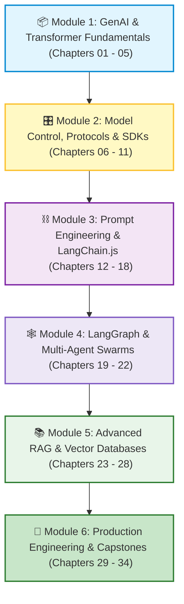

# 🤖 Full-Stack AI Engineering: Complete Master Revision Guide

Welcome to the **Master Index and Complete Revision Guide** for Full-Stack AI Engineering!

This master document serves as both a **central navigation hub** to all 34 chapters and a **high-density revision guide**. You can use this single file to review core concepts, formulas, architectures, code snippets, production tips, and interview questions across the entire course.

---

## 📌 Master Course Navigation

### 📦 Module 1: GenAI & Transformer Fundamentals
* [01. Introduction to AI Engineering](./01_Introduction.md) — Deterministic vs. Probabilistic Systems, First Principles API calls.
* [02. What is AI, ML, and Deep Learning?](./02_What_is_AI_ML_DL.md) — Neurons, Weights, Biases, Activation Functions, Gradient Descent.
* [03. Transformers and Attention](./03_Transformers_and_Attention.md) — Self-Attention, QKV Matrices, Multi-Head Attention, $O(N^2)$ Complexity.
* [04. Tokens and Tokenization](./04_Tokens_and_Tokenization.md) — Byte Pair Encoding (BPE), Token IDs, Pricing, Token Budgeting.
* [05. Embeddings and Vector Search](./05_Embeddings_and_Vector_Search.md) — Semantic Coordinates, Cosine Similarity, Vector Distance.

### 🎛️ Module 2: Model Control, Protocols & SDKs
* [06. Generation Control](./06_Generation_Control.md) — Temperature, Top-P, Presence & Frequency Penalties, Stop Sequences.
* [07. Function Calling & Structured Outputs](./07_Function_Calling_and_Structured_Outputs.md) — Tool Calling, Zod Validation, Constrained Decoding.
* [08. Model Context Protocol (MCP)](./08_Model_Context_Protocol_MCP.md) — Universal standard for AI tools, Resources, Prompts, `stdio` / `SSE`.
* [09. LLM SDKs](./09_LLM_SDKs.md) — OpenAI, Google GenAI, Anthropic, Ollama, Error Handling.
* [10. Streaming and SSE](./10_Streaming_and_SSE.md) — Server-Sent Events, Time-To-First-Token (TTFT), Async Iterators.
* [11. Multimodal Models](./11_Multimodal_Models.md) — Vision Transformers (ViT), Patch Embeddings, OCR & Document Analysis.

### ⛓️ Module 3: Prompt Engineering & LangChain.js
* [12. Prompt Engineering Basics](./12_Prompt_Engineering_Basics.md) — System/User/Assistant Roles, Few-Shot, Chain-of-Thought (CoT).
* [13. Prompt Engineering Advanced](./13_Prompt_Engineering_Advanced.md) — ReAct Pattern, Direct & Indirect Injections, XML Guardrails.
* [14. LangChain.js & LCEL](./14_LangChain_Introduction_and_LCEL.md) — Declarative Pipelines, `.pipe()`, Runnable Interface.
* [15. Output Parsers & Memory](./15_LangChain_Output_Parsers_and_Memory.md) — Zod Structured Output, Sliding Window Memory, Redis Sessions.
* [16. Document Loaders & Splitters](./16_LangChain_Document_Loaders_and_Splitters.md) — Text/PDF Loaders, Recursive Splitters, Chunk Overlap.
* [17. Retrievers & Custom Tools](./17_LangChain_Retrievers_and_Tools.md) — VectorStoreRetriever, MultiQueryRetriever, DynamicStructuredTool.
* [18. Callbacks & LangSmith](./18_LangChain_Callbacks_and_LangSmith.md) — Lifecycle Event Hooks, Token Telemetry, LangSmith Waterfall Traces.

### 🕸️ Module 4: LangGraph & Multi-Agent Swarms
* [19. LangGraph Core Nodes & Edges](./19_LangGraph_Core_Nodes_and_Edges.md) — StateGraph, Annotation State, Worker Nodes, Graph Compilation.
* [20. Reducers & Conditional Routing](./20_LangGraph_Reducers_and_Routing.md) — Message Reducers, `addConditionalEdges`, Cyclic ReAct Loops.
* [21. Human-in-the-Loop (HITL)](./21_LangGraph_Human_in_the_Loop.md) — Checkpointing (`PostgresSaver`), Breakpoints, Approval Gates.
* [22. Multi-Agent Design](./22_LangGraph_Multi_Agent_Design.md) — Supervisor Architecture, Specialist Delegation, Swarm Collaboration.

### 📚 Module 5: Advanced RAG & Vector Databases
* [23. RAG Ingestion & Chunking](./23_RAG_Ingestion_and_Chunking.md) — End-to-End RAG Ingestion & Query Pipelines, Metadata Filtering.
* [24. Advanced Retrieval & HyDE](./24_RAG_Advanced_Retrieval.md) — Hybrid Search (BM25 + Dense), RRF Fusion, Hypothetical Documents.
* [25. Corrective & Self-RAG](./25_RAG_Corrective_and_Self_RAG.md) — Document Grader Nodes, Fallback Web Search, Hallucination Checks.
* [26. Reranking & Compression](./26_RAG_Reranking_and_Compression.md) — Bi-Encoders vs. Cross-Encoders, Cohere Rerank, Context Compression.
* [27. Vector Databases Overview](./27_Vector_Databases_Overview.md) — Pinecone, Qdrant, ChromaDB, Weaviate, HNSW vs. IVFFlat.
* [28. pgvector in PostgreSQL](./28_pgvector_in_PostgreSQL.md) — SQL Vectors, `<=>` Cosine Distance, HNSW SQL Indexes, Hybrid Queries.

### 🚀 Module 6: Production Engineering & Capstones
* [29. AI Agent Blueprint I](./29_AI_Agent_Blueprints_1.md) — Autonomous Customer Support & Billing Agent with Hard Guardrails.
* [30. AI Agent Blueprint II](./30_AI_Agent_Blueprints_2.md) — Parallel Code Reviewer and Research Synthesis Agent.
* [31. Production Fastify & Docker](./31_Production_Fastify_and_Docker.md) — High-Throughput Node API, Multi-Stage Dockerfile, Graceful Shutdown.
* [32. Redis Caching & Rate Limiting](./32_Production_Redis_Caching_and_Rate_Limiting.md) — Semantic Caching ($0.00 / 5ms), Token-Bucket Limits.
* [33. Interview Questions & Challenges](./33_Interview_Questions_and_Coding_Challenges.md) — 25+ High-Yield Questions, Coding Solutions.
* [34. Grand Capstone Projects](./34_Capstone_Projects.md) — Enterprise RAG Platform & Multi-Agent Swarm Blueprints.

---

# 📖 Module-by-Module High-Density Revision Summaries

---

## MODULE 1: Generative AI & Transformer Fundamentals

### 01. Introduction to AI Engineering
🔗 **Full Lesson:** [01_Introduction.md](./01_Introduction.md)
* **What**: Shift from deterministic software ($f(x) = y$) to probabilistic AI reasoning.
* **Why It Exists**: LLMs generate statistically likely answers; engineers orchestrate models with validation, guardrails, and backend security.
* **Key Takeaway**: Never expose API keys in frontend code; always proxy through Node.js.

### 02. What is AI, ML, and Deep Learning?
🔗 **Full Lesson:** [02_What_is_AI_ML_DL.md](./02_What_is_AI_ML_DL.md)
* **What**: Artificial neurons calculate $Y = \text{Activation}(\sum(X_i \cdot W_i) + B)$.
* **Training Loop**: Forward Pass $\to$ Loss Calculation $\to$ Backpropagation $\to$ Gradient Descent.
* **Key Takeaway**: Deep learning introduces non-linear activations (ReLU/Sigmoid) to learn complex language and vision patterns.

### 03. Transformers and Attention
🔗 **Full Lesson:** [03_Transformers_and_Attention.md](./03_Transformers_and_Attention.md)
* **What**: Replaced sequential RNNs with parallel processing via **Self-Attention**.
* **Formula**: $\text{Attention}(Q, K, V) = \text{softmax}\left(\frac{Q K^T}{\sqrt{d_k}}\right) V$.
* **Key Takeaway**: Scaling by $\sqrt{d_k}$ stabilizes gradients; attention has $O(N^2)$ quadratic complexity.

### 04. Tokens and Tokenization
🔗 **Full Lesson:** [04_Tokens_and_Tokenization.md](./04_Tokens_and_Tokenization.md)
* **What**: Subword tokenization (Byte Pair Encoding) converts text into numerical Token IDs.
* **Rule of Thumb**: 1 Token $\approx$ 4 characters $\approx$ 0.75 English words.
* **Key Takeaway**: Tokens govern API pricing, latency, and context limits.

### 05. Embeddings and Vector Search
🔗 **Full Lesson:** [05_Embeddings_and_Vector_Search.md](./05_Embeddings_and_Vector_Search.md)
* **What**: Converts semantic meaning into high-dimensional vectors (e.g. 1536 floats).
* **Formula**: Cosine Similarity measures the angle between vectors (1.0 = identical meaning).
* **Key Takeaway**: Always use the exact same embedding model for indexing documents and querying.

---

## MODULE 2: Model Control, Protocols & SDKs

### 06. Generation Control
🔗 **Full Lesson:** [06_Generation_Control.md](./06_Generation_Control.md)
* **Parameters**: `temperature` ($0.0 = \text{deterministic}$, $1.0 = \text{creative}$), `top_p` (nucleus sampling), `stop` sequences.
* **Penalties**: Presence penalty introduces new topics; Frequency penalty stops repetitive loops.

### 07. Function Calling & Structured Outputs
🔗 **Full Lesson:** [07_Function_Calling_and_Structured_Outputs.md](./07_Function_Calling_and_Structured_Outputs.md)
* **What**: Model outputs structured JSON tool calls; backend Node.js executes the real code.
* **Key Takeaway**: Constrained Decoding guarantees 100% schema-compliant JSON via Zod.

### 08. Model Context Protocol (MCP)
🔗 **Full Lesson:** [08_Model_Context_Protocol_MCP.md](./08_Model_Context_Protocol_MCP.md)
* **What**: Anthropic's open standard ("USB-C for AI") connecting models to Tools, Resources, and Prompts.
* **Transports**: `stdio` for local tools; `SSE` for remote cloud microservices.

### 09. LLM SDKs
🔗 **Full Lesson:** [09_LLM_SDKs.md](./09_LLM_SDKs.md)
* **Providers**: OpenAI, Google GenAI, Anthropic Claude, and Ollama (free local models).
* **Key Takeaway**: SDKs provide automatic retries, backoff, and TypeScript type safety.

### 10. Streaming and SSE
🔗 **Full Lesson:** [10_Streaming_and_SSE.md](./10_Streaming_and_SSE.md)
* **What**: Server-Sent Events stream tokens to UI in real time, dropping TTFT to $< 250\text{ms}$.
* **Header Rule**: `Content-Type: text/event-stream` and `X-Accel-Buffering: no`.

### 11. Multimodal Models
🔗 **Full Lesson:** [11_Multimodal_Models.md](./11_Multimodal_Models.md)
* **What**: Vision Transformers (ViT) slice images into patches and process them alongside text.
* **Key Takeaway**: Use `detail: "high"` for small text/OCR; `detail: "low"` for fast classification.

---

## MODULE 3: Prompt Engineering & LangChain.js

### 12. Prompt Engineering Basics
🔗 **Full Lesson:** [12_Prompt_Engineering_Basics.md](./12_Prompt_Engineering_Basics.md)
* **Roles**: `system` (rules), `user` (prompt), `assistant` (history), `tool` (results).
* **Techniques**: Zero-Shot, Few-Shot, and Chain-of-Thought (CoT) step-by-step reasoning.

### 13. Prompt Engineering Advanced
🔗 **Full Lesson:** [13_Prompt_Engineering_Advanced.md](./13_Prompt_Engineering_Advanced.md)
* **ReAct**: Iterative Thought $\to$ Action $\to$ Observation loop.
* **Security**: XML Tag Isolation (`<user_input>`) defends against direct and indirect prompt injections.

### 14. LangChain.js & LCEL
🔗 **Full Lesson:** [14_LangChain_Introduction_and_LCEL.md](./14_LangChain_Introduction_and_LCEL.md)
* **Syntax**: `prompt.pipe(model).pipe(parser)`.
* **Runnable Interface**: Universal `.invoke()`, `.stream()`, and `.batch()` methods.

### 15. Output Parsers & Memory
🔗 **Full Lesson:** [15_LangChain_Output_Parsers_and_Memory.md](./15_LangChain_Output_Parsers_and_Memory.md)
* **Structured Output**: `model.withStructuredOutput(zodSchema)`.
* **Memory**: Sliding Window Memory preserves token budget; persist in Redis in production.

### 16. Document Loaders & Splitters
🔗 **Full Lesson:** [16_LangChain_Document_Loaders_and_Splitters.md](./16_LangChain_Document_Loaders_and_Splitters.md)
* **Splitter**: `RecursiveCharacterTextSplitter` splits hierarchically by `["\n\n", "\n", " ", ""]`.
* **Rule**: Always include 10–15% `chunkOverlap` to preserve cross-boundary context.

### 17. Retrievers & Custom Tools
🔗 **Full Lesson:** [17_LangChain_Retrievers_and_Tools.md](./17_LangChain_Retrievers_and_Tools.md)
* **Retriever**: `vectorStore.asRetriever({ k: 3 })`.
* **Tools**: `new DynamicStructuredTool({ name, description, schema, func })`.

### 18. Callbacks & LangSmith
🔗 **Full Lesson:** [18_LangChain_Callbacks_and_LangSmith.md](./18_LangChain_Callbacks_and_LangSmith.md)
* **Callbacks**: Lifecycle hooks (`handleLLMStart`, `handleToolEnd`, `handleLLMError`).
* **LangSmith**: Visual execution waterfalls, latency tracking, and token telemetry via `LANGCHAIN_TRACING_V2=true`.

---

## MODULE 4: LangGraph & Multi-Agent Swarms

### 19. LangGraph Core Nodes & Edges
🔗 **Full Lesson:** [19_LangGraph_Core_Nodes_and_Edges.md](./19_LangGraph_Core_Nodes_and_Edges.md)
* **What**: State machines for cyclic agent workflows.
* **Primitives**: State Schema (`Annotation.Root`), Nodes (functions), Edges (`START`, `END`).

### 20. Reducers & Conditional Routing
🔗 **Full Lesson:** [20_LangGraph_Reducers_and_Routing.md](./20_LangGraph_Reducers_and_Routing.md)
* **Reducers**: `(curr, update) => curr.concat(update)` appends messages safely.
* **Routing**: `addConditionalEdges` routes dynamically based on tool calls or task completion.

### 21. Human-in-the-Loop (HITL)
🔗 **Full Lesson:** [21_LangGraph_Human_in_the_Loop.md](./21_LangGraph_Human_in_the_Loop.md)
* **Checkpointers**: `MemorySaver` / `PostgresSaver` freeze state under a `thread_id`.
* **Breakpoints**: `interruptBefore: ["node_name"]` pauses execution for human review and approval.

### 22. Multi-Agent Design
🔗 **Full Lesson:** [22_LangGraph_Multi_Agent_Design.md](./22_LangGraph_Multi_Agent_Design.md)
* **Supervisor Pattern**: Manager agent delegates tasks to specialized workers (Researcher, Coder, Reviewer).
* **Advantage**: Reduces context crowding and increases tool execution reliability.

---

## MODULE 5: Advanced RAG & Vector Databases

### 23. RAG Ingestion & Chunking
🔗 **Full Lesson:** [23_RAG_Ingestion_and_Chunking.md](./23_RAG_Ingestion_and_Chunking.md)
* **What**: Retrieval-Augmented Generation eliminates hallucinations and accesses private data.
* **Rule**: Attach rich metadata (`tenant_id`, `category`, `source`) for fast pre-filtering.

### 24. Advanced Retrieval & HyDE
🔗 **Full Lesson:** [24_RAG_Advanced_Retrieval.md](./24_RAG_Advanced_Retrieval.md)
* **Hybrid Search**: Combines Dense Vectors + Sparse BM25 via Reciprocal Rank Fusion (RRF).
* **HyDE**: Generates hypothetical answer passages to bridge the question-to-document vector gap.

### 25. Corrective & Self-RAG
🔗 **Full Lesson:** [25_RAG_Corrective_and_Self_RAG.md](./25_RAG_Corrective_and_Self_RAG.md)
* **CRAG**: Document Grader evaluates retrieved chunks and triggers fallback web search if irrelevant.
* **Self-RAG**: Grades generated answers against source facts to prevent hallucinations.

### 26. Reranking & Compression
🔗 **Full Lesson:** [26_RAG_Reranking_and_Compression.md](./26_RAG_Reranking_and_Compression.md)
* **Two-Stage Funnel**: Retrieve Top 50 (Bi-Encoder) $\to$ Rerank to Top 3 (Cohere Cross-Encoder).
* **Context Compression**: Squeezes out irrelevant sentences to save 60%+ tokens.

### 27. Vector Databases Overview
🔗 **Full Lesson:** [27_Vector_Databases_Overview.md](./27_Vector_Databases_Overview.md)
* **Indexing**: HNSW multi-layer graphs achieve $O(\log N)$ search speed.
* **Comparison**: Pinecone (Serverless Cloud), Qdrant (Rust High-Perf), ChromaDB (Local Dev), pgvector (Unified SQL).

### 28. pgvector in PostgreSQL
🔗 **Full Lesson:** [28_pgvector_in_PostgreSQL.md](./28_pgvector_in_PostgreSQL.md)
* **SQL Vector Operators**: `<=>` Cosine Distance, `<->` L2 Distance, `<#>` Negative Dot Product.
* **Index**: `CREATE INDEX ON table USING hnsw (embedding vector_cosine_ops);`.

---

## MODULE 6: Production Engineering & Capstones

### 29. AI Agent Blueprint I: Customer Support & Billing
🔗 **Full Lesson:** [29_AI_Agent_Blueprints_1.md](./29_AI_Agent_Blueprints_1.md)
* **What**: Autonomous support agent with hard programmatic refund guardrails ($100 cap) and human escalation.

### 30. AI Agent Blueprint II: Code Reviewer
🔗 **Full Lesson:** [30_AI_Agent_Blueprints_2.md](./30_AI_Agent_Blueprints_2.md)
* **What**: Parallel Fan-Out/Fan-In LangGraph pipeline auditing PRs for Security, Performance, and Style.

### 31. Production Fastify & Docker
🔗 **Full Lesson:** [31_Production_Fastify_and_Docker.md](./31_Production_Fastify_and_Docker.md)
* **Fastify**: High-throughput SSE streaming server with non-root multi-stage Docker container.
* **Shutdown**: `SIGTERM` handlers allow in-flight token streams to drain cleanly.

### 32. Redis Caching & Rate Limiting
🔗 **Full Lesson:** [32_Production_Redis_Caching_and_Rate_Limiting.md](./32_Production_Redis_Caching_and_Rate_Limiting.md)
* **Semantic Cache**: Serves similar queries in 5ms for $0.00 using Redis Vector Search (Cosine $> 0.94$).
* **Rate Limiting**: Token-Bucket algorithm prevents API abuse and budget overruns.

### 33. Interview Questions & Coding Challenges
🔗 **Full Lesson:** [33_Interview_Questions_and_Coding_Challenges.md](./33_Interview_Questions_and_Coding_Challenges.md)
* **What**: 25+ High-Yield AI Engineer Interview Questions and verified live-coding challenge solutions.

### 34. Grand Capstone Projects
🔗 **Full Lesson:** [34_Capstone_Projects.md](./34_Capstone_Projects.md)
* **What**: Full architectures for Enterprise Multi-Tenant RAG Search and Autonomous Multi-Agent Swarms.

---

> [!TIP]
> **Learning Tip**: Click any of the chapter links above to open the complete deep-dive tutorial lesson for that topic!
