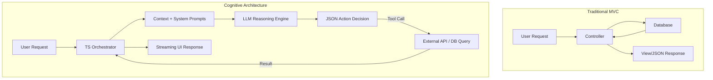

# Chapter 1: Introduction to Full-Stack AI Engineering for MERN Developers

**Estimated Reading Time**: 20 minutes  
**Difficulty**: Beginner (For experienced JS/TS developers)  
**Prerequisites**: Core JavaScript/TypeScript, HTTP protocol basics, Express/Node.js familiarity.  
**Learning Objectives**:
1. Contrast traditional deterministic programming with probabilistic machine learning and LLM engineering.
2. Understand why the JavaScript/TypeScript ecosystem is highly suited for AI application development.
3. Comprehend the shift from MVC (Model-View-Controller) to Cognitive Architectures.
4. Implement a first-principles LLM API call using raw HTTP and TypeScript in Node.js.

---

## Introduction

As a MERN (MongoDB, Express, React, Node.js) developer, you are accustomed to building systems where inputs yield highly predictable, structured outputs. You write code that validates form fields, queries database collections, and returns deterministic JSON. 

In the era of Generative AI, this model changes. Instead of writing the logic that solves a problem, you write code that *orchestrates* a reasoning engine (the Large Language Model) to solve the problem for you. This transition does not render your web development skills obsolete; rather, it makes them more critical than ever. AI models are useless in isolation—they require APIs, user interfaces, security filters, rate limiters, caching layers, and database connections. You already know how to build all of these. 

This chapter will lay the mental foundations of AI Engineering and show you how your JavaScript background gives you a massive advantage.

---

## Theory: From Deterministic Code to Probabilistic Systems

### 1. Traditional Programming ($f(x) = y$)
In traditional software engineering, you write the rules (the logic) and supply the data. The computer executes your rules on the data to produce an answer.

$$\text{Data} + \text{Rules (Code)} \xrightarrow{\text{Execution}} \text{Answers}$$

For example, to determine if an email is spam, you might check if it contains keywords like "free money" or "buy now". If it matches, you return `true`. This is **deterministic**—the same input under the same conditions always produces the exact same output.

### 2. Machine Learning / Deep Learning
In classical Machine Learning, you flip the equation. You provide the computer with data and the correct answers (labels), and the computer trains a model to discover the rules.

$$\text{Data} + \text{Answers (Labels)} \xrightarrow{\text{Training}} \text{Rules (Model)}$$

Once trained, you use the model (rules) to predict labels for new data. This is **probabilistic**—the model predicts the *likelihood* of an email being spam (e.g., $94\%$ probability).

### 3. Generative AI & Large Language Models (LLMs)
LLMs introduce a third paradigm: **General Reasoning Engines**. You do not train the model (that is done by research companies like OpenAI, Google, and Anthropic). Instead, you use natural language prompts to guide a pre-trained model.

$$\text{Data} + \text{Natural Language Instructions (Prompt)} \xrightarrow{\text{Inference}} \text{Reasoned Outputs}$$

The LLM does not just match strings; it understands context, semantics, and nuance. However, because it is probabilistic, it does not guarantee a single deterministic output. Your job as an AI Engineer is to build a structured framework around this probabilistic engine to make it behave deterministically enough for production use.

### Why JavaScript/TypeScript for AI?
A common myth is that you must learn Python to build AI systems. While Python is the undisputed king of **Model Training** and data science (thanks to PyTorch and TensorFlow), **AI Application Engineering** is different. 

AI Engineering is about integration, orchestration, streaming UI, and API performance. 
* **Concurrency**: Node.js handles thousands of concurrent I/O operations (such as streaming responses from LLM APIs) far more efficiently than Python due to its event loop.
* **Typing**: TypeScript provides strict interfaces over the fluid, unstructured text returned by AI models.
* **Unified Stack**: Using JS/TS allows you to share data models and logic between your React frontend, Express/NestJS backend, and AI agents.

---

## Real-World Analogy: The Restaurant Kitchen

Think of a traditional MERN application as a **Vending Machine**. The user inserts a specific input (money + code `A1`), the mechanics run a deterministic sequence of gears, and the exact snack falls down. It is fast, predictable, and simple.

An AI-powered application is a **Five-Star Restaurant**:
* **The LLM is the Executive Chef**: It is highly skilled, knows recipes, and can improvise. However, if left unsupervised, the chef might make a dish too spicy or go off-menu.
* **The Prompt is the Order Ticket**: If you write "Make something good", the chef will guess. If you write "Medium-rare ribeye with a side of asparagus, no butter", you get a precise result.
* **The AI Engineer is the Sous Chef/Kitchen Manager**: You set up the kitchen layout, clean the vegetables (clean the input data), inspect the food before it goes to the customer (guardrails), and handle payments (token pricing and API limits).

---

## Architecture Diagram: MVC vs. Cognitive Architecture

In traditional MVC, the controller is a simple router. In an AI-driven Cognitive Architecture, the orchestrator manages a loop of observation, decision-making, and action.



---

## Code Example: Calling an LLM via Raw HTTP (TypeScript)

Let us bypass all frameworks and build a clean API client using native Node `fetch` and TypeScript. This shows you exactly what happens under the hood when you use libraries like LangChain or SDKs.

Save this file as `basic_client.ts`.

```typescript
import dotenv from 'dotenv';
dotenv.config();

// Ensure you run: npm install dotenv @types/node
// And have your OPENAI_API_KEY in a .env file.

interface ChatMessage {
  role: 'system' | 'user' | 'assistant';
  content: string;
}

interface OpenAIRequest {
  model: string;
  messages: ChatMessage[];
  temperature?: number;
}

interface OpenAIResponse {
  choices: {
    message: {
      content: string;
    };
  }[];
  usage: {
    prompt_tokens: number;
    completion_tokens: number;
    total_tokens: number;
  };
}

async function generateCompletion(
  prompt: string,
  systemInstruction: string = "You are a helpful coding assistant."
): Promise<string> {
  const apiKey = process.env.OPENAI_API_KEY;
  if (!apiKey) {
    throw new Error("Missing OPENAI_API_KEY environment variable.");
  }

  const requestBody: OpenAIRequest = {
    model: "gpt-4o-mini", // Cost-effective model for testing
    messages: [
      { role: "system", content: systemInstruction },
      { role: "user", content: prompt }
    ],
    temperature: 0.7 // Balances creativity and determinism
  };

  try {
    const response = await fetch("https://api.openai.com/v1/chat/completions", {
      method: "POST",
      headers: {
        "Content-Type": "application/json",
        "Authorization": `Bearer ${apiKey}`
      },
      body: JSON.stringify(requestBody)
    });

    if (!response.ok) {
      const errorText = await response.text();
      throw new Error(`OpenAI API error (${response.status}): ${errorText}`);
    }

    const data = (await response.json()) as OpenAIResponse;
    const result = data.choices[0]?.message?.content;
    
    if (!result) {
      throw new Error("Empty response received from OpenAI.");
    }

    // Log the token usage for monitoring
    console.log(`[Usage Metrics] Prompt: ${data.usage.prompt_tokens} | Completion: ${data.usage.completion_tokens} | Total: ${data.usage.total_tokens}`);

    return result;
  } catch (error) {
    console.error("Failed to fetch completion:", error);
    throw error;
  }
}

// Execution block
(async () => {
  const systemPrompt = "You are a senior software architect. Explain concepts using clean TypeScript examples.";
  const userPrompt = "Explain the difference between interface and type in TypeScript.";
  
  console.log("Sending prompt to LLM...");
  const reply = await generateCompletion(userPrompt, systemPrompt);
  console.log("\n--- LLM Response ---");
  console.log(reply);
})();
```

---

## Best Practices, Production & Security Considerations

### 1. Security: Keep Keys Safe
Never expose your API keys (`OPENAI_API_KEY`, `GEMINI_API_KEY`) to the client side. Your React frontend must NEVER make direct calls to OpenAI. Always route requests through your Express/Node.js backend, which acts as a secure proxy and enforces authentication.

### 2. Performance: Time-to-First-Token (TTFT)
LLM queries are slow (often taking 1–5 seconds). Users hate waiting.
* **Best Practice**: Use **streaming responses** (using Server-Sent Events or WebSockets) so that the user receives output character-by-character, drastically reducing perceived latency.

### 3. Cost Optimization: Know your pricing
Models are billed per 1,000 tokens (both input and output).
* **Rule**: Keep system instructions concise. Large templates appended to every query add up to huge monthly bills. Use smaller models (like `gpt-4o-mini` or `gemini-1.5-flash`) for routing/classification, and reserve expensive models (`gpt-4o`, `claude-3-5-sonnet`) for complex reasoning tasks.

---

## Common Mistakes

1. **Treating LLMs as Database Queries**: Expecting $100\%$ uptime and identical output text every time. You must build retry logic and parse responses using runtime validators (like Zod).
2. **Hardcoding System Context**: Hardcoding large text structures into your main routing files instead of keeping prompts separate, versioned, and modular.
3. **No Timeout Handling**: LLM APIs will occasionally hang. Always wrap API requests in a timeout controller (`AbortController`).

---

## Exercises & Mini Project

### Exercise 1: Cost Calculator
Using the token usage stats returned by the raw API, write a helper function that estimates the cost of a request based on current market pricing (e.g., Input: \$2.50 per million tokens, Output: \$10.00 per million tokens).

### Mini Project: User Intent Router
Create a simple Express server with a POST endpoint `/api/route`. The server should accept a user query (e.g., "I want to delete my account" or "How do I update my profile") and use an LLM API to categorize the intent into one of three categories: `SUPPORT`, `SALES`, or `TECHNICAL`. Return the category as JSON.

---

## Interview Questions

1. **Q**: Why would you use Node.js instead of Python for orchestrating multi-agent systems?
   * **A**: Python is single-threaded and blocked by the Global Interpreter Lock (GIL). Multi-agent systems involve heavy concurrent network I/O (parallel calls to LLMs, databases, and search engines). Node.js's non-blocking I/O event loop handles these highly concurrent operations much more efficiently with a lower memory footprint.
2. **Q**: What does it mean that LLMs are "probabilistic" in a production context, and how do we counter it?
   * **A**: It means that the output is determined by predicting probability distributions of words, leading to variance. We counter this by lowering the `temperature` parameter (to make output more deterministic), using rigid structured output formats (JSON Schema/Zod), and validating responses with guardrails.

---

## Summary

You have learned that transitioning to Full-Stack AI engineering shifts your focus from writing strict logic to managing reasoning pipelines. Node.js and TypeScript are fantastic tools for this task. You wrote a clean HTTP handler to communicate directly with OpenAI, laying the foundation for using advanced orchestration tools in the chapters ahead.

---

## Navigation

**Prev:** [Course Overview](./00_Index.md) | **Index:** [Course Overview](./00_Index.md) | **Next:** [Chapter 2: What is AI, ML, and DL?](./02_What_is_AI_ML_DL.md)
