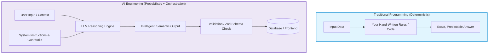
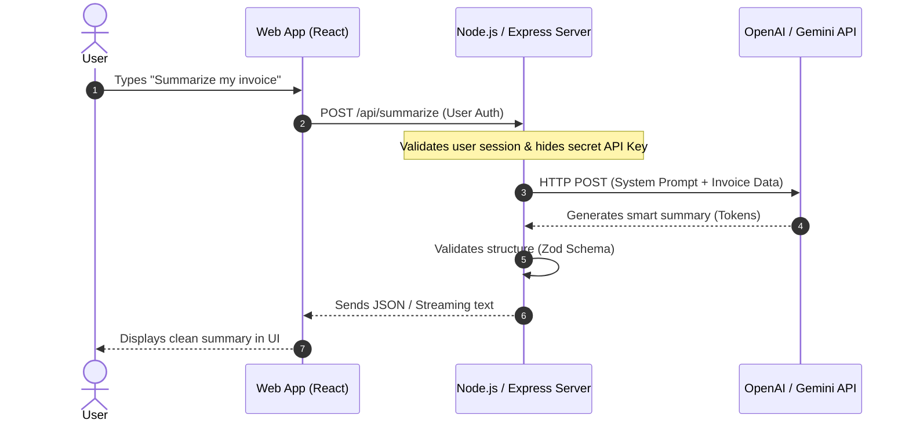
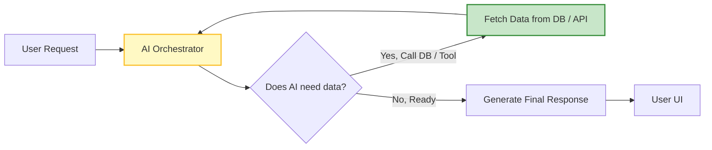

# 🤖 Introduction to AI Engineering

## 📌 Overview

Welcome to the world of **AI Engineering**! 

If you already know how to write code (like JavaScript, TypeScript, or Python), you are used to a world of absolute rules: 
- `2 + 2` is always `4`.
- If an `if` condition is true, the computer *always* runs the code inside it.
- If a user clicks a button, a database query runs and returns exact rows.

This is called **Deterministic Programming**.

In **Artificial Intelligence (AI) Engineering**, the paradigm changes. Instead of writing all the rules yourself, you work with **Large Language Models (LLMs)**—smart AI reasoning engines that understand human language. AI doesn't give you fixed mathematical formulas; it calculates the most likely, intelligent answer based on patterns it learned from vast amounts of data. This is called **Probabilistic Computing**.

As an AI Engineer, your superpower is combining traditional, reliable code with intelligent AI models to build smart, real-world apps (like AI chatbots, smart search engines, automated code assistants, and autonomous agents).



---

## 🎯 Why This Matters

Why should you learn AI Engineering today?
1. **You Don't Need a PhD in Math or Python**: You do not need to invent new machine learning algorithms from scratch. Giant AI companies (like OpenAI, Google, Anthropic) have already trained the foundational models. Your job is **application engineering**—connecting these models to databases, user interfaces, APIs, and business workflows.
2. **JavaScript / TypeScript is Perfect for AI**: While researchers use Python to train models, production applications run on web servers and browsers. JavaScript and Node.js excel at handling concurrent network requests, real-time streaming, and fast web APIs.
3. **Every Modern App Needs Intelligence**: From customer support to search bars, summarizing documents, and generating reports, AI features are becoming mandatory across all software products.

---

## 🧠 Prerequisites

Before starting this lesson, all you need is:
- **Basic JavaScript / TypeScript**: Knowing what variables, functions, `async/await`, and promises are.
- **Basic HTTP understanding**: Knowing what a `POST` request, headers, and JSON bodies look like.

---

## 🔍 Deep Dive

### 1. Deterministic vs. Probabilistic Systems

Let's break down the fundamental difference in how computers think:

| Feature | Traditional Software | AI Engineering |
|---|---|---|
| **Core Logic** | Fixed rules (`if/else`, SQL queries) | Pattern recognition & reasoning (LLMs) |
| **Output Type** | Exact, deterministic (always identical) | Semantic, probabilistic (statistically likely) |
| **Input Type** | Strict data (JSON, forms, IDs) | Natural language (text, audio, images) |
| **Failure Mode** | Throws a syntax/runtime error | May produce an incorrect or unformatted answer (hallucination) |
| **Your Job** | Write the step-by-step logic | Write clear prompts, provide context, and guardrail outputs |



---

### 2. The Shift: MVC vs. Cognitive Architecture

In traditional web development, you use the **MVC (Model-View-Controller)** pattern:
- **Model**: Database schema (e.g., MongoDB / PostgreSQL).
- **View**: Frontend user interface (e.g., React / Next.js).
- **Controller**: Business logic that runs fixed algorithms.

In **AI Cognitive Architecture**, the controller gets an "AI Brain":
- The AI can read user requests.
- It can decide *which* tool or database query to run.
- It can inspect the tool's answer and re-evaluate if it needs more information before replying to the user.



---

### 3. Core Golden Rules of AI Engineering

1. **Never expose your API keys in frontend code**:
   Always call AI APIs (OpenAI, Gemini, Anthropic) from a backend server (Node.js/Express/Fastify). If you put your API key in a React or browser script, anyone can inspect the page, steal your key, and drain your budget.
2. **Never blindly trust AI output**:
   Because LLMs are probabilistic, always validate their responses using schema validators (like `Zod`) before inserting them into your database or sending critical actions.
3. **Use streaming for great User Experience**:
   AI models take 2 to 5 seconds to generate complete answers. Streaming responses word-by-word (token-by-token) makes your application feel instantly responsive.

---

## 💡 Simple Example

Think of an AI model like an **extremely smart intern**:
- If you give vague instructions like *"Do something with this file"*, they might guess wrong.
- If you give crisp instructions like *"Extract the customer name, total price, and date from this invoice, and format the output as JSON"*, they will deliver a perfect result.
- As the manager (the AI Engineer), you write the checklist (the prompt), review their work (schema validation), and pass it to the customer.

---

## 🏗️ Real-World Example: Smart Support Ticket Classifier

Imagine an e-commerce platform receiving thousands of customer complaints daily:
- **Old way**: Hundreds of complex regex and keyword checks (`if text.includes("refund") ...`). Breaks when a user says *"I want my money back for this broken shirt"*.
- **AI Engineer way**: Send the text to a lightweight LLM (`gpt-4o-mini` or `gemini-1.5-flash`). Ask it to classify the intent into `REFUND`, `TECH_SUPPORT`, or `SHIPPING`. It handles typos, slang, and multiple languages effortlessly.

---

## ⚠️ Common Mistakes & Pitfalls

1. ❌ **Putting API keys in `.env` and pushing to GitHub**:
   - *Fix*: Always add `.env` to `.gitignore`.
2. ❌ **Calling OpenAI directly from React (`useEffect` / `fetch`)**:
   - *Fix*: Always call your own backend endpoint (`/api/chat`), which securely talks to OpenAI.
3. ❌ **Assuming AI is a database**:
   - *Fix*: AI does not store your private company data unless you provide it in the prompt or connect it via Vector Databases (RAG).

---

## 🔥 Important Points to Remember

- **Deterministic**: Same input $\to$ always exact same output (traditional code).
- **Probabilistic**: Output calculated by predicting the most probable words (LLMs).
- **Orchestration**: The code you write to connect LLMs to prompts, databases, APIs, and UIs.
- **Latency & Streaming**: LLMs take time to generate text; use Server-Sent Events (SSE) to stream words live to users.

---

## 💻 Code / Commands / Configuration

Here is a complete, beginner-friendly Node.js / TypeScript script to make your very first direct LLM call using native `fetch` (no heavy libraries needed):

```typescript
// basic_ai_call.ts
// Prerequisites:
// 1. Run: npm init -y
// 2. Run: npm install dotenv
// 3. Create a .env file containing: OPENAI_API_KEY=your_key_here

import * as dotenv from 'dotenv';
dotenv.config();

interface ChatMessage {
  role: 'system' | 'user' | 'assistant';
  content: string;
}

async function askAI(userQuestion: string): Promise<string> {
  const apiKey = process.env.OPENAI_API_KEY;

  if (!apiKey) {
    throw new Error("❌ Error: OPENAI_API_KEY is not set in your .env file!");
  }

  // Define the message history
  const messages: ChatMessage[] = [
    {
      role: 'system',
      content: 'You are a patient, beginner-friendly AI teacher. Explain concepts in simple words.'
    },
    {
      role: 'user',
      content: userQuestion
    }
  ];

  console.log("⏳ Sending question to AI model...");

  const response = await fetch("https://api.openai.com/v1/chat/completions", {
    method: "POST",
    headers: {
      "Content-Type": "application/json",
      "Authorization": `Bearer ${apiKey}`
    },
    body: JSON.stringify({
      model: "gpt-4o-mini", // Fast, highly capable, and low cost
      messages: messages,
      temperature: 0.7 // 0.0 = strict & factual, 1.0 = creative & diverse
    })
  });

  if (!response.ok) {
    const errorDetails = await response.text();
    throw new Error(`API Error (${response.status}): ${errorDetails}`);
  }

  const data = await response.json();
  const answer = data.choices[0].message.content;

  return answer;
}

// Run the function
(async () => {
  try {
    const question = "Explain what an API is using an analogy with a restaurant.";
    const result = await askAI(question);
    console.log("\n🤖 AI Response:\n");
    console.log(result);
  } catch (error) {
    console.error(error);
  }
})();
```

---

## 🎤 Interview Perspective

* **Q: What is the difference between an AI Researcher and an AI Application Engineer?**
  * **Answer**: An AI Researcher invents new model architectures, designs loss functions, and trains models using massive GPU clusters and Python. An AI Engineer builds production software *around* pre-trained models—handling data ingestion, caching, vector search (RAG), prompt chaining, latency optimization, and web integration.
* **Q: Why is JavaScript/TypeScript well-suited for AI orchestration?**
  * **Answer**: Node.js has a non-blocking, asynchronous event loop that effortlessly handles hundreds of simultaneous streaming HTTP connections to LLM APIs, while TypeScript provides strong type safety when parsing complex model JSON outputs.

---

## 🧩 Connection With Previous Concepts

- **Next Lesson ([02_What_is_AI_ML_DL.md](./02_What_is_AI_ML_DL.md))**: Now that you know what AI Engineering is at a high level, we will dive inside the machine to understand how Artificial Intelligence, Machine Learning, and Deep Learning actually work from the ground up!

---

Previous : — | Index: [00_Index.md](./00_Index.md) | Next: [02_What_is_AI_ML_DL.md](./02_What_is_AI_ML_DL.md)
