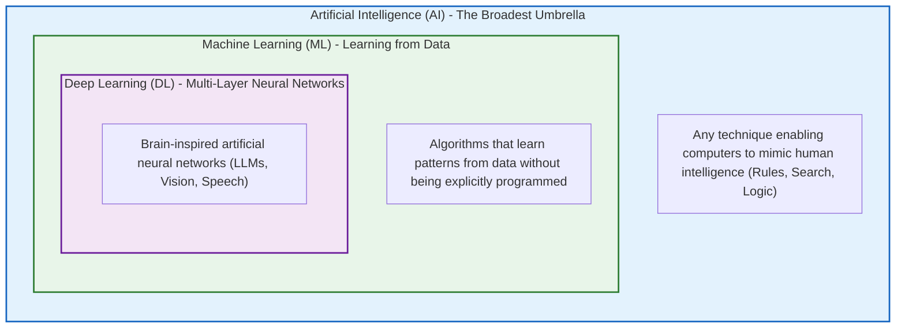
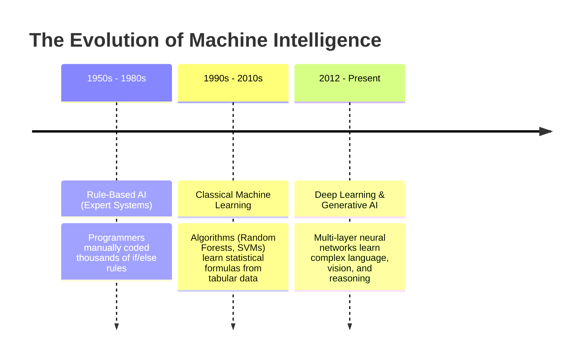
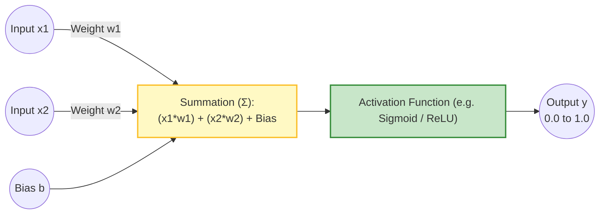
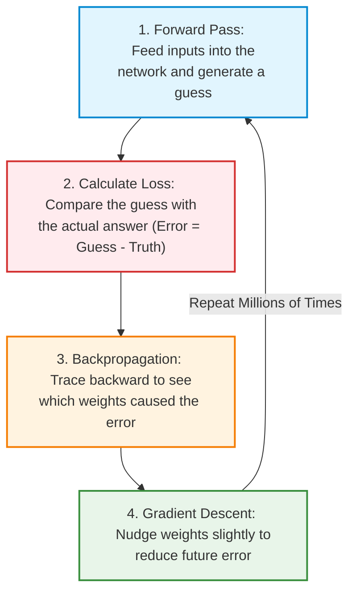

# 🤖 What is AI, ML, and Deep Learning?

## 📌 Overview

If you are new to the AI space, you probably hear the terms **Artificial Intelligence (AI)**, **Machine Learning (ML)**, and **Deep Learning (DL)** used interchangeably. 

However, they are not the same thing! Think of them as a set of Russian nesting dolls (one inside the other):



- **AI (Artificial Intelligence)**: The broad concept of creating machines capable of intelligent behavior (like playing chess or answering questions).
- **ML (Machine Learning)**: A subfield of AI where machines *learn* from past examples rather than following hardcoded `if/else` rules.
- **DL (Deep Learning)**: A specialized branch of ML powered by multi-layered **Artificial Neural Networks** (the technology behind ChatGPT, facial recognition, and self-driving cars).

---

## 🎯 Why This Matters

To build apps using AI, you don't need to do calculus by hand, but you **must understand the mental model**:
1. When someone says *"the model is hallucinating"*, you will know it is because neural networks calculate mathematical probabilities, not database lookups.
2. When someone talks about *"weights, biases, and fine-tuning"*, you will understand what knobs are actually being turned inside the AI.
3. It helps you pick the right tool: You don't need an expensive Deep Learning model to filter emails if a simple rule or classical ML algorithm does the job for free.

---

## 🧠 Prerequisites

- [01_Introduction.md](./01_Introduction.md): Understanding deterministic vs. probabilistic systems.
- Basic high-school math intuition (addition, multiplication).

---

## 🔍 Deep Dive

### 1. The Three Eras of Intelligence



---

### 2. Inside an Artificial Neuron (The Building Block)

In biology, your brain is made of billions of neurons that send electrical signals to each other. Deep Learning simulates this inside computer memory using simple math:



Let's break down the 4 key components:
1. **Inputs ($x$)**: The incoming data (e.g., word count, email length, image pixel).
2. **Weights ($w$)**: The *importance* or *strength* given to that input. If an input is very predictive, its weight becomes large.
3. **Bias ($b$)**: An offset value added to shift the baseline before making a decision (like a minimum threshold).
4. **Activation Function**: A mathematical formula that squashes the output into a useful range:
   - **Sigmoid**: Squashes numbers to a decimal between `0.0` and `1.0` (great for probabilities: `0.92 = 92% yes`).
   - **ReLU (Rectified Linear Unit)**: If negative, returns `0`; if positive, returns the number itself (`max(0, x)`).

$$\text{Output} = \text{Activation}\left(\sum (x_i \cdot w_i) + \text{bias}\right)$$

---

### 3. How Neural Networks Learn: The Training Loop

How does a neural network get smart? It learns through **trial and error** using a 4-step loop:



- **Loss Function**: Measures how wrong the AI's guess was (e.g., Mean Squared Error).
- **Gradient Descent**: An optimization algorithm that calculates the direction to adjust weights to minimize the loss.
- **Learning Rate**: The step size taken during each weight update. If too large, the model overshoots; if too small, training takes forever.

---

## 💡 Simple Example: Learning to Throw Darts

Imagine you are blindfolded and learning to throw a dart at a bullseye:
1. **Forward Pass**: You throw a dart blindly.
2. **Loss Calculation**: Your coach shouts: *"You were 2 feet too far to the left!"* (This is the Loss).
3. **Backpropagation**: Your brain figures out: *"My arm angle was tilted too far left."*
4. **Gradient Descent**: On your next throw, you adjust your arm slightly to the right (Weight update).
5. After 1,000 practice throws, you hit the bullseye consistently!

---

## 🏗️ Real-World Example: Spam Filter Classification

In an email app like Gmail:
- **Input 1 ($x_1$)**: Number of suspicious keywords (e.g. "free money", "claim prize").
- **Input 2 ($x_2$)**: Sender domain reputation score.
- The model multiplies each by its learned weights and adds bias.
- If the output probability is $> 0.85$, the email automatically moves to the Spam folder.

---

## ⚠️ Common Mistakes & Pitfalls

1. ❌ **Thinking AI models "understand" text like humans**:
   - *Reality*: Neural networks understand **numbers and patterns**. All text is converted into numbers before entering a model.
2. ❌ **Overfitting**:
   - *Mistake*: Training a model so much on specific training data that it memorizes the answers, failing on new real-world data.
3. ❌ **Using Deep Learning for simple tabular data**:
   - *Mistake*: Using a massive neural network for a simple Excel-style pricing table. Classical ML (like XGBoost or Random Forests) is often faster, cheaper, and more accurate for tabular numbers.

---

## 🔥 Important Points to Remember

- **AI**: Broad field of intelligent machines.
- **ML**: Machines learning rules from data.
- **Deep Learning**: ML using multi-layer neural networks.
- **Neuron Formula**: $\text{Activation}(\sum(x \cdot w) + b)$.
- **Training**: Forward Pass $\to$ Loss $\to$ Backpropagation $\to$ Gradient Descent.

---

## 💻 Code / Commands / Configuration

Here is a complete, standalone TypeScript implementation of a single artificial neuron that learns to classify binary logic (AND gate) from scratch:

```typescript
// single_neuron_training.ts
// Run directly with: npx ts-node single_neuron_training.ts

// 1. Sigmoid Activation Function (squashes any number into 0.0 to 1.0)
function sigmoid(x: number): number {
  return 1 / (1 + Math.exp(-x));
}

// 2. Derivative of Sigmoid (used to calculate adjustment gradient)
function sigmoidDerivative(x: number): number {
  const s = sigmoid(x);
  return s * (1 - s);
}

class SimpleNeuron {
  private weight1: number = Math.random();
  private weight2: number = Math.random();
  private bias: number = Math.random();
  private learningRate: number = 0.5;

  // Forward pass: compute the output guess
  public forward(x1: number, x2: number): number {
    const rawSum = x1 * this.weight1 + x2 * this.weight2 + this.bias;
    return sigmoid(rawSum);
  }

  // Train the neuron using gradient descent
  public train(trainingData: { x1: number; x2: number; expected: number }[], epochs: number) {
    for (let epoch = 0; epoch < epochs; epoch++) {
      let totalLoss = 0;

      for (const item of trainingData) {
        const guess = this.forward(item.x1, item.x2);
        const error = item.expected - guess;
        totalLoss += Math.pow(error, 2);

        // Adjust weights and bias based on gradient
        const adjustment = error * sigmoidDerivative(guess);
        this.weight1 += item.x1 * adjustment * this.learningRate;
        this.weight2 += item.x2 * adjustment * this.learningRate;
        this.bias += adjustment * this.learningRate;
      }

      if (epoch % 1000 === 0) {
        console.log(`Epoch ${epoch} | Total Loss: ${totalLoss.toFixed(5)}`);
      }
    }
  }
}

// Execution: Train neuron to learn the "AND" gate (Only 1,1 produces 1)
(() => {
  const neuron = new SimpleNeuron();

  const dataset = [
    { x1: 0, x2: 0, expected: 0 },
    { x1: 0, x2: 1, expected: 0 },
    { x1: 1, x2: 0, expected: 0 },
    { x1: 1, x2: 1, expected: 1 },
  ];

  console.log("🚀 Training single neuron on AND dataset...");
  neuron.train(dataset, 5000);

  console.log("\n🧪 Testing Neuron Predictions:");
  for (const test of dataset) {
    const prediction = neuron.forward(test.x1, test.x2);
    console.log(`Input: [${test.x1}, ${test.x2}] -> Predicted: ${prediction.toFixed(4)} (Expected: ${test.expected})`);
  }
})();
```

---

## 🎤 Interview Perspective

* **Q: What is the purpose of an activation function in neural networks?**
  * **Answer**: Activation functions introduce non-linearity into the network. Without non-linear activation functions, stacking multiple layers would collapse mathematically into a single linear regression ($y = mx + c$), making it impossible for the network to learn complex patterns like language or images.
* **Q: What is the difference between supervised and unsupervised learning?**
  * **Answer**: Supervised learning trains on labeled data where inputs and expected target answers are provided (e.g., spam vs. not spam). Unsupervised learning discovers hidden patterns or clusters in unlabeled data without predefined answers (e.g., customer segmentation).

---

## 🧩 Connection With Previous Concepts

- **Previous Lesson ([01_Introduction.md](./01_Introduction.md))**: Introduced AI Engineering and the shift from deterministic code to probabilistic models.
- **Next Lesson ([03_Transformers_and_Attention.md](./03_Transformers_and_Attention.md))**: We will explore the breakthrough architecture that revolutionized modern AI: the **Transformer** and its **Self-Attention Mechanism**!

---

Previous : [01_Introduction.md](./01_Introduction.md) | Index: [00_Index.md](./00_Index.md) | Next: [03_Transformers_and_Attention.md](./03_Transformers_and_Attention.md)
