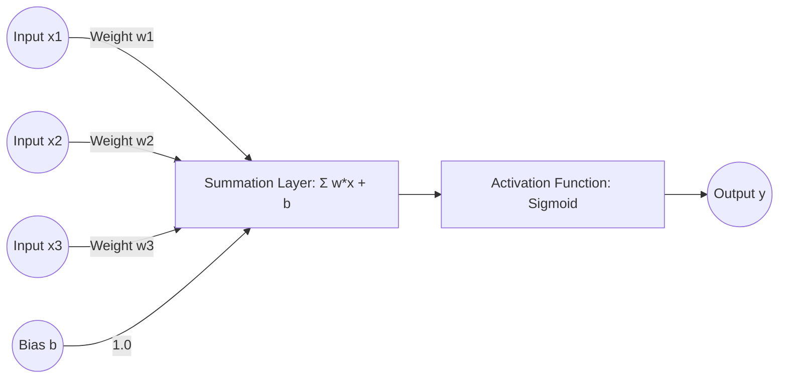

# Chapter 2: What is AI, ML, and Deep Learning?

**Estimated Reading Time**: 20 minutes  
**Difficulty**: Beginner  
**Prerequisites**: Chapter 1.  
**Learning Objectives**:
1. Categorize AI system paradigms (Rule-based, ML, Deep Learning).
2. Understand Neural Network structures (neurons, layers, weights, biases).
3. Comprehend how models learn via Backpropagation and Gradient Descent.
4. Implement a single-neuron classifier programmatically in TypeScript.

---

## Introduction

To write applications that consume machine learning models, you must first demystify what a model is. Software engineers often treat machine learning as a magical "black box" that guesses answers. In reality, a machine learning model is a mathematical function with adjustable knobs. 

In this chapter, we build our understanding from first principles, explaining the differences between AI, ML, and Deep Learning, and implementing a basic neuron in TypeScript.

---

## Theory: The Artificial Intelligence Hierarchy

```text
┌───────────────────────────────────────────────┐
│ Artificial Intelligence (AI)                  │
│  ┌──────────────────────────────────────────┐  │
│  │ Machine Learning (ML)                    │  │
│  │  ┌────────────────────────────────────┐  │  │
│  │  │ Deep Learning (DL)                 │  │  │
│  │  └────────────────────────────────────┘  │  │
│  └──────────────────────────────────────────┘  │
└───────────────────────────────────────────────┘
```

### 1. Artificial Intelligence (AI)
The broadest category. It includes any machine that mimics human cognitive functions. In the 1980s, this was dominated by **Expert Systems**: large databases of nested `if/else` statements written by human engineers. These systems do not "learn"—they follow strict, pre-programmed trees.

### 2. Machine Learning (ML)
Instead of writing the rules manually, we feed an algorithm historical data (inputs and correct answers) and allow the algorithm to discover the mathematical formulas (rules) that connect them.
* **Types of ML**:
  * **Supervised Learning**: Training on labeled data (e.g. housing features and sale prices).
  * **Unsupervised Learning**: Clustering unlabeled data (e.g. grouping customer purchase logs).

### 3. Deep Learning (DL)
A specialized branch of ML utilizing **Artificial Neural Networks** inspired by biological brains. 
* **The Neuron (Node)**: The base unit of a neural network. It takes inputs ($x_i$), multiplies them by weights ($w_i$), adds a bias ($b$), and runs the sum through an **Activation Function** (like ReLU or Sigmoid) to determine output.

$$y = \text{Activation}\left(\sum_{i=1}^{n} w_i x_i + b\right)$$

* **Layers**: Neurons are organized into an Input Layer, multiple Hidden Layers (hence "Deep"), and an Output Layer.
* **Weights ($w$)**: The strength of the connection between neurons.
* **Biases ($b$)**: An offset value added to shift the activation function.
* **Backpropagation & Gradient Descent**: The learning mechanism. The model guesses an answer, measures how far off it was (the Loss), and calculates the mathematical slope (Gradient) to adjust weights and biases backwards through the network to minimize future errors.

---

## Real-World Analogy: Tuning a Radio

Think of training a neural network as **tuning an old analog radio**:
* **The Radio is the Neural Network**: The circuit layout is fixed (architecture).
* **The Tuning Knobs are Weights and Biases**: You turn the dial to change resistance.
* **The Static Noise is the Loss**: When the knobs are wrong, you hear static.
* **Gradient Descent is Your Tuning Hand**: If you turn the knob slightly to the right and the sound gets clearer, you continue turning right. If it gets static, you turn left. You make adjustments until the music plays clearly.

---

## Architecture Diagram: Artificial Neuron Model

This diagram represents a single neuron, illustrating how inputs are weighted, summed, shifted by a bias, and activated.



---

## Code Example: Single Neuron Classifier (TypeScript)

Let's build a single neuron from scratch in TypeScript that learns to classify customer intents based on two numerical features: `messageLength` and `containsPriceKeywords` (0 or 1). It learns to distinguish between `SUPPORT` (0) and `SALES` (1).

Create `neuron_classifier.ts`:

```typescript
// Sigmoid Activation Function (squashes outputs between 0.0 and 1.0)
function sigmoid(x: number): number {
  return 1 / (1 + Math.exp(-x));
}

// Derivative of Sigmoid (used for backpropagation adjustment)
function sigmoidDerivative(x: number): number {
  const s = sigmoid(x);
  return s * (1 - s);
}

class SingleNeuron {
  private weights: number[];
  private bias: number;
  private learningRate: number;

  constructor(featuresCount: number, learningRate: number = 0.1) {
    // Initialize weights and bias with small random numbers
    this.weights = Array.from({ length: featuresCount }, () => Math.random() - 0.5);
    this.bias = Math.random() - 0.5;
    this.learningRate = learningRate;
  }

  // Forward Pass: calculate prediction
  public predict(inputs: number[]): number {
    let sum = this.bias;
    for (let i = 0; i < inputs.length; i++) {
      sum += inputs[i] * this.weights[i];
    }
    return sigmoid(sum);
  }

  // Train: adjust weights using gradient descent
  public train(inputs: number[], target: number) {
    let sum = this.bias;
    for (let i = 0; i < inputs.length; i++) {
      sum += inputs[i] * this.weights[i];
    }
    const prediction = sigmoid(sum);

    // Calculate Loss (Error)
    const error = target - prediction;

    // Backpropagation: Calculate adjustments (Gradients)
    const gradient = error * sigmoidDerivative(sum);

    // Update weights and bias
    for (let i = 0; i < inputs.length; i++) {
      this.weights[i] += this.learningRate * gradient * inputs[i];
    }
    this.bias += this.learningRate * gradient;
  }

  public getWeights() {
    return { weights: this.weights, bias: this.bias };
  }
}

// Ingestion Training Data
// Input features: [messageLengthNormalized, containsPriceKeywords]
// Targets: 0 (SUPPORT), 1 (SALES)
const trainingData = [
  { inputs: [0.1, 0.0], target: 0 }, // Short chat, no price keywords -> SUPPORT
  { inputs: [0.9, 1.0], target: 1 }, // Long email with pricing queries -> SALES
  { inputs: [0.2, 1.0], target: 1 }, // Short query, asks "how much?" -> SALES
  { inputs: [0.8, 0.0], target: 0 }  // Long bug description, no price -> SUPPORT
];

// Instantiating Neuron
const neuron = new SingleNeuron(2, 0.2);

console.log("Training the neuron over 1000 epochs...");
for (let epoch = 0; epoch < 1000; epoch++) {
  for (const data of trainingData) {
    neuron.train(data.inputs, data.target);
  }
}

console.log("\nTraining complete. Adjustments:");
console.log(neuron.getWeights());

// Test the trained neuron
console.log("\nTesting predictions:");
const testA = [0.15, 1.0]; // Short message, contains price keyword
const predA = neuron.predict(testA);
console.log(`Input [0.15, 1.0] -> Pred: ${predA.toFixed(4)} (${predA > 0.5 ? 'SALES' : 'SUPPORT'})`);

const testB = [0.75, 0.0]; // Long message, no price keywords
const predB = neuron.predict(testB);
console.log(`Input [0.75, 0.0] -> Pred: ${predB.toFixed(4)} (${predB > 0.5 ? 'SALES' : 'SUPPORT'})`);
```

Run the script:
```bash
npx tsx neuron_classifier.ts
```

---

## Best Practices, Production & Security Considerations

### 1. Avoid Reinventing Core Math
While writing neurons from scratch teaches first principles, in production, never roll your own raw matrix math wrappers in Node.js.
* **Production Rule**: Use pre-compiled, C++ backed libraries like TensorFlow.js or ONNX Runtime Node if you need to run local model inferences, ensuring high performance.

---

## Common Mistakes

1. **Confusing AI with ML**: Writing hardcoded rule engines and calling them "Machine Learning". ML requires statistical models that adapt their weight parameters based on training datasets.

---

## Exercises & Mini Project

### Exercise 1: Multi-class Intent
Research and describe how to extend a single binary neuron to handle three classifications (e.g. `SUPPORT`, `SALES`, `HR`) using a Softmax activation layer.

### Mini Project: Housing Price Estimator
Write a script that implements a single-variable linear neuron: $y = wx + b$. Train it on 5 data points matching house size (sq ft) to sale price, showing how the weight converges to the optimal price multiplier.

---

## Interview Questions

1. **Q**: What is the difference between supervised and unsupervised learning?
   * **A**: Supervised learning trains a model using labeled inputs (data + ground truth answers). Unsupervised learning trains on unlabeled data, finding structural patterns or clusters without human-provided labels.
2. **Q**: What is the role of an activation function in neural network layers?
   * **A**: Without activation functions, a neural network is just a series of linear multiplications, meaning it behaves like a single-layer linear model. Activation functions (like Sigmoid or ReLU) introduce non-linearity, allowing the network to learn complex non-linear patterns.

---

## Navigation

**Prev:** [Chapter 1: Introduction](./01_Introduction.md) | **Index:** [Course Overview](./00_Index.md) | **Next:** [Chapter 3: Transformers and Attention](./03_Transformers_and_Attention.md)
