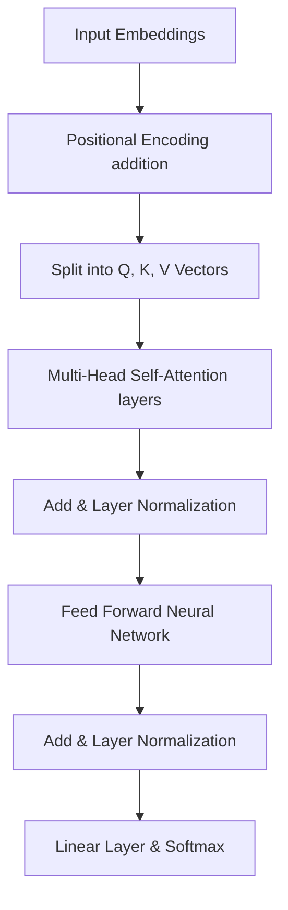

# Chapter 3: Transformers and the Attention Mechanism

**Estimated Reading Time**: 25 minutes  
**Difficulty**: Intermediate  
**Prerequisites**: Chapters 1 & 2.  
**Learning Objectives**:
1. Understand why sequential processing (RNNs) failed to scale for long texts.
2. Explain the core architecture of the Transformer Block.
3. Comprehend the self-attention formula from first principles.
4. Explain how multi-head attention extracts multiple semantic relationships.
5. Compute a mock attention weight matrix in TypeScript.

---

## Introduction

Modern Generative AI did not exist before 2017. The breakthrough that enabled ChatGPT, Claude, and Gemini was a specific neural network architecture: the **Transformer**. 

Prior to the Transformer, computers read text like humans: word-by-word. This sequential approach made it impossible to train large models. The Transformer changed this by introducing **Self-Attention**, allowing the model to look at the entire document at once.

In this chapter, we unpack the mathematical foundations of the Transformer and implement self-attention inside a TypeScript runner.

---

## Theory: The Evolution of Attention

### 1. The RNN / LSTM Bottleneck
In Recurrent Neural Networks (RNNs), to generate the 50th word, the model runs a loop that passes a hidden state vector sequentially through 49 steps. 
* **Vanishing Gradients**: By step 50, the math gradient from step 1 has been multiplied 50 times, shrinking to zero. The model "forgets" the start of the sentence.
* **No Parallelization**: You cannot compute step 50 without computing step 49 first. This means models could not be trained efficiently on GPUs.

### 2. The Transformer Block
Introduced in the paper *"Attention Is All You Need"* (Google, 2017), the Transformer architecture eliminates recurrence. It ingests the entire text block simultaneously and uses **Positional Encodings** to remember where words were in the sentence.

### 3. Self-Attention ($Q, K, V$ Math)
Attention allows a word to calculate its relationship to every other word in the text. For each token, the model projects its embedding into three vectors:
1. **Query ($Q$)**: What the token is looking for.
2. **Key ($K$)**: The metadata tags other tokens use to advertise their contents.
3. **Value ($V$)**: The actual content of the token.

The attention calculation follows these steps:
* Step 1: Multiply Query vectors ($Q$) by Key vectors transpose ($K^T$) to get raw similarity scores.
* Step 2: Divide by the square root of the dimensions ($\sqrt{d_k}$) to keep gradients stable.
* Step 3: Apply the **Softmax** function to convert scores into probabilities (weights summing to 1.0).
* Step 4: Multiply the attention weights by the Value vectors ($V$) to generate the final context-rich token output.

$$\text{Attention}(Q, K, V) = \text{softmax}\left(\frac{QK^T}{\sqrt{d_k}}\right)V$$

### 4. Multi-Head Attention
Instead of computing attention once, models run the calculation 8, 16, or 32 times in parallel (heads). Each "head" learns a different relationship:
* Head 1 might focus on subject-verb agreement.
* Head 2 might focus on pronoun resolution (matching "it" to "database").
* Head 3 might focus on geographic associations.

---

## Real-World Analogy: The Filing Cabinet Search

Imagine you are looking for tax records in a library:
* **The RNN Approach**: You are blindfolded. You walk past bookshelves, pick up a book, read it, and try to remember it. You walk to the next book. By book 100, you have forgotten book 1.
* **The Transformer (QKV) Approach**: 
  * You walk in with a search query: "2025 Invoice matching Company X" (**Query**).
  * You look at the filing cabinets. Each drawer has a label: "2025 Invoices", "2024 Tax Forms" (**Keys**).
  * You compare your query to the labels. The "2025 Invoices" cabinet is a 95% match, others are 5% matches.
  * You open the 95% cabinet and extract the documents (**Values**). You have bypassed reading the rest of the library.

---

## Architecture Diagram: Inside the Transformer Block

This diagram shows how input embeddings are enriched with positional data, passed through Multi-Head Attention, normalized, and output through a feedforward network.



---

## Code Example: Self-Attention Weight Calculator (TypeScript)

Let's write a script that implements the attention weight calculation ($QK^T / \sqrt{d_k}$ with Softmax) using matrices in TypeScript to see how similarity grids are compiled.

Create `attention_calculator.ts`:

```typescript
// Helper: Softmax function squashes a vector into probabilities that sum to 1.0
function softmax(vector: number[]): number[] {
  const exponents = vector.map(val => Math.exp(val));
  const sumExponents = exponents.reduce((a, b) => a + b, 0);
  return exponents.map(exp => exp / sumExponents);
}

// Helper: Dot Product of two vectors
function dotProduct(vecA: number[], vecB: number[]): number {
  return vecA.reduce((sum, val, idx) => sum + val * vecB[idx], 0);
}

/**
 * Calculates a basic attention matrix for a sequence of 3 tokens
 * Token 1: "The", Token 2: "Postgres", Token 3: "database"
 */
function calculateAttentionWeights() {
  // Query vectors for each token (Dimensions = 4)
  const Queries = [
    [0.1, 0.8, 0.0, 0.2], // "The"
    [0.9, 0.1, 0.1, 0.8], // "Postgres"
    [0.9, 0.0, 0.0, 0.9]  // "database"
  ];

  // Key vectors for each token
  const Keys = [
    [0.15, 0.75, 0.05, 0.1], // "The"
    [0.85, 0.15, 0.08, 0.75], // "Postgres"
    [0.88, 0.05, 0.02, 0.85]  // "database"
  ];

  const dimension = 4;
  const sqrtD = Math.sqrt(dimension);

  console.log("Calculating Attention Grid (Similarity Matrix)...");

  // Loop over each token query to check against all token keys
  const tokenLabels = ["The", "Postgres", "database"];

  for (let q = 0; q < Queries.length; q++) {
    const query = Queries[q];
    const rawScores: number[] = [];

    for (let k = 0; k < Keys.length; k++) {
      const key = Keys[k];
      
      // Calculate dot product Q * K^T
      const score = dotProduct(query, key);
      
      // Scale by sqrt(d_k)
      const scaledScore = score / sqrtD;
      rawScores.push(scaledScore);
    }

    // Apply Softmax to get probabilities (attention weights)
    const weights = softmax(rawScores);

    console.log(`\nAttention weights for word: "${tokenLabels[q]}"`);
    weights.forEach((weight, idx) => {
      console.log(`  - Focus on "${tokenLabels[idx].padEnd(10)}": ${(weight * 100).toFixed(2)}%`);
    });
  }
}

// Execute calculation
calculateAttentionWeights();
```

Run this file:
```bash
npx tsx attention_calculator.ts
```

Notice how "database" assigns a massive focus score ($> 90\%$) to "Postgres" because they share close semantic query-key dimensions, while assigning almost $0\%$ to "The".

---

## Best Practices, Production & Security Considerations

### 1. Use FlashAttention for Custom Workloads
If you deploy open-source models (like Llama-3) on your own infrastructure, configure them to use **FlashAttention**. FlashAttention is a hardware-optimized GPU algorithm that manages memory read/write cycles, accelerating attention calculations by up to $300\%$ and reducing VRAM usage.

---

## Common Mistakes

1. **Ignoring Sequence Overhead**: Assuming that doubling the text input context length in a custom pipeline only doubles execution latency. Because of the $O(N^2)$ attention bottleneck, long-context latency spikes significantly.

---

## Exercises & Mini Project

### Exercise 1: Multi-Head Projection
Write a brief technical description explaining why key/query projections are split into multiple lower-dimensional heads instead of running a single high-dimensional attention calculation.

### Mini Project: Attention Visualizer Console
Write a TypeScript function that takes a text sentence, tokenizes it into words, and generates a random mock attention grid showing relationships. Print the grid in the terminal using colored background blocks based on weights (e.g. heatmaps).

---

## Interview Questions

1. **Q**: What is the self-attention formula? Explain the role of the $\sqrt{d_k}$ scaling factor.
   * **A**: The formula is $\text{softmax}(QK^T / \sqrt{d_k})V$. The scaling factor $\sqrt{d_k}$ (square root of key dimensions) is critical because as dimensions grow, the dot product values grow large, pushing the softmax function into regions with tiny gradients (vanishing gradients). Scaling keeps values stable during gradient updates.
2. **Q**: How do Transformers process word order without recurrent loops?
   * **A**: Transformers use **Positional Encodings**: static mathematical wave vectors added to the input word embeddings. These vectors code the index positions of words in the sequence, allowing the model to distinguish between "cat eats mouse" and "mouse eats cat".

---

## Navigation

**Prev:** [Chapter 2: What is AI, ML, and DL?](./02_What_is_AI_ML_DL.md) | **Index:** [Course Overview](./00_Index.md) | **Next:** [Chapter 4: Tokens and Tokenization](./04_Tokens_and_Tokenization.md)
