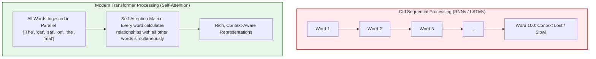
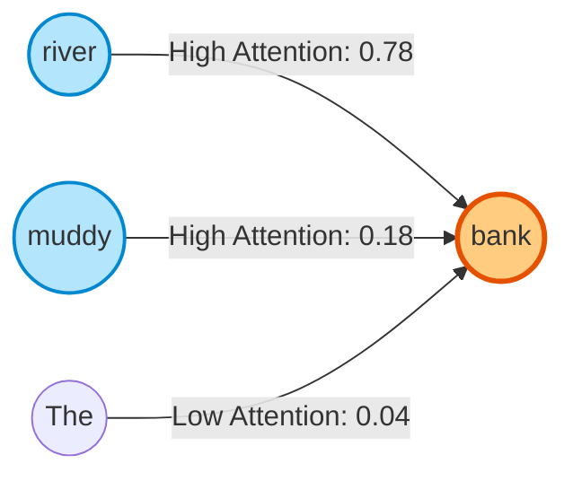
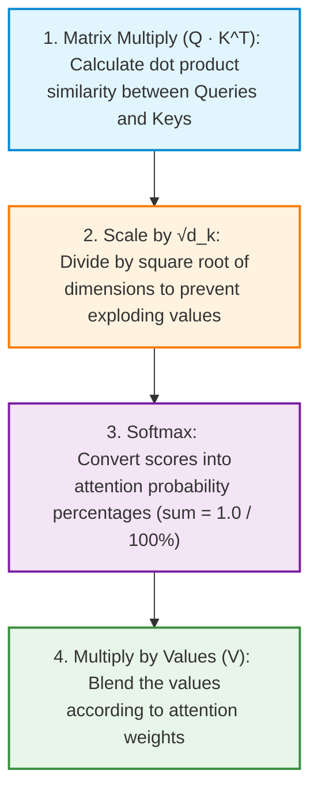
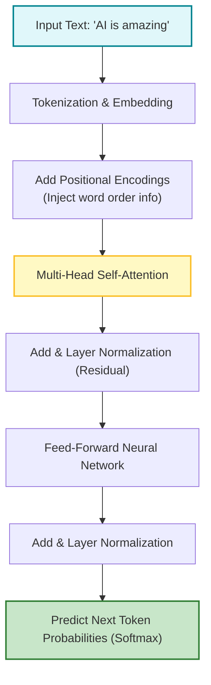

# 🤖 Transformers and the Attention Mechanism

## 📌 Overview

Before 2017, computers processed human language like an old tape recorder: word by word, from left to right. If a paragraph was 100 words long, by the time the computer reached the 100th word, it had almost completely forgotten what the 1st word was!

In 2017, a team of Google researchers published a legendary paper titled **"Attention Is All You Need"**. They introduced a brand-new neural network architecture called the **Transformer**.

Instead of reading one word at a time, the Transformer ingests an **entire sentence or document at once in parallel** and calculates how every single word relates to every other word. This revolutionary mechanism is called **Self-Attention**, and it powers almost every modern AI model today—including ChatGPT, Claude, Gemini, and LLaMA!



---

## 🎯 Why This Matters

1. **Powers 99% of GenAI**: Whether you are working with text, code, audio, or images, the underlying engine is almost always a Transformer.
2. **Context Window Limitations**: Understanding attention helps you understand why LLMs have token limits and why processing 1 million tokens costs more computation (attention complexity scales quadratically with context length: $O(N^2)$).
3. **Explains AI Memory**: It demystifies how an AI model can resolve pronouns (like knowing whether "it" refers to the dog or the street).

---

## 🧠 Prerequisites

- [01_Introduction.md](./01_Introduction.md): Probabilistic models and tokens.
- [02_What_is_AI_ML_DL.md](./02_What_is_AI_ML_DL.md): Neural networks, weights, and vectors.

---

## 🔍 Deep Dive

### 1. Why Did Old Models (RNNs/LSTMs) Fail?

Before Transformers, we used **Recurrent Neural Networks (RNNs)**:
- **No GPU Parallelism**: Because word 2 depended on word 1, computers could not process words at the same time. Training took weeks.
- **Vanishing Gradients & Forgetting**: Passing mathematical state through 50+ time steps caused early information to fade to zero.

---

### 2. The Core Idea of Self-Attention: Disambiguation

Look at these two sentences:
- Sentence A: *"The **bank** of the river was muddy."*
- Sentence B: *"The **bank** approved the loan."*

The word *"bank"* has completely different meanings. How does a computer know which one is meant?
Through **Self-Attention**, the word *"bank"* looks at nearby words:
- In sentence A, *"bank"* pays high attention to *"river"* and *"muddy"* $\to$ financial meaning drops, natural riverbank meaning emerges.
- In sentence B, *"bank"* pays high attention to *"loan"* and *"approved"* $\to$ financial meaning dominates.



---

### 3. The Math of Attention: Query, Key, and Value ($Q, K, V$)

To calculate attention mathematically, every word is converted into 3 distinct vectors:

| Component | Analogy (YouTube / Search Engine) | Meaning in Model |
|---|---|---|
| **Query ($Q$)** | What you type in the search bar | What the current word is looking for |
| **Key ($K$)** | The video title & metadata tags | How other words advertise their meaning |
| **Value ($V$)** | The actual video content you watch | The actual semantic information of the word |



The mathematical formula:

$$\text{Attention}(Q, K, V) = \text{softmax}\left(\frac{Q K^T}{\sqrt{d_k}}\right) V$$

- **Why divide by $\sqrt{d_k}$?** As vector dimensions grow (e.g., 4096 dimensions), dot products become huge numbers. Large numbers make Softmax output sharp `0`s and `1`s, killing the learning gradients. Scaling keeps gradients healthy!

---

### 4. Multi-Head Attention

Instead of running attention once, modern Transformers use **Multi-Head Attention** (e.g., 8, 16, or 32 heads in parallel).
Each head focuses on a different aspect of language:
- **Head 1**: Focuses on grammatical syntax (verbs matching nouns).
- **Head 2**: Focuses on pronoun resolution (linking "she" or "it" to the correct person/object).
- **Head 3**: Focuses on emotional tone and sentiment.

---

### 5. The Complete Transformer Architecture



---

## 💡 Simple Example: The Library Search

Imagine walking into a massive library:
1. **Query ($Q$)**: You hold a note saying *"Need information on 1969 Moon Landing"*.
2. **Keys ($K$)**: Every book on the shelf has a label on its spine (*"Cooking"*, *"Space Exploration 1960s"*, *"Gardening"*).
3. **Attention Score**: You compare your note to all labels. The book *"Space Exploration 1960s"* matches 95%, while *"Gardening"* matches 0%.
4. **Values ($V$)**: You open the 95% matching book and extract its pages.

---

## 🏗️ Real-World Example: Autocomplete & Coding Assistants

When GitHub Copilot predicts the next line of your TypeScript code:
- Your cursor is on line 20.
- The Self-Attention mechanism reads lines 1 through 19 simultaneously.
- It pays high attention to the imported database models on line 2 and function parameters on line 15 to predict the exact variable names on line 20.

---

## ⚠️ Common Mistakes & Pitfalls

1. ❌ **Thinking Transformers read left-to-right**:
   - *Reality*: Transformers read all input tokens at once. They need **Positional Encodings** to know which word was first, second, or third.
2. ❌ **Ignoring Quadratic Memory Cost ($O(N^2)$)**:
   - *Trap*: Doubling the prompt length from 4,000 tokens to 8,000 tokens quadruples ($4\times$) the attention matrix computations. This is why long-context models require specialized GPU optimizations (like FlashAttention).

---

## 🔥 Important Points to Remember

- **Transformers** replaced RNNs because they process text in parallel.
- **Self-Attention** allows words to look at every other word to gather context.
- **$Q, K, V$**: Query (search), Key (tag/index), Value (content).
- **Multi-Head Attention**: Multiple attention mechanisms running in parallel to capture syntax, semantics, and relationships.
- **$O(N^2)$ Complexity**: Processing cost grows with the square of the context length.

---

## 💻 Code / Commands / Configuration

Here is a simple, intuitive TypeScript script that simulates the **Self-Attention score calculation** using matrices and Softmax:

```typescript
// self_attention_demo.ts
// Run with: npx ts-node self_attention_demo.ts

// Softmax function: converts raw scores into probabilities that sum to 1.0
function softmax(vector: number[]): number[] {
  const expScores = vector.map(val => Math.exp(val));
  const sumExp = expScores.reduce((acc, curr) => acc + curr, 0);
  return expScores.map(val => val / sumExp);
}

// Dot Product: measures alignment between two vectors
function dotProduct(vecA: number[], vecB: number[]): number {
  return vecA.reduce((sum, val, idx) => sum + val * vecB[idx], 0);
}

// Calculate Self-Attention scores for a 3-word sentence: ["AI", "is", "cool"]
function calculateAttentionScores() {
  const words = ["AI", "is", "cool"];
  const dimension = 4; // Dimension of each vector (d_k)
  const scale = Math.sqrt(dimension);

  // Mock Query (Q) and Key (K) vectors for each word
  const queries: Record<string, number[]> = {
    "AI":   [1.0, 0.2, 0.8, 0.1],
    "is":   [0.1, 0.1, 0.2, 0.9],
    "cool": [0.9, 0.3, 0.7, 0.2],
  };

  const keys: Record<string, number[]> = {
    "AI":   [0.9, 0.3, 0.8, 0.0],
    "is":   [0.1, 0.2, 0.1, 0.8],
    "cool": [0.8, 0.4, 0.6, 0.1],
  };

  console.log("🔍 Computing Self-Attention Scores:\n");

  for (const wordA of words) {
    const rawScores: number[] = [];

    for (const wordB of words) {
      const q = queries[wordA];
      const k = keys[wordB];
      // Formula: (Q · K^T) / sqrt(d_k)
      const score = dotProduct(q, k) / scale;
      rawScores.push(score);
    }

    // Apply Softmax across row
    const attentionWeights = softmax(rawScores);

    console.log(`Word: "${wordA}" attention breakdown:`);
    words.forEach((targetWord, idx) => {
      const percentage = (attentionWeights[idx] * 100).toFixed(1);
      console.log(`  -> Pays ${percentage}% attention to "${targetWord}"`);
    });
    console.log("");
  }
}

calculateAttentionScores();
```

---

## 🎤 Interview Perspective

* **Q: Why does the self-attention formula divide by $\sqrt{d_k}$?**
  * **Answer**: For large vector dimensions $d_k$, the dot product $Q \cdot K^T$ grows very large in magnitude. Large values push the Softmax function into regions with extremely tiny gradients (the vanishing gradient problem). Scaling by $\sqrt{d_k}$ stabilizes the variance to $1.0$, ensuring smooth gradient flow during training.
* **Q: What is the difference between an Encoder-only, Decoder-only, and Encoder-Decoder Transformer?**
  * **Answer**: 
    - **Encoder-only** (e.g., BERT): Sees all tokens bidirectionally; ideal for classification and embeddings.
    - **Decoder-only** (e.g., GPT-4, LLaMA): Uses causal masking so tokens only look at previous tokens; ideal for auto-regressive text generation.
    - **Encoder-Decoder** (e.g., T5): Encodes an input sequence and decodes an output sequence; ideal for translation.

---

## 🧩 Connection With Previous Concepts

- **Previous Lesson ([02_What_is_AI_ML_DL.md](./02_What_is_AI_ML_DL.md))**: Covered artificial neurons, activation functions, and gradient descent.
- **Next Lesson ([04_Tokens_and_Tokenization.md](./04_Tokens_and_Tokenization.md))**: We will explore how raw text is broken down into numerical **Tokens** before it can enter a Transformer!

---

Previous : [02_What_is_AI_ML_DL.md](./02_What_is_AI_ML_DL.md) | Index: [00_Index.md](./00_Index.md) | Next: [04_Tokens_and_Tokenization.md](./04_Tokens_and_Tokenization.md)
