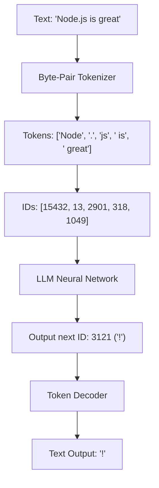

# Chapter 4: Tokens and Tokenization

**Estimated Reading Time**: 20 minutes  
**Difficulty**: Intermediate  
**Prerequisites**: Chapters 1–3.  
**Learning Objectives**:
1. Understand Byte-Pair Encoding (BPE) and subword tokenization algorithms.
2. Understand why token counts limit LLM performance and context windows.
3. Count tokens programmatically using `js-tiktoken` in TypeScript.
4. Explain how tokenization biases affect non-English languages and numerical computations.

---

## Introduction

As a web developer, you measure strings by character counts (`string.length` or bytes). If you pass these measurements directly to LLMs, your apps will crash or exceed API budgets. LLMs do not read words or characters; they read **tokens**.

Understanding tokenization is essential for building production AI applications. It dictates API costs, latency, memory limits, and explains many of the strange bugs and logical limitations of modern models.

In this chapter, we explore how tokenization algorithms work and count tokens programmatically.

---

## Theory: Byte-Pair Encoding & Context Budgets

### 1. What is a Token?
A token is a word chunk. Text is split into common letter combinations. In English text:
* 1 token is roughly equivalent to **4 characters**.
* 1 token is roughly equivalent to **0.75 words**.
* Common words like `"the"`, `"and"`, or `"node"` are usually single tokens. Uncommon words are split into pieces: `"unbelievable"` $\rightarrow$ `["un", "believ", "able"]`.

### 2. Byte-Pair Encoding (BPE)
BPE is the standard tokenization algorithm used by GPT and Claude. It builds a vocabulary from data:
* **Step 1**: Start with all individual characters (alphabet + symbols) in the vocabulary.
* **Step 2**: Scan the training text database and count the most frequent adjacent character pairs (e.g. `e` and `r` $\rightarrow$ `er`).
* **Step 3**: Merge that pair and add it to the vocabulary as a single entry.
* **Step 4**: Repeat this merge process until the vocabulary reaches its target size (e.g. 100,000 token entries).

### 3. Why LLMs Can't Count Letters or Spell
Because tokenizers group letters into subwords, the LLM never sees individual characters.
* If you ask an LLM: *"How many letters are in the word strawberry?"*, the tokenizer outputs the tokens `["straw", "berry"]`.
* The model looks at those two tokens and guesses the character count, often resulting in mistakes.

### 4. Language Bias
BPE tokenizers are trained primarily on English datasets. 
* The English word `"cat"` is 1 token.
* The Hindi word for cat (`"बिल्ली"`) consumes 4 to 6 tokens because the characters are split into byte-level pieces.
* Consequently, running queries in non-English languages is up to **5x more expensive** and exhausts context windows much faster.

---

## Real-World Analogy: The Lego Puzzle

Imagine you are building a LEGO tower:
* **Character-level processing**: Every individual letter is a $1 \times 1$ Lego brick. Building a tower takes thousands of steps (high computational cost).
* **Word-level processing**: You have a pre-made brick for every word in the dictionary. The problem is your storage bucket must be infinite, and you cannot handle typos or new words like "React".
* **Subword (Tokenization) Approach**: You build a bucket of common building blocks (prefixes, roots, suffixes). A common word gets a single large brick. An uncommon word is assembled by locking together a few smaller blocks. You can assemble anything with a small, optimized collection.

---

## Architecture Diagram: Token Conversion Flow

This diagram illustrates how raw text strings are converted to token arrays, passed through model inference, and converted back to readable text.



---

## Code Example: Programmatic Token Counting (TypeScript)

Let's build a tokenizer utility that counts tokens and prints the exact subword split of strings using `js-tiktoken` (specifically the `o200k_base` encoding used by GPT-4o).

Ensure you have initialized TypeScript in your working directory and installed the dependency:
```bash
npm install js-tiktoken
```

Create `token_counter.ts`:

```typescript
import { getEncoding, encodingForModel } from "js-tiktoken";

// Initialize tokenizer for the GPT-4o family models
const tokenizer = encodingForModel("gpt-4o-mini");

interface TokenAnalysis {
  text: string;
  charCount: number;
  tokenCount: number;
  segments: { id: number; text: string }[];
}

function analyzeTextTokens(text: string): TokenAnalysis {
  const tokenIds = tokenizer.encode(text);
  const segments = tokenIds.map(id => ({
    id: id,
    text: tokenizer.decode([id])
  }));

  return {
    text,
    charCount: text.length,
    tokenCount: tokenIds.length,
    segments
  };
}

// Test Case 1: Simple English Sentence
console.log("--- English Analysis ---");
const analysis1 = analyzeTextTokens("Tokenization is unbelievable!");
console.log(`Chars: ${analysis1.charCount} | Tokens: ${analysis1.tokenCount}`);
analysis1.segments.forEach(s => console.log(`  - [ID ${s.id.toString().padEnd(6)}] -> "${s.text}"`));

// Test Case 2: Code block tokenization
console.log("\n--- TypeScript Code Block Analysis ---");
const codeBlock = `const add = (a: number, b: number): number => a + b;`;
const analysis2 = analyzeTextTokens(codeBlock);
console.log(`Chars: ${analysis2.charCount} | Tokens: ${analysis2.tokenCount}`);
// Print only first few tokens to show spacing cost
analysis2.segments.slice(0, 8).forEach(s => console.log(`  - [ID ${s.id.toString().padEnd(6)}] -> "${s.text}"`));
```

Run this file:
```bash
npx tsx token_counter.ts
```

Observe how spaces, indentation, and characters in the programming code (`=>`, `:`, `const`) are split into individual tokens, highlighting why sending large code blocks can be expensive.

---

## Best Practices, Production & Security Considerations

### 1. Enforce Server-Side Validation
Never rely on client-side React code to limit prompt lengths.
* **Production Rule**: Always run the `js-tiktoken` analyzer inside your Express/Fastify API request controllers. If the incoming payload token count exceeds a threshold (e.g. 5,000 tokens), reject the request with a `400 Bad Request` before calling the LLM provider.

---

## Common Mistakes

1. **Using character length division**: Assuming `Math.round(string.length / 4)` is safe for inputs that contain emojis, non-English text, or programming files. It will underestimate token counts, leading to context window overflow crashes.

---

## Exercises & Mini Project

### Exercise 1: Tokenizer swap comparison
Compare the token output counts of `js-tiktoken` for `o200k_base` and `cl100k_base` (used by older models like GPT-4) on the same string containing mixed programming code and emojis. Explain which tokenizer is more efficient.

### Mini Project: Smart Chat Truncator
Write a TypeScript class `SmartTruncator` that accepts an array of message objects (role, content) and recursively drops the oldest messages to ensure the total conversation token count remains below 1,500, always keeping the system message intact.

---

## Interview Questions

1. **Q**: Why do non-English queries cost more to run on LLM APIs than English queries?
   * **A**: BPE tokenizers are trained primarily on English databases. For English, common words are mapped to single tokens. For non-English languages, characters are split into raw byte configurations, requiring 4 to 6 tokens per word. This inflates both processing costs and context usage.
2. **Q**: What are the trade-offs of using models with larger context windows (e.g., 1 million tokens)?
   * **A**: While large context windows allow you to send huge documents, query latencies increase (specifically Time-to-First-Token) and processing costs scale up. Furthermore, models can suffer from "lost in the middle" phenomena, where attention drops for details in the middle of long prompts.

---

## Navigation

**Prev:** [Chapter 3: Transformers and Attention](./03_Transformers_and_Attention.md) | **Index:** [Course Overview](./00_Index.md) | **Next:** [Chapter 5: Embeddings and Vector Search](./05_Embeddings_and_Vector_Search.md)
