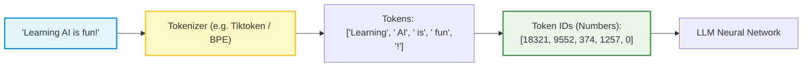
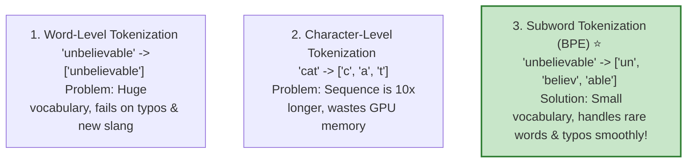
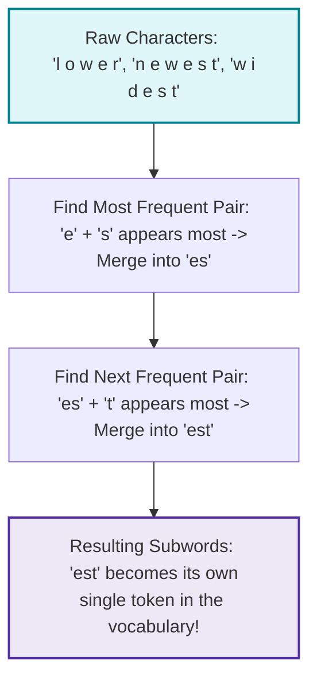
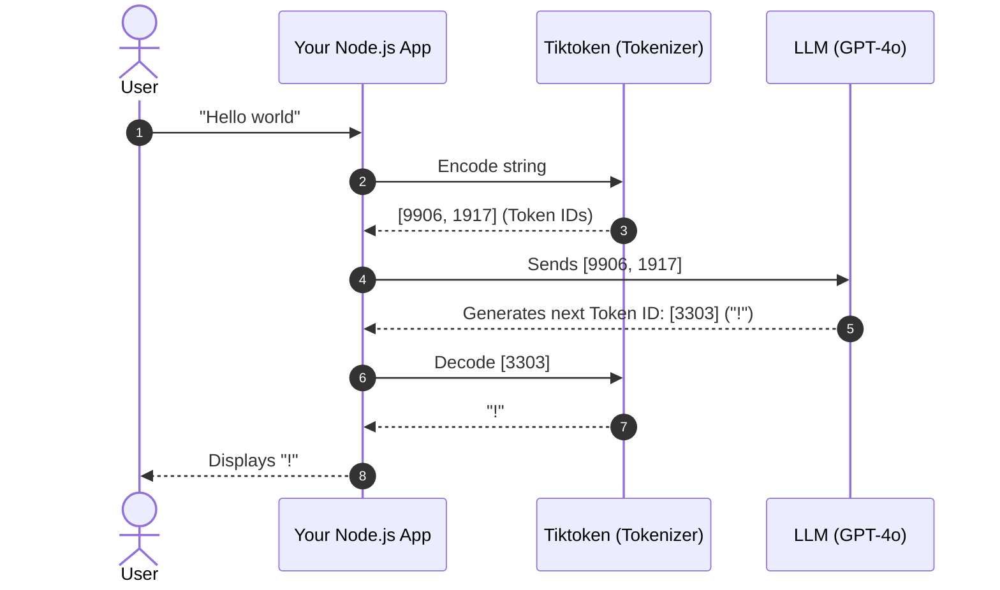

# 🤖 Tokens and Tokenization

## 📌 Overview

Computers cannot read human letters, words, or sentences directly. They only understand numbers.

Before a Large Language Model (LLM) can process any prompt you type, it must slice your text into small chunks called **Tokens**, and convert each chunk into a unique number (a **Token ID**).

Think of tokens as the **Lego bricks of language** and the **currency of the AI world**. Everything in GenAI—pricing, context windows, speed, and rate limits—is measured in tokens!



---

## 🎯 Why This Matters

1. **You Pay Per Token**: OpenAI, Anthropic, and Google charge you based on input tokens and output tokens. If you do not monitor your token usage, your API bill can skyrocket.
2. **Context Window Limits**: Models have fixed maximum limits (e.g., 8k, 128k, or 1M tokens). If your prompt exceeds this, the API throws an error.
3. **Explains AI Oddities**: Why can't ChatGPT spell *"strawberry"* (counting the 'r's) easily? Because it doesn't see individual letters `s-t-r-a-w-b-e-r-r-y`—it sees whole token chunks like `["straw", "berry"]`!

---

## 🧠 Prerequisites

- [01_Introduction.md](./01_Introduction.md): How LLMs generate text token-by-token.
- [03_Transformers_and_Attention.md](./03_Transformers_and_Attention.md): How Transformers process token sequences.

---

## 🔍 Deep Dive

### 1. Three Ways to Slice Text



Modern LLMs use **Subword Tokenization** algorithms like **Byte Pair Encoding (BPE)** or **WordPiece**.

---

### 2. How Byte Pair Encoding (BPE) Works

BPE builds a vocabulary by iteratively merging the most frequent pairs of characters in a large training dataset:



Through this process, common words like `"the"` become 1 token, while rare or complex words like `"electromagnetism"` are split into pieces like `["electro", "magnet", "ism"]`.

---

### 3. Golden Rule of Thumb: Words vs. Tokens

In English:
- **1 Token $\approx$ 0.75 Words** (or 4 characters).
- **100 Tokens $\approx$ 75 Words**.
- **1,000 Tokens $\approx$ 750 Words** (about 1.5 single-spaced pages).

> [!WARNING]
> Non-English languages (Hindi, Arabic, Japanese, etc.) and code indentation often consume **2x to 5x more tokens** for the same amount of information because their characters and whitespace are split into smaller subword chunks.

---

### 4. The Tokenization Pipeline



---

## 💡 Simple Example

Let's look at how the sentence *"Tokenization is magical!"* is broken down:

| Text Fragment | Token ID | Why? |
|---|---|---|
| `"Token"` | `30642` | Common English root word |
| `"ization"` | `1634` | Common English suffix |
| `" is"` | `374` | Notice the leading space is part of the token! |
| `" magical"` | `24958` | Common adjective with leading space |
| `"!"` | `0` | Punctuation mark |

Notice that **spaces** are usually included at the beginning of words! `" hello"` and `"hello"` are two completely different tokens.

---

## 🏗️ Real-World Example: Token Budgeting in Chatbots

When building a customer support chatbot:
1. **User Question**: 100 tokens.
2. **System Prompt (Instructions)**: 500 tokens.
3. **Retrieved Database Context (RAG)**: 2,000 tokens.
4. **Chat History (Last 5 messages)**: 1,500 tokens.
5. **Total Input Tokens**: $100 + 500 + 2000 + 1500 = 4,100$ tokens per message!

Knowing token sizes helps you implement a **Sliding Window** to trim older chat history before you exceed model limits.

---

## ⚠️ Common Mistakes & Pitfalls

1. ❌ **Counting words instead of tokens**:
   - *Trap*: Assuming 1,000 words equals 1,000 tokens. In reality, it may be 1,350+ tokens.
2. ❌ **Ignoring Whitespace in Code**:
   - *Trap*: Large code blocks with 8-space indentations use significantly more tokens than 2-space indentation.
3. ❌ **Forgetting Output Tokens in Cost Calculations**:
   - *Trap*: Output tokens are typically **3x to 4x more expensive** per token than input tokens across OpenAI, Anthropic, and Google.

---

## 🔥 Important Points to Remember

- LLMs only process numbers (Token IDs), not raw text.
- Subword tokenization (BPE) handles common words, rare words, and typos.
- 1 Token $\approx$ 4 characters $\approx$ 0.75 English words.
- Leading spaces and punctuation are separate tokens.
- Token counts determine pricing, latency, and context limits.

---

## 💻 Code / Commands / Configuration

Here is how to calculate exact token counts and inspect token IDs in JavaScript / TypeScript using `gpt-tokenizer` (or `@dqbd/tiktoken`):

```typescript
// token_counter.ts
// 1. Run: npm install gpt-tokenizer
// 2. Run: npx ts-node token_counter.ts

import { encode, decode } from 'gpt-tokenizer';

function analyzeTextTokens(text: string) {
  console.log("📝 Original Text:\n" + text + "\n");

  // 1. Convert text to Token IDs (Numbers)
  const tokenIds = encode(text);
  console.log(`🔢 Total Tokens: ${tokenIds.length}`);
  console.log("Token IDs:", tokenIds);

  // 2. Inspect each token individually
  console.log("\n🔍 Token Breakdown:");
  tokenIds.forEach((id, index) => {
    const chunk = decode([id]);
    console.log(`  Token #${index + 1} | ID: ${id.toString().padEnd(6)} | Text: "${chunk}"`);
  });

  // 3. Estimate cost for GPT-4o-mini ($0.15 per 1M input tokens)
  const costPerMillion = 0.15;
  const estimatedCost = (tokenIds.length / 1_000_000) * costPerMillion;
  console.log(`\n💰 Estimated Input Cost: $${estimatedCost.toFixed(8)} USD`);
}

// Test with a sample sentence containing punctuation and spacing
const sample = "Full-Stack AI Engineering with TypeScript is awesome! 🚀";
analyzeTextTokens(sample);
```

---

## 🎤 Interview Perspective

* **Q: What is Byte Pair Encoding (BPE) and why is it preferred over character-level tokenization?**
  * **Answer**: BPE is a subword tokenization algorithm that iteratively merges the most frequent pairs of characters/bytes into single tokens. It strikes the perfect balance: it keeps the vocabulary size manageable (around 32k–100k tokens), avoids out-of-vocabulary errors by falling back to characters/bytes for unknown words, and keeps sequence lengths much shorter than character-level tokenization.
* **Q: Why are LLMs bad at math and character-level tasks (like reversing words)?**
  * **Answer**: Because LLMs operate on tokens, not characters. To the model, the word "apple" is a single token ID (`17231`). It never sees the individual letters 'a', 'p', 'p', 'l', 'e', making character manipulation and exact digit-by-digit arithmetic difficult without Chain-of-Thought prompting.

---

## 🧩 Connection With Previous Concepts

- **Previous Lesson ([03_Transformers_and_Attention.md](./03_Transformers_and_Attention.md))**: Learned how Transformers compute self-attention across sequences of tokens.
- **Next Lesson ([05_Embeddings_and_Vector_Search.md](./05_Embeddings_and_Vector_Search.md))**: We will learn how tokens are converted into high-dimensional geometric vectors called **Embeddings** to perform semantic search!

---

Previous : [03_Transformers_and_Attention.md](./03_Transformers_and_Attention.md) | Index: [00_Index.md](./00_Index.md) | Next: [05_Embeddings_and_Vector_Search.md](./05_Embeddings_and_Vector_Search.md)
