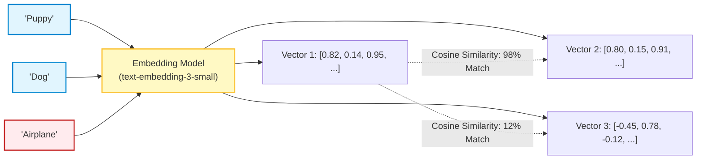
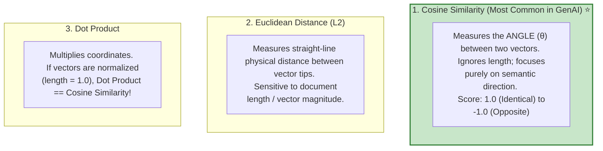
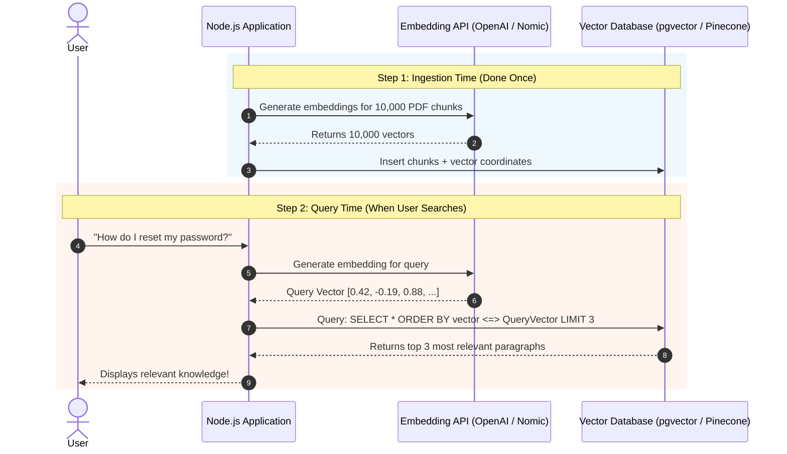

# 🤖 Embeddings and Vector Search

## 📌 Overview

How can a computer understand that the word **"puppy"** is almost identical in meaning to **"dog"**, while completely unrelated to **"airplane"**?

In traditional programming, `"puppy"` and `"dog"` share zero letters. If you do a simple SQL `LIKE '%dog%'` search, `"puppy"` will never match!

To solve this, AI uses **Embeddings**. 

An **Embedding** takes a piece of text (a word, sentence, or entire article) and converts it into a list of numbers called a **Vector** (for example, a list of 1,536 numbers). These numbers represent the **coordinates of meaning** in a multi-dimensional semantic space. Concepts with similar meanings are placed physically close to each other in this mathematical space!



---

## 🎯 Why This Matters

1. **Powers RAG (Retrieval-Augmented Generation)**: Embeddings allow your AI to search through millions of internal company PDFs, documentation pages, or customer logs in milliseconds.
2. **Semantic Search vs. Keyword Search**: Users don't need to guess exact keywords. A user searching *"How do I change my home location?"* will find documents titled *"Updating your billing and shipping address"*.
3. **Recommendation Engines & Clustering**: Spotify, Netflix, and Amazon use embeddings to recommend songs, movies, and products based on user preference vectors.

---

## 🧠 Prerequisites

- [01_Introduction.md](./01_Introduction.md): How AI models process text.
- [04_Tokens_and_Tokenization.md](./04_Tokens_and_Tokenization.md): How text is converted into tokens before being embedded.

---

## 🔍 Deep Dive

### 1. Visualizing Semantic Dimensions

Imagine a 3-dimensional space where each axis represents a concept:
- **Axis 1**: "Is it an animal?" (0 = No, 1 = Yes)
- **Axis 2**: "Is it a pet?" (0 = Wild/Object, 1 = Domesticated Pet)
- **Axis 3**: "Can it fly?" (0 = No, 1 = Yes)

```text
Dog    -> [ 0.95,  0.98,  0.02 ]  (Animal: Yes, Pet: Yes, Flies: No)
Puppy  -> [ 0.94,  0.97,  0.01 ]  (Extremely close coordinates to Dog!)
Cat    -> [ 0.93,  0.95,  0.03 ]  (Very close to Dog)
Eagle  -> [ 0.91,  0.10,  0.99 ]  (Animal: Yes, Pet: No, Flies: Yes)
Boeing -> [ 0.01,  0.00,  0.98 ]  (Animal: No, Pet: No, Flies: Yes)
```

In real-world models, instead of just 3 axes, embeddings have **1,536 to 3,072 dimensions**, capturing nuanced concepts like sentiment, technical depth, formality, and domain context!

---

### 2. Measuring Similarity: Cosine Similarity vs. Euclidean Distance

How do we mathematically calculate how close two vectors are?



$$\text{Cosine Similarity}(\vec{A}, \vec{B}) = \frac{\vec{A} \cdot \vec{B}}{\|\vec{A}\| \|\vec{B}\|} = \frac{\sum (A_i \cdot B_i)}{\sqrt{\sum A_i^2} \cdot \sqrt{\sum B_i^2}}$$

---

### 3. The Vector Search Workflow (Semantic Search Pipeline)



---

## 💡 Simple Example: Vector Math with King and Queen

One of the most famous discoveries in AI embedding research is that semantic relationships behave like vector arithmetic:

$$\vec{\text{King}} - \vec{\text{Man}} + \vec{\text{Woman}} \approx \vec{\text{Queen}}$$

- If you take the vector for **King**,
- Subtract the concept of **Manhood**,
- And add the concept of **Womanhood**,
- The resulting coordinates land right next to **Queen**!

---

## 🏗️ Real-World Example: Duplicate Ticket Detection

In a large customer support system:
- When a customer submits a new ticket: *"My screen is completely black and won't turn on"*.
- The system embeds the text and performs a vector search against past resolved tickets.
- It finds a past ticket: *"Display is unresponsive and device does not boot"*.
- Cosine similarity score: `0.94` (94% match).
- The system immediately suggests the verified solution to the customer before an agent even opens the ticket!

---

## ⚠️ Common Mistakes & Pitfalls

1. ❌ **Mixing different embedding models**:
   - *Critical Trap*: If you embed your database documents using OpenAI's `text-embedding-3-small` (1536 dimensions), you **CANNOT** search them using Google Gemini embeddings or Cohere embeddings! Different models have completely different coordinate systems.
2. ❌ **Embedding huge multi-page documents as a single vector**:
   - *Trap*: A 50-page PDF averaged into one vector loses all specific details. Always split documents into smaller chunks (e.g. 300 to 500 tokens) before embedding.
3. ❌ **Re-embedding static documents on every search**:
   - *Trap*: Embed your documentation once, store the vectors in a vector database, and only embed the user's query at runtime.

---

## 🔥 Important Points to Remember

- An **Embedding** converts semantic meaning into a list of numbers (coordinates).
- Similar meanings produce vectors that point in the same direction in vector space.
- **Cosine Similarity** measures the angle between vectors (1.0 = perfect match).
- Vector search enables searching by **concept and meaning**, not just exact keywords.
- Always use the **exact same model** for both indexing documents and querying.

---

## 💻 Code / Commands / Configuration

Here is a complete TypeScript script that generates real embeddings using the OpenAI API and calculates cosine similarity between different phrases:

```typescript
// embedding_search_demo.ts
// 1. Run: npm install dotenv
// 2. Run: npx ts-node embedding_search_demo.ts

import * as dotenv from 'dotenv';
dotenv.config();

// 1. Mathematical Cosine Similarity function
function cosineSimilarity(vecA: number[], vecB: number[]): number {
  let dotProduct = 0;
  let normA = 0;
  let normB = 0;

  for (let i = 0; i < vecA.length; i++) {
    dotProduct += vecA[i] * vecB[i];
    normA += vecA[i] * vecA[i];
    normB += vecB[i] * vecB[i];
  }

  if (normA === 0 || normB === 0) return 0;
  return dotProduct / (Math.sqrt(normA) * Math.sqrt(normB));
}

// 2. Fetch Embedding vector from OpenAI API
async function getEmbedding(text: string): Promise<number[]> {
  const apiKey = process.env.OPENAI_API_KEY;
  if (!apiKey) throw new Error("OPENAI_API_KEY is not set!");

  const response = await fetch("https://api.openai.com/v1/embeddings", {
    method: "POST",
    headers: {
      "Content-Type": "application/json",
      "Authorization": `Bearer ${apiKey}`
    },
    body: JSON.stringify({
      model: "text-embedding-3-small", // 1536 dimensions, highly cost-effective
      input: text
    })
  });

  const data = await response.json();
  return data.data[0].embedding;
}

// 3. Demo: Semantic Search
(async () => {
  try {
    console.log("⏳ Generating embeddings...");

    const phrase1 = "A cute little puppy playing in the yard";
    const phrase2 = "A young dog running on grass";
    const phrase3 = "Stock market shares dropped by five percent";

    const vec1 = await getEmbedding(phrase1);
    const vec2 = await getEmbedding(phrase2);
    const vec3 = await getEmbedding(phrase3);

    console.log(`Vector Dimension Size: ${vec1.length} numbers\n`);

    const sim1_2 = cosineSimilarity(vec1, vec2);
    const sim1_3 = cosineSimilarity(vec1, vec3);

    console.log(`Match between ("${phrase1}") AND ("${phrase2}"):`);
    console.log(`👉 Cosine Similarity: ${(sim1_2 * 100).toFixed(2)}% (High Semantic Match!)\n`);

    console.log(`Match between ("${phrase1}") AND ("${phrase3}"):`);
    console.log(`👉 Cosine Similarity: ${(sim1_3 * 100).toFixed(2)}% (Unrelated Concept)`);
  } catch (error) {
    console.error(error);
  }
})();
```

---

## 🎤 Interview Perspective

* **Q: What is the difference between dense embeddings and sparse embeddings (like BM25)?**
  * **Answer**: 
    - **Dense Embeddings** (e.g. OpenAI embeddings) have fixed-length vectors (e.g. 1536 numbers) where almost all values are non-zero. They excel at understanding synonyms, concepts, and semantic intent.
    - **Sparse Embeddings** (e.g. BM25 / TF-IDF) have huge vectors matching the entire dictionary, where only the exact matching words have non-zero values. They excel at exact keyword matches, serial numbers, product IDs, and rare proper nouns.
    - **Production Standard**: Modern RAG systems use **Hybrid Search** (combining Dense + Sparse search).
* **Q: Why is Cosine Similarity preferred over Euclidean Distance for text embeddings?**
  * **Answer**: Cosine similarity measures the angle between vectors and is independent of magnitude. If two documents discuss the exact same topic, but one is a short paragraph and the other is a long summary, their vector directions will align (high cosine similarity), whereas Euclidean distance might penalize the difference in vector magnitude.

---

## 🧩 Connection With Previous Concepts

- **Previous Lesson ([04_Tokens_and_Tokenization.md](./04_Tokens_and_Tokenization.md))**: Sliced raw text into token chunks.
- **Next Lesson ([06_Generation_Control.md](./06_Generation_Control.md))**: We will explore how to steer and control LLM text generation using parameters like **Temperature**, **Top-P**, and **Penalties**!

---

Previous : [04_Tokens_and_Tokenization.md](./04_Tokens_and_Tokenization.md) | Index: [00_Index.md](./00_Index.md) | Next: [06_Generation_Control.md](./06_Generation_Control.md)
