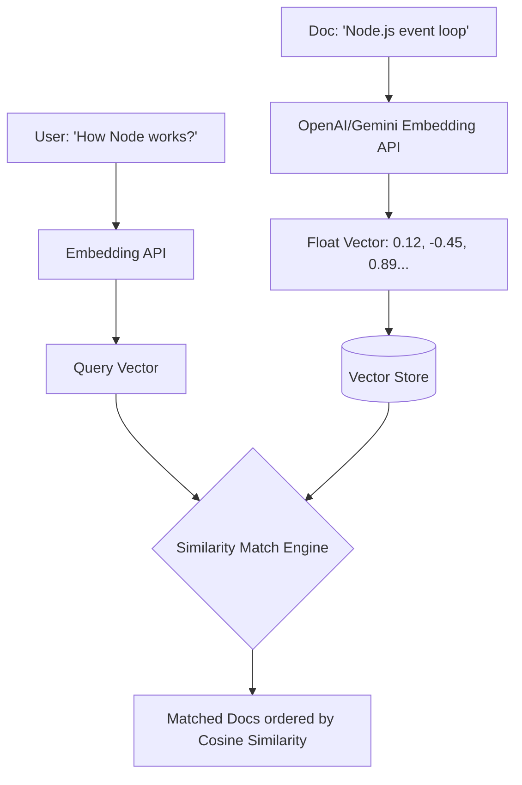

# Chapter 5: Embeddings and Vector Search

**Estimated Reading Time**: 25 minutes  
**Difficulty**: Intermediate  
**Prerequisites**: Chapters 1–4.  
**Learning Objectives**:
1. Define what vector embeddings represent in high-dimensional semantic spaces.
2. Calculate Cosine Similarity from scratch in TypeScript.
3. Understand the mathematical difference between Cosine, Euclidean, and Inner Product metrics.
4. Conceptualize how high-dimensional vectors are stored and queried.

---

## Introduction

In classical software engineering, you search databases using exact matching. If a user queries `"PostgreSQL replication"`, a standard database indexes alphanumeric strings and returns matches containing those exact letters. However, if the user searches for `"DB clustering guide"`, exact matching fails, even though the concepts are identical.

**Vector Embeddings** solve this. They translate language, images, or audio into arrays of numbers (vectors) representing semantic meaning. In this chapter, we explore embeddings and write a cosine similarity engine in TypeScript.

---

## Theory: Semantic Spaces and Coordinate Math

### 1. What is an Embedding?
An embedding is an array of floating-point numbers (e.g. 1536 floats for OpenAI's `text-embedding-3-small` model) that represent a text's coordinate position in a multi-dimensional semantic space.
* **Semantic Dimension**: Each index in the array represents a learned concept (such as tense, gender, scale, or tone). The values are determined during model training.
* **Vector Proximity**: Sentences with similar meanings are mapped close to one another in this high-dimensional coordinate system, regardless of the words used.

### 2. Distance Metrics
To perform a semantic search, we measure the distance between a query vector and candidate vectors in our database:

#### A. Euclidean (L2) Distance
Calculates the straight-line distance between two points in space.

$$\text{Distance} = \sqrt{\sum_{i=1}^{n} (A_i - B_i)^2}$$

#### B. Cosine Distance & Similarity
Cosine similarity measures the angle between two vectors, ignoring their length (magnitude). This is the standard choice for text search because document length should not bias matching scores.
* **Formula**:

$$\text{Similarity} = \frac{A \cdot B}{\|A\| \|B\|} = \frac{\sum A_i B_i}{\sqrt{\sum A_i^2} \sqrt{\sum B_i^2}}$$

* **Scale**: Cosine Similarity ranges from `1.0` (identical direction/meaning) to `-1.0` (opposite meaning). Cosine Distance is defined as `1 - Cosine Similarity`.

#### C. Inner Product (Dot Product)
Calculates the sum of dimensions multiplied. If the embedding vectors are normalized (have a length of 1.0), Inner Product is mathematically identical to Cosine Similarity and is faster to compute.

---

## Real-World Analogy: The Geographic Map

Imagine placing stickers on a physical globe:
* The cities **Rome** and **Milan** are close to each other.
* The city **Tokyo** is far away.

If you represent each city by its coordinates `[Latitude, Longitude]`, Rome is `[41.9, 12.4]` and Milan is `[45.4, 9.1]`. Calculating similarity is just measuring the physical distance between these coordinate arrays. 

Embeddings do the exact same thing, but instead of a 2D map, they map text onto a **1,536-dimensional semantic globe**. Rome and Milan represent concepts like "PostgreSQL clusters" and "database replication".

---

## Architecture Diagram: Text-to-Embedding Pipeline

This diagram shows how documents are ingested, transformed into embeddings, stored in a database, and queried via similarity search.



---

## Code Example: Cosine Similarity from Scratch (TypeScript)

Let's implement a cosine similarity calculator from scratch in TypeScript to understand how vector search engines compute matching scores behind the scenes.

Create `cosine_similarity.ts`:

```typescript
/**
 * Computes the dot product of two numerical arrays: sum(A_i * B_i)
 */
function dotProduct(vecA: number[], vecB: number[]): number {
  if (vecA.length !== vecB.length) {
    throw new Error(`Dimension mismatch: Vector A (${vecA.length}) != Vector B (${vecB.length})`);
  }
  return vecA.reduce((sum, val, idx) => sum + val * vecB[idx], 0);
}

/**
 * Computes the magnitude (norm) of a vector: sqrt(sum(A_i^2))
 */
function vectorMagnitude(vec: number[]): number {
  return Math.sqrt(vec.reduce((sum, val) => sum + val * val, 0));
}

/**
 * Computes Cosine Similarity between two vectors
 */
function calculateCosineSimilarity(vecA: number[], vecB: number[]): number {
  const dot = dotProduct(vecA, vecB);
  const magA = vectorMagnitude(vecA);
  const magB = vectorMagnitude(vecB);

  if (magA === 0 || magB === 0) {
    return 0; // Avoid division by zero
  }

  return dot / (magA * magB);
}

// Mock 3-Dimensional Embeddings representing: [Is_Technical, Is_Mammal, Is_Vehicle]
const query = [0.92, 0.01, 0.05]; // Query: "How to deploy Docker containers" (Highly technical)

const doc1 = [0.89, 0.00, 0.02];  // Doc 1: "Docker container deployment guide"
const doc2 = [0.05, 0.95, 0.01];  // Doc 2: "Guide to domestic cat breeds"
const doc3 = [0.10, 0.02, 0.88];  // Doc 3: "Reviewing the new Tesla Model Y"

console.log("Analyzing semantic similarity...");
const score1 = calculateCosineSimilarity(query, doc1);
const score2 = calculateCosineSimilarity(query, doc2);
const score3 = calculateCosineSimilarity(query, doc3);

console.log(`Query vs Doc 1 (Docker): ${score1.toFixed(4)} (Highly Similar)`);
console.log(`Query vs Doc 2 (Cats):   ${score2.toFixed(4)} (Dissimilar)`);
console.log(`Query vs Doc 3 (Tesla):  ${score3.toFixed(4)} (Dissimilar)`);
```

Run this script:
```bash
npx tsx cosine_similarity.ts
```

---

## Best Practices, Production & Security Considerations

### 1. Never Mix Embedding Models
Every embedding model calculates its own unique high-dimensional semantic space.
* **Production Rule**: If you generate document embeddings using OpenAI's `text-embedding-3-small`, you must use that exact same model to generate embeddings for user queries. Comparing OpenAI embeddings with Gemini embeddings will yield random, incorrect similarity scores.

---

## Common Mistakes

1. **Calculating distance loops in Node**: Using standard JS loops to compute similarity over millions of database records. Always offload similarity calculations to optimized database extensions like `pgvector` or dedicated vector search engines.

---

## Exercises & Mini Project

### Exercise 1: Euclidean vs Cosine
Implement a TypeScript helper calculating Euclidean distance. Compare its output order to Cosine similarity on vectors of varying lengths.

### Mini Project: Semantic QA Matcher
Write an in-memory document class `SemanticDB`. Store a list of strings and mock 4D vectors. Add a query function `search(queryVec: number[], limit: number)` that returns the top $N$ closest matching text strings sorted by cosine similarity.

---

## Interview Questions

1. **Q**: Why is Cosine Similarity preferred over Euclidean Distance for text semantic search?
   * **A**: Cosine similarity measures the angle between vectors, ignoring magnitude. In text retrieval, document length varies. A long document containing a topic mentioned repeatedly will have a larger vector magnitude than a short document covering the same topic. Cosine similarity evaluates their contextual similarity while ignoring document length.
2. **Q**: What is the difference between Cosine Distance and Cosine Similarity?
   * **A**: Cosine Similarity measures spatial alignment (from -1 to 1, where 1 means identical). Cosine Distance measures spatial difference and is defined as `1 - Cosine Similarity` (ranging from 0 to 2).

---

## Navigation

**Prev:** [Chapter 4: Tokens and Tokenization](./04_Tokens_and_Tokenization.md) | **Index:** [Course Overview](./00_Index.md) | **Next:** [Chapter 6: Generation Control](./06_Generation_Control.md)
