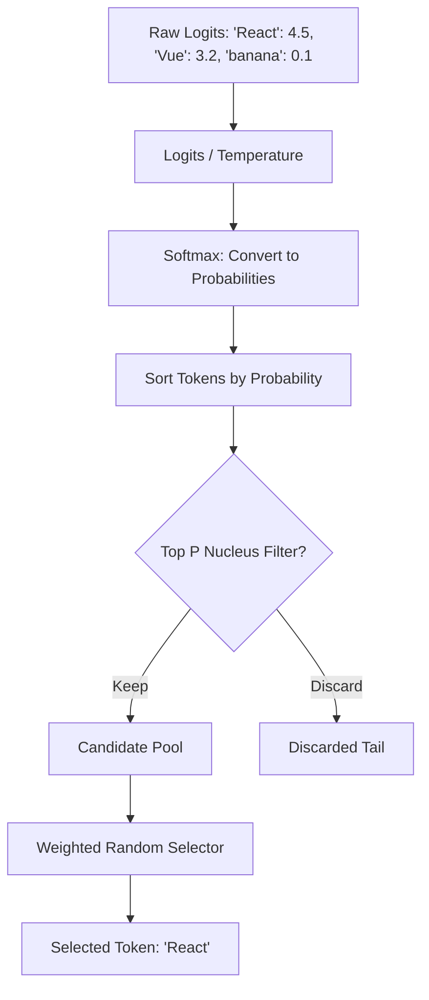

# Chapter 6: Generation Control (Temperature and Top P)

**Estimated Reading Time**: 20 minutes  
**Difficulty**: Intermediate  
**Prerequisites**: Chapters 1–5.  
**Learning Objectives**:
1. Understand how LLMs calculate token probability distributions.
2. Master the mathematical logic of the Temperature scaling parameter.
3. Master Top P (Nucleus Sampling) behavior.
4. Understand why models hallucinate from a probabilistic perspective.
5. Simulate temperature adjustment using TypeScript.

---

## Introduction

When you ask an LLM to generate text, it doesn't work like a database query. It doesn't fetch a stored paragraph. Instead, it plays a statistical guessing game: it calculates a probability score for every word in its vocabulary and picks the next word.

As developers, we control this guessing game using two key parameters: **Temperature** and **Top P**. 

Understanding how these work from first principles is key to building reliable, deterministic production applications (like writing code or outputting structured JSON) vs creative applications (like marketing copy).

In this chapter, we explore how LLMs generate text and build a token selection simulator in TypeScript.

---

## Theory: Logits, Softmax, and Sampler Control

### 1. Logits and Softmax
At the final layer of a Transformer, the model outputs raw values (called **Logits**) for every token in its vocabulary. If the vocabulary has 100,000 tokens, the logits array has a size of 100,000.
* To turn these raw numbers into probabilities that sum to $1.0$ ($100\%$), they are run through the **Softmax** function:

$$P(x_i) = \frac{e^{\text{logit}_i}}{\sum e^{\text{logit}_j}}$$

### 2. The Temperature Parameter
Temperature ($T$) shifts this probability distribution by dividing the logits before the Softmax calculation:

$$P(x_i) = \frac{e^{\text{logit}_i / T}}{\sum e^{\text{logit}_j / T}}$$

* **Low Temperature ($T \to 0.0$)**: Sharpens the distribution. The token with the highest logit becomes overwhelmingly likely to be selected. The output becomes deterministic and predictable.
* **High Temperature ($T > 1.0$)**: Flattens the distribution. Tokens with lower probability scores get a much higher chance of selection, leading to creative and varied outputs.

### 3. Top P (Nucleus Sampling)
Instead of considering all 100,000 vocabulary tokens, Top P restricts selection to a cumulative probability percentage (the "nucleus"):
* If `Top P = 0.9`, the sampler sorts tokens by probability and keeps only the top tokens whose combined probabilities sum to $90\%$. It discards the remaining $10\%$ tail.
* **Production Rule**: Adjust either Temperature or Top P, never both.

### 4. Hallucinations
A hallucination occurs when the model predicts a sequence of tokens that is grammatically correct but factually false. Because the model is a probabilistic engine, if it selects a low-probability token early on, it is forced to continue generating text that justifies that error, leading to hallucinations.

---

## Real-World Analogy: Cooking with Spices

Imagine you are baking a chocolate cake:
* **Temperature = Heat Level**:
  * **Low Temp (0.1)**: You follow the recipe exactly. You measure sugar and bake at the precise temperature. The cake is predictable and tastes good (Deterministic).
  * **High Temp (1.2)**: You throw ingredients in randomly, improvising measurements. You might bake a masterwork, or you might end up with burnt dough (Creative/Hallucination).
* **Top P = Ingredient Limit**:
  * **Low Top P (0.1)**: You only use the top most common ingredients (sugar, flour, cocoa).
  * **High Top P (0.9)**: You allow a wider variety of ingredients, including chili powder or salt.

---

## Architecture Diagram: Text Generation Sampling Flow

This diagram illustrates how raw logits flow through temperature scaling and Top P filtering to select the final output token.



---

## Code Example: Probability Sampling Simulator (TypeScript)

Let's write a TypeScript script that simulates how temperature scales token probabilities and how Top P filters out the long tail of unlikely words.

Create `generation_sampler.ts`:

```typescript
interface TokenProb {
  token: string;
  logit: number;
  prob?: number;
}

// Softmax helper that supports Temperature scaling
function softmaxWithTemp(logits: TokenProb[], temp: number): TokenProb[] {
  // If temp is extremely low, simulate deterministic argmax
  const t = Math.max(temp, 0.01);
  
  // Calculate exponents: e^(logit / T)
  const exponents = logits.map(item => Math.exp(item.logit / t));
  const sumExponents = exponents.reduce((a, b) => a + b, 0);

  return logits.map((item, idx) => ({
    token: item.token,
    logit: item.logit,
    prob: exponents[idx] / sumExponents
  }));
}

// Filters candidate pool using Top P Nucleus Sampling
function applyTopP(logits: TokenProb[], topP: number): TokenProb[] {
  // Sort descending by probability
  const sorted = [...logits].sort((a, b) => (b.prob ?? 0) - (a.prob ?? 0));
  
  let cumulativeSum = 0;
  const filtered: TokenProb[] = [];

  for (const item of sorted) {
    filtered.push(item);
    cumulativeSum += item.prob ?? 0;
    if (cumulativeSum >= topP) {
      break; // Cumulative threshold hit, cut off the remaining tokens
    }
  }
  return filtered;
}

// Ingestion dataset: Raw Logits output for next word after "I write..."
const rawLogits: TokenProb[] = [
  { token: "TypeScript", logit: 4.0 },
  { token: "JavaScript", logit: 3.5 },
  { token: "Python", logit: 2.0 },
  { token: "poetry", logit: 0.5 },
  { token: "bananas", logit: -2.0 }
];

console.log("--- Scenario 1: Low Temp (0.1) - Coding Focus ---");
const lowTempProbs = softmaxWithTemp(rawLogits, 0.1);
lowTempProbs.forEach(t => console.log(`Token: "${t.token.padEnd(12)}" | Prob: ${(t.prob! * 100).toFixed(4)}%`));

console.log("\n--- Scenario 2: High Temp (1.0) - Creative Focus ---");
const highTempProbs = softmaxWithTemp(rawLogits, 1.0);
highTempProbs.forEach(t => console.log(`Token: "${t.token.padEnd(12)}" | Prob: ${(t.prob! * 100).toFixed(4)}%`));

console.log("\n--- Scenario 3: High Temp (1.0) + Top P (0.85) ---");
const filteredPool = applyTopP(highTempProbs, 0.85);
filteredPool.forEach(t => console.log(`Token: "${t.token.padEnd(12)}" | Prob: ${(t.prob! * 100).toFixed(4)}%`));
console.log(`(Tokens like "poetry" and "bananas" have been filtered out)`);
```

Run this file:
```bash
npx tsx generation_sampler.ts
```

Observe how low temperature ($0.1$) focuses almost $100\%$ probability onto `"TypeScript"`, while high temperature ($1.0$) spreads the probability across all candidates, including `"poetry"`.

---

## Best Practices, Production & Security Considerations

### 1. Adjust Temperature for the Task
* **T = 0.0 (Deterministic)**: Use for code generation, database queries, structured JSON parsing, mathematical calculations, and classifications.
* **T = 0.7 (Creative)**: Use for chat dialogs, email drafting, summarizing documents, and marketing copies.

---

## Common Mistakes

1. **Setting Temperature to 0.0 and expecting perfect determinism**: While $0.0$ minimizes randomness, execution environments and model routing can still introduce tiny variations in float calculations. Always implement validations for output schemas.

---

## Exercises & Mini Project

### Exercise 1: Argmax implementation
Write a TypeScript function that extracts the single highest logit from an array (equivalent to Temperature = 0.0) without running any exponential functions.

### Mini Project: Dynamic temperature controller
Write an API helper function that adjusts request parameters based on target tasks (e.g. if task is "write_sql", set Temperature to 0.0; if "write_email", set Temperature to 0.8).

---

## Interview Questions

1. **Q**: What is the mathematical effect of dividing logits by a low Temperature ($T < 1.0$)?
   * **A**: Dividing logits by a value $< 1.0$ scales the differences between logits. When run through the exponential Softmax function, these scaled differences amplify, concentrating the probability distribution onto the highest logit token.
2. **Q**: Why should you avoid modifying both Temperature and Top P simultaneously?
   * **A**: Both parameters modify token selection probability. Adjusting both makes it difficult to trace or tune the model's behavior. The standard practice is to pick one (usually Temperature) and leave the other at its default value.

---

## Navigation

**Prev:** [Chapter 5: Embeddings and Vector Search](./05_Embeddings_and_Vector_Search.md) | **Index:** [Course Overview](./00_Index.md) | **Next:** [Chapter 7: Function Calling and Structured Outputs](./07_Function_Calling_and_Structured_Outputs.md)
