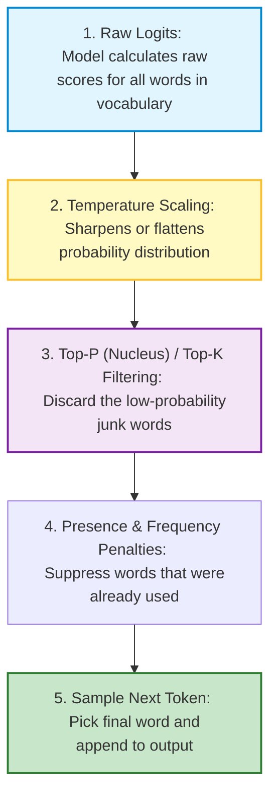
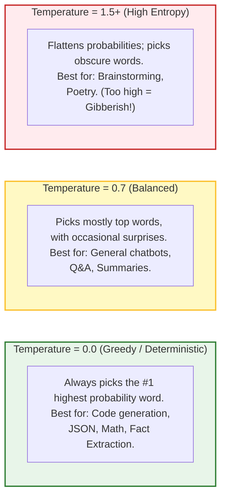
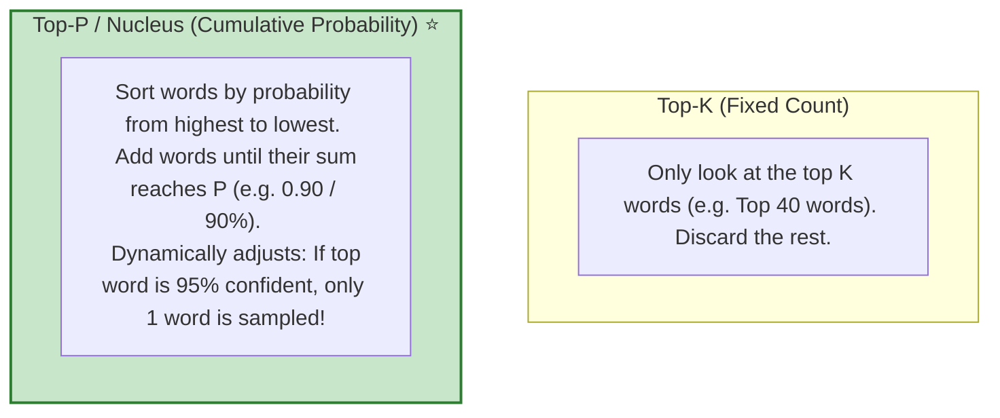
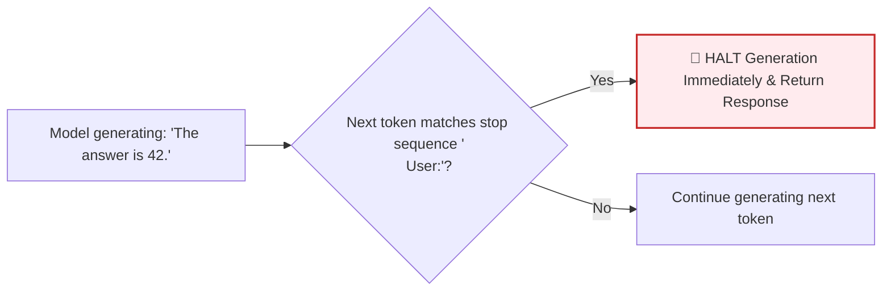

# 🤖 Generation Control: Temperature, Top-P, and Penalties

## 📌 Overview

When you ask an LLM a question, it doesn't output the full answer in one giant leap. Instead, it predicts **one token at a time** in a continuous loop.

For every single token, the model calculates probability scores for all 100,000+ words in its vocabulary. 

**Generation Control** is the set of knobs and sliders you can adjust (like **Temperature**, **Top-P**, and **Frequency Penalty**) to steer how the AI picks the next word—allowing you to make the model strictly factual (like a calculator), creatively diverse (like a poet), or prevent it from repeating itself in loops!



---

## 🎯 Why This Matters

1. **Avoid Hallucinations in Production**: When extracting structured data (JSON, SQL, invoices), you want **Temperature = 0.0** so the AI gives strict, reproducible, deterministic outputs.
2. **Spark Creativity When Needed**: For marketing copy, brainstorming, or creative writing, higher temperatures make the AI sound lively, engaging, and diverse.
3. **Stop Infinite Repetition Loops**: If an AI gets stuck repeating the same sentence over and over, **Frequency Penalty** solves the bug.
4. **Enforce Clean Stops**: **Stop Sequences** let you cut off generation immediately when the model finishes its role (preventing it from hallucinating the user's next message).

---

## 🧠 Prerequisites

- [01_Introduction.md](./01_Introduction.md): Probabilistic nature of LLMs.
- [04_Tokens_and_Tokenization.md](./04_Tokens_and_Tokenization.md): Understanding how models generate token IDs.

---

## 🔍 Deep Dive

### 1. Temperature: The Randomness Slider



Mathematical intuition:

$$P(token_i) = \frac{e^{z_i / T}}{\sum e^{z_j / T}}$$

- When $T \to 0$, the highest score dominates completely ($100\%$ probability).
- When $T$ is high, all token scores become closer together, creating randomness.

---

### 2. Top-P (Nucleus Sampling) vs. Top-K

Instead of considering all 100,000 words in the dictionary, sampling strategies cut off the long tail of unlikely words:



> [!TIP]
> **OpenAI Recommendation**: Adjust either `temperature` OR `top_p`, but not both at the same time. If you want high predictability, set `temperature = 0.0`.

---

### 3. Presence Penalty vs. Frequency Penalty

Both parameters accept values between `-2.0` and `+2.0`:

| Parameter | How It Calculates Penalty | When to Use |
|---|---|---|
| **Presence Penalty** | One-time penalty if a word has appeared **at least once** in the text so far. | When you want the AI to talk about **new topics** and broaden its vocabulary. |
| **Frequency Penalty** | Increases penalty proportionally **every time** a word is repeated ($N \times \text{penalty}$). | When you want to stop the AI from **repeating the exact same words or phrases**. |

---

### 4. Stop Sequences (`stop`)

A **Stop Sequence** is a list of strings (e.g., `["\nUser:", "###", "END"]`). As soon as the model generates this exact string, it **halts generation immediately**, even if `max_tokens` has not been reached.



---

## 💡 Simple Example: The Ice Cream Parlor

Imagine ordering ice cream from an AI:
- **Temperature = 0.0**: Always orders Chocolate (the #1 best-selling flavor in the shop).
- **Temperature = 0.7**: Orders Chocolate 70% of the time, Vanilla 20%, Strawberry 10%.
- **Temperature = 1.9**: Orders Wasabi-Pickle flavor.
- **Top-P = 0.8**: Ignores the bottom 20% weird flavors entirely and only chooses among the standard popular ones.
- **Frequency Penalty = 1.5**: Refuses to order the same flavor twice in a row!

---

## 🏗️ Real-World Example: Production Settings Cheat Sheet

| Use Case | Temperature | Top-P | Presence Penalty | Frequency Penalty |
|---|---|---|---|---|
| **JSON Data Extraction** | `0.0` | `1.0` | `0.0` | `0.0` |
| **SQL Query Generation** | `0.0` | `1.0` | `0.0` | `0.0` |
| **Customer Support Chat** | `0.3` | `0.9` | `0.1` | `0.2` |
| **Blog Post / Creative Copy**| `0.8` | `0.95` | `0.5` | `0.4` |
| **Code Refactoring** | `0.1` | `1.0` | `0.0` | `0.0` |

---

## ⚠️ Common Mistakes & Pitfalls

1. ❌ **Setting Temperature > 0 for Structured Outputs (JSON)**:
   - *Trap*: High temperatures can cause the AI to emit invalid JSON syntax, missing quotes, or unexpected field names.
2. ❌ **Setting Temperature = 2.0**:
   - *Trap*: Causes the model to output total gibberish and broken UTF-8 characters.
3. ❌ **Setting Frequency Penalty too high (> 1.5)**:
   - *Trap*: The model will refuse to repeat standard grammatical words like `"the"`, `"and"`, or `"is"`, making sentences sound unnatural.

---

## 🔥 Important Points to Remember

- **Temperature**: Controls randomness ($0.0 = \text{strict/deterministic}, 1.0+ = \text{creative}$).
- **Top-P**: Dynamic nucleus threshold (sum of top candidate probabilities).
- **Presence Penalty**: Encourages introducing new ideas/topics.
- **Frequency Penalty**: Discourages repeating the exact same words.
- **Stop Sequences**: String delimiters that instantly stop generation.

---

## 💻 Code / Commands / Configuration

Here is a TypeScript script demonstrating how changing `temperature` and `stop` sequences affects LLM behavior:

```typescript
// generation_control_demo.ts
// Run with: npx ts-node generation_control_demo.ts

import * as dotenv from 'dotenv';
dotenv.config();

interface GenerationOptions {
  temperature?: number;
  top_p?: number;
  frequency_penalty?: number;
  presence_penalty?: number;
  stop?: string[];
  max_tokens?: number;
}

async function testGeneration(prompt: string, options: GenerationOptions) {
  const apiKey = process.env.OPENAI_API_KEY;
  if (!apiKey) throw new Error("Missing OPENAI_API_KEY");

  const response = await fetch("https://api.openai.com/v1/chat/completions", {
    method: "POST",
    headers: {
      "Content-Type": "application/json",
      "Authorization": `Bearer ${apiKey}`
    },
    body: JSON.stringify({
      model: "gpt-4o-mini",
      messages: [{ role: "user", content: prompt }],
      ...options
    })
  });

  const data = await response.json();
  return data.choices[0].message.content;
}

(async () => {
  const prompt = "Generate a single creative tagline for an AI coffee machine.";

  console.log("🔒 1. Deterministic Run (Temperature: 0.0):");
  const res1 = await testGeneration(prompt, { temperature: 0.0 });
  console.log(`"${res1}"\n`);

  console.log("🎨 2. Creative Run (Temperature: 1.0):");
  const res2 = await testGeneration(prompt, { temperature: 1.0 });
  console.log(`"${res2}"\n`);

  console.log("🛑 3. Run with Stop Sequence (Stop at word 'Brew'):");
  const res3 = await testGeneration(prompt, { 
    temperature: 0.7, 
    stop: ["Brew", "brew"] 
  });
  console.log(`"${res3}" (Halted at stop sequence!)\n`);
})();
```

---

## 🎤 Interview Perspective

* **Q: Why should you use `temperature = 0.0` for function calling and database queries?**
  * **Answer**: At temperature 0.0, the model performs greedy decoding, consistently selecting the highest-probability token. This produces deterministic, reproducible results, minimizing syntax errors in generated JSON schemas, SQL queries, and tool call arguments.
* **Q: What is the difference between Top-P and Top-K sampling?**
  * **Answer**: Top-K truncates candidates to a fixed count $K$ regardless of probability distribution. Top-P (nucleus sampling) dynamically adjusts the candidate pool by taking the minimal set of tokens whose cumulative probability exceeds $P$. When the model is confident, Top-P selects very few tokens; when uncertain, it widens the pool dynamically.

---

## 🧩 Connection With Previous Concepts

- **Previous Lesson ([05_Embeddings_and_Vector_Search.md](./05_Embeddings_and_Vector_Search.md))**: Covered vector search and semantic similarity.
- **Next Lesson ([07_Function_Calling_and_Structured_Outputs.md](./07_Function_Calling_and_Structured_Outputs.md))**: We will learn how to turn LLMs into reliable backend engines using **Function Calling** and **Structured Outputs (Zod)**!

---

Previous : [05_Embeddings_and_Vector_Search.md](./05_Embeddings_and_Vector_Search.md) | Index: [00_Index.md](./00_Index.md) | Next: [07_Function_Calling_and_Structured_Outputs.md](./07_Function_Calling_and_Structured_Outputs.md)
