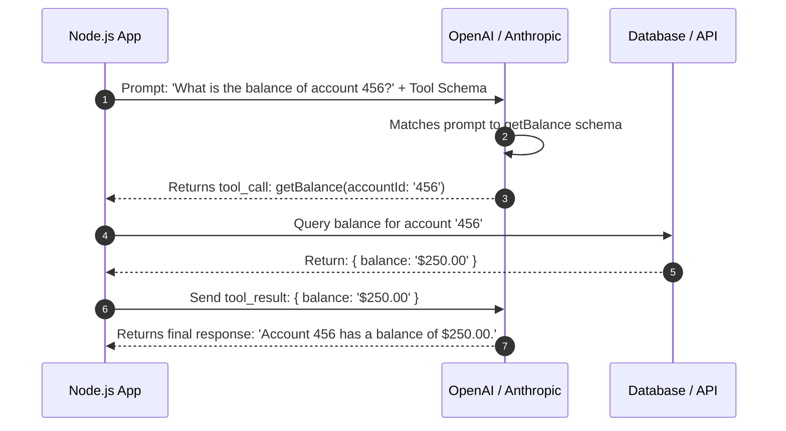

# Chapter 7: Function Calling and Structured Outputs

**Estimated Reading Time**: 25 minutes  
**Difficulty**: Advanced  
**Prerequisites**: Chapters 1–6.  
**Learning Objectives**:
1. Declare tools using JSON Schema in LLM API payloads.
2. Intercept and parse model tool-calling responses programmatically.
3. Force output generation to match a schema using Zod.
4. Execute tool calls safely on the backend.

---

## Introduction

To build applications with LLMs, they must connect to the outside world. An LLM that only chats is a closed system. It cannot write to your database, fetch current stock prices, or check user files.

**Function Calling** (or Tool Calling) allows models to interact with your code. The model does not execute code itself. Instead, it halts text generation, outputs a JSON payload containing function names and arguments, and waits for your backend application to run the code.

In this chapter, we explore how to configure structured outputs and execute tool calls in TypeScript.

---

## Theory: The Tool Calling Loop and Structured Output Enforcements

### 1. Tool Declaration (JSON Schema)
When you register a tool with an LLM, you define a JSON Schema. The schema tells the model:
1. The tool's name (e.g. `getAccountBalance`).
2. A description of what the tool does (used by the model to decide if it should call the tool).
3. The parameters the tool expects (including types, constraints, and required fields).

### 2. The Tool Execution Lifecycle
1. **Request**: The user asks: `"Check balance for user_123."`
2. **Model Call**: The application calls the LLM, passing the prompt and the tool schemas.
3. **Inference**: The model recognizes that `getAccountBalance` matches the request. It outputs a `tool_call` payload instead of a text message:
   `{ name: "getAccountBalance", arguments: { userId: "user_123" } }`
4. **Execution**: Your backend catches this payload, parses the arguments, runs the function (e.g., queries database), and gets a result: `{ balance: "$150.00" }`
5. **Final Inference**: The backend sends the result back to the model, and the model synthesizes a final response: `"User 123 has a balance of $150.00."`

### 3. Structured Outputs
Instead of returning conversational text, structured outputs force the model to conform strictly to a target JSON schema.
* **Mechanism**: Standard models might occasionally return invalid JSON. Structured outputs enforce schema constraints at the token sampler level, preventing the model from outputting tokens that would violate the schema structure.

---

## Real-World Analogy: The Restaurant Menu

Imagine you are ordering at a drive-thru:
* **Without Tools**: You ask: "How much is a burger?" The employee looks at the static board and tells you. They cannot cook anything or take your card.
* **With Tools**: You say: "I want to order a Cheeseburger, bill my card ending in 1234."
  * The employee cannot charge your card directly.
  * They press a button on their register (Tool Call: `processPayment(cardSuffix: 1234, amount: 5.99)`).
  * The payment terminal processes the card and sends a printout back to the employee (Tool Result: `success`).
  * The employee hands you the burger (Final Output).

---

## Architecture Diagram: Tool Execution Sequence

This diagram maps out the multi-step communication loop of tool execution.



---

## Code Example: Tool Routing and Execution (TypeScript)

Let's implement a complete tool-calling loop in TypeScript using the official OpenAI SDK and Zod.

Ensure you have installed the dependencies:
```bash
npm install openai zod dotenv
```

Create `tool_executor.ts`:

```typescript
import { OpenAI } from "openai";
import { z } from "zod";
import dotenv from "dotenv";

dotenv.config();

const openai = new OpenAI();

// 1. Define local backend tools

// User DB Lookup Tool Schema
const GetUserEmailSchema = z.object({
  userId: z.string().describe("The unique user database identification string")
});
type GetUserEmailInput = z.infer<typeof GetUserEmailSchema>;

// Local Tool Implementation
function getUserEmail(args: GetUserEmailInput): string {
  console.log(`[Executing Tool] getUserEmail for user ID: ${args.userId}`);
  const mockDb: Record<string, string> = {
    "user_123": "john.doe@example.com",
    "user_456": "jane.smith@example.com"
  };
  return mockDb[args.userId] || "user_not_found";
}

async function runToolCallingDemo() {
  const userPrompt = "Can you check the email database for user_123 and let me know if they exist?";

  // 2. Define the tool configuration payload for OpenAI API
  const tools = [
    {
      type: "function" as const,
      function: {
        name: "getUserEmail",
        description: "Fetch a user's registered email address from the local database.",
        parameters: {
          type: "object",
          properties: {
            userId: {
              type: "string",
              description: "The unique user database identification string"
            }
          },
          required: ["userId"],
          additionalProperties: false
        }
      }
    }
  ];

  console.log("Sending initial prompt to model...");
  const response = await openai.chat.completions.create({
    model: "gpt-4o-mini",
    messages: [{ role: "user", content: userPrompt }],
    tools: tools,
    temperature: 0.1
  });

  const message = response.choices[0].message;

  // 3. Check if the model decided to call a tool
  if (message.tool_calls && message.tool_calls.length > 0) {
    const toolCall = message.tool_calls[0];
    console.log(`\nModel requested tool call: "${toolCall.function.name}"`);
    console.log(`Arguments payload: ${toolCall.function.arguments}`);

    if (toolCall.function.name === "getUserEmail") {
      // Parse and validate arguments using Zod
      const args = GetUserEmailSchema.parse(JSON.parse(toolCall.function.arguments));
      
      // Execute the local tool
      const emailResult = getUserEmail(args);
      console.log(`Tool Result: "${emailResult}"`);

      // 4. Feed the tool result back to the model
      const finalResponse = await openai.chat.completions.create({
        model: "gpt-4o-mini",
        messages: [
          { role: "user", content: userPrompt },
          message, // Include initial assistant response with tool_call
          {
            role: "tool",
            tool_call_id: toolCall.id,
            content: JSON.stringify({ email: emailResult })
          }
        ]
      });

      console.log("\n--- Final Model Synthesis ---");
      console.log(finalResponse.choices[0].message.content);
    }
  } else {
    console.log("No tool calls triggered. Response:", message.content);
  }
}

// Execute
runToolCallingDemo();
```

Run this script:
```bash
npx tsx tool_executor.ts
```

---

## Best Practices, Production & Security Considerations

### 1. Implement Strict Input Validation
Never trust the arguments returned by the LLM. They are generated probabilistically and could contain prompt injection payloads or invalid types.
* **Production Rule**: Always parse LLM arguments using Zod schemas (as shown in the code example) before passing them to internal databases, filesystem APIs, or billing services.

### 2. Implement Execution Retries
If the LLM returns invalid JSON for tool arguments, catch the parsing error and send it back to the model: *"You returned invalid arguments for tool X. Error: Y. Please try again."*

---

## Common Mistakes

1. **Allowing direct SQL or shell command execution**: Exposing tools like `runSQL(query)` or `executeShell(cmd)`. This allows users to execute prompt injections to delete databases or read server files.

---

## Exercises & Mini Project

### Exercise 1: Zod Schema Compiler
Write a TypeScript script that converts a Zod schema into a JSON Schema object automatically, making it easier to register tools programmatically.

### Mini Project: Weather Tool Agent
Implement a local tool `getWeather(city: string)`. Call the LLM with the prompt: *"Should I take an umbrella in Paris today?"*. Intercept the tool call, return a mock response containing `{ weather: "rainy" }`, and print the final model output.

---

## Interview Questions

1. **Q**: What is the difference between Function Calling and code execution?
   * **A**: Function calling is a communication protocol. The LLM does not execute code. It output structured JSON arguments and suggests *when* to run a function. The client application executes the code on its own system and returns the result to the LLM.
2. **Q**: How do structured output enforcements work at the sampler level?
   * **A**: During generation, the sampler calculates probabilities for every vocabulary token. If a structured output schema is enforced, tokens that violate the schema structure are filtered out (their probability is set to zero), forcing the model to generate syntax-compliant JSON.

---

## Navigation

**Prev:** [Chapter 6: Generation Control](./06_Generation_Control.md) | **Index:** [Course Overview](./00_Index.md) | **Next:** [Chapter 8: Model Context Protocol](./08_Model_Context_Protocol_MCP.md)
