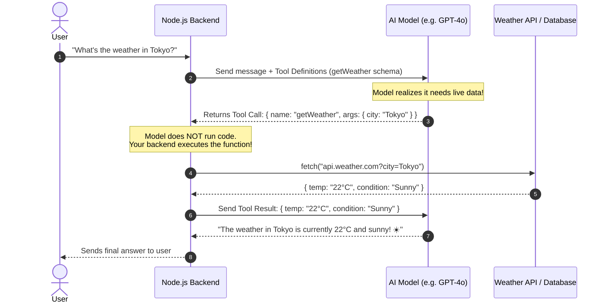
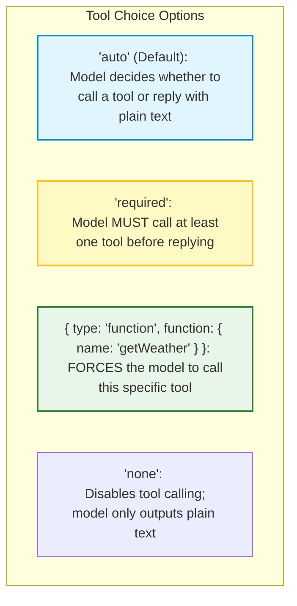
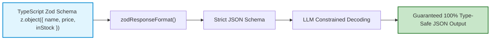

# 🤖 Function Calling and Structured Outputs

## 📌 Overview

By default, Large Language Models output unstructured conversational text. 

While great for chatting, text is dangerous for backend applications. If you ask an AI: *"Give me the user's order details"*, and it replies *"Sure! Here is the info: Name is Alex, Order #123"*, your JavaScript code will crash trying to parse that string into database fields!

**Function Calling** (also known as **Tool Calling**) and **Structured Outputs** turn the LLM into a reliable backend component:
1. **Structured Outputs**: Guarantees that the AI returns 100% valid JSON matching a strict TypeScript/Zod schema.
2. **Function Calling**: Allows the AI to decide *when* and *which* function (API, database query, payment tool) to call to fetch live data or take real-world actions.



---

## 🎯 Why This Matters

1. **Connects AI to the Real World**: An AI model's training data is frozen in time. Function calling lets it check live databases, query stock prices, send emails, and trigger Stripe payments.
2. **Eliminates JSON Syntax Errors**: Before Structured Outputs, models frequently returned broken JSON with missing brackets or markdown ticks (` ```json `). Native Structured Outputs enforce 100% schema compliance at the token level using constrained decoding.
3. **Foundation for AI Agents**: Every AI Agent is built on function calling—the agent loops between thinking, picking a tool, reading the result, and picking the next tool.

---

## 🧠 Prerequisites

- [01_Introduction.md](./01_Introduction.md): How LLMs communicate via HTTP JSON payloads.
- [06_Generation_Control.md](./06_Generation_Control.md): Temperature settings (`0.0` for structured outputs).

---

## 🔍 Deep Dive

### 1. Golden Rule: Who Runs the Code?

> [!IMPORTANT]
> **The LLM never runs code directly!**
> The AI only acts as a **decision maker**. It outputs a JSON payload containing the function name and parameters. **Your Node.js backend** inspects the payload, executes the real TypeScript function, and sends the return value back to the model.

---

### 2. Anatomy of a Tool Definition (JSON Schema)

When you send a request to OpenAI or Gemini, you pass a list of available `tools`:

```json
{
  "type": "function",
  "function": {
    "name": "get_stock_price",
    "description": "Fetches current market price for a given stock ticker symbol",
    "parameters": {
      "type": "object",
      "properties": {
        "ticker": {
          "type": "string",
          "description": "The 3 or 4 letter stock ticker (e.g. AAPL, GOOG)"
        }
      },
      "required": ["ticker"],
      "additionalProperties": false
    }
  }
}
```

---

### 3. Tool Choice Modes (`tool_choice`)

You can control whether the model is allowed or forced to call tools:



---

### 4. Structured Outputs with Zod

Instead of writing JSON Schema by hand, you can define TypeScript models using **Zod** (via `@openai/zod-response-format` or LangChain):



---

## 💡 Simple Example: The Smart Home Assistant

Imagine telling your smart speaker: *"Turn off the living room lights and set the bedroom thermostat to 72 degrees."*
1. Model reads your prompt.
2. Model emits two tool calls simultaneously:
   - Tool 1: `setLight({ room: "living_room", state: false })`
   - Tool 2: `setThermostat({ room: "bedroom", degrees: 72 })`
3. Node.js backend calls your IoT smart home devices.
4. Model responds: *"I've turned off the living room lights and set the bedroom temperature to 72°."*

---

## 🏗️ Real-World Example: Database SQL Query Agent

In an enterprise dashboard:
- User asks: *"How many new users signed up last week?"*
- LLM calls tool: `runReadOnlySqlQuery({ query: "SELECT count(*) FROM users WHERE created_at >= NOW() - INTERVAL '7 days'" })`
- Backend runs the query safely on PostgreSQL and returns `{ count: 412 }`.
- LLM reads `{ count: 412 }` and answers: *"There were 412 new signups last week, an increase of 12% over the prior week."*

---

## ⚠️ Common Mistakes & Pitfalls

1. ❌ **Vague Tool Descriptions**:
   - *Trap*: Writing description: `"Gets data"`. The model won't know when to use it.
   - *Fix*: Be extremely explicit: `"Retrieves current user account balance in USD. Requires authenticated userId."`
2. ❌ **Not handling Tool Call Errors**:
   - *Trap*: If your database query fails, crashing the server.
   - *Fix*: Catch the error in Node.js and return a tool message `{ error: "User not found with ID 456" }` so the AI can explain the error politely to the user.
3. ❌ **Allowing destructive actions without confirmation**:
   - *Caution*: Never let an AI directly call `deleteUser()` or `sendRefund()` without human confirmation (Human-in-the-Loop).

---

## 🔥 Important Points to Remember

- LLMs **decide** what to call; your backend **executes** the code.
- Always provide clear descriptions for functions and parameters.
- Use `response_format` with strict JSON schema for guaranteed type-safe output.
- `tool_choice: "auto"` allows the model to decide whether a tool is needed.

---

## 💻 Code / Commands / Configuration

Here is a complete, working TypeScript script demonstrating Function Calling with Node.js:

```typescript
// function_calling_demo.ts
// 1. Run: npm install dotenv
// 2. Run: npx ts-node function_calling_demo.ts

import * as dotenv from 'dotenv';
dotenv.config();

// 1. Define our real backend tool
function getCryptoPrice(args: { symbol: string }): { symbol: string; price: number; currency: string } {
  const prices: Record<string, number> = {
    "BTC": 64500.00,
    "ETH": 3450.50,
    "SOL": 145.20
  };

  const symbol = args.symbol.toUpperCase();
  const price = prices[symbol] || 0;
  return { symbol, price, currency: "USD" };
}

// 2. Tool definition schema sent to LLM
const cryptoTool = {
  type: "function" as const,
  function: {
    name: "getCryptoPrice",
    description: "Get the current live price of a cryptocurrency by ticker symbol (e.g. BTC, ETH, SOL).",
    parameters: {
      type: "object",
      properties: {
        symbol: {
          type: "string",
          description: "The crypto ticker symbol like BTC, ETH, or SOL"
        }
      },
      required: ["symbol"],
      additionalProperties: false
    },
    strict: true
  }
};

async function runAgent(userPrompt: string) {
  const apiKey = process.env.OPENAI_API_KEY;
  if (!apiKey) throw new Error("Missing OPENAI_API_KEY");

  const messages: any[] = [
    { role: "system", content: "You are a helpful crypto trading assistant." },
    { role: "user", content: userPrompt }
  ];

  console.log(`👤 User: "${userPrompt}"`);

  // Step 1: Send user query + tool definitions to model
  const firstResponse = await fetch("https://api.openai.com/v1/chat/completions", {
    method: "POST",
    headers: {
      "Content-Type": "application/json",
      "Authorization": `Bearer ${apiKey}`
    },
    body: JSON.stringify({
      model: "gpt-4o-mini",
      messages: messages,
      tools: [cryptoTool],
      tool_choice: "auto",
      temperature: 0.0
    })
  });

  const firstData = await firstResponse.json();
  const choice = firstData.choices[0].message;

  // Step 2: Check if model wants to call a tool
  if (choice.tool_calls && choice.tool_calls.length > 0) {
    const toolCall = choice.tool_calls[0];
    console.log(`\n⚙️ LLM decided to call tool: "${toolCall.function.name}"`);
    console.log(`📦 Arguments generated by LLM:`, toolCall.function.arguments);

    // Step 3: Execute the real TypeScript function in Node.js
    const parsedArgs = JSON.parse(toolCall.function.arguments);
    const toolResult = getCryptoPrice(parsedArgs);
    console.log(`⚡ Tool Output:`, toolResult);

    // Step 4: Append model's tool call AND tool result to conversation history
    messages.push(choice);
    messages.push({
      role: "tool",
      tool_call_id: toolCall.id,
      content: JSON.stringify(toolResult)
    });

    // Step 5: Send updated history back to model for final natural language answer
    const secondResponse = await fetch("https://api.openai.com/v1/chat/completions", {
      method: "POST",
      headers: {
        "Content-Type": "application/json",
        "Authorization": `Bearer ${apiKey}`
      },
      body: JSON.stringify({
        model: "gpt-4o-mini",
        messages: messages
      })
    });

    const secondData = await secondResponse.json();
    console.log(`\n🤖 AI Final Reply:\n"${secondData.choices[0].message.content}"`);
  } else {
    console.log(`\n🤖 AI Reply (No tool needed):\n"${choice.content}"`);
  }
}

// Run the agent
runAgent("How much is 1 Bitcoin (BTC) worth right now?");
```

---

## 🎤 Interview Perspective

* **Q: How does OpenAI's Structured Outputs feature guarantee 100% valid JSON adherence compared to prompting?**
  * **Answer**: Older prompting methods relied on the model generating tokens freely and hoping it followed JSON syntax. Structured Outputs use **Constrained Decoding / Grammar Masking** at the token sampling step. The model's logits are dynamically masked using a grammar state machine so that invalid tokens (e.g. a letter where a number or closing brace is expected) have probability zero, making syntax errors mathematically impossible.
* **Q: How do you protect against security vulnerabilities when allowing an LLM to call backend tools?**
  * **Answer**: Enforce strict schema validation (Zod) on arguments, use read-only database connections for data queries, implement authentication/role checks in the backend function runner, and require explicit human confirmation for destructive actions (like financial transactions or data deletion).

---

## 🧩 Connection With Previous Concepts

- **Previous Lesson ([06_Generation_Control.md](./06_Generation_Control.md))**: Used temperature `0.0` for deterministic outputs.
- **Next Lesson ([08_Model_Context_Protocol_MCP.md](./08_Model_Context_Protocol_MCP.md))**: We will explore the open industry standard for connecting AI models to tools and data sources: Anthropic's **Model Context Protocol (MCP)**!

---

Previous : [06_Generation_Control.md](./06_Generation_Control.md) | Index: [00_Index.md](./00_Index.md) | Next: [08_Model_Context_Protocol_MCP.md](./08_Model_Context_Protocol_MCP.md)
