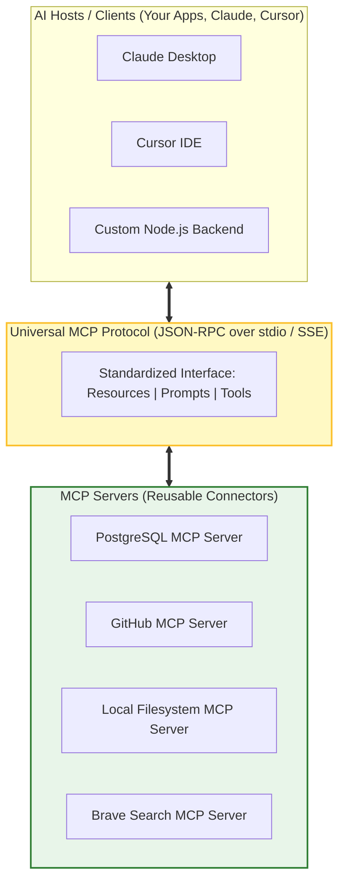
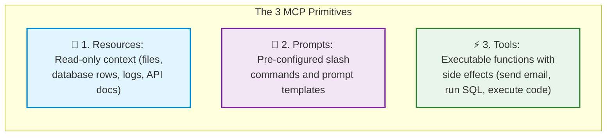
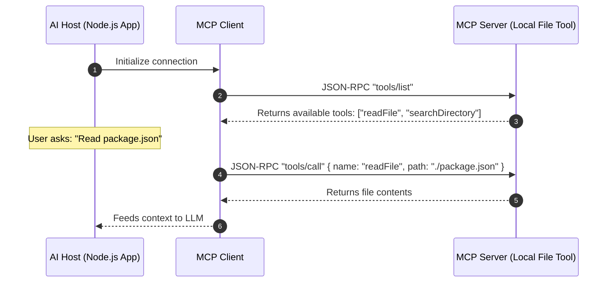

# 🤖 Model Context Protocol (MCP)

## 📌 Overview

Imagine if every computer mouse, keyboard, and flash drive required a different, custom cable to connect to your laptop. It would be a chaotic mess of adapters!

Until late 2024, that is exactly how AI worked. Every developer had to write custom, proprietary glue code to connect LLMs to PostgreSQL, GitHub, Slack, Notion, or local files. If you changed your AI framework, you had to rewrite all your integrations from scratch.

To fix this, Anthropic introduced the **Model Context Protocol (MCP)**. 

MCP is the **"USB-C standard for AI applications"**. It is an open protocol that provides a universal, standardized way for AI models and assistants (like Claude, Cursor, or your custom Node.js apps) to connect safely to data sources, local files, and external tools!



---

## 🎯 Why This Matters

1. **Write Once, Use Anywhere**: Build an MCP server for your database once, and it instantly works with Claude Desktop, Cursor IDE, LangChain, or your custom TypeScript bots without writing custom adapters.
2. **Standardized Security & Isolation**: MCP servers run in isolated processes (via `stdio` or HTTP `SSE`), allowing users to control exact file permissions and data access.
3. **Rapid Ecosystem Growth**: You don't need to build tools for Slack, GitHub, or Postgres yourself—you can simply plug in pre-built open-source MCP servers from the community.

---

## 🧠 Prerequisites

- [01_Introduction.md](./01_Introduction.md): How AI apps interact with backends.
- [07_Function_Calling_and_Structured_Outputs.md](./07_Function_Calling_and_Structured_Outputs.md): Understanding tools and schemas.

---

## 🔍 Deep Dive

### 1. The 3 Core Primitives of MCP

Every MCP Server exposes three standard capabilities:



---

### 2. How MCP Communicates: Transports

MCP uses **JSON-RPC 2.0** messages transmitted over two primary transports:

| Transport | Description | Best For |
|---|---|---|
| **`stdio` (Standard I/O)** | Communicates via the command line `stdin` and `stdout` as a local child process. | Local desktop tools, local database access, Cursor, Claude Desktop. |
| **`SSE` (Server-Sent Events)** | Communicates over standard HTTP with streaming event updates. | Remote cloud microservices, enterprise servers, multi-user deployments. |



---

## 💡 Simple Example: The Universal Power Adapter

Think of traditional tool calling like traveling the world with 20 different wall plugs (one for UK, one for US, one for Europe, one for India).
- **Without MCP**: You write custom code for Postgres, custom code for GitHub, custom code for Slack.
- **With MCP**: Every data source plugs into the universal MCP socket. Any AI model plugs in and immediately gets access to all data sources!

---

## 🏗️ Real-World Example: Enterprise Knowledge Assistant

Imagine an engineering team using Claude Desktop or Cursor:
- They install an internal **PostgreSQL MCP Server** on their developer machines.
- A developer asks the AI: *"What was the revenue generated by customer #8819 last month?"*
- The AI automatically discovers the `query_customer_revenue` tool from the local MCP server, safely executes it with local credentials, and displays the exact answer.

---

## ⚠️ Common Mistakes & Pitfalls

1. ❌ **Logging to `console.log()` in a `stdio` MCP Server**:
   - *Critical Trap*: In `stdio` transport, `stdout` is reserved strictly for JSON-RPC messages! If you write `console.log("Debugging...")`, the client parser crashes. Always use `console.error()` for debugging logs.
2. ❌ **Granting Unrestricted Root Filesystem Access**:
   - *Security Risk*: Always restrict your MCP file server to specific whitelisted directories (e.g. `/workspace/project`).

---

## 🔥 Important Points to Remember

- **MCP** is an open standard created by Anthropic for connecting AI models to data and tools.
- **Host**: The AI app (Cursor, Claude Desktop, your custom backend).
- **Client**: Maintains the 1:1 connection to an MCP server.
- **Server**: Exposes Resources, Prompts, and Tools.
- Uses **JSON-RPC 2.0** over `stdio` (local) or `SSE` (remote).

---

## 💻 Code / Commands / Configuration

Here is a complete, beginner-friendly TypeScript MCP server using the official `@modelcontextprotocol/sdk`:

```typescript
// mcp_server.ts
// 1. Run: npm install @modelcontextprotocol/sdk zod
// 2. Run: npx ts-node mcp_server.ts

import { Server } from "@modelcontextprotocol/sdk/server/index.js";
import { StdioServerTransport } from "@modelcontextprotocol/sdk/server/stdio.js";
import {
  CallToolRequestSchema,
  ListToolsRequestSchema,
} from "@modelcontextprotocol/sdk/types.js";
import { z } from "zod";

// 1. Initialize the MCP Server
const server = new Server(
  {
    name: "simple-math-mcp-server",
    version: "1.0.0",
  },
  {
    capabilities: {
      tools: {}, // Advertise that this server supports tools
    },
  }
);

// 2. Define the list of available tools
server.setRequestHandler(ListToolsRequestSchema, async () => {
  return {
    tools: [
      {
        name: "calculate_tax",
        description: "Calculates total price including local state sales tax",
        inputSchema: {
          type: "object",
          properties: {
            subtotal: { type: "number", description: "Base purchase price" },
            taxRate: { type: "number", description: "Tax rate decimal (e.g. 0.08 for 8%)" },
          },
          required: ["subtotal", "taxRate"],
        },
      },
    ],
  };
});

// 3. Handle tool execution requests
server.setRequestHandler(CallToolRequestSchema, async (request) => {
  if (request.params.name === "calculate_tax") {
    const args = request.params.arguments as { subtotal: number; taxRate: number };
    const total = args.subtotal + (args.subtotal * args.taxRate);

    // Note: Always use console.error for logging in stdio mode!
    console.error(`[MCP Log] Calculated tax for subtotal: $${args.subtotal}`);

    return {
      content: [
        {
          type: "text",
          text: `Total with tax is: $${total.toFixed(2)} USD`,
        },
      ],
    };
  }

  throw new Error(`Tool not found: ${request.params.name}`);
});

// 4. Connect server to Stdio transport
async function main() {
  const transport = new StdioServerTransport();
  await server.connect(transport);
  console.error("🚀 Math MCP Server running on stdio!");
}

main().catch((err) => console.error("Fatal Server Error:", err));
```

---

## 🎤 Interview Perspective

* **Q: How does MCP differ from standard OpenAI Function Calling?**
  * **Answer**: OpenAI Function Calling is an API feature specific to OpenAI where tool schemas are sent inline with each HTTP completion request. MCP is an architectural protocol that standardizes how tools, file resources, and prompt templates are discovered, secured, and executed across any LLM provider and any client application.
* **Q: Why is `console.error` mandatory when logging inside a `stdio` MCP server?**
  * **Answer**: The `stdio` transport uses standard output (`stdout`) exclusively for serialization of JSON-RPC protocol frames. Emitting raw strings or debugging logs via `console.log()` corrupts the JSON stream and breaks the client's RPC parser. `stderr` (`console.error`) is unbuffered and ignored by the protocol transport, making it safe for developer logging.

---

## 🧩 Connection With Previous Concepts

- **Previous Lesson ([07_Function_Calling_and_Structured_Outputs.md](./07_Function_Calling_and_Structured_Outputs.md))**: Covered basic tool calling mechanics.
- **Next Lesson ([09_LLM_SDKs.md](./09_LLM_SDKs.md))**: We will explore the official SDKs (OpenAI, Google GenAI, Anthropic, Ollama) and how to configure them in production!

---

Previous : [07_Function_Calling_and_Structured_Outputs.md](./07_Function_Calling_and_Structured_Outputs.md) | Index: [00_Index.md](./00_Index.md) | Next: [09_LLM_SDKs.md](./09_LLM_SDKs.md)
