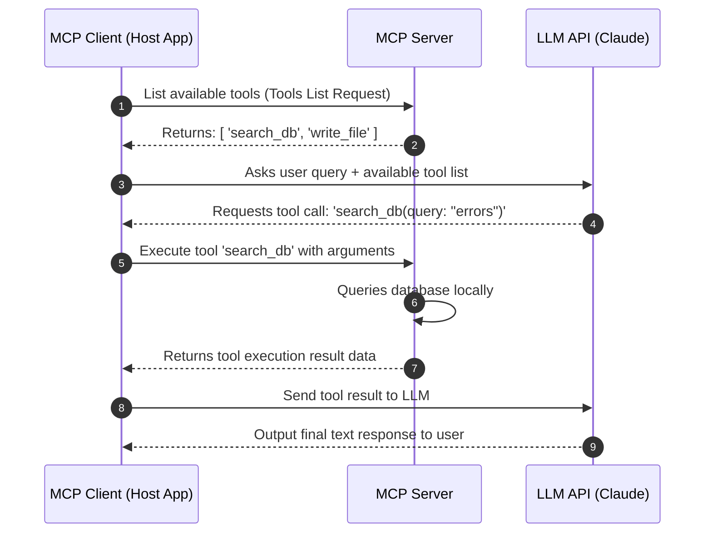

# Chapter 8: Model Context Protocol (MCP)

**Estimated Reading Time**: 20 minutes  
**Difficulty**: Intermediate  
**Prerequisites**: Chapters 1–7.  
**Learning Objectives**:
1. Understand the problem MCP solves in decoupled AI architectures.
2. Explain the difference between MCP Hosts, Clients, and Servers.
3. Understand the core abstractions: Resources, Prompts, and Tools.
4. Implement a mock MCP tool routing server in TypeScript.

---

## Introduction

As the AI ecosystem expands, developers face an integration challenge. Every developer building an IDE extension, database tool, or workspace manager writes custom code to connect LLMs to local data. 

**Model Context Protocol (MCP)**, open-sourced by Anthropic, is an open standard designed to resolve this. It behaves like a universal hardware driver: it decouples clients (applications like Cursor, Claude Desktop, or your custom Node API) from data sources (databases, local files, Slack, GitHub) by defining a standardized protocol for sharing contexts and tools.

In this chapter, we explore the architecture of MCP and implement a mock tool router in TypeScript.

---

## Theory: Core MCP Architecture

MCP defines a client-server architecture running over local transport protocol (like standard I/O streams) or remote networks (JSON-RPC over WebSockets/HTTP).

```text
  Client App (Host)  <─── MCP Protocol ───>  MCP Server
          │                                       ├──> Database Server
          └──> LLM Model API                      ├──> Local Filesystem
                                                  └──> GitHub API
```

### 1. Core Architecture Components
* **MCP Host**: The application that orchestrates the user session (e.g. Claude Desktop, VSCode).
* **MCP Client**: The component inside the Host that establishes a connection to an MCP Server.
* **MCP Server**: A lightweight process that exposes resources, prompts, or tools via the MCP protocol.

### 2. Core Concepts
* **Resources**: Read-only data sources (like local log files, SQL table schema snapshots).
* **Prompts**: Standardized templates for instructions (like a "code_review" prompt layout).
* **Tools**: Executable actions (like `read_file`, `write_file`, `execute_query`).

### 3. Why MCP is a Game-Changer
Before MCP, if you wanted an LLM to read your database, you had to write custom database connector scripts for that specific model. With MCP, you run a standard Postgres MCP Server. Any MCP-compatible host can immediately query and explore your database using standardized client methods.

---

## Real-World Analogy: USB Computer Ports

Think of MCP as the **USB standard** for computer peripherals:
* **Before USB**: If you bought a mouse, keyboard, or printer, each device required a unique, custom port on the back of your computer motherboard. You had to run custom driver software for every device.
* **After USB**: Everything plugs into a standard USB port. The computer operating system does not need to know the inner workings of the device. It speaks the standard USB protocol.
* **MCP** is the USB port for AI models. Instead of writing custom connectors for GitHub, Slack, Postgres, or files, they all plug into the standard MCP interface.

---

## Architecture Diagram: MCP Communication Lifecycle

This diagram shows how an MCP Host queries tools, routes execution to the MCP Server, and passes results back to the LLM.



---

## Code Example: Mock MCP Tools Server (TypeScript)

Let's build a mock MCP tool coordinator in TypeScript that registers local system tools and handles incoming execution requests.

Create `mcp_server.ts`:

```typescript
// Define standard MCP request/response interfaces based on JSON-RPC

interface ToolDefinition {
  name: string;
  description: string;
  inputSchema: Record<string, any>;
}

interface MCPCallRequest {
  jsonrpc: "2.0";
  method: "tools/call";
  params: {
    name: string;
    arguments: Record<string, any>;
  };
  id: string | number;
}

interface MCPCallResponse {
  jsonrpc: "2.0";
  result: {
    content: { type: "text"; text: string }[];
    isError?: boolean;
  };
  id: string | number;
}

class MockMcpServer {
  private tools: Map<string, { definition: ToolDefinition; handler: Function }> = new Map();

  // Register a tool with the server
  public registerTool(definition: ToolDefinition, handler: Function) {
    this.tools.set(definition.name, { definition, handler });
  }

  // Handle incoming tool execution request
  public handleRequest(request: MCPCallRequest): MCPCallResponse {
    const tool = this.tools.get(request.params.name);

    if (!tool) {
      return {
        jsonrpc: "2.0",
        id: request.id,
        result: {
          content: [{ type: "text", text: `Error: Tool '${request.params.name}' not found.` }],
          isError: true
        }
      };
    }

    try {
      // Execute local handler logic
      const output = tool.handler(request.params.arguments);
      return {
        jsonrpc: "2.0",
        id: request.id,
        result: {
          content: [{ type: "text", text: JSON.stringify(output) }]
        }
      };
    } catch (error: any) {
      return {
        jsonrpc: "2.0",
        id: request.id,
        result: {
          content: [{ type: "text", text: `Execution failed: ${error.message}` }],
          isError: true
        }
      };
    }
  }
}

// Ingestion and setup
const mcpServer = new MockMcpServer();

// Register System Info Tool
mcpServer.registerTool(
  {
    name: "getSystemTime",
    description: "Returns the current server clock time.",
    inputSchema: { type: "object", properties: {} }
  },
  () => {
    return { currentTime: new Date().toISOString() };
  }
);

// Register File Reader Tool
mcpServer.registerTool(
  {
    name: "readFileSnippet",
    description: "Reads local files.",
    inputSchema: {
      type: "object",
      properties: {
        path: { type: "string" }
      },
      required: ["path"]
    }
  },
  (args: { path: string }) => {
    console.log(`[MCP Server Executing] Reading file path: ${args.path}`);
    return { path: args.path, status: "SUCCESS", mockData: "Vortex system logs initialised." };
  }
);

// Test Request: Simulate Client calling getSystemTime
console.log("--- Client Requesting 'getSystemTime' ---");
const clientReq1: MCPCallRequest = {
  jsonrpc: "2.0",
  method: "tools/call",
  params: { name: "getSystemTime", arguments: {} },
  id: 1
};
const response1 = mcpServer.handleRequest(clientReq1);
console.log("Server Response:", JSON.stringify(response1, null, 2));

// Test Request 2: Simulate Client calling readFileSnippet
console.log("\n--- Client Requesting 'readFileSnippet' ---");
const clientReq2: MCPCallRequest = {
  jsonrpc: "2.0",
  method: "tools/call",
  params: { name: "readFileSnippet", arguments: { path: "/var/logs/vortex.log" } },
  id: 2
};
const response2 = mcpServer.handleRequest(clientReq2);
console.log("Server Response:", JSON.stringify(response2, null, 2));
```

Run this file:
```bash
npx tsx mcp_server.ts
```

---

## Best Practices, Production & Security Considerations

### 1. Restrict Port Scope
Never expose your MCP server directly to the open internet without an authentication proxy layer. 
* **Production Rule**: Run local MCP servers using standard input/output streams (`stdio`) or bind HTTP ports to `localhost` (`127.0.0.1`) only, keeping them secure from external scans.

---

## Common Mistakes

1. **Deploying MCP servers with unrestricted access**: Allowing an MCP file tool to access the root directory (`/`). Always confine path resolution arguments to a specific subdirectory.

---

## Exercises & Mini Project

### Exercise 1: JSON-RPC List Tools schema
Design the JSON schema for listing available tools (`tools/list`) and implement a method on the `MockMcpServer` class that returns the registered tools list.

### Mini Project: Postgres MCP Server Mock
Build a mock MCP server that registers a tool `executeSQLSnippet(sql: string)`. Validate that the string does not contain forbidden keywords like `DROP` or `DELETE`, and returns mock query results.

---

## Interview Questions

1. **Q**: What are the three primary features exposed by an MCP Server?
   * **A**: Resources (read-only context sources like files/databases), Prompts (templates for LLM instructions), and Tools (executable functions that perform actions on external systems).
2. **Q**: What transport methods does MCP use for client-server communication?
   * **A**: It primarily uses **standard input/output streams (stdio)** for local processes (like CLI helpers running under Cursor or Claude Desktop) and **Server-Sent Events (SSE)/HTTP or WebSockets** for remote network connections.

---

## Navigation

**Prev:** [Chapter 7: Function Calling and Structured Outputs](./07_Function_Calling_and_Structured_Outputs.md) | **Index:** [Course Overview](./00_Index.md) | **Next:** [Chapter 9: Working with LLM SDKs](./09_LLM_SDKs.md)
