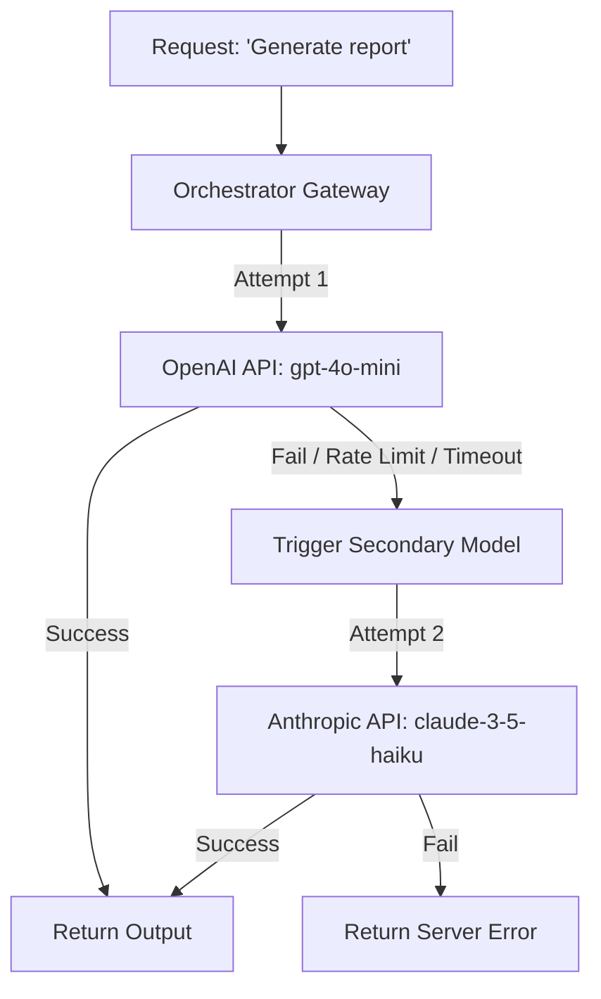

# Chapter 9: Working with LLM SDKs (OpenAI, Gemini, Anthropic)

**Estimated Reading Time**: 25 minutes  
**Difficulty**: Advanced  
**Prerequisites**: Chapters 1–8.  
**Learning Objectives**:
1. Integrate the official Node.js SDKs for OpenAI, Anthropic, and Google Gemini.
2. Structure message histories with correct roles (System, User, Assistant).
3. Implement failover gateways that route queries to alternative providers.
4. Manage API keys securely in production TS backends.

---

## Introduction

While raw HTTP client requests are useful for understanding first principles, production-grade applications require using official SDKs. These SDKs manage connection pools, handle HTTP headers, support TypeScript typing out of the box, and automatically handle retry backoffs when APIs throw temporary errors.

As a MERN stack developer, you are used to fetching data from single-provider sources. In AI engineering, we often deploy multi-provider architectures. 

In this chapter, we write a multi-provider gateway in TypeScript to run text generation across OpenAI, Anthropic, and Gemini.

---

## Theory: SDK Architectures and Message Formats

Each AI provider distributes its own official NPM library:
* **OpenAI** (`openai`): Uses a unified `messages` array payload format. System instructions are passed as a message object with the role `"system"`.
* **Anthropic** (`@anthropic-ai/sdk`): Passes system instructions as a top-level parameter `system: "..."`, outside the `messages` array. Claude models require specifying `max_tokens` on every invocation.
* **Google Gemini** (`@google/genai`): The new `@google/genai` SDK uses a config object parameter structure. System instructions are passed as `systemInstruction: "..."` inside the `config` payload.

### API Key Governance
Never embed API keys (`process.env.OPENAI_API_KEY`) in client-side React code. This allows users to read keys from network panels and steal your API budgets. Always run LLM SDK integrations on a secured Node.js backend.

---

## Real-World Analogy: The Multi-Currency Credit Card Reader

Imagine a retail store card reader:
* If the terminal supports only Visa, and the client hands you a Mastercard, the transaction fails.
* A smart terminal accepts Visa, Mastercard, and Amex. It translates the card swipe data into the correct bank format automatically.
* **The LLM Gateway** is that smart terminal. Your application inputs a clean text string. The gateway translates that string into the message payload formats required by OpenAI, Claude, or Gemini based on routing parameters.

---

## Architecture Diagram: Multi-Provider Failover Gateway

This diagram illustrates how an API request is routed to a primary provider and falls back to a secondary provider if the primary request fails.



---

## Code Example: Multi-Provider Fallover Gateway (TypeScript)

Let's write a TypeScript class `LlmGateway` that initializes all three SDK clients and executes a query, automatically falling back to Anthropic if OpenAI fails.

Install the official libraries:
```bash
npm install openai @anthropic-ai/sdk @google/genai dotenv
```

Create `llm_gateway.ts`:

```typescript
import { OpenAI } from "openai";
import { Anthropic } from "@anthropic-ai/sdk";
import { GoogleGenAI } from "@google/genai";
import dotenv from "dotenv";

dotenv.config();

class LlmGateway {
  private openai: OpenAI;
  private anthropic: Anthropic;
  private gemini: GoogleGenAI;

  constructor() {
    // Initialize clients from environment variables
    this.openai = new OpenAI({ apiKey: process.env.OPENAI_API_KEY });
    this.anthropic = new Anthropic({ apiKey: process.env.ANTHROPIC_API_KEY });
    this.gemini = new GoogleGenAI({ apiKey: process.env.GEMINI_API_KEY });
  }

  // Call OpenAI API
  public async queryOpenAI(prompt: string, systemMsg: string): Promise<string> {
    console.log("[Gateway] Attempting OpenAI completion...");
    const response = await this.openai.chat.completions.create({
      model: "gpt-4o-mini",
      messages: [
        { role: "system", content: systemMsg },
        { role: "user", content: prompt }
      ],
      temperature: 0.2
    });
    return response.choices[0].message.content || "";
  }

  // Call Anthropic API
  public async queryAnthropic(prompt: string, systemMsg: string): Promise<string> {
    console.log("[Gateway] Attempting Anthropic completion...");
    const response = await this.anthropic.messages.create({
      model: "claude-3-5-haiku-latest",
      max_tokens: 1024,
      system: systemMsg, // Passed as top-level parameter
      messages: [
        { role: "user", content: prompt }
      ]
    });
    const textBlock = response.content.find(b => b.type === "text");
    return textBlock && 'text' in textBlock ? textBlock.text : "";
  }

  // Unified Request with automatic fallback logic
  public async queryWithFallback(prompt: string, systemMsg: string): Promise<string> {
    try {
      // Primary Attempt: OpenAI
      const result = await this.queryOpenAI(prompt, systemMsg);
      return result;
    } catch (openaiError: any) {
      console.warn(`[Gateway Warning] OpenAI failed: ${openaiError.message}`);
      console.log("[Gateway] Routing request to Fallback Provider (Anthropic)...");
      
      try {
        // Fallback Attempt: Anthropic
        const result = await this.queryAnthropic(prompt, systemMsg);
        return result;
      } catch (anthropicError: any) {
        console.error("[Gateway Error] All providers failed.");
        throw new Error(`Failover failed: ${anthropicError.message}`);
      }
    }
  }
}

// Execution Block
(async () => {
  const gateway = new LlmGateway();
  const system = "You are a database consultant. Keep responses under 2 sentences.";
  const prompt = "Explain database indexing.";

  try {
    const result = await gateway.queryWithFallback(prompt, system);
    console.log("\n--- Final Response ---");
    console.log(result);
  } catch (error: any) {
    console.error("Execution failed:", error.message);
  }
})();
```

Run this script:
```bash
npx tsx llm_gateway.ts
```

---

## Best Practices, Production & Security Considerations

### 1. Configure Abort Controllers
In production, never let connection threads hang. If a provider's API goes down, it can cause long request waits.
* **Production Rule**: Configure timeout boundaries in the SDK client options (e.g. `timeout: 10000` for a 10-second cutoff), or pass an `AbortSignal` to break requests quickly.

---

## Common Mistakes

1. **Exposing raw error logs**: Passing provider API stack traces directly back to the browser client when a request fails. Always map errors to clean HTTP error states (e.g. `502 Bad Gateway`).

---

## Exercises & Mini Project

### Exercise 1: Gemini Adapter addition
Extend the `LlmGateway` class. Add a method `queryGemini(prompt, systemMsg)` using the Google Gemini SDK.

### Mini Project: Load-balanced Gateway
Write a class `LoadBalancedGateway` that alternates requests between OpenAI and Anthropic dynamically based on a round-robin rotation, ensuring even API budget utilization.

---

## Interview Questions

1. **Q**: What are the differences between OpenAI and Anthropic SDK payloads for system prompts?
   * **A**: OpenAI places the system instructions inside the `messages` array as a message object with the role `"system"`. Anthropic Claude SDK separates it entirely, passing it as a top-level property named `system` in the configuration object.
2. **Q**: Why is a multi-provider gateway critical for production AI systems?
   * **A**: APIs experience outages, latency spikes, and rate-limiting blocks. A failover gateway ensures high availability by automatically routing traffic to secondary model providers if the primary provider fails.

---

## Navigation

**Prev:** [Chapter 8: Model Context Protocol](./08_Model_Context_Protocol_MCP.md) | **Index:** [Course Overview](./00_Index.md) | **Next:** [Chapter 10: Streaming and SSE](./10_Streaming_and_SSE.md)
