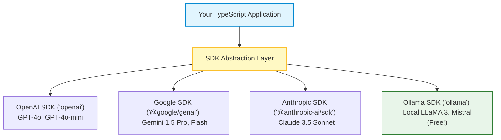
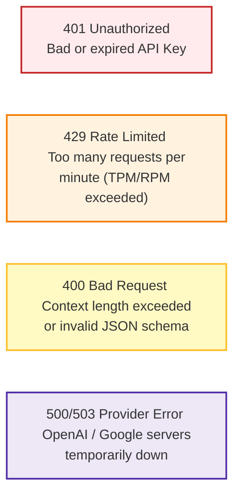

# 🤖 LLM SDKs: OpenAI, Gemini, Anthropic, and Ollama

## 📌 Overview

In Chapter 1, we made direct HTTP `fetch()` calls to OpenAI. While great for learning how things work under the hood, writing raw HTTP requests in production gets tedious quickly: you have to manually handle network timeouts, rate limit retries, JSON serialization, and TypeScript types.

To make life easy, every major AI provider provides an official **SDK (Software Development Kit)** for Node.js and TypeScript.

In this chapter, we will learn how to use the major AI SDKs—**OpenAI**, **Google Gemini**, **Anthropic Claude**, and **Ollama (for free, local offline models)**—and understand how to handle errors like a seasoned pro!



---

## 🎯 Why This Matters

1. **Automatic Retries with Exponential Backoff**: When an AI API experiences a temporary traffic spike (HTTP 429 Rate Limit or 503 Overloaded), SDKs automatically wait and retry smoothly.
2. **First-Class TypeScript Types**: Get instant autocompletion for model names, message roles, parameters, and tool formats right inside VS Code.
3. **Local & Free AI with Ollama**: Test and develop AI agents completely offline on your laptop without paying a single dollar in API fees.

---

## 🧠 Prerequisites

- [01_Introduction.md](./01_Introduction.md): Basic LLM API request anatomy.
- [06_Generation_Control.md](./06_Generation_Control.md): Temperature and sampling parameters.

---

## 🔍 Deep Dive

### 1. Comparison of Major AI Provider SDKs

| Provider | NPM Package | Flagship Model | Superpower / Best For |
|---|---|---|---|
| **OpenAI** | `openai` | `gpt-4o`, `gpt-4o-mini` | Ecosystem maturity, Structured Outputs, JSON speed |
| **Google** | `@google/genai` | `gemini-1.5-flash`, `gemini-1.5-pro` | Massive 2M token context window, lowest cost, fast multimodal |
| **Anthropic** | `@anthropic-ai/sdk` | `claude-3-5-sonnet` | Best-in-class coding capabilities, complex agentic reasoning |
| **Ollama** | `ollama` | `llama3.2`, `mistral` | Runs locally on your machine, 100% private, zero API cost |

---

### 2. Handling Production HTTP Status Codes

When talking to AI APIs, you will encounter 4 key error codes:



---

## 💡 Simple Example: The Hotel Concierge

Think of SDKs like a **Hotel Concierge**:
- **Raw Fetch**: You have to find the taxi driver's phone number yourself, negotiate the price, check if he is awake, and retry if the call drops.
- **SDK**: You simply ask the concierge *"Call me a cab"*. The concierge handles dialing, retries if the line is busy, handles payment, and returns when the cab is at the door.

---

## 🏗️ Real-World Example: Provider Fallback Pattern

In high-availability enterprise applications:
1. App sends user query to **Claude 3.5 Sonnet**.
2. If Anthropic returns an `APIError (503 Overloaded)` after 3 retries:
3. The app automatically catches the error and switches to **GPT-4o** as a backup!
4. Zero downtime for end users.

---

## ⚠️ Common Mistakes & Pitfalls

1. ❌ **Instantiating the client inside a request handler**:
   - *Bad*: `app.post('/chat', () => { const openai = new OpenAI(); ... })` (wastes memory and resets connection pools).
   - *Good*: Instantiate the SDK client **once** globally at module level.
2. ❌ **Hardcoding Model Names as raw strings everywhere**:
   - *Fix*: Create a `models.ts` constant file (e.g. `export const FAST_MODEL = "gpt-4o-mini"`) so you can upgrade models in one single place.

---

## 🔥 Important Points to Remember

- Official SDKs handle serialization, streaming helpers, and auto-retries.
- Use `gpt-4o-mini` or `gemini-1.5-flash` for high-speed, cost-effective tasks.
- Use `claude-3-5-sonnet` for heavy coding and complex reasoning.
- Use **Ollama** for free local testing and privacy-sensitive data.

---

## 💻 Code / Commands / Configuration

Here is a clean TypeScript example demonstrating how to initialize and use both OpenAI and Ollama side by side:

```typescript
// sdk_comparison_demo.ts
// 1. Run: npm install openai ollama dotenv
// 2. Run: npx ts-node sdk_comparison_demo.ts

import * as dotenv from 'dotenv';
import OpenAI from 'openai';
import ollama from 'ollama';

dotenv.config();

// 1. Initialize OpenAI Client
const openai = new OpenAI({
  apiKey: process.env.OPENAI_API_KEY,
  maxRetries: 3, // Auto-retry up to 3 times on 429 / 500 errors
  timeout: 15 * 1000, // 15 seconds timeout
});

// A. Function to query OpenAI Cloud
async function askOpenAI(prompt: string): Promise<string> {
  try {
    const response = await openai.chat.completions.create({
      model: "gpt-4o-mini",
      messages: [{ role: "user", content: prompt }],
      temperature: 0.5,
    });

    return response.choices[0]?.message?.content || "No response received";
  } catch (error: any) {
    if (error instanceof OpenAI.APIError) {
      console.error(`[OpenAI Error] Status: ${error.status} | Code: ${error.code}`);
    }
    throw error;
  }
}

// B. Function to query Local Offline Model via Ollama
async function askLocalOllama(prompt: string): Promise<string> {
  try {
    const response = await ollama.chat({
      model: "llama3.2:latest", // Ensure you ran: ollama run llama3.2
      messages: [{ role: "user", content: prompt }],
    });

    return response.message.content;
  } catch (error) {
    console.error("[Ollama Error] Make sure the Ollama app is running locally!", error);
    throw error;
  }
}

// Run comparison
(async () => {
  const prompt = "Explain the concept of asynchronous programming in 2 sentences.";

  console.log("☁️ Asking OpenAI (Cloud)...");
  const cloudReply = await askOpenAI(prompt);
  console.log("Response:", cloudReply, "\n");

  // Uncomment to test with local Ollama:
  // console.log("💻 Asking Ollama (Local & Free)...");
  // const localReply = await askLocalOllama(prompt);
  // console.log("Response:", localReply);
})();
```

---

## 🎤 Interview Perspective

* **Q: How do you handle transient API failures and rate limits in a production LLM service?**
  * **Answer**: Implement Exponential Backoff with Jitter (built into official SDKs), configure reasonable timeouts using `AbortController`, implement a fallback provider pattern (e.g. failing over from Anthropic to OpenAI), and use a Redis-backed queue (like BullMQ) to throttle outgoing requests to stay within Tier rate limits (TPM/RPM).
* **Q: Why would a company choose to run local open-weight models (via Ollama/vLLM) instead of cloud APIs?**
  * **Answer**: Data privacy and regulatory compliance (HIPAA, GDPR) where proprietary data cannot leave local infrastructure, zero variable API cost at high volume, and air-gapped offline operation.

---

## 🧩 Connection With Previous Concepts

- **Previous Lesson ([08_Model_Context_Protocol_MCP.md](./08_Model_Context_Protocol_MCP.md))**: Covered standardizing tool and context connections with MCP.
- **Next Lesson ([10_Streaming_and_SSE.md](./10_Streaming_and_SSE.md))**: We will dive into **Streaming and Server-Sent Events (SSE)** to stream AI tokens live to frontend web applications!

---

Previous : [08_Model_Context_Protocol_MCP.md](./08_Model_Context_Protocol_MCP.md) | Index: [00_Index.md](./00_Index.md) | Next: [10_Streaming_and_SSE.md](./10_Streaming_and_SSE.md)
