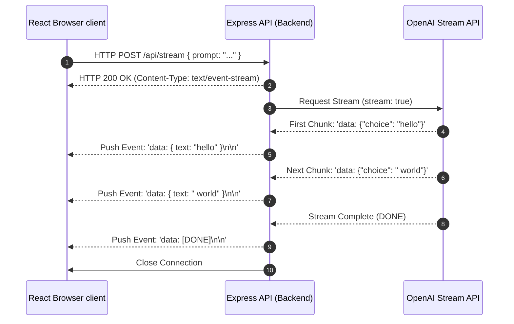

# Chapter 10: Streaming and Server-Sent Events (SSE)

**Estimated Reading Time**: 25 minutes  
**Difficulty**: Advanced  
**Prerequisites**: Chapters 1–9.  
**Learning Objectives**:
1. Explain how token streaming works over HTTP.
2. Configure Server-Sent Events (SSE) headers in Node APIs.
3. Consume chunk streams from LLM SDKs.
4. Implement a streaming completion API using Express and TypeScript.

---

## Introduction

Generative AI models are slow. Generating a 300-word response can take 3 to 6 seconds. If your application waits for the entire response to compile before returning it, the user will experience long delays and may leave the page.

**Streaming** solves this. As the model predicts tokens, the API sends them to the client character-by-character. We implement this using **Server-Sent Events (SSE)**.

In this chapter, we explore streaming architectures and build an Express streaming API in TypeScript.

---

## Theory: SSE vs. WebSockets & Chunk Consumption

### 1. Server-Sent Events (SSE)
SSE is a web standard allowing a server to push real-time events to a client over a persistent HTTP connection.
* **SSE vs WebSockets**: WebSockets are bidirectional and switch protocols from HTTP to WS. SSE runs over standard HTTP, is unidirectional (Server to Client), and works out-of-the-box with firewalls, load balancers, and SSL/TLS.
* **MIME Type**: SSE connections require setting the HTTP response header:
  `Content-Type: text/event-stream`
* **Protocol Format**: SSE transmits data in blocks starting with `data: ` and ending with two newlines (`\n\n`):
  `data: {"text": "hello"}\n\n`

### 2. Stream Consumption
When calling `stream: true` in an LLM SDK, the API doesn't return a simple promise. It returns an asynchronous iterable stream. We write loops using `for await...of` syntax to read text chunks as they arrive from the network.

---

## Real-World Analogy: The Water Tap

Imagine you are thirsty:
* **No Cache / Batch**: You order a gallon bucket of water. You wait at the tap for 10 minutes while the bucket fills. Once filled, you carry the heavy bucket back and drink.
* **Streaming (SSE)**: You open a tap and drink directly from the stream. The water flows immediately. You don't wait for a bucket to fill before you start drinking.

---

## Architecture Diagram: Streaming Response Lifecycle

This diagram shows how a streaming connection is established and how chunks flow from the LLM provider, through the backend, to the frontend.



---

## Code Example: SSE Streaming Server (TypeScript)

Let's build an Express backend server in TypeScript that streams completions using OpenAI's SDK and native HTTP streaming configurations.

First, ensure you have installed the dependencies:
```bash
npm install express openai dotenv
npm install --save-dev @types/express @types/node tsx
```

Create `stream_server.ts`:

```typescript
import express, { Request, Response } from "express";
import { OpenAI } from "openai";
import dotenv from "dotenv";

dotenv.config();

const app = express();
app.use(express.json());

const openai = new OpenAI();

app.post("/api/stream", async (req: Request, res: Response): Promise<void> => {
  const { prompt } = req.body;

  if (!prompt) {
    res.status(400).json({ error: "Prompt parameter is required." });
    return;
  }

  // 1. Configure SSE HTTP Response Headers
  res.setHeader("Content-Type", "text/event-stream");
  res.setHeader("Cache-Control", "no-cache");
  res.setHeader("Connection", "keep-alive");

  console.log(`[Stream Server] Open stream connection for prompt: "${prompt}"`);

  try {
    // 2. Call OpenAI API with stream enabled
    const stream = await openai.chat.completions.create({
      model: "gpt-4o-mini",
      messages: [{ role: "user", content: prompt }],
      stream: true, // Enable streaming chunk delivery
    });

    // 3. Loop over stream chunks and write to HTTP connection
    for await (const chunk of stream) {
      const content = chunk.choices[0]?.delta?.content || "";
      if (content) {
        // SSE protocol requires 'data: ' prefix and double newline suffix
        const eventData = { text: content };
        res.write(`data: ${JSON.stringify(eventData)}\n\n`);
      }
    }

    // 4. Signal stream completion and close connection
    res.write("data: [DONE]\n\n");
    res.end();
    console.log("[Stream Server] Stream completed and connection closed.");

  } catch (error: any) {
    console.error("[Stream Server Error] Streaming failed:", error.message);
    res.write(`data: ${JSON.stringify({ error: "Internal generation failed" })}\n\n`);
    res.end();
  }
});

const PORT = 3000;
app.listen(PORT, () => {
  console.log(`Streaming server listening on http://localhost:${PORT}`);
});
```

Run this file:
```bash
npx tsx stream_server.ts
```

Test the streaming server in a separate terminal:
```bash
curl -X POST http://localhost:3000/api/stream \
     -H "Content-Type: application/json" \
     -d '{"prompt": "Write 3 bullet points explaining React hook rules."}'
```

---

## Best Practices, Production & Security Considerations

### 1. Close Upstream Connections on Client Disconnect
If a user closes their browser or navigates away during a stream, the backend connection closes. If you don't catch this, the backend will keep fetching tokens from the LLM, inflating your bill.
* **Production Rule**: Listen to the client's close event (`req.on("close")`) and trigger an `AbortController` to stop the upstream LLM stream immediately:
  ```typescript
  const controller = new AbortController();
  req.on("close", () => {
    console.log("Client disconnected. Canceling generation...");
    controller.abort();
  });
  ```

---

## Common Mistakes

1. **Caching Stream Responses**: Deploying streaming APIs behind proxies or CDN systems (like Cloudflare or Nginx) without disabling buffering. Buffering collects the stream in a buffer and returns it all at once, destroying the real-time experience. Always set the header: `X-Accel-Buffering: no`.

---

## Exercises & Mini Project

### Exercise 1: SSE HTML Client
Write a simple `index.html` file using JavaScript's native `EventSource` or `fetch` stream readers to consume and render the token chunks in real time on a webpage.

### Mini Project: Log Stream Reader
Write a script that reads a local file `app.log` line-by-line using Node's `readline` module, streams each line to a client using SSE headers with a 500ms delay, and closes when finished.

---

## Interview Questions

1. **Q**: Why is SSE preferred over WebSockets for streaming LLM text completions?
   * **A**: WebSockets are designed for bidirectional communication and require custom protocol switching. Text generation is unidirectional (Server to Client). SSE runs over standard HTTP, supports connection recovery out of the box, and works seamlessly with standard security firewalls and CDNs.
2. **Q**: What HTTP response headers are required to configure a Server-Sent Events stream?
   * **A**: You must configure `Content-Type: text/event-stream`, `Cache-Control: no-cache` (prevents intermediate proxy caching), and `Connection: keep-alive` (forces the socket connection to remain open).

---

## Navigation

**Prev:** [Chapter 9: Working with LLM SDKs](./09_LLM_SDKs.md) | **Index:** [Course Overview](./00_Index.md) | **Next:** [Chapter 11: Multimodal Models](./11_Multimodal_Models.md)
