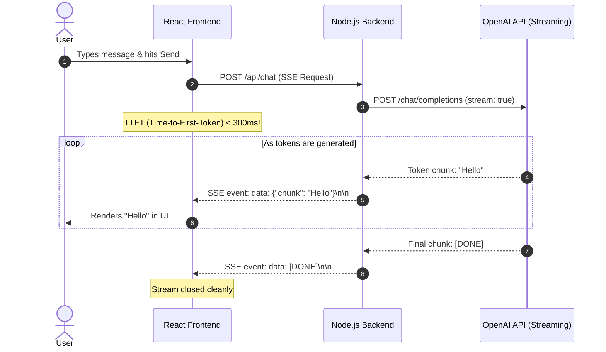
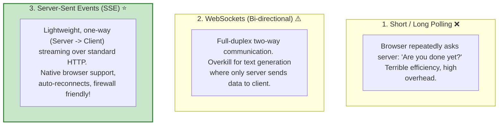
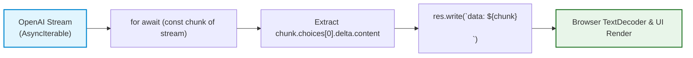

# 🤖 Streaming and Server-Sent Events (SSE)

## 📌 Overview

When you chat with ChatGPT or Claude on the web, you don't wait 5 seconds in complete silence for the entire paragraph to appear at once. 

Instead, the words start appearing **instantly on your screen**, typing out word by word like magic! 

This is called **Streaming**, and in web engineering it is powered by **Server-Sent Events (SSE)**. 

Because LLMs generate text one token at a time internally, streaming allows your backend server to pipe each token to the user's browser the exact millisecond it is calculated—transforming a sluggish 5-second wait into an instant, engaging user experience!



---

## 🎯 Why This Matters

1. **Drastically Reduces Perceived Latency (TTFT)**: **Time-To-First-Token** drops from 4,000ms down to ~250ms. The user starts reading immediately.
2. **Standard Web Technology (HTTP)**: SSE works over regular HTTP connections (`Content-Type: text/event-stream`), without the complexity of configuring WebSockets.
3. **Mandatory for Production AI Apps**: Modern users will assume your app is broken or frozen if they don't see words streaming in real time.

---

## 🧠 Prerequisites

- [01_Introduction.md](./01_Introduction.md): How LLMs generate tokens.
- [04_Tokens_and_Tokenization.md](./04_Tokens_and_Tokenization.md): Understanding tokens and word generation.
- Basic Node.js HTTP stream concepts (`ReadableStream`, `res.write()`).

---

## 🔍 Deep Dive

### 1. SSE vs. WebSockets vs. Polling



---

### 2. The Wire Protocol Format of SSE

SSE is incredibly simple. The server sends plain text over an open HTTP connection formatted with `data:` prefixes and double newlines `\n\n`:

```text
data: {"text": "The"}

data: {"text": " capital"}

data: {"text": " of"}

data: {"text": " France"}

data: {"text": " is Paris."}

data: [DONE]

```

---

### 3. Handling Streaming in Node.js (Async Iterators)

Modern JavaScript makes consuming AI streams effortless using `for await (... of ...)`:



---

## 💡 Simple Example: The Water Hose vs. The Bucket

- **Without Streaming (Bucket)**: You wait until the entire 5-gallon bucket is completely full of water before carrying it to the garden. (Slow and heavy).
- **With Streaming (Hose)**: You turn on the faucet and water flows continuously through the hose to your plants immediately!

---

## 🏗️ Real-World Example: Customer Chat Widget

When a user chats with a customer support AI:
1. User asks: *"How do I return a damaged package?"*
2. Server opens an SSE connection.
3. As the AI reasons through company return policy, the user watches the step-by-step instructions appear on their screen.
4. If the user stops reading or closes the tab, the backend detects connection close and aborts the OpenAI call (saving token costs).

---

## ⚠️ Common Mistakes & Pitfalls

1. ❌ **Buffering Proxies (Nginx / Cloudflare)**:
   - *Critical Gotcha*: By default, reverse proxies like Nginx or Cloudflare buffer HTTP responses before sending them to the client, ruining the real-time streaming effect!
   - *Fix*: Send the header `X-Accel-Buffering: no` and `Cache-Control: no-cache` in your Node.js response.
2. ❌ **Forgetting to flush or close the connection (`res.end()`)**:
   - *Trap*: Leaving HTTP connections hanging indefinitely will exhaust server socket pools.

---

## 🔥 Important Points to Remember

- Streaming drastically reduces **Time-To-First-Token (TTFT)**.
- **Server-Sent Events (SSE)** is the industry standard for LLM streaming.
- SSE requires headers: `Content-Type: text/event-stream` and `Cache-Control: no-cache`.
- Always set `X-Accel-Buffering: no` to prevent reverse proxies from buffering chunks.

---

## 💻 Code / Commands / Configuration

Here is a complete, beginner-friendly Express backend server demonstrating how to stream tokens using SSE:

```typescript
// streaming_server.ts
// 1. Run: npm install express openai dotenv @types/express
// 2. Run: npx ts-node streaming_server.ts

import express, { Request, Response } from 'express';
import OpenAI from 'openai';
import * as dotenv from 'dotenv';

dotenv.config();

const app = express();
app.use(express.json());

const openai = new OpenAI({
  apiKey: process.env.OPENAI_API_KEY,
});

// SSE Streaming Endpoint
app.post('/api/chat/stream', async (req: Request, res: Response) => {
  const { prompt } = req.body;

  if (!prompt) {
    return res.status(400).json({ error: "Missing prompt" });
  }

  // 1. Set required SSE HTTP Headers
  res.setHeader('Content-Type', 'text/event-stream');
  res.setHeader('Cache-Control', 'no-cache');
  res.setHeader('Connection', 'keep-alive');
  res.setHeader('X-Accel-Buffering', 'no'); // Disable Nginx buffering

  try {
    console.log(`📡 Starting stream for prompt: "${prompt}"`);

    // 2. Request streaming completion from OpenAI
    const stream = await openai.chat.completions.create({
      model: 'gpt-4o-mini',
      messages: [{ role: 'user', content: prompt }],
      stream: true, // Enable streaming mode!
    });

    // 3. Iterate over token chunks as they arrive from OpenAI
    for await (const chunk of stream) {
      const token = chunk.choices[0]?.delta?.content || '';
      if (token) {
        // Send SSE formatted frame
        res.write(`data: ${JSON.stringify({ text: token })}\n\n`);
      }
    }

    // 4. Send standard completion signal
    res.write(`data: [DONE]\n\n`);
    res.end();
    console.log("✅ Stream completed successfully.");
  } catch (error) {
    console.error("Stream Error:", error);
    res.write(`data: ${JSON.stringify({ error: "Stream failed" })}\n\n`);
    res.end();
  }
});

app.listen(3000, () => {
  console.log("🚀 Streaming server running on http://localhost:3000");
});
```

---

## 🎤 Interview Perspective

* **Q: What is Time-To-First-Token (TTFT) and why is it more important than total completion time for user-facing applications?**
  * **Answer**: TTFT measures the latency between when the user submits a request and when the first generated token appears in the UI. Because humans read at approximately 200–300 words per minute, once streaming begins, the user is actively reading while subsequent tokens generate in the background. A low TTFT creates the perception of instant responsiveness, whereas waiting for the entire batch creates high perceived latency.
* **Q: Why is Server-Sent Events (SSE) preferred over WebSockets for LLM chat generation?**
  * **Answer**: LLM chat generation is fundamentally unidirectional during generation (the server streams tokens to the client). SSE operates over standard HTTP/1.1 and HTTP/2, requires no special protocol upgrade handshake, works cleanly through standard load balancers and firewalls, and includes built-in browser reconnection mechanisms via `EventSource`.

---

## 🧩 Connection With Previous Concepts

- **Previous Lesson ([09_LLM_SDKs.md](./09_LLM_SDKs.md))**: Used official SDKs to make batch requests.
- **Next Lesson ([11_Multimodal_Models.md](./11_Multimodal_Models.md))**: We will explore **Multimodal Models** that can see images, listen to audio, and analyze complex visual documents!

---

Previous : [09_LLM_SDKs.md](./09_LLM_SDKs.md) | Index: [00_Index.md](./00_Index.md) | Next: [11_Multimodal_Models.md](./11_Multimodal_Models.md)
