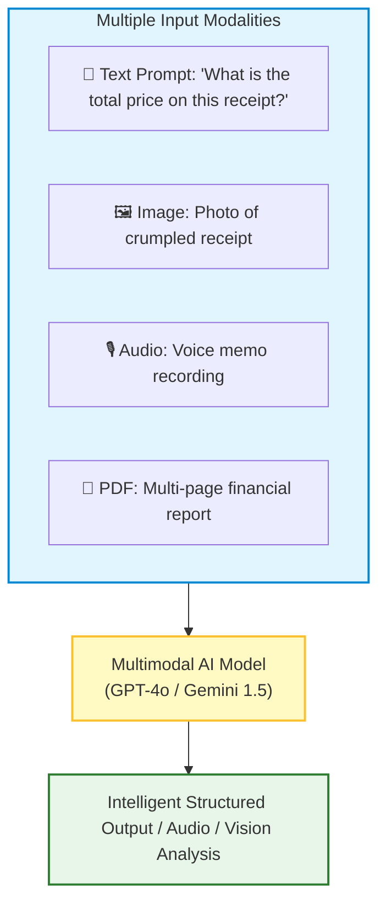
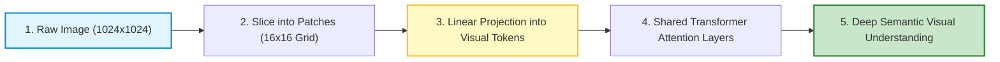
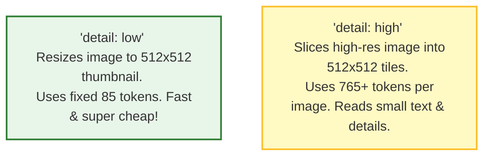

# 🤖 Multimodal Models: Vision, Audio, and Documents

## 📌 Overview

Until recently, AI models were **text-only**. If you wanted an AI to read a photo of a restaurant menu or a scanned PDF receipt, you had to run a clumsy OCR (Optical Character Recognition) tool first.

Today, frontier models (like GPT-4o, Gemini 1.5 Pro, and Claude 3.5 Sonnet) are natively **Multimodal**. 

**Multimodal** means the AI has eyes and ears! It can accept multiple types of input—**Text**, **Images**, **Audio**, **Video**, and **PDFs**—all in the same prompt, and reason across them simultaneously with superhuman accuracy!



---

## 🎯 Why This Matters

1. **Document & Receipt Parsing**: Extract structured tables, totals, and line items from scanned PDF invoices and handwritten forms in seconds without complex OCR rules.
2. **Visual Debugging & UI Inspection**: Feed a screenshot of your React website or UI mockup to the AI and ask it to write the exact CSS code or diagnose layout bugs.
3. **Medical & Industrial Applications**: Analyze X-rays, inspection photos, chart diagrams, and circuit boards with contextual reasoning.

---

## 🧠 Prerequisites

- [01_Introduction.md](./01_Introduction.md): How LLM API calls work.
- [04_Tokens_and_Tokenization.md](./04_Tokens_and_Tokenization.md): Understanding tokens and pricing.
- [09_LLM_SDKs.md](./09_LLM_SDKs.md): Using the OpenAI and Google GenAI SDKs.

---

## 🔍 Deep Dive

### 1. How Vision Works Inside: Vision Transformers (ViT)

How can a model that processes numbers "see" an image?



1. The image is divided into small grid squares (e.g. $16 \times 16$ pixel patches).
2. Each patch is converted into a **Visual Embedding Token**.
3. These visual tokens are mixed directly with text tokens in the Self-Attention mechanism, allowing words to attend to visual features!

---

### 2. Supplying Images: URL vs. Base64

You can pass images to the API in two formats:

| Method | Syntax | Best For |
|---|---|---|
| **Public Image URL** | `{ url: "https://mysite.com/cat.jpg" }` | Images already hosted on S3, Cloudinary, or public CDNs. |
| **Base64 Data URI** | `{ url: "data:image/jpeg;base64,/9j/4AAQSk..." }` | Local files, user uploads, private canvas drawings, webcam snaps. |

---

### 3. Detail Levels & Token Costs (`detail: "low"` vs `"high"`)

OpenAI's Vision API provides a `detail` parameter:



---

## 💡 Simple Example: The Doctor Looking at an X-Ray

- **Old OCR**: A blind reader who can only recognize letters typed in standard fonts. An X-ray or diagram looks like total blank space.
- **Multimodal AI**: An experienced doctor who looks at the visual picture, reads the accompanying lab notes, and explains how the fracture on the bone relates to the patient's symptoms!

---

## 🏗️ Real-World Example: Receipt Expense Tracker

In a fintech app like Expensify:
1. User snaps a photo of their restaurant bill on their phone.
2. React Native app converts image to Base64 and sends to backend.
3. Backend calls `gpt-4o-mini` with a Zod schema (`merchant`, `total`, `tax`, `tip`, `items`).
4. AI extracts all fields into JSON with 99.8% accuracy and automatically records the expense.

---

## ⚠️ Common Mistakes & Pitfalls

1. ❌ **Sending Massive 20MB Raw Photos**:
   - *Trap*: Sending uncompressed 4K phone camera photos wastes network bandwidth. Always resize images on the client/server (e.g. max 1500px width) before sending to the API.
2. ❌ **Using `detail: "low"` for Reading Small Text**:
   - *Trap*: Low detail blurs out fine print, barcodes, and serial numbers. Always use `detail: "high"` for OCR and document parsing.

---

## 🔥 Important Points to Remember

- **Multimodal**: Processes text, images, audio, and documents together.
- Images are sliced into patches and converted into visual tokens (ViT).
- Images can be passed as public URLs or Base64 data URIs.
- `detail: "low"` = fixed 85 tokens; `detail: "high"` = tiled high-res tokens.

---

## 💻 Code / Commands / Configuration

Here is a TypeScript script analyzing a local image file using OpenAI's Vision API:

```typescript
// vision_analysis_demo.ts
// 1. Run: npm install openai dotenv
// 2. Run: npx ts-node vision_analysis_demo.ts

import OpenAI from 'openai';
import * as fs from 'fs';
import * as dotenv from 'dotenv';

dotenv.config();

const openai = new OpenAI({
  apiKey: process.env.OPENAI_API_KEY,
});

// Helper: Convert local file to Base64 data URL
function encodeImageToBase64(filePath: string): string {
  const fileBuffer = fs.readFileSync(filePath);
  return `data:image/jpeg;base64,${fileBuffer.toString('base64')}`;
}

async function analyzeImage(imagePath: string, userQuestion: string) {
  try {
    const base64Image = encodeImageToBase64(imagePath);

    console.log("👁️ Sending image to GPT-4o for visual analysis...");

    const response = await openai.chat.completions.create({
      model: "gpt-4o-mini",
      messages: [
        {
          role: "user",
          content: [
            { type: "text", text: userQuestion },
            {
              type: "image_url",
              image_url: {
                url: base64Image,
                detail: "high", // High resolution tile inspection
              },
            },
          ],
        },
      ],
      max_tokens: 500,
    });

    console.log("\n🤖 Vision Analysis Result:\n");
    console.log(response.choices[0].message.content);
  } catch (error) {
    console.error("Error analyzing image:", error);
  }
}

// Example usage (ensure sample.jpg exists in the directory)
// analyzeImage("./sample.jpg", "Extract all text and list the main objects found in this image.");
```

---

## 🎤 Interview Perspective

* **Q: How does a Multimodal Transformer integrate visual tokens with text tokens?**
  * **Answer**: Modern multimodal architectures use a Vision Transformer (ViT) encoder to tokenize images into a sequence of patch embeddings. A projection layer maps these visual embeddings into the exact same vector embedding space as text tokens. The merged token sequence is then fed into a unified decoder Transformer, where cross-attention and self-attention operate seamlessly across both modalities.
* **Q: When would you choose Google Gemini 1.5 Pro over GPT-4o for multimodal tasks?**
  * **Answer**: Gemini 1.5 Pro features a massive context window of up to 2 million tokens, enabling native ingestion of 1-hour video clips, 10 hours of raw audio, or 1,000-page PDF documents without needing external chunking or pre-processing.

---

## 🧩 Connection With Previous Concepts

- **Previous Lesson ([10_Streaming_and_SSE.md](./10_Streaming_and_SSE.md))**: Streamed text tokens live.
- **Next Lesson ([12_Prompt_Engineering_Basics.md](./12_Prompt_Engineering_Basics.md))**: We will master the core foundations of **Prompt Engineering**—learning how to write elite system instructions, few-shot examples, and chain-of-thought prompts!

---

Previous : [10_Streaming_and_SSE.md](./10_Streaming_and_SSE.md) | Index: [00_Index.md](./00_Index.md) | Next: [12_Prompt_Engineering_Basics.md](./12_Prompt_Engineering_Basics.md)
