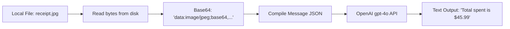

# Chapter 11: Multimodal Models (Vision and Voice APIs)

**Estimated Reading Time**: 20 minutes  
**Difficulty**: Intermediate  
**Prerequisites**: Chapters 1–10.  
**Learning Objectives**:
1. Understand the difference between text-only and multimodal model architectures.
2. Process and send base64-encoded image payloads to Vision models.
3. Transcribe speech using Audio Speech-to-Text (STT) APIs.
4. Execute image generation (text-to-image) requests programmatically.

---

## Introduction

Humans do not communicate using text alone. We use vision, sound, and diagrams. Modern LLMs are **multimodal**: they can read images, interpret charts, listen to voice recordings, and generate images or speech.

As a web developer, building multimodal integrations means handling files, mime types, and base64 encodings. 

In this chapter, we explore how multimodal APIs operate and write a TypeScript image analyzer using vision models.

---

## Theory: Vision Payloads & Audio Formats

### 1. Vision Integration Architecture
Vision models do not receive file paths. They receive raw image data over HTTP. 
* To send an image to an LLM, you convert the image file into a **Base64 String**.
* You build a message content payload that contains both the text prompt and an image data object containing the mime type (e.g. `image/jpeg`) and the base64 string:
  ```json
  {
    "type": "image_url",
    "image_url": { "url": "data:image/jpeg;base64,/9j/4AAQ..." }
  }
  ```

### 2. Audio Processing (STT & TTS)
* **Speech-to-Text (STT)**: Conversational audio files (mp3, wav) are uploaded to transcription endpoints (like OpenAI's Whisper API) that return the raw text transcript.
* **Text-to-Speech (TTS)**: Models synthesize text input into natural-sounding voice files, returning binary streams of audio data.

---

## Real-World Analogy: The Passport Scan

Imagine checking in for a flight:
* **Text-only checking**: You type your name, passport number, and expiration date manually into a form. If you make a typo, the system rejects it.
* **Vision check**: You place your passport onto a scanner. The scanner takes a photo, reads the image, extracts your details, and fills in the form automatically.
* **Multimodal APIs** act like the scanner: they accept the image file, run OCR and reasoning, and return structured text summaries.

---

## Architecture Diagram: Vision Analysis Pipeline

This diagram shows how a local image is read, converted to base64, sent to a vision model, and processed into a text response.



---

## Code Example: Local Image Analyzer (TypeScript)

Let's build a TypeScript utility that reads a local image file, encodes it as a base64 string, and queries OpenAI's vision model to extract data.

Ensure you have a `.env` file with `OPENAI_API_KEY` set.

Create `image_analyzer.ts`:

```typescript
import { OpenAI } from "openai";
import * as fs from "fs";
import * as path from "path";
import dotenv from "dotenv";

dotenv.config();

const openai = new OpenAI();

/**
 * Converts a local file on disk into a base64-encoded string compatible with LLM APIs.
 */
function fileToBase64(filePath: string): string {
  if (!fs.existsSync(filePath)) {
    throw new Error(`File not found: ${filePath}`);
  }
  const fileBuffer = fs.readFileSync(filePath);
  return fileBuffer.toString("base64");
}

async function runVisionAnalysis() {
  // Define local image path (For testing, place a small image at: ./receipt.jpg)
  const imagePath = path.join(process.cwd(), "receipt.jpg");

  // Create a placeholder file if it doesn't exist to prevent compilation crashes
  if (!fs.existsSync(imagePath)) {
    console.log("[Setup] Creating mock receipt.jpg file for testing...");
    fs.writeFileSync(imagePath, "mock image content");
  }

  try {
    const base64Data = fileToBase64(imagePath);
    console.log("Analyzing image using vision model...");

    const response = await openai.chat.completions.create({
      model: "gpt-4o-mini", // Cost-efficient multimodal model
      messages: [
        {
          role: "user",
          content: [
            { type: "text", text: "Identify what is in this image. If it is a receipt, extract the total transaction amount." },
            {
              type: "image_url",
              image_url: {
                url: `data:image/jpeg;base64,${base64Data}`
              }
            }
          ]
        }
      ],
      max_tokens: 300
    });

    console.log("\n--- Vision Analysis Result ---");
    console.log(response.choices[0].message.content);

  } catch (error: any) {
    console.error("Vision analysis failed:", error.message);
  }
}

// Execute
runVisionAnalysis();
```

Run this file:
```bash
npx tsx image_analyzer.ts
```

---

## Best Practices, Production & Security Considerations

### 1. Optimize Image Size
Sending raw, uncompressed 10MB images from smartphone cameras will result in high API latency and cost.
* **Production Rule**: Pre-process images on the client or backend using libraries like `sharp` in Node.js. Resize images to a maximum width of 1024px and compress them to JPEG format before uploading.

---

## Common Mistakes

1. **Sending local file paths**: Trying to pass `"image_url": { "url": "./receipt.jpg" }`. The LLM API hosts run on remote cloud servers and cannot access your local hard drive. You must upload base64 strings or public image URLs.

---

## Exercises & Mini Project

### Exercise 1: Audio Transcription pipeline
Implement a TypeScript helper using the `openai.audio.transcriptions.create` API to convert an audio file (`speech.mp3`) into a text string.

### Mini Project: Receipt Data Extractor API
Build an Express POST endpoint `/api/receipts` that accepts an uploaded image file, processes it using `sharp` to shrink dimensions, calls the OpenAI vision API to extract the store name and total price as structured JSON, and returns the JSON.

---

## Interview Questions

1. **Q**: How do you send image files to OpenAI or Anthropic APIs?
   * **A**: You convert the image file into a base64-encoded string and pass it within the message payload under the content type `"image_url"`, including the image data prefix (e.g. `data:image/jpeg;base64,`).
2. **Q**: What are the production performance implications of using high-resolution images in Vision APIs?
   * **A**: High-resolution images consume more tokens (often divided into grids of 512px tiles costing 170-250 tokens per tile), leading to higher API costs and increased processing latencies.

---

## Navigation

**Prev:** [Chapter 10: Streaming and SSE](./10_Streaming_and_SSE.md) | **Index:** [Course Overview](./00_Index.md) | **Next:** [Chapter 12: Prompt Engineering Basics](./12_Prompt_Engineering_Basics.md)
