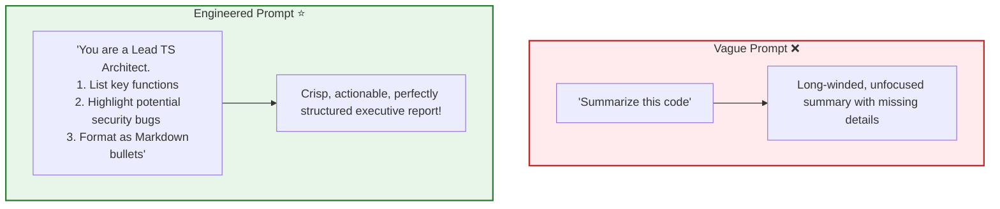
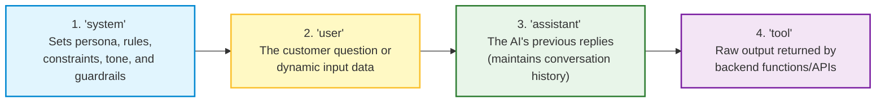
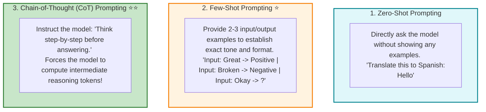
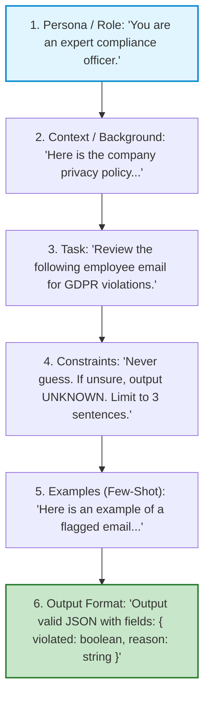

# 🤖 Prompt Engineering: Fundamentals, Roles, and Chain-of-Thought

## 📌 Overview

If Large Language Models are super-intelligent reasoning engines, then **Prompts are the steering wheel and pedals**.

**Prompt Engineering** is the practice of crafting clear, structured, and strategic natural language instructions to guide an AI model to produce accurate, consistent, and high-quality answers.

Because LLMs predict text based on context, how you phrase your question, provide examples, and define constraints determines whether you get a confusing mess or a brilliant, production-ready response!



---

## 🎯 Why This Matters

1. **Cheaper than Fine-Tuning**: 90% of AI engineering problems can be solved instantly by improving your prompts rather than spending thousands of dollars training custom models.
2. **Eliminates Hallucinations**: Clear constraints and formatting rules prevent the AI from making up facts or straying off-topic.
3. **Unlocks Complex Reasoning**: Techniques like **Chain-of-Thought** allow AI models to solve difficult multi-step logic and math problems that fail with simple questions.

---

## 🧠 Prerequisites

- [01_Introduction.md](./01_Introduction.md): How LLMs process probabilistic instructions.
- [06_Generation_Control.md](./06_Generation_Control.md): Temperature and sampling settings.

---

## 🔍 Deep Dive

### 1. The 4 Message Roles in LLM Chat

Every chat conversation sent to an AI API is an array of messages with distinct roles:



---

### 2. The Core Prompting Techniques



---

### 3. Why Chain-of-Thought (CoT) Works

LLMs generate one token at a time without backtracking. 
- If you ask: *"If John has 5 apples and eats 2, then buys 3 packs of 4 apples, how many does he have?"*
- If the model tries to answer immediately in 1 token: It might guess wrong.
- With **Chain-of-Thought** (*"Let's think step by step"*):
  - Step 1: John starts with 5.
  - Step 2: Eats 2 $\to 5 - 2 = 3$.
  - Step 3: 3 packs of 4 is $12$ apples.
  - Step 4: $3 + 12 = 15$.
  - Each generated sentence becomes context for the next calculation, leading to the correct answer!

---

### 4. The Anatomy of an Enterprise-Grade Prompt



---

## 💡 Simple Example: The Recipe Assistant

- **Bad Prompt**: *"Give me a pasta recipe."*
  - Result: 5-page Italian history lesson with exotic ingredients you don't own.
- **Engineered Prompt**: *"You are a quick weeknight chef. Give me a 15-minute pasta recipe using only 5 common ingredients. Format the response as: 1. Ingredients list, 2. Numbered step-by-step cooking steps."*
  - Result: Crisp, exact, 15-minute recipe ready to cook!

---

## 🏗️ Real-World Example: Customer Sentiment Classifier

In an e-commerce dashboard, we use Few-Shot prompting to classify customer reviews:
```text
System: You classify customer sentiment into POSITIVE, NEUTRAL, or NEGATIVE.

User: "The delivery arrived 2 days late, but the shirt quality is incredible!"
Assistant: POSITIVE

User: "Package arrived on time."
Assistant: NEUTRAL

User: "Item was broken and customer service refused to refund me."
Assistant: NEGATIVE

User: "Not bad for the price, might buy again."
Assistant: [Model reliably predicts: POSITIVE]
```

---

## ⚠️ Common Mistakes & Pitfalls

1. ❌ **Negative Constraints ("Don't think of a pink elephant")**:
   - *Trap*: Telling an AI *"Do not mention competitors"* often causes the model to attend to competitor names and mention them!
   - *Fix*: Use positive instructions: *"Focus exclusively on our company's product features."*
2. ❌ **Placing Context at the Very End of Long Prompts**:
   - *Trap*: Models pay highest attention to the beginning (system prompt) and the very end (recent user prompt). Put critical instructions at the end if the prompt is long (Lost in the Middle phenomenon).

---

## 🔥 Important Points to Remember

- **System Role**: Defines rules, constraints, and identity.
- **Zero-Shot**: Direct question with no examples.
- **Few-Shot**: Giving 2–3 input/output pairs to establish format and pattern.
- **Chain-of-Thought (CoT)**: "Think step-by-step" to unlock complex multi-step reasoning.
- Clear constraints prevent hallucinations.

---

## 💻 Code / Commands / Configuration

Here is a TypeScript script demonstrating how **Chain-of-Thought** and structured system prompts dramatically improve reasoning:

```typescript
// prompt_engineering_demo.ts
// Run with: npx ts-node prompt_engineering_demo.ts

import OpenAI from 'openai';
import * as dotenv from 'dotenv';

dotenv.config();

const openai = new OpenAI({
  apiKey: process.env.OPENAI_API_KEY,
});

async function runPromptExperiment() {
  const mathPuzzle = `A store has 12 boxes of pens. Each box contains 8 pens. 
  The store sells 3 boxes in the morning and 24 individual pens in the afternoon. 
  How many individual pens are left in the store?`;

  console.log("🧩 Testing Zero-Shot vs Chain-of-Thought (CoT):\n");

  // 1. Direct Zero-Shot (Risk of quick math error)
  const zeroShotRes = await openai.chat.completions.create({
    model: "gpt-4o-mini",
    messages: [
      { role: "system", content: "Answer with only the final number." },
      { role: "user", content: mathPuzzle }
    ],
    temperature: 0.0
  });

  console.log(`1️⃣ Zero-Shot Direct Answer:\n${zeroShotRes.choices[0].message.content}\n`);

  // 2. Chain-of-Thought (Step-by-step reasoning)
  const cotRes = await openai.chat.completions.create({
    model: "gpt-4o-mini",
    messages: [
      { 
        role: "system", 
        content: `You are an expert math tutor. 
Always solve problems step-by-step using Chain-of-Thought reasoning.
Format your answer as:
- Step 1: Initial inventory calculation
- Step 2: Morning deductions
- Step 3: Afternoon deductions
- Final Answer: [Number]` 
      },
      { role: "user", content: mathPuzzle }
    ],
    temperature: 0.0
  });

  console.log(`2️⃣ Chain-of-Thought Structured Answer:\n${cotRes.choices[0].message.content}`);
}

runPromptExperiment();
```

---

## 🎤 Interview Perspective

* **Q: Why does Chain-of-Thought (CoT) prompting increase accuracy on complex mathematical and logical tasks?**
  * **Answer**: LLMs are autoregressive models that generate output token by token without lookahead or backtracking. Asking for an immediate answer forces the model to encode all computational steps into the prediction of the very first token. CoT forces the model to generate intermediate reasoning tokens, which are then fed back into the context window as attention inputs for subsequent calculations.
* **Q: What is the "Lost in the Middle" phenomenon in long context prompting?**
  * **Answer**: Research shows that LLMs recall information best when it is placed at the very beginning (Primacy effect) or the very end (Recency effect) of the context window. Information placed in the middle of long documents (50k+ tokens) experiences lower attention weights and is more likely to be overlooked.

---

## 🧩 Connection With Previous Concepts

- **Previous Lesson ([11_Multimodal_Models.md](./11_Multimodal_Models.md))**: Processed visual and text tokens.
- **Next Lesson ([13_Prompt_Engineering_Advanced.md](./13_Prompt_Engineering_Advanced.md))**: We will explore **Advanced Prompt Engineering**—including the **ReAct Framework**, **Prompt Injections**, and **System Guardrails**!

---

Previous : [11_Multimodal_Models.md](./11_Multimodal_Models.md) | Index: [00_Index.md](./00_Index.md) | Next: [13_Prompt_Engineering_Advanced.md](./13_Prompt_Engineering_Advanced.md)
