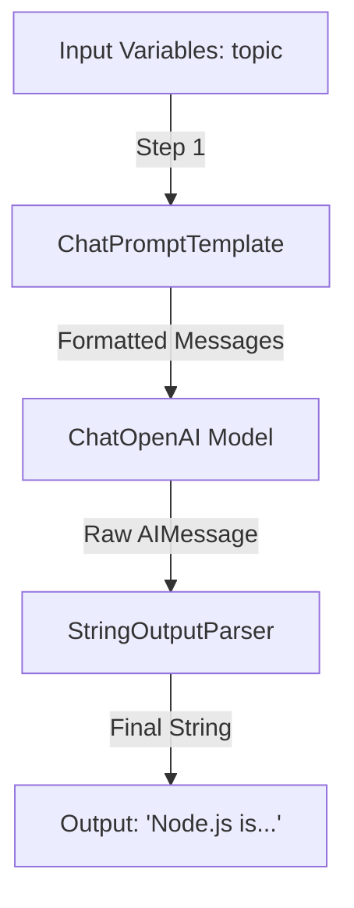

# Chapter 14: LangChain Introduction and LCEL

**Estimated Reading Time**: 20 minutes  
**Difficulty**: Intermediate  
**Prerequisites**: Chapters 1–13.  
**Learning Objectives**:
1. Install and configure core LangChain JS packages.
2. Differentiate between LLMs and ChatModels abstractions.
3. Master LangChain Expression Language (LCEL) pipeline composition.
4. Programmatically batch and stream runs using LCEL methods.

---

## Introduction

As your AI applications grow, direct SDK integration becomes difficult to manage. If you decide to switch from OpenAI to Claude, you have to rewrite your message array format, payload configurations, and parsing logic. 

**LangChain JS** solves this by providing a unified abstraction layer. It treats models, prompts, and output parsers as standardized blocks that can be chained together. 

In this chapter, we install LangChain and build an orchestration pipeline using **LangChain Expression Language (LCEL)**.

---

## Theory: The Modular Ecosystem and Runnables

### 1. Structure of the Ecosystem
LangChain is split into modular NPM packages:
* `@langchain/core`: Essential base classes, types, and the Runnable interface.
* `@langchain/openai` / `@langchain/anthropic`: Provider-specific integration modules.
* `@langchain/community`: Community integrations (databases, vector stores, custom loaders).

### 2. LangChain Expression Language (LCEL)
LCEL is a declarative language to compile runnables into a single chain. Every component in LCEL extends the `Runnable` class, which exposes standard async methods:
* `.invoke(input)`: Runs the chain on a single input.
* `.stream(input)`: Streams the output chunk-by-chunk.
* `.batch([inputs])`: Runs multiple inputs in parallel, optimizing API throughput.

LCEL chains are created by piping runnables together using the `.pipe()` method.

```typescript
// LCEL Pipeline Syntax
const chain = prompt.pipe(model).pipe(parser);
```

---

## Real-World Analogy: Express Middleware Chains

Think of an LCEL chain as an **Express Router Middleware Pipeline**:
* **Express Pipeline**: `validateRequest` $\to$ `authenticateUser` $\to$ `queryDatabase` $\to$ `sendJSON`.
* **LangChain Pipeline**: `ChatPromptTemplate` $\to$ `ChatModel` $\to$ `StringOutputParser`.

Just like Express passes request/response objects down the middleware chain, LCEL passes inputs/outputs down its runnable chain. If a middleware in Express changes the shape of the data, the subsequent middleware expects that new shape. The same applies to LCEL runnables.

---

## Architecture Diagram: LCEL Pipeline Flow

This diagram illustrates how data flows through an LCEL pipeline, from input variables to the final parsed string.



---

## Code Example: Prompt-Model Pipeline (TypeScript)

Let's build a basic LCEL pipeline that takes a user query, compiles it using a ChatPromptTemplate, calls OpenAI, and returns the response using a StringOutputParser.

Install the required packages:
```bash
npm install @langchain/core @langchain/openai dotenv
```

Create `langchain_lcel.ts`:

```typescript
import { ChatOpenAI } from "@langchain/openai";
import { ChatPromptTemplate } from "@langchain/core/prompts";
import { StringOutputParser } from "@langchain/core/output_parsers";
import dotenv from "dotenv";

dotenv.config();

async function runLcelPipeline() {
  // 1. Initialize the Model
  const model = new ChatOpenAI({
    modelName: "gpt-4o-mini",
    temperature: 0.3
  });

  // 2. Define the Chat Prompt Template
  const prompt = ChatPromptTemplate.fromMessages([
    ["system", "You are a code reviewer. Keep feedback under 3 bullet points."],
    ["human", "Review this code snippet:\n{code}"]
  ]);

  // 3. Initialize the String Output Parser
  const parser = new StringOutputParser();

  // 4. Compose the LCEL Pipeline using .pipe()
  const chain = prompt.pipe(model).pipe(parser);

  console.log("Invoking LCEL pipeline...");
  const codeSnippet = "const check = (x) => x == null ? true : false;";
  
  try {
    const result = await chain.invoke({ code: codeSnippet });
    console.log("\n--- Review Output ---");
    console.log(result);
  } catch (error: any) {
    console.error("Pipeline failed:", error.message);
  }
}

// Run
runLcelPipeline();
```

Run this script:
```bash
npx tsx langchain_lcel.ts
```

---

## Best Practices, Production & Security Considerations

### 1. Implement Fallbacks inside LCEL
Model APIs experience rate limits and occasional downtime.
* **Production Rule**: Configure fallbacks directly inside the LCEL pipeline using `.withFallbacks()` to automatically route queries to a secondary provider if the primary provider fails:
  ```typescript
  const modelWithFallback = openaiModel.withFallbacks([anthropicModel]);
  const chain = prompt.pipe(modelWithFallback).pipe(parser);
  ```

---

## Common Mistakes

1. **Mixing up ChatModels and LLMs**: Attempting to use legacy text-completion models (which take strings) where ChatModels (which take structured message arrays) are required. Always use `ChatOpenAI` or `ChatAnthropic`.

---

## Exercises & Mini Project

### Exercise 1: Pipeline streaming
Update the code example to use the `.stream()` method. Iterate over the stream and print chunks to the console as they arrive.

### Mini Project: Language Translator Pipeline
Create an LCEL pipeline that takes a source language, a target language, and text, and returns the translated text. Test it by translating English to French.

---

## Interview Questions

1. **Q**: What is the purpose of LCEL in LangChain?
   * **A**: LCEL (LangChain Expression Language) is a declarative syntax for composing individual `Runnable` components (prompts, models, parsers) into a unified pipeline, supporting streaming, batching, and fallovers out of the box.
2. **Q**: What is the difference between `.invoke()` and `.batch()` methods in a Runnable?
   * **A**: `.invoke()` runs the pipeline on a single input object. `.batch()` takes an array of inputs and runs them concurrently, optimizing network latency and GPU throughput when processing multiple requests.

---

## Navigation

**Prev:** [Chapter 13: Prompt Engineering Advanced](./13_Prompt_Engineering_Advanced.md) | **Index:** [Course Overview](./00_Index.md) | **Next:** [Chapter 15: Output Parsers and Memory](./15_LangChain_Output_Parsers_and_Memory.md)
