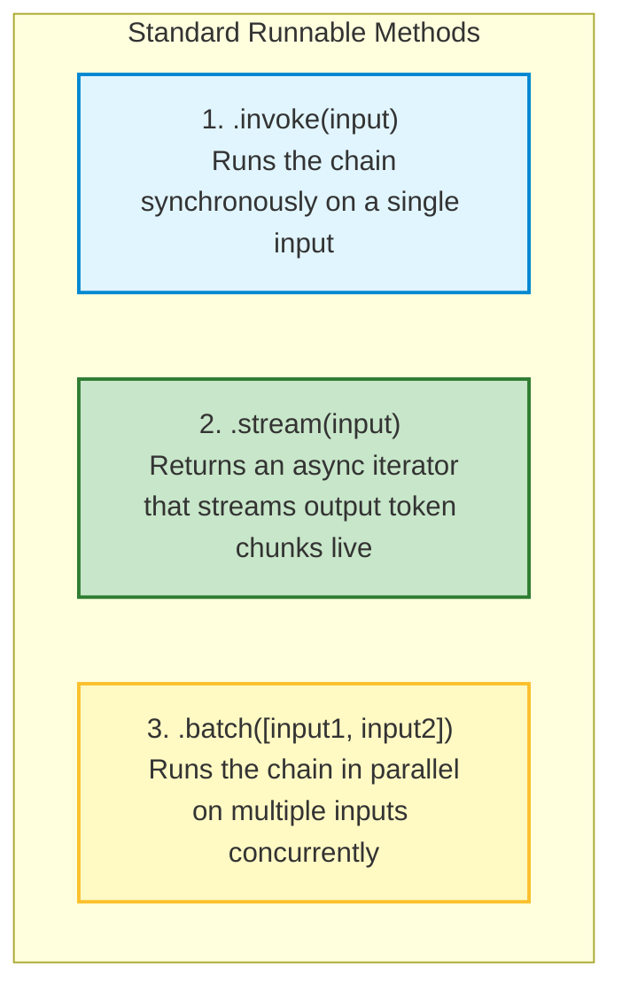

# 🤖 LangChain.js: Introduction and LCEL (LangChain Expression Language)

## 📌 Overview

Up to this point, we have written individual API calls to OpenAI using raw SDKs. But what happens when your application needs to:
1. Format a dynamic prompt template,
2. Pass it to an LLM,
3. Parse the output into a clean string or JSON,
4. Stream the result live to the user?

Connecting all these steps manually with custom code creates messy spaghetti code.

This is where **LangChain.js** comes in! 

LangChain is the most popular framework for building LLM applications in JavaScript and TypeScript. At its heart is **LCEL (LangChain Expression Language)**—a clean, declarative syntax using the pipe operator (`.pipe()`) that allows you to snap AI components together like Lego bricks!

```mermaid
flowchart LR
    Input["User Input: { topic: 'React' }"] --> Prompt["ChatPromptTemplate <br> Formats system & user messages"]
    Prompt -->| .pipe() | Model["ChatOpenAI <br> Computes LLM reasoning"]
    Model -->| .pipe() | Parser["StringOutputParser <br> Extracts clean text response"]
    Parser --> Output["Final Clean Output"]

    style Input fill:#e1f5fe,stroke:#0288d1,stroke-width:2px
    style Prompt fill:#fff9c4,stroke:#fbc02d,stroke-width:2px
    style Model fill:#ede7f6,stroke:#7e57c2,stroke-width:2px
    style Parser fill:#e8f5e9,stroke:#2e7d32,stroke-width:2px
    style Output fill:#c8e6c9,stroke:#2e7d32,stroke-width:2px
```

---

## 🎯 Why This Matters

1. **Declarative Pipelines with `.pipe()`**: Build complex AI pipelines in 3 lines of readable code instead of 30 lines of boilerplate.
2. **Universal Streaming & Batching Out-of-the-Box**: Every LCEL chain automatically supports `.invoke()`, `.stream()`, `.batch()`, and `.streamEvents()` without writing custom streaming logic!
3. **Provider Agnostic**: Switch your underlying model from OpenAI to Anthropic or Gemini by changing a single line of code without touching your business logic.

---

## 🧠 Prerequisites

- [01_Introduction.md](./01_Introduction.md): Basic LLM API concepts.
- [09_LLM_SDKs.md](./09_LLM_SDKs.md): How chat models and message roles work.

---

## 🔍 Deep Dive

### 1. The Unix Pipe Concept in JavaScript

In Linux / Unix terminal, you chain programs using the pipe operator `|`:
```bash
cat logs.txt | grep "ERROR" | wc -l
```

LCEL brings this exact concept to JavaScript using the `.pipe()` method:

```typescript
const chain = promptTemplate.pipe(chatModel).pipe(outputParser);
const result = await chain.invoke({ topic: "Quantum Computing" });
```

---

### 2. The Universal `Runnable` Interface

Every component in LangChain (prompts, models, parsers, retrievers, tools) implements the standard **Runnable Interface**:



---

### 3. Key Components of an LCEL Chain

1. **`ChatPromptTemplate`**: A reusable template containing placeholders (e.g. `{topic}`) that generates structured chat messages.
2. **`ChatOpenAI` / `ChatAnthropic`**: The model wrapper that sends messages to the AI provider.
3. **`StringOutputParser`**: Extracts the `.content` string from the model's complex response object, stripping away metadata.

---

## 💡 Simple Example: The Factory Assembly Line

Think of LCEL like a **Factory Assembly Line**:
1. **Station 1 (Prompt Template)**: Takes raw ingredients (user variables) and prepares the recipe sheet.
2. **Station 2 (Model)**: The chef cooks the meal based on the recipe sheet.
3. **Station 3 (Output Parser)**: The packaging unit puts the cooked meal into a clean takeaway box.
4. The conveyor belt connecting all stations is `.pipe()`!

---

## 🏗️ Real-World Example: Multi-Lingual Product Description Generator

In an international e-commerce store:
- User inputs `{ product: "Wireless Earbuds", targetLanguage: "French" }`.
- LCEL Chain:
  - Formats prompt: *"You are an expert copywriter. Write a 2-sentence sales description for {product} in {targetLanguage}."*
  - Passes to `ChatOpenAI`.
  - Parses into clean text.
  - Returns: *"Découvrez nos écouteurs sans fil haute fidélité..."*

---

## ⚠️ Common Mistakes & Pitfalls

1. ❌ **Forgetting Variable Matching in Prompt Templates**:
   - *Trap*: Defining template `{topic}` but invoking with `{ subject: "AI" }`. LCEL will throw a missing variable error.
2. ❌ **Using Legacy `LLMChain` instead of LCEL**:
   - *Note*: LangChain v0.1+ deprecated old classes like `LLMChain` and `SequentialChain`. Always use modern LCEL (`.pipe()`).

---

## 🔥 Important Points to Remember

- **LangChain.js**: Framework for building modular LLM applications in TypeScript.
- **LCEL**: LangChain Expression Language (`prompt.pipe(model).pipe(parser)`).
- Every LCEL chain automatically supports `.invoke()`, `.stream()`, and `.batch()`.
- Clean separation between prompts, models, and parsers.

---

## 💻 Code / Commands / Configuration

Here is a complete, working TypeScript example using modern LangChain.js and LCEL:

```typescript
// lcel_basic_demo.ts
// 1. Run: npm install @langchain/core @langchain/openai dotenv
// 2. Run: npx ts-node lcel_basic_demo.ts

import { ChatOpenAI } from "@langchain/openai";
import { ChatPromptTemplate } from "@langchain/core/prompts";
import { StringOutputParser } from "@langchain/core/output_parsers";
import * as dotenv from "dotenv";

dotenv.config();

async function runLCELDemo() {
  // 1. Define the Prompt Template
  const prompt = ChatPromptTemplate.fromMessages([
    ["system", "You are a witty tech tutor. Explain technical concepts in 2 short, humorous sentences."],
    ["user", "Explain what {concept} is."]
  ]);

  // 2. Define the Model
  const model = new ChatOpenAI({
    modelName: "gpt-4o-mini",
    temperature: 0.7,
  });

  // 3. Define the Output Parser
  const parser = new StringOutputParser();

  // 4. Compose the Chain using LCEL .pipe()
  const chain = prompt.pipe(model).pipe(parser);

  console.log("🚀 1. Running .invoke() on single input:");
  const result = await chain.invoke({ concept: "Recursion" });
  console.log(result, "\n");

  console.log("🌊 2. Running .stream() to stream tokens in real-time:");
  const stream = await chain.stream({ concept: "Garbage Collection" });
  for await (const chunk of stream) {
    process.stdout.write(chunk);
  }
  console.log("\n\n✅ Done!");
}

runLCELDemo();
```

---

## 🎤 Interview Perspective

* **Q: What is LCEL (LangChain Expression Language) and what architectural advantages does it provide?**
  * **Answer**: LCEL is a declarative orchestration syntax that chains LangChain primitives using `.pipe()`. It standardizes all components under a unified `Runnable` interface, providing first-class support for streaming, parallel batch execution, asynchronous execution, fallback handling, and distributed tracing (via LangSmith) without writing custom wrapper logic.
* **Q: How does LCEL make it easy to swap model providers?**
  * **Answer**: Because all model classes (`ChatOpenAI`, `ChatAnthropic`, `ChatGoogleGenerativeAI`) implement the same `BaseChatModel` interface, you simply swap the instantiated model object inside the pipeline without altering the prompt templates, parsers, or downstream business logic.

---

## 🧩 Connection With Previous Concepts

- **Previous Lesson ([13_Prompt_Engineering_Advanced.md](./13_Prompt_Engineering_Advanced.md))**: Learned advanced prompt reasoning and security.
- **Next Lesson ([15_LangChain_Output_Parsers_and_Memory.md](./15_LangChain_Output_Parsers_and_Memory.md))**: We will explore **Output Parsers** (Zod/JSON) and how to manage **Conversation Memory** in LangChain!

---

Previous : [13_Prompt_Engineering_Advanced.md](./13_Prompt_Engineering_Advanced.md) | Index: [00_Index.md](./00_Index.md) | Next: [15_LangChain_Output_Parsers_and_Memory.md](./15_LangChain_Output_Parsers_and_Memory.md)
