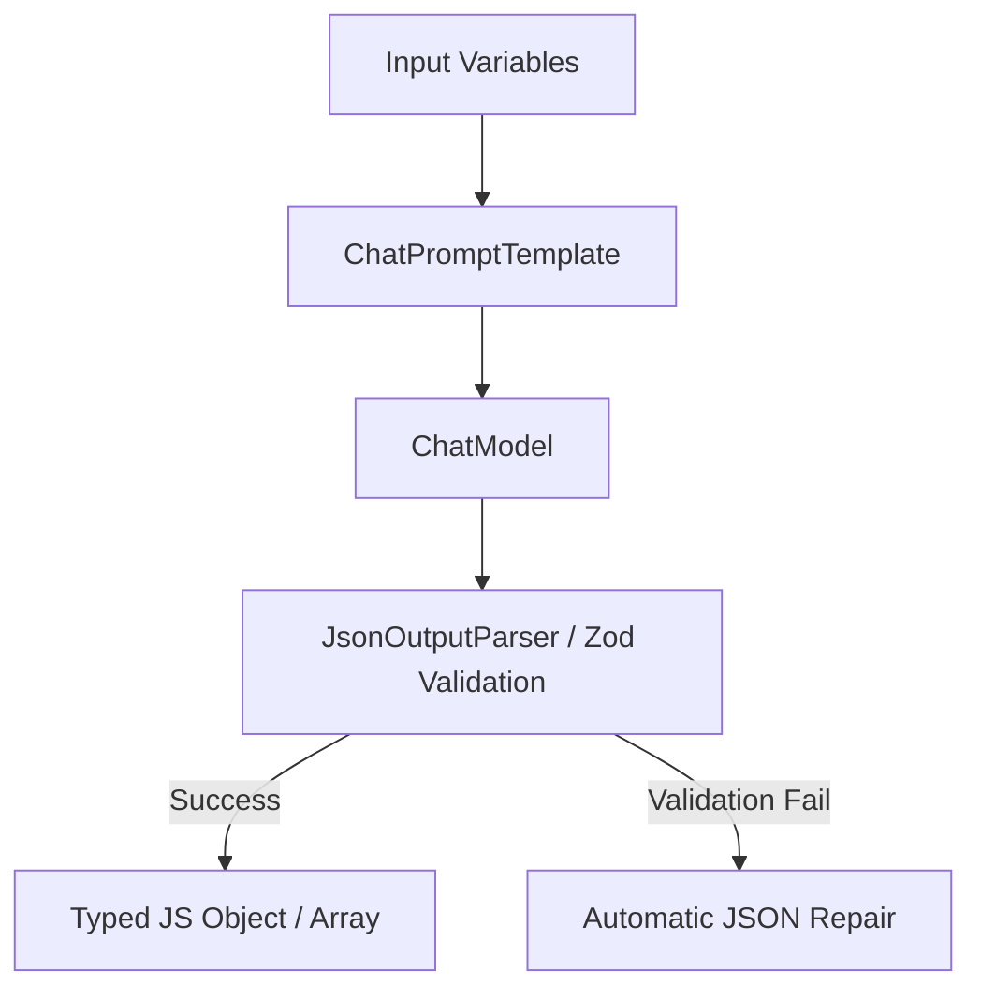

# Chapter 15: LangChain Output Parsers and Memory

**Estimated Reading Time**: 25 minutes  
**Difficulty**: Intermediate  
**Prerequisites**: Chapters 1–14.  
**Learning Objectives**:
1. Structure LLM responses using LangChain Output Parsers.
2. Enforce output type schemas using Zod.
3. Manage conversational state in LangChain workflows.
4. Implement a typed JSON parsing pipeline in TypeScript.

---

## Introduction

Getting an LLM to respond with clean text is fine for a chat interface, but applications need structured data. If you want to render a dashboard or populate a database, you need typed JSON, not conversational text.

Furthermore, LLMs are stateless: they do not remember previous messages in a conversation. We must manage this memory state manually.

In this chapter, we explore how to structure model outputs using output parsers and manage conversation history.

---

## Theory: Structured Parsers and Memory Abstractions

### 1. Output Parsers
LangChain output parsers extract and format text outputs into structured objects:
* **StringOutputParser**: Extracts the text content from a model message.
* **JsonOutputParser**: Automatically parses the model response as JSON.
* **StructuredOutputParser**: Instructs the model on the output schema using JSON Schema and validates the parsed JSON at runtime.

### 2. State Management (Memory)
To maintain conversation context, we use a message memory buffer:
* **BufferMemory**: Stores raw message history in an array and injects it into the prompt context for subsequent turns.
* **MessageHistory**: A persistent store (like Redis or Postgres) that keeps conversation history across sessions.

---

## Real-World Analogy: The Translator and the Filing Cabinet

Imagine a customer service representative:
* **Output Parser = Translator**: A client speaks in a foreign language. The translator listens, extracts key details (Name, Account ID, Issue), writes them on a structured form, and hand it to the representative.
* **Memory = Customer Filing Cabinet**: Every time the customer calls, the representative pulls their folder from the cabinet, reads the notes of the previous call, and uses that context to resolve the new request.

---

## Architecture Diagram: Structured Parsing Flow

This diagram illustrates how inputs are passed to the model, and how the output is parsed and validated into a structured TypeScript object.



---

## Code Example: Typed JSON Parsing Pipeline (TypeScript)

Let's build a LangChain pipeline that parses the model's response into a structured TypeScript object representing a list of tasks.

Create `langchain_parsers.ts`:

```typescript
import { ChatOpenAI } from "@langchain/openai";
import { ChatPromptTemplate } from "@langchain/core/prompts";
import { JsonOutputParser } from "@langchain/core/output_parsers";
import dotenv from "dotenv";

dotenv.config();

// 1. Define the target TypeScript interface
interface ProjectTasks {
  projectName: string;
  tasks: {
    title: string;
    priority: "HIGH" | "NORMAL" | "LOW";
    estimateDays: number;
  }[];
}

async function runParsingPipeline() {
  const model = new ChatOpenAI({
    modelName: "gpt-4o-mini",
    temperature: 0.1 // Low temperature is critical for structured outputs
  });

  // 2. Define the System Prompt instructing the model on the target JSON structure
  const prompt = ChatPromptTemplate.fromMessages([
    [
      "system",
      "You are a project manager. Create a task list for the user's project.\n" +
      "You must return a JSON object conforming exactly to this structure:\n" +
      "{\n" +
      "  \"projectName\": \"Name of project\",\n" +
      "  \"tasks\": [\n" +
      "    { \"title\": \"Task title\", \"priority\": \"HIGH\" | \"NORMAL\" | \"LOW\", \"estimateDays\": 2 }\n" +
      "  ]\n" +
      "}"
    ],
    ["human", "Generate a task list for building a: {project}"]
  ]);

  // 3. Initialize the JSON Output Parser
  const parser = new JsonOutputParser<ProjectTasks>();

  // 4. Compose the LCEL Pipeline
  const chain = prompt.pipe(model).pipe(parser);

  console.log("Requesting structured task list...");
  try {
    const result = await chain.invoke({ project: "Node.js REST API with Postgres connection" });
    
    console.log("\n--- Parsed JSON Output ---");
    console.log("Project Name:", result.projectName);
    console.log("Tasks:");
    result.tasks.forEach((t, idx) => {
      console.log(`  ${idx + 1}. [${t.priority}] ${t.title} (${t.estimateDays} days)`);
    });

  } catch (error: any) {
    console.error("Failed to parse structured output:", error.message);
  }
}

// Run
runParsingPipeline();
```

Run this file:
```bash
npx tsx langchain_parsers.ts
```

---

## Best Practices, Production & Security Considerations

### 1. Set Temperature to 0.0
When generating structured outputs (JSON or SQL), set the model temperature to `0.0`. Higher temperatures introduce randomness, increasing the risk of syntax errors or invalid JSON structure.

---

## Common Mistakes

1. **Using custom regex string parsers**: Writing complex regular expressions to extract JSON from text outputs instead of using LangChain's built-in structured JSON parsers.

---

## Exercises & Mini Project

### Exercise 1: Zod Schema Parser
Research LangChain's `StructuredOutputParser.fromZodSchema` and rewrite the code example to enforce validation rules using a Zod schema object.

### Mini Project: Memory-backed Console Chat
Write a script that loops user console inputs and uses a chat memory array to maintain conversation history, allowing the user to have a multi-turn chat with the model.

---

## Interview Questions

1. **Q**: Why are output parsers critical for integrating LLMs into backend services?
   * **A**: LLMs generate unstructured text by default. Output parsers instruct the model on formatting, parse raw text outputs into typed JSON objects, and run validation rules to ensure the data is safe to ingest.
2. **Q**: How do you manage conversational state in stateless API endpoints?
   * **A**: You store the conversation history (system instructions, user messages, and model responses) in a database (like Redis or Postgres). For each new request, you load the history and inject it into the prompt context before the user's new message.

---

## Navigation

**Prev:** [Chapter 14: LangChain Intro and LCEL](./14_LangChain_Introduction_and_LCEL.md) | **Index:** [Course Overview](./00_Index.md) | **Next:** [Chapter 16: Loaders and Splitters](./16_LangChain_Document_Loaders_and_Splitters.md)
