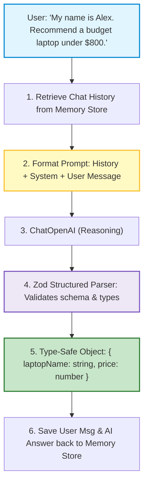
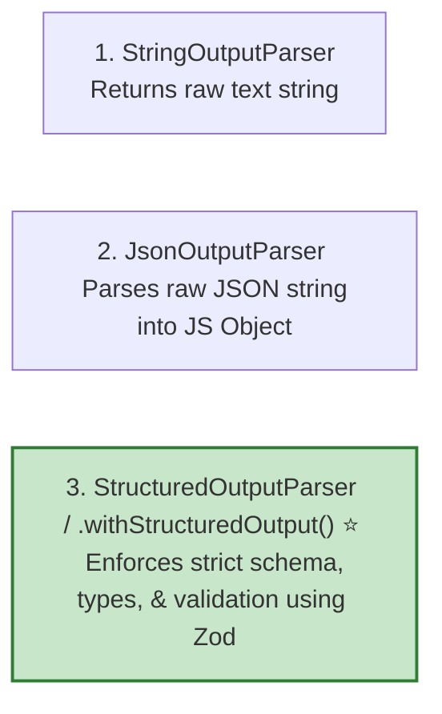
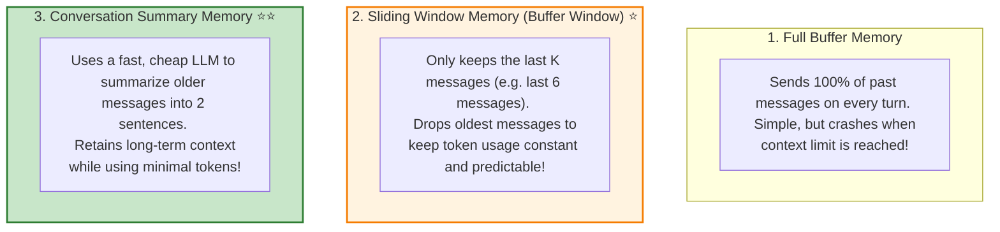

# 🤖 LangChain.js: Output Parsers and Conversation Memory

## 📌 Overview

When building real-world AI applications, you quickly hit two big challenges:
1. **Unpredictable Output Formats**: How do you guarantee the AI returns a clean, strongly-typed JavaScript object instead of a conversational paragraph?
2. **Statelessness (AI Amnesia)**: LLM APIs are 100% stateless—every new HTTP request has zero memory of what was said 10 seconds ago!

In this chapter, you will master **Output Parsers** (especially with **Zod**) to extract guaranteed JSON, and learn how to manage **Conversation Memory** so your chatbot remembers past conversations without running out of tokens!



---

## 🎯 Why This Matters

1. **End-to-End TypeScript Safety**: Parse model outputs directly into verified TypeScript interfaces with runtime validation using Zod.
2. **Multi-Turn Chatbots**: Maintain seamless back-and-forth context across multiple messages in a conversation.
3. **Token Budget Optimization**: Prevent massive API bills by pruning and summarizing old chat history instead of blindly sending 50 past messages on every click.

---

## 🧠 Prerequisites

- [07_Function_Calling_and_Structured_Outputs.md](./07_Function_Calling_and_Structured_Outputs.md): Structured outputs and JSON schemas.
- [14_LangChain_Introduction_and_LCEL.md](./14_LangChain_Introduction_and_LCEL.md): LCEL pipelines and `.pipe()`.

---

## 🔍 Deep Dive

### 1. Types of Output Parsers in LangChain



---

### 2. The 3 Memory Management Strategies

Because context windows are finite and cost tokens, you must choose how you store conversation history:



---

### 3. Modern LangChain Memory with `MessagesPlaceholder`

In modern LCEL, chat history is passed cleanly into prompt templates using `MessagesPlaceholder`:

```typescript
const prompt = ChatPromptTemplate.fromMessages([
  ["system", "You are a friendly personal assistant."],
  new MessagesPlaceholder("history"), // Dynamic array of past BaseMessages
  ["user", "{input}"]
]);
```

---

## 💡 Simple Example: The Medical Prescription Extractor

Imagine building an app for doctors:
- The doctor types unstructured notes: *"Patient Jane Doe, 34 years old, prescribed Amoxicillin 500mg twice daily for 7 days."*
- We define a Zod Schema: `{ patientName: string, age: number, medication: string, dosage: string }`.
- Using `.withStructuredOutput(prescriptionSchema)`, the AI outputs an exact, type-safe JavaScript object ready to insert into MongoDB or PostgreSQL!

---

## 🏗️ Real-World Example: Customer Support Session Store

In a multi-user web application:
1. When user #101 connects, we load their past messages from Redis.
2. We pass the last 6 messages into the LCEL chain.
3. The AI replies accurately remembering what the user said previously.
4. We push the new interaction back into Redis with a 24-hour expiration TTL.

---

## ⚠️ Common Mistakes & Pitfalls

1. ❌ **Storing All Conversation History in Memory (RAM)**:
   - *Trap*: If your server restarts, all user chat history is wiped out. Always persist session history in a database like Redis, PostgreSQL, or MongoDB in production.
2. ❌ **Not Truncating History in Long Sessions**:
   - *Trap*: A user who chats for 40 minutes can generate 30,000 tokens of history, causing every subsequent message to cost $0.10+ and slow down drastically. Always use a sliding window or summary.

---

## 🔥 Important Points to Remember

- **Output Parsers** convert unstructured AI text into strongly typed JSON.
- `.withStructuredOutput(zodSchema)` is the cleanest, most reliable way to enforce schemas in LangChain.
- **Sliding Window Memory** keeps the last $K$ messages to stay within token budgets.
- Always store production chat sessions in persistent storage like **Redis**.

---

## 💻 Code / Commands / Configuration

Here is a complete TypeScript script demonstrating **Zod Structured Outputs** and **Sliding Window Chat History**:

```typescript
// output_parser_and_memory_demo.ts
// 1. Run: npm install @langchain/core @langchain/openai zod dotenv
// 2. Run: npx ts-node output_parser_and_memory_demo.ts

import { ChatOpenAI } from "@langchain/openai";
import { ChatPromptTemplate, MessagesPlaceholder } from "@langchain/core/prompts";
import { HumanMessage, AIMessage, BaseMessage } from "@langchain/core/messages";
import { z } from "zod";
import * as dotenv from "dotenv";

dotenv.config();

// 1. Define Zod Schema for Structured Output
const MovieRecommendationSchema = z.object({
  title: z.string().describe("The name of the movie"),
  releaseYear: z.number().describe("Year the movie was released"),
  genres: z.array(z.string()).describe("List of genre tags (e.g. Sci-Fi, Thriller)"),
  whyYouWillLoveIt: z.string().describe("A 1-sentence personalized pitch"),
});

type MovieRecommendation = z.infer<typeof MovieRecommendationSchema>;

async function runStructuredOutputDemo() {
  const model = new ChatOpenAI({
    modelName: "gpt-4o-mini",
    temperature: 0.2,
  });

  // Attach Zod structured output to the model
  const structuredModel = model.withStructuredOutput(MovieRecommendationSchema);

  console.log("🎬 1. Fetching Structured Movie Recommendation...");
  const result: MovieRecommendation = await structuredModel.invoke(
    "Recommend a mind-bending sci-fi movie similar to Inception or Interstellar."
  );

  console.log("Structured Type-Safe JSON Result:");
  console.log(result);
  console.log(`Movie Title: ${result.title} (${result.releaseYear})`);
}

async function runConversationMemoryDemo() {
  const model = new ChatOpenAI({ modelName: "gpt-4o-mini", temperature: 0.5 });

  const prompt = ChatPromptTemplate.fromMessages([
    ["system", "You are a helpful travel guide assistant."],
    new MessagesPlaceholder("history"),
    ["user", "{input}"],
  ]);

  const chain = prompt.pipe(model);

  // In-memory chat history array (sliding window)
  const chatHistory: BaseMessage[] = [];

  // Turn 1
  console.log("\n💬 Turn 1:");
  const userMsg1 = "Hi! My name is Sarah and I'm planning a 3-day trip to Rome.";
  console.log(`User: ${userMsg1}`);
  
  const res1 = await chain.invoke({ history: chatHistory, input: userMsg1 });
  console.log(`AI: ${res1.content}\n`);

  // Record history
  chatHistory.push(new HumanMessage(userMsg1));
  chatHistory.push(new AIMessage(res1.content as string));

  // Turn 2 (Testing memory of name and destination)
  console.log("💬 Turn 2:");
  const userMsg2 = "What are the top 2 things I should see on day 1?";
  console.log(`User: ${userMsg2}`);

  const res2 = await chain.invoke({ history: chatHistory, input: userMsg2 });
  console.log(`AI: ${res2.content}\n`);
}

(async () => {
  await runStructuredOutputDemo();
  await runConversationMemoryDemo();
})();
```

---

## 🎤 Interview Perspective

* **Q: How does `model.withStructuredOutput(schema)` differ from parsing raw JSON with `JSON.parse()`?**
  * **Answer**: `model.withStructuredOutput()` utilizes native OpenAI/Anthropic Constrained Decoding (Grammar Masking) under the hood. It guarantees that the emitted tokens strictly conform to the JSON schema at generation time, preventing syntax errors, trailing commas, and markdown wrappers. `JSON.parse()` on raw string completions frequently throws runtime errors when models output markdown commentary.
* **Q: What is the risk of using unbounded conversation history in multi-turn chatbots?**
  * **Answer**: Unbounded conversation history leads to exponential token growth on every turn. This increases API billing costs linearly per turn, slows down Time-To-First-Token, and will eventually crash when the total token count exceeds the model's maximum context window limit.

---

## 🧩 Connection With Previous Concepts

- **Previous Lesson ([14_LangChain_Introduction_and_LCEL.md](./14_LangChain_Introduction_and_LCEL.md))**: Introduced LCEL chains and `.pipe()`.
- **Next Lesson ([16_LangChain_Document_Loaders_and_Splitters.md](./16_LangChain_Document_Loaders_and_Splitters.md))**: We will learn how to ingest real-world files (PDFs, Markdown, Webpages) and slice them into semantic chunks for RAG!

---

Previous : [14_LangChain_Introduction_and_LCEL.md](./14_LangChain_Introduction_and_LCEL.md) | Index: [00_Index.md](./00_Index.md) | Next: [16_LangChain_Document_Loaders_and_Splitters.md](./16_LangChain_Document_Loaders_and_Splitters.md)
