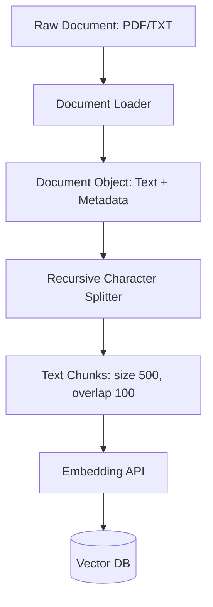

# Chapter 16: Document Loaders and Text Splitters

**Estimated Reading Time**: 25 minutes  
**Difficulty**: Intermediate  
**Prerequisites**: Chapters 1–15.  
**Learning Objectives**:
1. Load unstructured text data using LangChain Document Loaders.
2. Differentiate between word-level, character-level, and recursive text splitting.
3. Optimize chunk size and chunk overlap parameters for retrieval quality.
4. Process and split a local text file programmatically.

---

## Introduction

RAG applications start with ingestion. Before you can search your company's PDFs, markdown files, or spreadsheets, you must read the files and divide them into manageable chunks that fit inside context windows and maintain semantic meaning.

**Document Loaders** parse unstructured files into standardized `Document` objects. **Text Splitters** slice large documents into smaller chunks with optimal overlaps.

In this chapter, we explore document ingestion and write a file splitter script in TypeScript.

---

## Theory: Ingestion Pipelines and Splitter Logics

### 1. Document Loaders
Document loaders inherit from the `BaseDocumentLoader` class and expose a `.load()` method. They read raw files and return an array of `Document` objects containing the extracted text and metadata:
* **TextLoader**: Reads plain text files.
* **PDFLoader**: Extracts text from PDFs.
* **CSVLoader**: Parses tabular data, treating each row as a document.

### 2. Text Splitters
You cannot feed a 100-page document as a single string to an embedding model. It contains too much information, creating semantic noise. We must split it:
* **CharacterTextSplitter**: Splits text by a fixed character count.
* **RecursiveCharacterTextSplitter**: Splits text using a list of delimiters (double newlines, single newlines, spaces) recursively, keeping paragraphs, sentences, and words intact.
* **TokenTextSplitter**: Splits text by token count instead of characters.

### 3. Chunk Size & Overlap
* **Chunk Size**: The target size of each text block (e.g. 500 characters).
* **Chunk Overlap**: The amount of text shared between adjacent chunks (e.g. 100 characters). This ensures that semantic context spanning the boundary of a split is preserved.

---

## Real-World Analogy: Slicing a Loaf of Bread

Imagine you have a long French baguette:
* **No Splitting**: You try to eat the entire baguette in one bite (Context Window Overflow).
* **Splitting without Overlap**: You slice the baguette into clean pieces. If you slice directly through a piece of cheese embedded in the bread, the cheese falls out and is lost (Loss of context at split boundaries).
* **Splitting with Overlap**: You slice the baguette so that each piece overlaps slightly with the adjacent piece. If cheese sits on the boundary, it is preserved in both slices.

---

## Architecture Diagram: Document Ingestion Pipeline

This diagram shows how documents are loaded, split into overlapping chunks, and prepared for database ingestion.



---

## Code Example: Recursive Text Splitter (TypeScript)

Let's build a TypeScript script that reads a local file and splits it into chunks using the `RecursiveCharacterTextSplitter`.

First, install the community packages if needed:
```bash
npm install langchain @langchain/textsplitters
```

Create `document_splitter.ts`:

```typescript
import { RecursiveCharacterTextSplitter } from "@langchain/textsplitters";
import * as fs from "fs";
import * as path from "path";

async function runDocumentSplitter() {
  const targetFilePath = path.join(process.cwd(), "sample_document.txt");

  // 1. Create a dummy document for testing if it doesn't exist
  if (!fs.existsSync(targetFilePath)) {
    const sampleText = 
      "PostgreSQL is a powerful, open-source object-relational database system.\n\n" +
      "It has earned a strong reputation for reliability, feature robustness, and performance. " +
      "Many developers choose Postgres because it supports advanced data types like JSONB and spatial indexing via PostGIS.\n\n" +
      "In modern AI applications, developers extend Postgres using the pgvector extension. " +
      "This extension allows developers to store vector embeddings directly in database tables and execute cosine similarity searches alongside relational SQL queries.";
    fs.writeFileSync(targetFilePath, sampleText);
  }

  // 2. Read the file content
  const rawText = fs.readFileSync(targetFilePath, "utf-8");
  console.log(`Loaded file: "${targetFilePath}" (${rawText.length} characters)`);

  // 3. Initialize the Recursive Character Splitter
  // Target: 150-character chunks with a 30-character overlap
  const splitter = new RecursiveCharacterTextSplitter({
    chunkSize: 150,
    chunkOverlap: 30
  });

  // 4. Execute the splitting logic
  const chunks = await splitter.createDocuments([rawText]);

  console.log(`\nSplitting complete. Generated ${chunks.length} chunks:\n`);
  chunks.forEach((chunk, index) => {
    console.log(`--- Chunk ${index + 1} (Length: ${chunk.pageContent.length}) ---`);
    console.log(chunk.pageContent);
    console.log("------------------------------------------\n");
  });
}

// Run
runDocumentSplitter();
```

Run this file:
```bash
npx tsx document_splitter.ts
```

Observe how the recursive splitter prioritizes double newlines to split paragraphs cleanly, and keeps sentences intact where possible.

---

## Best Practices, Production & Security Considerations

### 1. Preserve Metadata
When splitting documents, ensure metadata (such as `source_file`, `author`, `created_at`) is copied from the parent document to every child chunk. This allows you to apply metadata filters in your vector database queries later.

---

## Common Mistakes

1. **Using 0% overlap**: Splitting documents with zero overlap, which cuts key concepts in half and makes them unsearchable.

---

## Exercises & Mini Project

### Exercise 1: Token Splitter Swap
Modify the code example to use `TokenTextSplitter` from `@langchain/textsplitters` and compare the generated chunks with those from the character splitter.

### Mini Project: HTML Page Parser
Write a script that fetches the HTML content of a public documentation page using `axios`, extracts the main text content, and splits it into 1,000-character chunks with a 200-character overlap.

---

## Interview Questions

1. **Q**: How does a `RecursiveCharacterTextSplitter` split text, and why is it preferred over a simple character count split?
   * **A**: A simple character split can cut words or sentences in half, losing their context. The recursive splitter uses a list of delimiters (defaulting to double newlines, single newlines, spaces) recursively, keeping paragraphs, sentences, and words intact.
2. **Q**: What is the purpose of chunk overlap in RAG ingestion?
   * **A**: Chunk overlap ensures that semantic concepts spanning the boundary of a split are preserved in both adjacent chunks, preventing context loss at split boundaries.

---

## Navigation

**Prev:** [Chapter 15: Output Parsers and Memory](./15_LangChain_Output_Parsers_and_Memory.md) | **Index:** [Course Overview](./00_Index.md) | **Next:** [Chapter 17: Retrievers and Tools](./17_LangChain_Retrievers_and_Tools.md)
