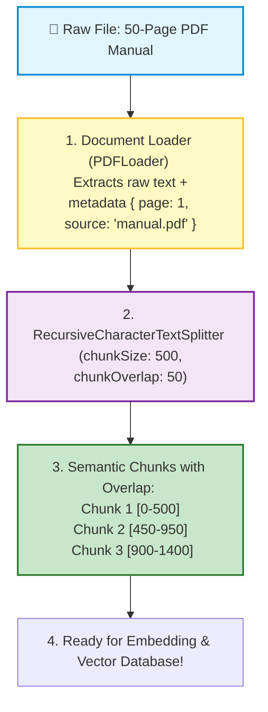
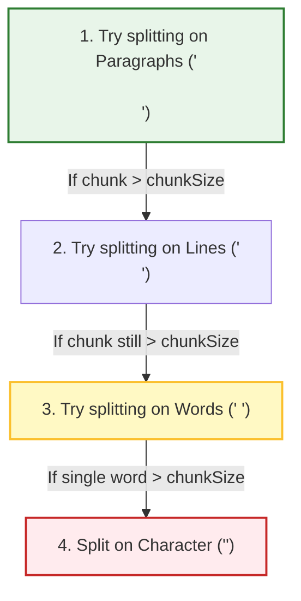

# 🤖 LangChain.js: Document Loaders and Text Splitters

## 📌 Overview

To build a private AI assistant that can answer questions about your company's internal PDFs, Notion pages, or website documentation, you first need to get that data **into the AI system**.

This ingestion process has two essential steps:
1. **Document Loaders**: Read raw files (PDFs, Word docs, Markdown, CSVs, or Webpages) and extract the clean text along with **Metadata** (like filename and page numbers).
2. **Text Splitters**: Slice large documents into small, digestible **Chunks** (e.g. 500 characters each) with a little bit of **Overlap** so context is never cut in half!



---

## 🎯 Why This Matters

1. **Prevents "Diluted" Embeddings**: If you embed an entire 100-page book as one single vector, all specific details get blurred and lost. Slicing into small chunks keeps each vector sharp and focused on a single topic.
2. **Preserves Context Across Boundaries**: If a critical sentence is split right down the middle across two chunks, **Chunk Overlap** ensures the full sentence exists intact inside both chunks.
3. **Cites Exact Sources**: Metadata allows your AI to say: *"Found on Page 14 of Employee_Handbook.pdf"*, building trust with your users.

---

## 🧠 Prerequisites

- [04_Tokens_and_Tokenization.md](./04_Tokens_and_Tokenization.md): Understanding tokens and chunk sizing.
- [05_Embeddings_and_Vector_Search.md](./05_Embeddings_and_Vector_Search.md): Why we embed chunks for semantic search.

---

## 🔍 Deep Dive

### 1. Major LangChain Document Loaders

| Loader | Package | Best For |
|---|---|---|
| `TextLoader` | `langchain/document_loaders/fs/text` | Plain text files (`.txt`, `.log`) |
| `PDFLoader` | `@langchain/community/document_loaders/fs/pdf` | PDF documents with page splitting |
| `CheerioWebBaseLoader` | `@langchain/community/document_loaders/web/cheerio` | Scraping public web pages and HTML |
| `JSONLoader` | `langchain/document_loaders/fs/json` | Structured JSON API responses |

Every loaded item is a LangChain **`Document`** object:
```typescript
interface Document {
  pageContent: string; // The extracted text
  metadata: Record<string, any>; // e.g. { source: "terms.pdf", page: 3 }
}
```

---

### 2. Why `RecursiveCharacterTextSplitter` is the Gold Standard

Why not just split by character count or spaces?
If you split strictly by character length, you might chop words in half like `"re- / imbursable"`.

`RecursiveCharacterTextSplitter` tries to split text hierarchically using a list of natural separators:
1. Double newlines `"\n\n"` (Paragraph breaks)
2. Single newlines `"\n"` (Line breaks)
3. Spaces `" "` (Word boundaries)
4. Empty string `""` (Fallback to characters if a word is huge)

This ensures paragraphs and sentences stay together whenever possible!



---

### 3. Visualizing Chunk Size and Overlap

```text
Full Text: "The brown fox jumps over the lazy dog in the sunny afternoon."

Chunk Size: 30 characters | Chunk Overlap: 10 characters

Chunk 1: [The brown fox jumps over the ]  (Chars 0 to 30)
Chunk 2: [over the lazy dog in the sunn]  (Chars 20 to 50 - "over the " is preserved!)
Chunk 3: [the sunny afternoon.         ]  (Chars 40 to 62)
```

---

## 💡 Simple Example: Slicing a Loaf of Bread

Think of chunking like **slicing a loaf of bread**:
- If you leave the loaf whole (no splitting), you can't make a sandwich (too big for the model's context window).
- If you shred it into breadcrumbs (character splitting), it falls apart (no context).
- Slicing into clean sandwich slices (semantic chunking) is the perfect size to consume!

---

## 🏗️ Real-World Example: Customer Knowledge Base Ingestion

In a SaaS help center:
- 500 markdown support articles are crawled using `CheerioWebBaseLoader`.
- Split using `RecursiveCharacterTextSplitter(chunkSize: 800, chunkOverlap: 100)`.
- Metadata `{ url: article.url, title: article.title }` is attached to every chunk.
- Vectors are stored in pgvector.
- When a customer asks a question, the AI retrieves the exact 800-character paragraph and links directly to the help article URL!

---

## ⚠️ Common Mistakes & Pitfalls

1. ❌ **Setting `chunkOverlap` to `0`**:
   - *Trap*: Information that spans across the boundary of two chunks gets sliced in half, causing the vector search to miss the full meaning. Always use 10% to 15% overlap.
2. ❌ **Losing Document Metadata**:
   - *Trap*: Discarding page numbers and URLs during chunking. Without metadata, your RAG bot cannot cite where it found the answer.

---

## 🔥 Important Points to Remember

- **Document Loaders** extract text and preserve metadata from files.
- **RecursiveCharacterTextSplitter** is the best general-purpose splitter for keeping paragraphs intact.
- **Chunk Size**: Target token/character length per piece (typically 500–1000 tokens).
- **Chunk Overlap**: Overlapping margin between consecutive chunks (typically 10–20%).

---

## 💻 Code / Commands / Configuration

Here is a complete TypeScript script showing how to load text and split it using `RecursiveCharacterTextSplitter`:

```typescript
// document_splitter_demo.ts
// 1. Run: npm install @langchain/core @langchain/textsplitters
// 2. Run: npx ts-node document_splitter_demo.ts

import { RecursiveCharacterTextSplitter } from "@langchain/textsplitters";
import { Document } from "@langchain/core/documents";

async function runSplitterDemo() {
  const samplePolicyDocument = `COMPANY RETURN POLICY 2026

1. ELIGIBILITY FOR RETURNS
Customers may return items within 30 days of initial delivery date.
To be eligible, the item must be unused, in the original packaging, and accompanied by the original sales receipt.

2. NON-REFUNDABLE ITEMS
Gift cards, downloadable software products, and personalized custom items cannot be returned.
Sale items marked 'Final Sale' are also strictly non-refundable.

3. REFUND PROCESS
Once your return is received and inspected by our warehouse team, we will send you an email notification.
If approved, your refund will be processed to the original credit card within 5 to 7 business days.`;

  // 1. Initialize Document object with Metadata
  const rawDoc = new Document({
    pageContent: samplePolicyDocument,
    metadata: { source: "policy_2026.txt", department: "Customer Support" },
  });

  // 2. Create the Recursive Text Splitter
  const splitter = new RecursiveCharacterTextSplitter({
    chunkSize: 200, // Small chunk size for demonstration
    chunkOverlap: 40, // 40 characters of overlap across boundaries
  });

  // 3. Split the document into chunks
  const chunks = await splitter.splitDocuments([rawDoc]);

  console.log(`📄 Original Document Length: ${samplePolicyDocument.length} characters`);
  console.log(`✂️ Generated ${chunks.length} Semantic Chunks:\n`);

  chunks.forEach((chunk, index) => {
    console.log(`--- Chunk #${index + 1} (${chunk.pageContent.length} chars) ---`);
    console.log(`Content:\n"${chunk.pageContent}"`);
    console.log(`Metadata:`, chunk.metadata);
    console.log("");
  });
}

runSplitterDemo();
```

---

## 🎤 Interview Perspective

* **Q: Why is `RecursiveCharacterTextSplitter` preferred over standard character splitting for RAG pipelines?**
  * **Answer**: `RecursiveCharacterTextSplitter` prioritizes semantic coherence. It recursively attempts to split along natural semantic boundaries (paragraphs `\n\n`, then lines `\n`, then words ` `) before falling back to raw character slices. This keeps related sentences and thoughts together within the same chunk, improving retrieval accuracy.
* **Q: What are the trade-offs of using small chunks (200 tokens) vs. large chunks (2000 tokens) in vector search?**
  * **Answer**: 
    - **Small chunks** (e.g. 200 tokens) produce fine-grained embeddings that match specific keywords/facts with high precision, but may lack surrounding context when generating answers.
    - **Large chunks** (e.g. 2000 tokens) contain rich context, but the embedding becomes generalized/diluted, making it harder to retrieve for specific detailed questions, and consuming more context window tokens.

---

## 🧩 Connection With Previous Concepts

- **Previous Lesson ([15_LangChain_Output_Parsers_and_Memory.md](./15_LangChain_Output_Parsers_and_Memory.md))**: Covered output validation and conversation memory.
- **Next Lesson ([17_LangChain_Retrievers_and_Tools.md](./17_LangChain_Retrievers_and_Tools.md))**: We will learn how to turn these chunked documents into searchable **Retrievers** and custom **Tools** in LangChain!

---

Previous : [15_LangChain_Output_Parsers_and_Memory.md](./15_LangChain_Output_Parsers_and_Memory.md) | Index: [00_Index.md](./00_Index.md) | Next: [17_LangChain_Retrievers_and_Tools.md](./17_LangChain_Retrievers_and_Tools.md)
