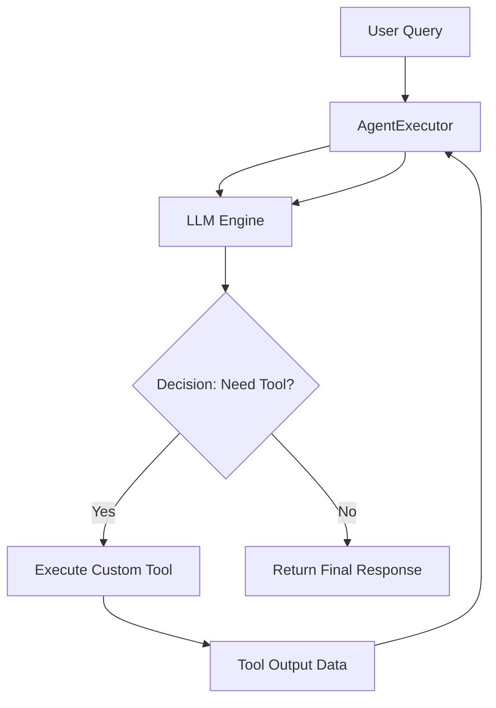

# Chapter 17: Retrievers and Custom Tools

**Estimated Reading Time**: 25 minutes  
**Difficulty**: Intermediate to Advanced  
**Prerequisites**: Chapters 1–16.  
**Learning Objectives**:
1. Connect LangChain Vector Stores to Retrievers.
2. Create custom tools using `@langchain/core/tools`.
3. Understand the role of `AgentExecutor` in orchestrating tools.
4. Build an in-memory vector store lookup retriever in TypeScript.

---

## Introduction

Once your documents are loaded and split, you need to search them. In LangChain, we do this using **Retrievers**. A retriever is an interface that takes a query string and returns an array of matching documents.

Furthermore, to allow the model to interact with external databases or APIs, we bind **Custom Tools** to it.

In this chapter, we explore how to build retrievers, declare custom tools, and run them using LangChain agents.

---

## Theory: Retrievers, Tool Binding, and Agent Executors

### 1. Vector Store Retrievers
A **Retriever** wraps a vector database. Unlike vector databases, which require vector array inputs, a retriever takes a natural language string, generates the query embedding under the hood, queries the vector database, and returns matching text documents.

### 2. Custom Tools
Tools are JavaScript functions that the model can invoke to perform actions. We define tools using the `@langchain/core/tools` package, declaring:
* A `name` (e.g. `query_database`).
* A `description` (tells the model when to use the tool).
* A Zod validation schema (declares the parameters the tool expects).

### 3. Agent Runtimes
An agent uses an LLM to decide what actions to take. The `AgentExecutor` orchestrates this loop: it calls the LLM, parses the tool request, runs the tool, feeds the output back to the LLM, and repeats until the final answer is generated.

---

## Real-World Analogy: The Research Librarian

Think of a user query as a question about "Postgres replication":
* **The Vector Store is the Library**: It contains thousands of books.
* **The Retriever is the Research Librarian**: You don't search the bookshelves yourself. You ask the librarian. The librarian goes to the database, finds the top 3 books, and hands them to you.
* **Tools are the Librarian's Assistants**: If you ask for a document that is locked in a cabinet, the librarian asks an assistant with a key (Tool: `unlockCabinet`) to fetch it.

---

## Architecture Diagram: Agent Tool Routing Loop

This diagram maps out the agent loop managed by the `AgentExecutor`.



---

## Code Example: In-Memory Vector Store Retriever (TypeScript)

Let's build a TypeScript script that indexes text documents in an in-memory vector store and uses a retriever to find similar documents.

First, install the community vector packages:
```bash
npm install @langchain/core @langchain/openai hnswlib-node
```
*(Note: If `hnswlib-node` requires compilation on your system, you can use the pre-built memory vector store package.)*

Create `langchain_retrievers.ts`:

```typescript
import { MemoryVectorStore } from "langchain/vectorstores/memory";
import { OpenAIEmbeddings } from "@langchain/openai";
import { Document } from "@langchain/core/documents";
import dotenv from "dotenv";

dotenv.config();

async function runVectorRetriever() {
  // 1. Initialize OpenAI Embeddings model
  const embeddings = new OpenAIEmbeddings({
    modelName: "text-embedding-3-small"
  });

  // 2. Initialize an In-Memory Vector Store
  const vectorStore = new MemoryVectorStore(embeddings);

  // 3. Define and Ingest Documents
  const docs = [
    new Document({
      pageContent: "PostgreSQL clustering requires setting up primary and replica nodes with hot_standby configurations.",
      metadata: { category: "database" }
    }),
    new Document({
      pageContent: "React useState hook manages local component state updates.",
      metadata: { category: "frontend" }
    }),
    new Document({
      pageContent: "Docker container network mappings are configured using the -p flags.",
      metadata: { category: "devops" }
    })
  ];

  console.log("Ingesting documents into vector store...");
  await vectorStore.addDocuments(docs);

  // 4. Create a Retriever from the Vector Store
  // Configured to return only the top 1 matching document
  const retriever = vectorStore.asRetriever({ k: 1 });

  console.log("Querying retriever for: 'postgres setup'...");
  const query = "How do I configure postgres nodes?";
  const results = await retriever.invoke(query);

  console.log("\n--- Retriever Result ---");
  if (results.length > 0) {
    console.log(`Content: "${results[0].pageContent}"`);
    console.log("Metadata:", results[0].metadata);
  } else {
    console.log("No matching documents found.");
  }
}

// Run
runVectorRetriever();
```

Run this file:
```bash
npx tsx langchain_retrievers.ts
```

---

## Best Practices, Production & Security Considerations

### 1. Constrain Retriever Outputs (`k` Parameter)
By default, retrievers might return 4 or more documents. If documents are large, this can quickly fill up your prompt context window, resulting in high token costs and latency.
* **Production Rule**: Set the `k` parameter (e.g. `k: 2`) to restrict retrieval to only the top most relevant documents.

---

## Common Mistakes

1. **Hardcoding Tool Names**: Changing tool names in the backend without updating their descriptions or references in the model prompts, causing tool matching to fail.

---

## Exercises & Mini Project

### Exercise 1: Custom Tool Definition
Create a custom tool `calculateTax` using the `tool` decorator from `@langchain/core/tools` that takes a price (number) and returns the tax (15%). Declare its inputs using a Zod schema.

### Mini Project: Database Agent
Combine a retriever and a calculator tool. Create an agent that takes a user prompt, retrieves database guide documents, and runs the calculator tool to generate cost estimations.

---

## Interview Questions

1. **Q**: What is the difference between a Vector Store and a Retriever in LangChain?
   * **A**: A Vector Store is a database abstraction for storing and searching vector embeddings. A Retriever is a read-only query interface that takes a natural language string as input and returns an array of matching document objects.
2. **Q**: How does the `AgentExecutor` run custom tools?
   * **A**: The executor passes the tool descriptions to the LLM. If the LLM returns a tool request, the executor halts text generation, runs the tool function locally using the arguments provided by the LLM, and feeds the tool output back to the LLM to continue the generation loop.

---

## Navigation

**Prev:** [Chapter 16: Loaders and Splitters](./16_LangChain_Document_Loaders_and_Splitters.md) | **Index:** [Course Overview](./00_Index.md) | **Next:** [Chapter 18: Callbacks and LangSmith](./18_LangChain_Callbacks_and_LangSmith.md)
