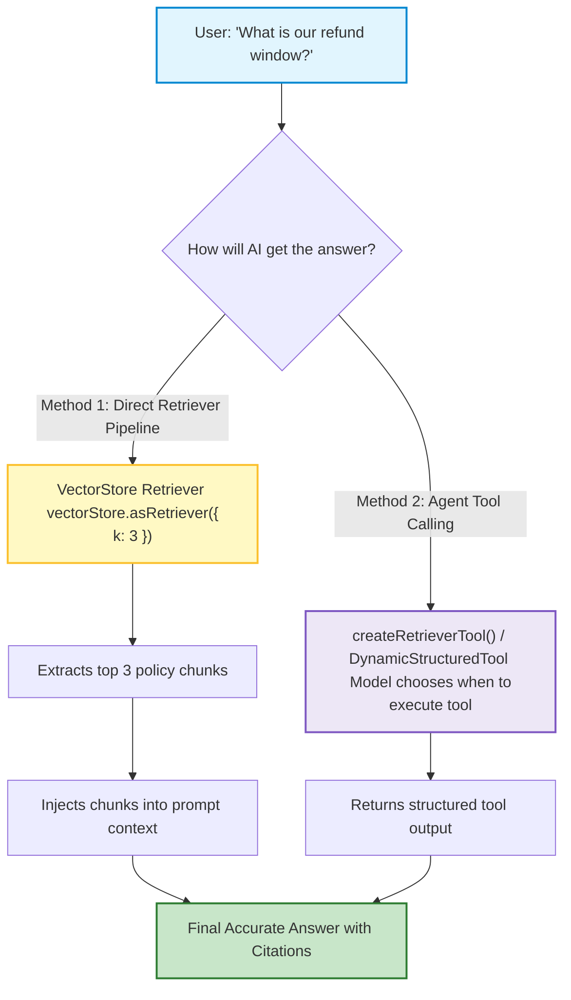
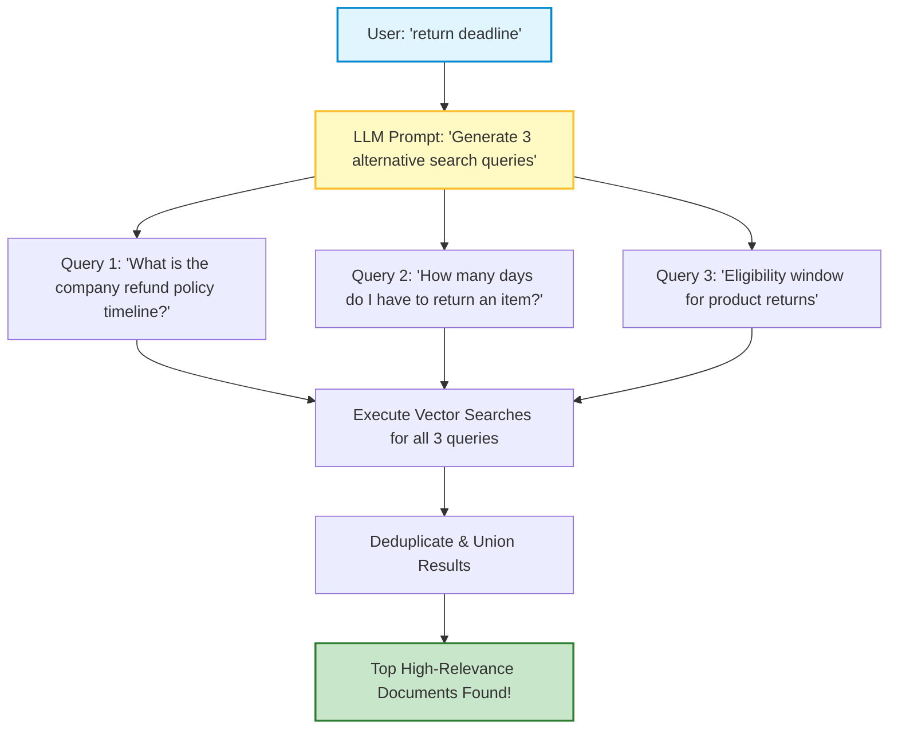

# 🤖 LangChain.js: Retrievers and Custom Tools

## 📌 Overview

In the previous chapter, we sliced our documents into semantic chunks. Now, how do we make those chunks **searchable** and **usable** by an AI model?

In LangChain, this is handled by two powerhouse concepts:
1. **Retrievers**: An abstraction that takes a natural language search query and returns a list of relevant `Document[]` objects.
2. **Tools (DynamicStructuredTool)**: Functions you give to an LLM with strict Zod validation so the model can take actions, call APIs, or search documents autonomously!



---

## 🎯 Why This Matters

1. **Decoupled Search Logic**: A Retriever can wrap a Vector Database, an Elasticsearch cluster, Google Search, or Wikipedia—your downstream LCEL chain doesn't care where the data comes from!
2. **Multi-Query Retrieval**: Fixes user typos and bad phrasing by automatically having an LLM generate 3 alternative query variations to search the vector database from multiple angles.
3. **Turn Anything into an Agent Tool**: Wrap any Node.js function (e.g. sending a Slack message, running a SQL query, querying Stripe) into a type-safe LangChain tool with Zod.

---

## 🧠 Prerequisites

- [05_Embeddings_and_Vector_Search.md](./05_Embeddings_and_Vector_Search.md): Vectors and cosine similarity.
- [07_Function_Calling_and_Structured_Outputs.md](./07_Function_Calling_and_Structured_Outputs.md): Tool calling and schemas.
- [16_LangChain_Document_Loaders_and_Splitters.md](./16_LangChain_Document_Loaders_and_Splitters.md): Chunking documents.

---

## 🔍 Deep Dive

### 1. VectorStore vs. Retriever

| Concept | What It Is | Responsibility |
|---|---|---|
| **VectorStore** | The physical or in-memory storage engine (e.g., pgvector, Pinecone, `MemoryVectorStore`). | Stores embedding vectors and handles database indexing. |
| **Retriever** | A standard LangChain `Runnable` interface that accepts a `string` and outputs `Document[]`. | Orchestrates search algorithms (Top-K, similarity thresholds, hybrid search). |

You can convert any VectorStore into a Retriever with one method:
```typescript
const retriever = vectorStore.asRetriever({ k: 3 }); // Fetch top 3 documents
```

---

### 2. Multi-Query Retriever (Smarter Search)

What if the user types a poorly phrased query like *"return deadline?"*
The **MultiQueryRetriever** solves this:



---

### 3. Building Custom Tools with `DynamicStructuredTool`

To create a tool for an AI agent in TypeScript:
1. Provide a **name** (e.g. `check_inventory`).
2. Provide a detailed **description** so the AI knows when to call it.
3. Provide a **Zod schema** for the input arguments.
4. Provide the **`func`** execution handler.

---

## 💡 Simple Example: The Librarian with a Toolbelt

- **The Retriever**: The librarian who runs into the book stacks, grabs the 3 most relevant books on a topic, and places them on your reading desk.
- **The Tool**: A calculator or stamp on the librarian's desk that can perform a specific task (like stamping a due date or checking computer records).

---

## 🏗️ Real-World Example: Customer Order Lookup Tool

In an e-commerce support agent:
- User asks: *"Where is my package for order #98765?"*
- LLM selects the `track_order` tool.
- LangChain validates arguments with Zod: `{ orderId: 98765 }`.
- Function calls the FedEx API and returns `{ status: "Out for Delivery", expectedTime: "3:00 PM" }`.
- AI replies: *"Your package for order #98765 is currently out for delivery and expected around 3:00 PM today!"*

---

## ⚠️ Common Mistakes & Pitfalls

1. ❌ **Vague Tool Descriptions**:
   - *Mistake*: `description: "look up orders"`.
   - *Fix*: `description: "Searches for shipping status and tracking details using a 5-digit numeric order ID."`
2. ❌ **Setting `k` too high in Retrievers**:
   - *Trap*: Setting `k: 20` dumps 20 long documents into the prompt, bloating token costs and confusing the model with irrelevant noise. Usually `k: 3` to `k: 5` is optimal.

---

## 🔥 Important Points to Remember

- **Retrievers** implement the Runnable interface (`string` input $\to$ `Document[]` output).
- `vectorStore.asRetriever({ k: 3 })` creates a search interface.
- **MultiQueryRetriever** generates query variations to maximize recall.
- **DynamicStructuredTool** combines Zod schemas with TypeScript functions.

---

## 💻 Code / Commands / Configuration

Here is a complete TypeScript example creating an in-memory vector retriever and a custom Zod tool:

```typescript
// retrievers_and_tools_demo.ts
// 1. Run: npm install @langchain/core @langchain/openai @langchain/community zod dotenv
// 2. Run: npx ts-node retrievers_and_tools_demo.ts

import { MemoryVectorStore } from "langchain/vectorstores/memory";
import { OpenAIEmbeddings, ChatOpenAI } from "@langchain/openai";
import { DynamicStructuredTool } from "@langchain/core/tools";
import { z } from "zod";
import * as dotenv from "dotenv";

dotenv.config();

async function runDemo() {
  const embeddings = new OpenAIEmbeddings({ model: "text-embedding-3-small" });

  // 1. Create an In-Memory Vector Store with sample knowledge
  console.log("📚 1. Indexing knowledge base into VectorStore...");
  const vectorStore = await MemoryVectorStore.fromTexts(
    [
      "Standard shipping takes 3-5 business days and costs $5.00.",
      "Express overnight shipping costs $25.00 for all orders.",
      "Orders over $50 qualify for free standard shipping.",
      "Returns are accepted within 30 days of delivery date.",
    ],
    [{ id: 1 }, { id: 2 }, { id: 3 }, { id: 4 }],
    embeddings
  );

  // 2. Create Retriever
  const retriever = vectorStore.asRetriever({ k: 2 });
  console.log("🔍 Searching retriever for: 'shipping cost'");
  const docs = await retriever.invoke("shipping cost");
  docs.forEach((d, i) => console.log(`  Match ${i + 1}: "${d.pageContent}"`));

  // 3. Create a Custom Structured Tool for an AI Agent
  const discountCalculatorTool = new DynamicStructuredTool({
    name: "calculate_discount",
    description: "Calculates discounted total price after applying a coupon promo code.",
    schema: z.object({
      originalPrice: z.number().describe("The original total price in USD"),
      promoCode: z.string().describe("The coupon code (e.g. SAVE10, SAVE20)"),
    }),
    func: async ({ originalPrice, promoCode }) => {
      let discount = 0;
      if (promoCode.toUpperCase() === "SAVE10") discount = 0.10;
      if (promoCode.toUpperCase() === "SAVE20") discount = 0.20;

      const finalPrice = originalPrice - (originalPrice * discount);
      return JSON.stringify({
        promoCode,
        discountApplied: `${discount * 100}%`,
        finalPrice: finalPrice.toFixed(2),
      });
    },
  });

  console.log("\n⚡ 2. Testing Custom Tool execution directly:");
  const toolResult = await discountCalculatorTool.invoke({
    originalPrice: 100,
    promoCode: "SAVE20",
  });
  console.log("Tool Execution Output:", toolResult);
}

runDemo();
```

---

## 🎤 Interview Perspective

* **Q: What is the architectural difference between a VectorStore and a Retriever in LangChain?**
  * **Answer**: A VectorStore is a storage and indexing backend responsible for persisting embeddings and executing similarity queries (e.g. pgvector, Pinecone). A Retriever is a higher-level functional abstraction implementing the standard `Runnable` interface that takes a string and returns `Document[]`. Retrievers can implement advanced algorithms such as MultiQuery generation, contextual compression, BM25 hybrid search, and parent-document retrieval on top of any underlying store.
* **Q: Why should tool schemas always include detailed parameter descriptions in Zod?**
  * **Answer**: The Zod descriptions are translated directly into the JSON Schema sent to the LLM's function calling API. The model relies entirely on these parameter descriptions to understand the required data types, formatting requirements, and semantic purpose of each input field.

---

## 🧩 Connection With Previous Concepts

- **Previous Lesson ([16_LangChain_Document_Loaders_and_Splitters.md](./16_LangChain_Document_Loaders_and_Splitters.md))**: Loaded and chunked documents.
- **Next Lesson ([18_LangChain_Callbacks_and_LangSmith.md](./18_LangChain_Callbacks_and_LangSmith.md))**: We will learn how to monitor, debug, and trace our AI applications using **Callbacks** and **LangSmith**!

---

Previous : [16_LangChain_Document_Loaders_and_Splitters.md](./16_LangChain_Document_Loaders_and_Splitters.md) | Index: [00_Index.md](./00_Index.md) | Next: [18_LangChain_Callbacks_and_LangSmith.md](./18_LangChain_Callbacks_and_LangSmith.md)
