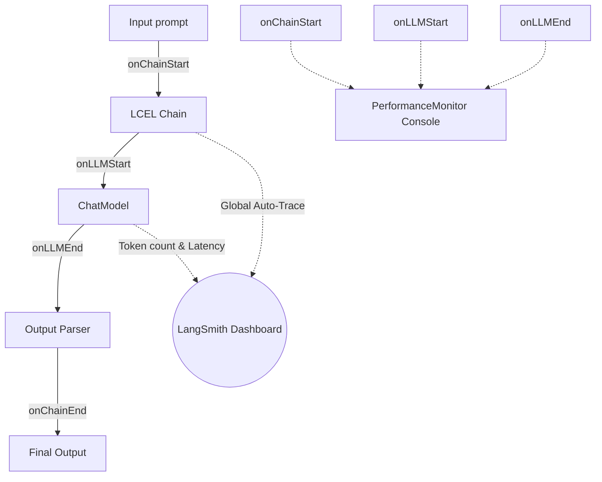

# Chapter 18: LangChain Callbacks and LangSmith

**Estimated Reading Time**: 20 minutes  
**Difficulty**: Intermediate to Advanced  
**Prerequisites**: Chapters 1–17.  
**Learning Objectives**:
1. Implement custom LangChain lifecycle Callback Handlers.
2. Track model token consumption and execution latency programmatically.
3. Configure LangSmith tracing in Node.js processes.
4. Tracing dynamic LCEL pipeline runs.

---

## Introduction

When building complex AI applications, debugging becomes difficult. When a chain fails, it can be hard to know which prompt variable was incorrect, which tool failed, or why the model returned incorrect text.

**LangChain Callbacks** allow you to hook into any lifecycle event in your execution pipeline. **LangSmith** is a hosted platform that automatically visualizes and logs these callback traces in a clean dashboard.

In this chapter, we write a custom performance callback handler and configure LangSmith tracing in TypeScript.

---

## Theory: Lifecycle Events and Cloud Tracing

### 1. The Callback Lifecycle
Every component in LangChain (prompts, models, chains, agents) implements callback hooks. You can intercept these events by writing a class that extends `BaseCallbackHandler`:
* `onLLMStart`: Triggered when the model starts generating text.
* `onLLMEnd`: Triggered when the model finishes generation.
* `onChainStart` / `onChainEnd`: Triggered at the beginning and end of a pipeline.
* `onToolStart` / `onToolEnd`: Triggered when a tool runs.

### 2. LangSmith Tracing
LangSmith captures these callback events globally. By setting environment variables in your Node process, LangChain will automatically trace prompt variables, model configurations, latency, token costs, and tool outputs, sending them to your LangSmith dashboard.

```text
Node.js API Run ──> [Callback Interceptor] ──> LangSmith Cloud Dashboard
                                                      ├──> Token Counts
                                                      ├──> Latency Graphs
                                                      └──> Error Logs
```

---

## Real-World Analogy: Server Metrics Loggers

Think of callbacks and LangSmith as **Express request loggers (like Morgan or Datadog)**:
* **Callbacks = Console Log Middleware**: You write a local middleware in Express that prints `[Request Started]` and `[Request Finished]` to your terminal.
* **LangSmith = Datadog / APM**: You install a cloud monitoring agent that automatically sends all request logs, database latency, and execution errors to a cloud dashboard.

---

## Architecture Diagram: Callback Tracing Flow

This diagram shows how lifecycle events are triggered during an LCEL chain execution and logged to both console and LangSmith.



---

## Code Example: Performance Monitor Callback (TypeScript)

Let's build a custom callback handler in TypeScript that measures the execution latency of LLM completion runs.

Create `langchain_callbacks.ts`:

```typescript
import { ChatOpenAI } from "@langchain/openai";
import { ChatPromptTemplate } from "@langchain/core/prompts";
import { StringOutputParser } from "@langchain/core/output_parsers";
import { BaseCallbackHandler } from "@langchain/core/callbacks";
import dotenv from "dotenv";

dotenv.config();

// 1. Build a Custom Performance Callback Handler
class LatencyMonitor extends BaseCallbackHandler {
  name = "LatencyMonitor";
  private startTime: number = 0;

  // Triggered when the LLM starts execution
  onLLMStart(runId: string) {
    this.startTime = Date.now();
    console.log(`[Callback Alert] LLM call initiated. Run ID: ${runId}`);
  }

  // Triggered when the LLM completes execution
  onLLMEnd(runId: string, output: any) {
    const elapsed = (Date.now() - this.startTime) / 1000;
    console.log(`[Callback Alert] LLM call complete. Latency: ${elapsed.toFixed(2)}s`);
    
    // Log token usage if returned by the provider
    const tokenUsage = output.llmOutput?.tokenUsage;
    if (tokenUsage) {
      console.log(`[Callback Alert] Tokens - Prompt: ${tokenUsage.promptTokens} | Completion: ${tokenUsage.completionTokens}`);
    }
  }

  // Triggered if an error occurs inside a chain component
  onChainError(err: Error) {
    console.error(`[Callback Alert] Chain execution failed: ${err.message}`);
  }
}

async function runCallbackPipeline() {
  // 2. Initialize the model with callbacks attached
  const model = new ChatOpenAI({
    modelName: "gpt-4o-mini",
    temperature: 0.2,
    callbacks: [new LatencyMonitor()] // Register custom handler
  });

  const prompt = ChatPromptTemplate.fromMessages([
    ["system", "You are an assistant. Keep responses under 1 sentence."],
    ["human", "Explain the concept of: {topic}"]
  ]);

  const chain = prompt.pipe(model).pipe(new StringOutputParser());

  console.log("Invoking LCEL chain...");
  try {
    const response = await chain.invoke({ topic: "Callbacks in Node.js" });
    console.log(`\nResponse: "${response}"`);
  } catch (error: any) {
    console.error("Pipeline failed:", error.message);
  }
}

// Run
runCallbackPipeline();
```

Run this file:
```bash
npx tsx langchain_callbacks.ts
```

---

## Best Practices, Production & Security Considerations

### 1. Enable Global LangSmith Tracing in Production
To trace requests in production, you don't need to modify your code. Simply add these environment variables to your deployment environment:
```env
LANGCHAIN_TRACING_V2=true
LANGCHAIN_API_KEY=your_langsmith_api_key
LANGCHAIN_PROJECT=vortex-production
```
LangChain will automatically trace all pipeline runs.

---

## Common Mistakes

1. **Hardcoding LangSmith API Keys**: Hardcoding keys into codebase variables instead of loading them securely via environment variables.

---

## Exercises & Mini Project

### Exercise 1: Tool Callback monitor
Extend the `LatencyMonitor` class to intercept tool execution events by implementing `onToolStart` and `onToolEnd` methods.

### Mini Project: Express Logging API
Write an Express server that uses your custom callback handler to log API prompt latency directly to a local file `latency_logs.txt`.

---

## Interview Questions

1. **Q**: What are Callback Handlers in LangChain?
   * **A**: Callback handlers are classes that implement lifecycle hooks (`onLLMStart`, `onLLMEnd`, etc.) to intercept, monitor, log, and debug pipeline executions in real time.
2. **Q**: How do you configure LangSmith tracing in an application?
   * **A**: You set the environment variables `LANGCHAIN_TRACING_V2=true` and `LANGCHAIN_API_KEY=your_key`. LangChain Core will then automatically intercept pipeline execution events and log them to your LangSmith dashboard.

---

## Navigation

**Prev:** [Chapter 17: Retrievers and Tools](./17_LangChain_Retrievers_and_Tools.md) | **Index:** [Course Overview](./00_Index.md) | **Next:** [Chapter 19: Nodes and Edges](./19_LangGraph_Core_Nodes_and_Edges.md)
