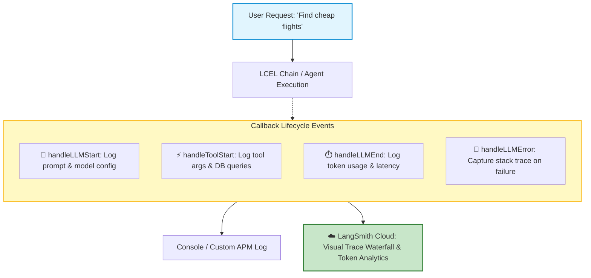
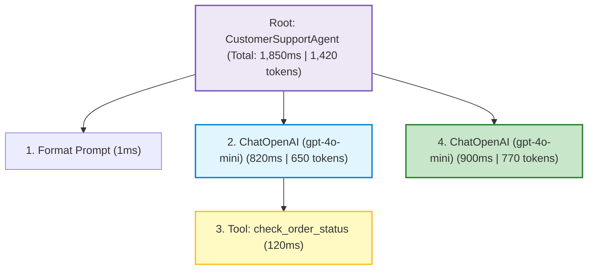

# 🤖 LangChain.js: Callbacks, Observability, and LangSmith

## 📌 Overview

When you build complex AI applications with multiple prompts, tools, vector searches, and agent loops, debugging becomes difficult. 

If your AI gives a weird answer or takes 8 seconds to respond:
- *Which specific tool failed?*
- *What exact prompt was sent to OpenAI?*
- *How many tokens were consumed across each sub-step?*
- *Where is the latency bottleneck?*

To solve this "black box" problem, LangChain provides **Callbacks** and **LangSmith**. 

Callbacks allow you to hook into every lifecycle event in your code (when an LLM starts, when a tool runs, when an error occurs), while **LangSmith** provides a visual dashboard showing full execution traces, latency waterfalls, and token costs!



---

## 🎯 Why This Matters

1. **Zero-Guesswork Debugging**: Inspect the exact string sent to the model and the exact raw tokens returned, eliminating guesswork.
2. **Cost & Latency Tracking**: Identify which specific prompt or tool is draining your API budget or causing slow response times.
3. **One-Line Production Tracing**: Simply setting environment variables enables full production observability in LangSmith without modifying a single line of application code!

---

## 🧠 Prerequisites

- [14_LangChain_Introduction_and_LCEL.md](./14_LangChain_Introduction_and_LCEL.md): LCEL pipelines and Runnables.
- [17_LangChain_Retrievers_and_Tools.md](./17_LangChain_Retrievers_and_Tools.md): Tools and retrievers.

---

## 🔍 Deep Dive

### 1. The Callback Lifecycle Methods

You can create a custom handler by extending `BaseCallbackHandler` and overriding specific hook methods:

| Callback Method | When It Triggers | Useful Data Provided |
|---|---|---|
| `handleLLMStart` | Right before the request is sent to the AI model | Serialized model, raw prompt strings |
| `handleLLMEnd` | When the model finishes generating tokens | Output text, token usage stats, total latency |
| `handleLLMError` | If the AI API throws a 429, 500, or timeout error | Error object, stack trace |
| `handleToolStart` | When an agent begins executing a tool | Tool name, input arguments |
| `handleToolEnd` | When the tool returns its result | Tool output string / JSON |

---

### 2. LangSmith: The Visual Tracing Platform

LangSmith is the industry standard APM (Application Performance Monitoring) for AI. It visualizes your execution graph as an interactive waterfall tree:



---

### 3. Enabling LangSmith with Environment Variables

You do NOT need to rewrite your chains. Simply set these 3 environment variables in your `.env` file:

```bash
# Enable LangSmith V2 Tracing
LANGCHAIN_TRACING_V2=true
LANGCHAIN_API_KEY=lsv2_pt_your_api_key_here
LANGCHAIN_PROJECT=production-mern-ai-agent
```

Every single `.invoke()`, `.stream()`, or agent run will automatically upload its trace tree to your LangSmith dashboard!

---

## 💡 Simple Example: The Flight Black Box

Think of Callbacks like an **Airplane Flight Data Recorder (Black Box)**:
- During normal flight, it silently records speed, altitude, and cockpit conversations.
- If an issue occurs, engineers open the black box and inspect the second-by-second timeline of events to diagnose what happened.

---

## 🏗️ Real-World Example: Real-Time Token Budget Alert

In a production SaaS app:
- We write a custom Callback handler `TokenCounterCallback`.
- Every time `handleLLMEnd` fires, we add the tokens used to the customer's monthly usage in MongoDB.
- If a customer exceeds their 50,000 token plan, the callback emits an event to notify the billing system and downgrade their tier gracefully.

---

## ⚠️ Common Mistakes & Pitfalls

1. ❌ **Passing Callbacks to the Constructor vs. `.invoke()`**:
   - *Constructor level*: Attaches callback to all runs of that model (`new ChatOpenAI({ callbacks: [handler] })`).
   - *Invoke level*: Attaches callback to a single request only (`chain.invoke(input, { callbacks: [handler] })`).
   - *Best Practice*: Pass user-specific callbacks at the `.invoke()` level to preserve request-scoped metadata.

---

## 🔥 Important Points to Remember

- **Callbacks** hook into start, end, and error events of models and tools.
- Extend `BaseCallbackHandler` to build custom logging, token accounting, or telemetry.
- **LangSmith** provides visual execution tracing, latency breakdown, and debugging.
- Enable LangSmith instantly using `LANGCHAIN_TRACING_V2=true`.

---

## 💻 Code / Commands / Configuration

Here is a TypeScript script demonstrating how to write a custom Callback Handler that logs token usage and latency:

```typescript
// custom_callbacks_demo.ts
// 1. Run: npm install @langchain/core @langchain/openai dotenv
// 2. Run: npx ts-node custom_callbacks_demo.ts

import { BaseCallbackHandler } from "@langchain/core/callbacks/base";
import { LLMResult } from "@langchain/core/outputs";
import { ChatOpenAI } from "@langchain/openai";
import { ChatPromptTemplate } from "@langchain/core/prompts";
import { StringOutputParser } from "@langchain/core/output_parsers";
import * as dotenv from "dotenv";

dotenv.config();

// 1. Custom Callback Handler for Latency & Token Logging
class MetricLoggingCallback extends BaseCallbackHandler {
  name = "MetricLoggingCallback";
  private startTime: number = 0;

  // Triggered right before the request is sent to the LLM
  async handleLLMStart(llm: any, prompts: string[]) {
    this.startTime = Date.now();
    console.log("⏱️ [Callback] LLM Request Started...");
  }

  // Triggered when the LLM finishes generating
  async handleLLMEnd(output: LLMResult) {
    const elapsed = Date.now() - this.startTime;
    const tokenUsage = output.llmOutput?.tokenUsage;

    console.log(`✅ [Callback] LLM Finished in ${elapsed}ms!`);
    if (tokenUsage) {
      console.log(`📊 [Token Metrics] Prompt: ${tokenUsage.promptTokens} | Completion: ${tokenUsage.completionTokens} | Total: ${tokenUsage.totalTokens}`);
    }
  }

  // Triggered if an error occurs
  async handleLLMError(err: Error) {
    console.error("❌ [Callback Error Alert]:", err.message);
  }
}

async function runDemo() {
  const customHandler = new MetricLoggingCallback();

  const model = new ChatOpenAI({
    modelName: "gpt-4o-mini",
    temperature: 0.5,
  });

  const prompt = ChatPromptTemplate.fromMessages([
    ["system", "You are a concise tech dictionary."],
    ["user", "Define {term} in 1 sentence."],
  ]);

  const chain = prompt.pipe(model).pipe(new StringOutputParser());

  console.log("🚀 Executing Chain with Custom Callback...\n");

  // Pass custom callback at runtime via config
  const response = await chain.invoke(
    { term: "WebSockets" },
    { callbacks: [customHandler] }
  );

  console.log(`\n🤖 Response: "${response}"`);
}

runDemo();
```

---

## 🎤 Interview Perspective

* **Q: How do you implement distributed tracing and observability in an enterprise LLM pipeline?**
  * **Answer**: We utilize LangChain's callback architecture integrated with LangSmith or OpenTelemetry. Lifecycle hooks (`handleLLMStart`, `handleToolStart`, `handleLLMEnd`) capture inputs, outputs, error states, latencies, and token consumption metrics at each node in the execution graph, streaming trace spans asynchronously to our central observability dashboard.
* **Q: What is the overhead of enabling LangSmith tracing in production?**
  * **Answer**: LangSmith client SDKs log and export trace events asynchronously in background threads/microtasks using non-blocking I/O. The runtime latency overhead on user requests is negligible (< 2ms), while preserving complete auditability.

---

## 🧩 Connection With Previous Concepts

- **Previous Lesson ([17_LangChain_Retrievers_and_Tools.md](./17_LangChain_Retrievers_and_Tools.md))**: Covered retrievers and custom tools.
- **Next Lesson ([19_LangGraph_Core_Nodes_and_Edges.md](./19_LangGraph_Core_Nodes_and_Edges.md))**: We step into the advanced world of **LangGraph.js** to build stateful, cyclical multi-agent graphs!

---

Previous : [17_LangChain_Retrievers_and_Tools.md](./17_LangChain_Retrievers_and_Tools.md) | Index: [00_Index.md](./00_Index.md) | Next: [19_LangGraph_Core_Nodes_and_Edges.md](./19_LangGraph_Core_Nodes_and_Edges.md)
