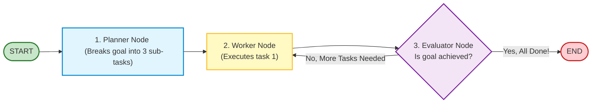
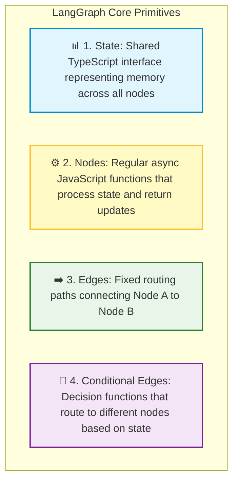
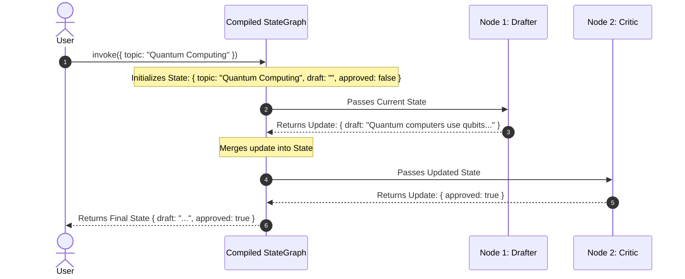

# 🤖 LangGraph.js: Core Nodes, Edges, and State

## 📌 Overview

Up to now, our LCEL chains have been **one-way streets** (Linear Pipelines: Input $\to$ Prompt $\to$ Model $\to$ Output).

While linear chains are fine for simple Q&A, **true AI Agents do not work in a straight line**. 
An agent needs to:
- Loop in cycles until a task is done,
- Make dynamic branching decisions (*"Should I search the web or reply directly?"*),
- Maintain and update shared memory state across multiple steps.

To solve this, LangChain created **LangGraph.js**. 

LangGraph allows you to model agent workflows as **State Machines and Cyclic Graphs**. You define a shared **State**, create **Nodes** (worker functions), and connect them with **Edges** (routing paths)!



---

## 🎯 Why This Matters

1. **Unlocks True Loops and Cycles**: Unlike LCEL, LangGraph allows your agent to loop back and retry if an API call fails or if code generation produced a syntax error.
2. **Predictable State Management**: Every step in the graph reads from and writes to a strictly typed, immutable **State** object (like Redux for AI).
3. **Foundation for Advanced Agentic Architectures**: LangGraph is the underlying engine for Multi-Agent swarms, Human-in-the-Loop approval gates, and long-running workflows.

---

## 🧠 Prerequisites

- [14_LangChain_Introduction_and_LCEL.md](./14_LangChain_Introduction_and_LCEL.md): LCEL pipelines and the Runnable interface.
- Basic understanding of JavaScript Objects and State Machines.

---

## 🔍 Deep Dive

### 1. The 4 Fundamental Building Blocks of LangGraph



---

### 2. The Lifecycle of a LangGraph Execution



---

### 3. Special Graph Constants: `START` and `END`

LangGraph provides built-in constants to define where execution begins and terminates:
- **`START`**: The entry point where user input is received.
- **`END`**: The terminal point where the graph halts and returns the final state to the caller.

```typescript
workflow.addEdge(START, "drafter");
workflow.addEdge("drafter", "critic");
workflow.addEdge("critic", END);
```

---

## 💡 Simple Example: The Essay Writing Pipeline

Think of LangGraph like a **Publishing House**:
1. **The State**: The physical folder holding the essay, notes, and approval stamps.
2. **Node 1 (Writer)**: Takes the folder, writes a draft, and puts it in the folder.
3. **Node 2 (Editor)**: Reads the draft, adds editorial feedback.
4. **Node 3 (Proofreader)**: Checks grammar, stamps approval, and sends to print (`END`).

---

## 🏗️ Real-World Example: Automated Code Generator with Self-Correction

In an automated coding agent:
- **Node 1 (Coder)**: Generates TypeScript code for a requested function.
- **Node 2 (Linter/Tester)**: Runs `tsc` and automated unit tests.
- **Conditional Edge**:
  - If tests pass $\to$ route to `END`.
  - If tests fail $\to$ route back to `Coder` with error logs to retry! (Cyclic Loop).

---

## ⚠️ Common Mistakes & Pitfalls

1. ❌ **Mutating State In-Place Directly**:
   - *Trap*: `state.messages.push(newMsg)` (breaks state tracking and time-travel).
   - *Fix*: Always return a partial state update object: `return { messages: [newMsg] };`.
2. ❌ **Creating Infinite Loops without Max Steps**:
   - *Trap*: If a cyclic agent keeps failing, it can loop forever.
   - *Fix*: Always add a `recursionLimit` (e.g. `recursionLimit: 15`) in the invocation config.

---

## 🔥 Important Points to Remember

- **LangGraph** enables cyclic graphs, loops, and complex state machines.
- **State**: The single source of truth across all nodes.
- **Nodes**: Standard async TypeScript functions.
- **Edges**: Direct connections (`addEdge`) or conditional routing (`addConditionalEdges`).
- Call `.compile()` to produce a runnable agent graph.

---

## 💻 Code / Commands / Configuration

Here is a complete, beginner-friendly TypeScript script building a basic 2-step **StateGraph** with LangGraph:

```typescript
// langgraph_basics_demo.ts
// 1. Run: npm install @langchain/langgraph @langchain/core @langchain/openai dotenv
// 2. Run: npx ts-node langgraph_basics_demo.ts

import { StateGraph, START, END, Annotation } from "@langchain/langgraph";
import { ChatOpenAI } from "@langchain/openai";
import * as dotenv from "dotenv";

dotenv.config();

// 1. Define the Shared State Schema using Annotation
const AgentState = Annotation.Root({
  topic: Annotation<string>(),
  draft: Annotation<string>(),
  critique: Annotation<string>(),
});

// 2. Initialize Model
const model = new ChatOpenAI({ modelName: "gpt-4o-mini", temperature: 0.7 });

// 3. Define Node 1: The Drafter
async function draftNode(state: typeof AgentState.State) {
  console.log("✍️ [Node 1: Drafter] Generating draft on:", state.topic);
  const response = await model.invoke(
    `Write a 2-sentence educational summary on the topic: ${state.topic}`
  );
  // Return partial update to merge into state
  return { draft: response.content as string };
}

// 4. Define Node 2: The Critic / Polisher
async function critiqueNode(state: typeof AgentState.State) {
  console.log("🧐 [Node 2: Critic] Polishing draft...");
  const response = await model.invoke(
    `Improve this summary to make it punchy and engaging: "${state.draft}"`
  );
  return { critique: response.content as string };
}

// 5. Build and Compile the StateGraph
async function runGraphDemo() {
  const workflow = new StateGraph(AgentState)
    .addNode("drafter", draftNode)
    .addNode("critic", critiqueNode)
    .addEdge(START, "drafter")
    .addEdge("drafter", "critic")
    .addEdge("critic", END);

  const app = workflow.compile();

  console.log("🚀 Running LangGraph Execution:\n");
  const finalResult = await app.invoke({ topic: "Server-Sent Events" });

  console.log("\n🏁 Final Graph State Result:");
  console.log("Original Draft:\n", finalResult.draft);
  console.log("\nPolished Critique:\n", finalResult.critique);
}

runGraphDemo();
```

---

## 🎤 Interview Perspective

* **Q: Why was LangGraph created if LangChain LCEL already existed?**
  * **Answer**: LCEL is designed strictly for Directed Acyclic Graphs (DAGs) where execution flows in a single forward pass. Real agentic systems require stateful loops, conditional branching, cyclical reflection, and human-in-the-loop pauses. LangGraph models workflows as generalized state machines with first-class support for cycles, checkpointing, and multi-agent coordination.
* **Q: How does state immutability benefit LangGraph applications?**
  * **Answer**: By returning partial delta updates rather than mutating state directly in-place, LangGraph enables reliable state persistence, time-travel debugging, audit logging, and deterministic replay of agent steps.

---

## 🧩 Connection With Previous Concepts

- **Previous Lesson ([18_LangChain_Callbacks_and_LangSmith.md](./18_LangChain_Callbacks_and_LangSmith.md))**: Covered tracing and debugging.
- **Next Lesson ([20_LangGraph_Reducers_and_Routing.md](./20_LangGraph_Reducers_and_Routing.md))**: We will learn how to use **State Reducers** (message appending) and **Conditional Routing** to build dynamic decision trees!

---

Previous : [18_LangChain_Callbacks_and_LangSmith.md](./18_LangChain_Callbacks_and_LangSmith.md) | Index: [00_Index.md](./00_Index.md) | Next: [20_LangGraph_Reducers_and_Routing.md](./20_LangGraph_Reducers_and_Routing.md)
