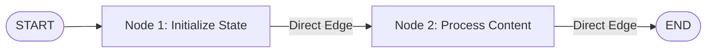

# Chapter 19: LangGraph Nodes and Edges

**Estimated Reading Time**: 20 minutes  
**Difficulty**: Intermediate to Advanced  
**Prerequisites**: Chapters 1–18.  
**Learning Objectives**:
1. Understand graph-based state-machine architectures for AI.
2. Define Graph States using LangGraph Annotations.
3. Write Node actions modifying state parameters.
4. Compose and compile workflows using the `StateGraph` builder.

---

## Introduction

Linear chains (like LCEL) are great for simple pipelines (Prompt $\to$ Model $\to$ Output). However, real-world tasks are rarely linear. If an agent tries to write code, it needs to run tests, examine errors, modify the code, and try again. This requires loops, cycles, and state persistence.

**LangGraph JS** is a framework for building stateful, multi-actor applications with LLMs. It models agent architectures as **State Graphs**.

In this chapter, we explore the core components of LangGraph—States, Nodes, and Edges—and build a basic stateful graph in TypeScript.

---

## Theory: State-Machine Architectures

A state graph is composed of three core concepts:
* **State**: A schema representing the data structure of your application. Every node in the graph reads from and writes to this state.
* **Nodes**: JavaScript functions that take the current state, perform operations (like calling an LLM or running a tool), and return an updated state object.
* **Edges**: Define the connections between nodes. Direct edges move from Node A directly to Node B.

```text
  [START] ──> Node A (Init) ──> Node B (Process) ──> [END]
```

### State-Driven Decisions
In a state graph, nodes do not call other nodes directly. Instead, nodes modify the global state. The graph executor checks the state and uses edges to route to the next node. This makes agent workflows modular and easy to debug.

---

## Real-World Analogy: The Assembly Line

Think of a state graph as a **factory assembly line**:
* **State is the Conveyor Belt**: It carries the product. As it moves, the product collects features (data).
* **Nodes are Factory Workers**: Worker 1 fits the chassis. Worker 2 mounts the engine. Worker 3 paints the car. Each worker reads the car's status from the belt, does their job, and puts the updated car back on the belt.
* **Edges are the Tracks**: They guide the conveyor belt from one worker to the next.

---

## Architecture Diagram: LangGraph Core Structure

This diagram shows how data moves from the entry point, through state nodes, and exits at the end point.



---

## Code Example: Greeting State Graph (TypeScript)

Let's build a basic state graph in TypeScript that initializes a user's profile state and adds a custom greeting message.

First, install the LangGraph package:
```bash
npm install @langchain/langgraph @langchain/core dotenv
```

Create `langgraph_basics.ts`:

```typescript
import { Annotation, StateGraph, START, END } from "@langchain/langgraph";

// 1. Define the Graph State Schema using Annotation
const GraphState = Annotation.Root({
  userName: Annotation<string>({
    reducer: (x, y) => y ?? x,
    default: () => "guest",
  }),
  greeting: Annotation<string>({
    reducer: (x, y) => y ?? x,
    default: () => "",
  })
});

// 2. Define the Nodes (State-modifying functions)

// Node A: Initialize user profile data
async function initializeUserNode(state: typeof GraphState.State) {
  console.log("[Node] Initializing user node...");
  return {
    userName: state.userName.toUpperCase() // Convert user name to uppercase
  };
}

// Node B: Generate greeting message
async function generateGreetingNode(state: typeof GraphState.State) {
  console.log("[Node] Generating greeting node...");
  return {
    greeting: `Welcome, ${state.userName}! Vortex system is online.`
  };
}

// 3. Compose the State Graph
const workflow = new StateGraph(GraphState)
  .addNode("initUser", initializeUserNode)
  .addNode("generateGreeting", generateGreetingNode)
  
  // Define edges
  .addEdge(START, "initUser") // Entry point
  .addEdge("initUser", "generateGreeting") // Transition edge
  .addEdge("generateGreeting", END); // Exit point

// 4. Compile the Graph
const app = workflow.compile();

// 5. Run the Graph
async function runGraph() {
  console.log("Invoking state graph...");
  const result = await app.invoke({ userName: "John Doe" });
  
  console.log("\n--- Graph Execution Result ---");
  console.log("State userName:", result.userName);
  console.log("State greeting:", result.greeting);
}

runGraph();
```

Run this file:
```bash
npx tsx langgraph_basics.ts
```

---

## Best Practices, Production & Security Considerations

### 1. Nodes Must Be Pure Functions
Always design node functions to be side-effect free. They should not modify the input state object directly. Instead, they must **return** a new partial state object. LangGraph will automatically merge the returned properties into the global state.

---

## Common Mistakes

1. **Mutating State directly**: Writing code like `state.userName = "Bob"` inside a node, which bypasses the reducer merges and causes tracking errors.

---

## Exercises & Mini Project

### Exercise 1: State counter addition
Add a state field `executionCount` with a reducer that increments the count by `1` every time a node is run.

### Mini Project: Code Review Graph
Build a graph with two nodes: `CodeReader` (reads a file) and `Formatter` (replaces triple spaces with double spaces). Route the document through both nodes and write the output back to disk.

---

## Interview Questions

1. **Q**: What is the role of the State in LangGraph?
   * **A**: The state acts as the single source of truth for the application. Every node reads the state, performs operations, and returns updates that are merged back into the state.
2. **Q**: How do nodes communicate with each other in LangGraph?
   * **A**: Nodes do not call each other directly. They communicate by modifying the shared global state. The graph executor checks the state and uses edges to determine the next node to run.

---

## Navigation

**Prev:** [Chapter 18: Callbacks and LangSmith](./18_LangChain_Callbacks_and_LangSmith.md) | **Index:** [Course Overview](./00_Index.md) | **Next:** [Chapter 20: Reducers and Routing](./20_LangGraph_Reducers_and_Routing.md)
