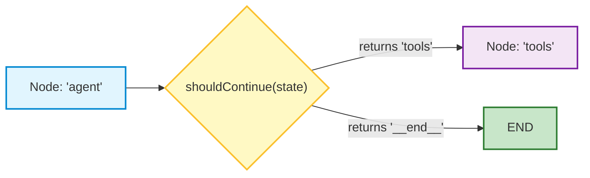

# 🤖 LangGraph.js: Reducers and Conditional Routing

## 📌 Overview

In the previous chapter, our graph followed a fixed, straight path from Node 1 to Node 2.

In real life, an AI agent must make **smart dynamic decisions**:
- *"Did the user ask a question I can answer directly, or do I need to call a tool?"*
- *"If the database query returned an error, should I retry or tell the user?"*

To build dynamic decision-making agents, LangGraph provides two essential tools:
1. **Reducers**: Functions that define how new data is merged into state (for example, appending new chat messages to an array instead of overwriting the previous message).
2. **Conditional Routing (`addConditionalEdges`)**: A traffic cop function that inspects the state and routes execution to different nodes!

```mermaid
flowchart TD
    START([START]) --> AgentNode["1. Agent Node <br> (LLM decides next step)"]
    AgentNode --> Decision{"Router: Does LLM want to call a tool?"}
    
    Decision -->|Yes, tool_calls present| ToolNode["2. Tool Node <br> (Executes backend API / SQL query)"]
    ToolNode -->|Feed tool output back (Cycle)| AgentNode
    
    Decision -->|No, Final answer ready| END([END])

    style START fill:#c8e6c9,stroke:#2e7d32,stroke-width:2px
    style AgentNode fill:#e1f5fe,stroke:#0288d1,stroke-width:2px
    style Decision fill:#fff9c4,stroke:#fbc02d,stroke-width:2px
    style ToolNode fill:#f3e5f5,stroke:#7b1fa2,stroke-width:2px
    style END fill:#ffcdd2,stroke:#c62828,stroke-width:2px
```

---

## 🎯 Why This Matters

1. **Powers the Autonomous ReAct Loop**: Allows the agent to call tools as many times as needed (e.g. check balance $\to$ process refund $\to$ send confirmation email) before returning the final response.
2. **Seamless Chat History Accumulation**: Reducers ensure that every new human message, tool result, and AI reply is cleanly appended to the conversation history array.
3. **Branching Workflows**: Route customer support queries to specialized sub-agents based on category (`BILLING`, `TECH_SUPPORT`, `SALES`).

---

## 🧠 Prerequisites

- [07_Function_Calling_and_Structured_Outputs.md](./07_Function_Calling_and_Structured_Outputs.md): Tool calling mechanics.
- [19_LangGraph_Core_Nodes_and_Edges.md](./19_LangGraph_Core_Nodes_and_Edges.md): StateGraph fundamentals.

---

## 🔍 Deep Dive

### 1. What is a State Reducer?

By default, when a node returns `{ temperature: 75 }`, LangGraph **overwrites** the old value of `temperature`.

However, for arrays (like `messages`), you don't want to overwrite history—you want to **append** new messages! A **Reducer** specifies how new updates combine with existing state:

```typescript
// Appends incoming messages to the existing array
const AgentState = Annotation.Root({
  messages: Annotation<BaseMessage[]>({
    reducer: (current, update) => current.concat(update),
    default: () => [],
  }),
});
```

---

### 2. How Conditional Routing Works (`addConditionalEdges`)

A conditional edge takes 3 arguments:
1. **Source Node**: The node that just finished running (e.g. `"agent"`).
2. **Routing Function**: A pure TypeScript function that inspects the state and returns a string key (e.g. `"continue"` or `"end"`).
3. **Route Map**: An object mapping return keys to destination node names (e.g. `{ continue: "tools", end: END }`).



---

## 💡 Simple Example: The Fork in the Road

Think of conditional routing like a **GPS Navigation App**:
- You arrive at an intersection (**Agent Node**).
- The GPS checks live traffic (**Routing Function**):
  - If highway is clear $\to$ take highway route (**Tool Node**).
  - If destination reached $\to$ stop trip (**END**).

---

## 🏗️ Real-World Example: Customer Support Classifier Router

In a multi-department enterprise bot:
- **Router Node**: Classifies user query intent.
- **Conditional Edge**:
  - `INTENT === 'BILLING'` $\to$ routes to `BillingAgentNode`.
  - `INTENT === 'TECH_SUPPORT'` $\to$ routes to `TechSupportAgentNode`.
  - `INTENT === 'CHITCHAT'` $\to$ routes directly to `GeneralChatNode`.

---

## ⚠️ Common Mistakes & Pitfalls

1. ❌ **Forgetting the Reducer for Message Arrays**:
   - *Trap*: If you omit the reducer, each node that returns a message will overwrite all previous chat history, leaving only the single newest message!
2. ❌ **Routing Function Hanging on Edge Cases**:
   - *Fix*: Always have a reliable fallback return value (like `END`) if unexpected state occurs.

---

## 🔥 Important Points to Remember

- **Reducers** define how partial updates are merged into state (e.g. array concatenation).
- `addConditionalEdges` routes execution dynamically based on runtime state.
- The **ReAct loop** cycles between the Agent Node and the Tool Node until no more tools are needed.
- `END` terminates the graph execution cleanly.

---

## 💻 Code / Commands / Configuration

Here is a complete, working TypeScript script implementing a **Full ReAct Agent Graph** with conditional tool routing:

```typescript
// langgraph_react_agent.ts
// 1. Run: npm install @langchain/langgraph @langchain/core @langchain/openai zod dotenv
// 2. Run: npx ts-node langgraph_react_agent.ts

import { StateGraph, START, END, Annotation } from "@langchain/langgraph";
import { ChatOpenAI } from "@langchain/openai";
import { HumanMessage, AIMessage, ToolMessage, BaseMessage } from "@langchain/core/messages";
import { DynamicStructuredTool } from "@langchain/core/tools";
import { z } from "zod";
import * as dotenv from "dotenv";

dotenv.config();

// 1. Define State Schema with Reducer for Message History
const MessagesState = Annotation.Root({
  messages: Annotation<BaseMessage[]>({
    reducer: (current, update) => current.concat(update),
    default: () => [],
  }),
});

// 2. Define Custom Tool
const stockPriceTool = new DynamicStructuredTool({
  name: "get_stock_price",
  description: "Get real-time stock ticker price",
  schema: z.object({ ticker: z.string().describe("Stock ticker (e.g. AAPL, TSLA)") }),
  func: async ({ ticker }) => {
    const prices: Record<string, string> = { "AAPL": "$225.50", "TSLA": "$210.00" };
    return prices[ticker.toUpperCase()] || "Ticker not found";
  },
});

const tools = [stockPriceTool];
const toolMap = { [stockPriceTool.name]: stockPriceTool };

// 3. Initialize Model with Tool Bindings
const model = new ChatOpenAI({ modelName: "gpt-4o-mini", temperature: 0.0 }).bindTools(tools);

// 4. Agent Node (Calls LLM)
async function callModel(state: typeof MessagesState.State) {
  console.log("🧠 [Agent Node] Consulting LLM...");
  const response = await model.invoke(state.messages);
  return { messages: [response] };
}

// 5. Tool Node (Executes Tool Calls)
async function callTool(state: typeof MessagesState.State) {
  const lastMessage = state.messages[state.messages.length - 1] as AIMessage;
  const toolCalls = lastMessage.tool_calls || [];
  const toolResults: BaseMessage[] = [];

  for (const call of toolCalls) {
    console.log(`⚡ [Tool Node] Executing: ${call.name} with args:`, call.args);
    const selectedTool = toolMap[call.name];
    const output = await selectedTool.invoke(call.args);
    toolResults.push(new ToolMessage({ tool_call_id: call.id!, content: output }));
  }

  return { messages: toolResults };
}

// 6. Routing Function (Traffic Cop)
function shouldContinue(state: typeof MessagesState.State) {
  const lastMessage = state.messages[state.messages.length - 1] as AIMessage;
  if (lastMessage.tool_calls && lastMessage.tool_calls.length > 0) {
    return "tools"; // Route to Tool Node!
  }
  return "__end__"; // Route to END!
}

// 7. Assemble the Graph
async function main() {
  const workflow = new StateGraph(MessagesState)
    .addNode("agent", callModel)
    .addNode("tools", callTool)
    .addEdge(START, "agent")
    .addConditionalEdges("agent", shouldContinue, {
      tools: "tools",
      __end__: END,
    })
    .addEdge("tools", "agent"); // Loop back to agent after tool execution!

  const app = workflow.compile();

  console.log("🚀 Invoking ReAct Agent Graph...\n");
  const result = await app.invoke({
    messages: [new HumanMessage("What is the current stock price of Apple (AAPL)?")],
  });

  const finalMessage = result.messages[result.messages.length - 1];
  console.log("\n🏁 Final Agent Response:\n", finalMessage.content);
}

main();
```

---

## 🎤 Interview Perspective

* **Q: How does LangGraph handle message array updates differently from primitive state updates?**
  * **Answer**: Primitive state fields use a replacement strategy by default where the new value overwrites the previous value. For message history, LangGraph uses custom Annotation reducers (e.g. `(current, update) => current.concat(update)`) to append newly generated human, AI, and tool messages to the conversation array, preserving full conversational context.
* **Q: How does LangGraph prevent infinite recursion in cyclic graphs?**
  * **Answer**: LangGraph enforces a runtime configurable `recursionLimit` parameter (defaulting to 25 steps). If a cyclical graph does not reach an `END` node within the step limit, LangGraph halts execution and throws a `GraphRecursionError`, preventing runaway API billing.

---

## 🧩 Connection With Previous Concepts

- **Previous Lesson ([19_LangGraph_Core_Nodes_and_Edges.md](./19_LangGraph_Core_Nodes_and_Edges.md))**: Covered basic StateGraph nodes and edges.
- **Next Lesson ([21_LangGraph_Human_in_the_Loop.md](./21_LangGraph_Human_in_the_Loop.md))**: We will learn how to pause graph execution and wait for human approval using **Human-in-the-Loop** and **Checkpointers**!

---

Previous : [19_LangGraph_Core_Nodes_and_Edges.md](./19_LangGraph_Core_Nodes_and_Edges.md) | Index: [00_Index.md](./00_Index.md) | Next: [21_LangGraph_Human_in_the_Loop.md](./21_LangGraph_Human_in_the_Loop.md)
