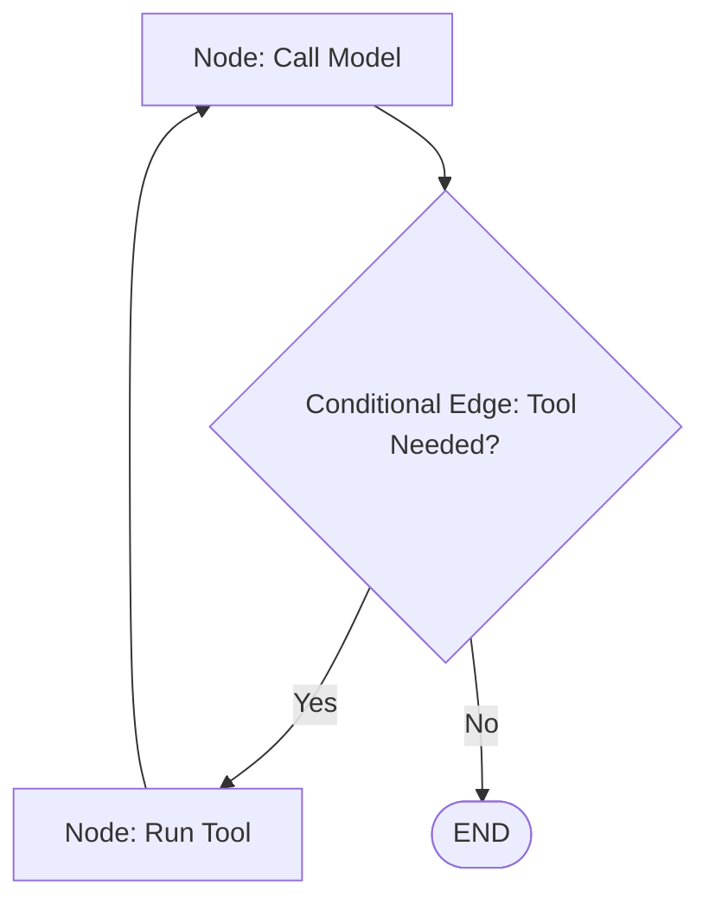

# Chapter 20: LangGraph Reducers and Routing

**Estimated Reading Time**: 25 minutes  
**Difficulty**: Advanced  
**Prerequisites**: Chapters 1–19.  
**Learning Objectives**:
1. Implement Reducers to handle complex state properties.
2. Route graph execution dynamically using Conditional Edges.
3. Manage message lists using LangGraph's pre-built message reducer.
4. Build a state-driven routing agent in TypeScript.

---

## Introduction

In basic graphs, the execution flow is fixed (Node A $\to$ Node B $\to$ END). However, real-world agents must make decisions based on runtime data. If a user asks for weather info, the agent should route to a weather tool. If the user says goodbye, the agent should route to the exit.

Furthermore, we must manage arrays of messages without overwriting them.

In this chapter, we explore how to configure state reducers and implement conditional routing in TypeScript.

---

## Theory: State Merging and Routing Logic

### 1. State Reducers
By default, if a node returns `{ messages: [newMsg] }`, it overwrites the entire messages array in the state. To prevent this, we configure **Reducers**.
A Reducer is a function that defines how new updates are merged into the existing state.
* **Message Reducer**: A prebuilt reducer (`addMessages`) that appends new messages to the existing list instead of replacing it.

### 2. Conditional Edges
Conditional edges allow the graph to route dynamically:
* Instead of mapping a direct connection, you register a routing function.
* The routing function inspects the current state (e.g. checks model output) and returns the name of the next node to run.

```text
  Node A (LLM) ──> [Routing Function] ──> Node B (Tool)
                                      └──> [END] (Response)
```

---

## Real-World Analogy: The Mail Sorting Office

Imagine a mail sorting office:
* **The Letters are Messages (State)**: A stack of letters accumulates in a tray.
* **The In-Tray is the Reducer**: When a mail carrier delivers new letters, they don't throw away the old letters in the tray. They stack the new letters on top (Message Reducer).
* **The Sorting Clerk is the Conditional Edge**: The clerk looks at each letter's zip code and routes it to the correct delivery truck (Routing).

---

## Architecture Diagram: Conditional Routing Loop

This diagram maps out a conditional loop where execution routes to a tool node if needed, or exits if complete.



---

## Code Example: Conditional Tool Router (TypeScript)

Let's build a stateful routing graph in TypeScript that checks if a user query requires database lookup and routes the execution dynamically.

Create `langgraph_routing.ts`:

```typescript
import { Annotation, StateGraph, START, END } from "@langchain/langgraph";
import { BaseMessage, HumanMessage, AIMessage } from "@langchain/core/messages";

// 1. Define the Stateful Schema
const RoutingState = Annotation.Root({
  messages: Annotation<BaseMessage[]>({
    reducer: (x, y) => x.concat(y), // Appends new messages to the list
    default: () => [],
  }),
  hasDatabaseContext: Annotation<boolean>({
    reducer: (x, y) => y ?? x,
    default: () => false,
  })
});

// 2. Define the Nodes

// Node A: Agent classifier (simulated LLM decision)
async function classifierNode(state: typeof RoutingState.State) {
  console.log("[ClassifierNode] Scanning query for DB keywords...");
  const lastMessage = state.messages[state.messages.length - 1];
  const query = lastMessage.content.toString().toLowerCase();

  // If query mentions DB topics, flag state for database routing
  const needsDB = query.includes("database") || query.includes("sql");
  
  return {
    hasDatabaseContext: needsDB,
    messages: [new AIMessage({ content: `Analyzed query. DB context matches: ${needsDB}` })]
  };
}

// Node B: Mock Database Query Executer
async function dbQueryNode(state: typeof RoutingState.State) {
  console.log("[DbQueryNode] Fetching database logs...");
  return {
    messages: [new AIMessage({ content: "Query Result: pg_stat_activity shows 3 active connections." })]
  };
}

// 3. Define the Conditional Routing Function
function determineNextNode(state: typeof RoutingState.State) {
  if (state.hasDatabaseContext) {
    console.log("[Router] Routing query to: dbQueryNode");
    return "queryDB";
  }
  console.log("[Router] Routing query to: END");
  return "exit";
}

// 4. Construct the Graph
const workflow = new StateGraph(RoutingState)
  .addNode("classifier", classifierNode)
  .addNode("queryDB", dbQueryNode)
  
  // Set entry point
  .addEdge(START, "classifier")
  
  // Register the Conditional Edge
  .addConditionalEdges("classifier", determineNextNode, {
    queryDB: "queryDB",
    exit: END
  })
  
  // Connect the DB node to the exit point
  .addEdge("queryDB", END);

// 5. Compile the Graph
const app = workflow.compile();

// 6. Test Runs
async function runDemos() {
  console.log("--- Run 1: Relational SQL Query ---");
  const res1 = await app.invoke({
    messages: [new HumanMessage("Show active SQL processes.")]
  });
  console.log("Final message:", res1.messages[res1.messages.length - 1].content);

  console.log("\n--- Run 2: Basic General Chat Query ---");
  const res2 = await app.invoke({
    messages: [new HumanMessage("Hello, how are you today?")]
  });
  console.log("Final message:", res2.messages[res2.messages.length - 1].content);
}

runDemos();
```

Run this file:
```bash
npx tsx langgraph_routing.ts
```

Observe how the graph dynamically decides to route to `dbQueryNode` based on key terms in the user prompt, or exits immediately.

---

## Best Practices, Production & Security Considerations

### 1. Prevent Infinite Cycles
When design loops in graphs (e.g. Coder $\to$ Test $\to$ Coder), always implement a safety break.
* **Production Rule**: Set a `maxIterations` counter inside the state. Increment it in the loops, and force conditional edges to route to the exit if the count exceeds a threshold (e.g. 5 attempts) to prevent infinite loops.

---

## Common Mistakes

1. **Incorrect Router Outputs**: Returning routing names from the conditional function that do not match the keys registered in the graph configuration mapping.

---

## Exercises & Mini Project

### Exercise 1: Iteration counter addition
Extend the `RoutingState` schema and the routing function. Restrict loops to a maximum of 2 attempts, logging a warning if the limit is exceeded.

### Mini Project: Email Router Agent
Build a graph that takes an email message. Categorize it into `SUPPORT` or `SPAM`. If categorised as `SUPPORT`, route to a draft generator node. If `SPAM`, route to a node that logs the email ID and exits immediately.

---

## Interview Questions

1. **Q**: What are Conditional Edges in LangGraph?
   * **A**: Conditional edges are routing pathways that execute a decision function at runtime, inspecting the current graph state to choose which node to run next.
2. **Q**: How does a message reducer prevent data loss in state graphs?
   * **A**: By default, returning a property in a node overwrites that property in the state. A message reducer appends new messages to the existing list, maintaining the full conversation history.

---

## Navigation

**Prev:** [Chapter 19: Nodes and Edges](./19_LangGraph_Core_Nodes_and_Edges.md) | **Index:** [Course Overview](./00_Index.md) | **Next:** [Chapter 21: Human-in-the-Loop](./21_LangGraph_Human_in_the_Loop.md)
