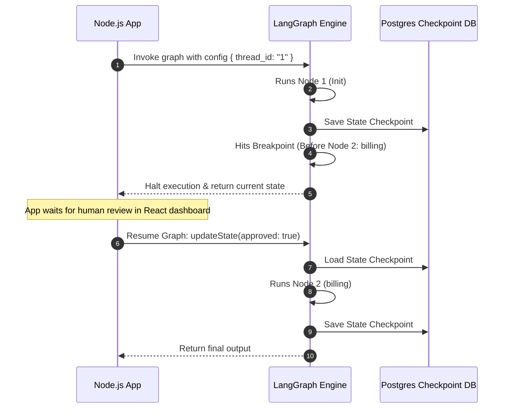

# Chapter 21: LangGraph Human-in-the-Loop

**Estimated Reading Time**: 25 minutes  
**Difficulty**: Expert  
**Prerequisites**: Chapters 1–20.  
**Learning Objectives**:
1. Implement breakpoints (`interruptBefore`, `interruptAfter`) in graphs.
2. Set up state checkpoint persistence using `MemorySaver`.
3. Pause graph execution and wait for human validation.
4. Resume paused graph executions programmatically in TypeScript.

---

## Introduction

Some actions are too sensitive to automate fully. If an AI agent attempts to refund a customer, send a billing email, or write to a production database, you need human oversight. This is known as **Human-in-the-Loop (HITL)**.

LangGraph implements HITL natively using **Breakpoints** and **Checkpointers**. You can compile a graph to halt execution before or after a node runs, save the state to a database, and wait for a resume command.

In this chapter, we explore HITL architectures and build an approval graph in TypeScript.

---

## Theory: Breakpoints, Checkpointers, and Approvals

### 1. Checkpoint Savers
A **Checkpointer** takes a snapshot of the graph state after every node runs.
* **MemorySaver**: An in-memory checkpointer used for development.
* **PostgresSaver**: A production database checkpointer that persists state across server restarts.
* **Thread ID**: Every session has a unique ID, allowing the checkpointer to save and load states for specific conversations.

### 2. Breakpoints
When compiling a graph, you can specify breakpoints:
* `interruptBefore: ["nodeName"]`: Halts execution before a node runs.
* `interruptAfter: ["nodeName"]`: Halts execution after a node runs.
* When a breakpoint is hit, the graph saves its state and stops execution, returning control to your application.

### 3. Resuming Execution
To resume execution:
1. Load the state snapshot using the thread ID.
2. Apply the human decision (e.g. set `approved: true`).
3. Call `app.updateState` or `app.stream(null, config)` to resume execution from the breakpoint.

---

## Real-World Analogy: The Wire Transfer

Imagine sending a wire transfer at a bank:
* **Fully Automated**: You click send, the API runs, and the money moves immediately. If you made a mistake, the money is gone.
* **Human-in-the-Loop**:
  * You request a transfer of \$50,000.
  * The system halts the transaction and flags it for review (Breakpoint).
  * A bank manager reviews the transaction, checks your ID, and clicks "Approve" (Human Decision).
  * The system resumes and completes the transfer.

---

## Architecture Diagram: Breakpoint Execution Loop

This diagram maps out the breakpoint flow, showing how execution halts and resumes upon human feedback.



---

## Code Example: Payment Approval Graph (TypeScript)

Let's build a TypeScript graph that requests payment processing. The graph halts execution before running the payment transaction node, waiting for a human approval update.

Create `langgraph_approval.ts`:

```typescript
import { Annotation, StateGraph, START, END, MemorySaver } from "@langchain/langgraph";

// 1. Define the Stateful Schema
const ApprovalState = Annotation.Root({
  amount: Annotation<number>({
    reducer: (x, y) => y ?? x,
    default: () => 0,
  }),
  isApproved: Annotation<boolean>({
    reducer: (x, y) => y ?? x,
    default: () => false,
  }),
  logs: Annotation<string[]>({
    reducer: (x, y) => x.concat(y),
    default: () => [],
  })
});

// 2. Define the Nodes

// Node A: Request generation node
async function requestPaymentNode(state: typeof ApprovalState.State) {
  console.log(`[Node: Request] Processing payment request of: $${state.amount}`);
  return {
    logs: [`Payment of $${state.amount} requested.`]
  };
}

// Node B: Payment processor (Requires approval)
async function executePaymentNode(state: typeof ApprovalState.State) {
  console.log("[Node: Payment] Executing payment transaction...");
  if (!state.isApproved) {
    console.log("[Node: Payment] ERROR: Transaction rejected. Missing approval.");
    return {
      logs: ["Transaction failed: Access Denied."]
    };
  }
  console.log("[Node: Payment] Transaction completed successfully!");
  return {
    logs: ["Transaction completed successfully."]
  };
}

// 3. Construct Graph with checkpointer and breakpoints
const workflow = new StateGraph(ApprovalState)
  .addNode("request", requestPaymentNode)
  .addNode("execute", executePaymentNode)
  .addEdge(START, "request")
  .addEdge("request", "execute")
  .addEdge("execute", END);

// Initialize Memory Saver Checkpointer
const memory = new MemorySaver();

// Compile graph with breakpoint set before 'execute' node
const app = workflow.compile({
  checkpointer: memory,
  interruptBefore: ["execute"] // HALT execution here
});

// 4. Execution Simulation
async function runApprovalFlow() {
  const config = { configurable: { thread_id: "payment-session-123" } };

  console.log("--- STEP 1: Initiating Payment Request ---");
  const firstRun = await app.invoke({ amount: 1500 }, config);

  console.log("\nGraph paused. Logs:", firstRun.logs);
  console.log("Current approval status:", firstRun.isApproved);

  // Retrieve state from checkpointer to verify execution was halted
  const graphState = await app.getState(config);
  console.log("\nNext Node Scheduled in Queue:", graphState.next); // Should print ['execute']

  console.log("\n--- STEP 2: Human Approves Transaction ---");
  // Simulate the human checking a checkbox on a React page and sending 'approved: true'
  await app.updateState(config, { isApproved: true });
  console.log("State updated. Resuming graph execution...");

  // Resume stream from checkpoint
  const finalRun = await app.invoke(null, config);

  console.log("\n--- Final Graph Output Logs ---");
  console.log(finalRun.logs);
}

runApprovalFlow();
```

Run this file:
```bash
npx tsx langgraph_approval.ts
```

Observe how the graph stops execution before running `executePaymentNode`, and resumes to complete the transaction after we update the state with `isApproved: true`.

---

## Best Practices, Production & Security Considerations

### 1. Persist to Postgres in Production
In production, if your server container restarts, `MemorySaver` snapshots are lost.
* **Production Rule**: Use database checkpointers like `PostgresSaver` (from `@langchain/langgraph-checkpoint-postgres`) to persist states across server restarts.

---

## Common Mistakes

1. **Forgetting config parameter on updateState**: Calling `app.updateState` without passing the `thread_id` config object, which results in state updates being lost.

---

## Exercises & Mini Project

### Exercise 1: Reject route addition
Add a node `cancelTransaction` and a conditional edge. If the human sets `isApproved: false`, route the graph to `cancelTransaction` instead of `execute`.

### Mini Project: Article Publisher API
Create an Express server. When a POST endpoint is hit, compile a graph that writes a draft article. Halt execution before publishing, saving the state to a database. Create an `/api/approve` endpoint that resumes the graph to save the article to disk.

---

## Interview Questions

1. **Q**: What is the difference between `interruptBefore` and `interruptAfter` in LangGraph?
   * **A**: `interruptBefore` pauses execution *before* a node runs, allowing you to review or modify the state inputs. `interruptAfter` pauses execution *after* a node runs, allowing you to validate the node's outputs before continuing.
2. **Q**: How do checkpoints enable Human-in-the-Loop workflows?
   * **A**: Checkpoints snapshot the graph state after every node execution. When a breakpoint halts execution, the current state is saved to a database. When a human reviews and resumes the thread, the engine loads the snapshot and resumes execution from that point.

---

## Navigation

**Prev:** [Chapter 20: Reducers and Routing](./20_LangGraph_Reducers_and_Routing.md) | **Index:** [Course Overview](./00_Index.md) | **Next:** [Chapter 22: Multi-Agent Design](./22_LangGraph_Multi_Agent_Design.md)
