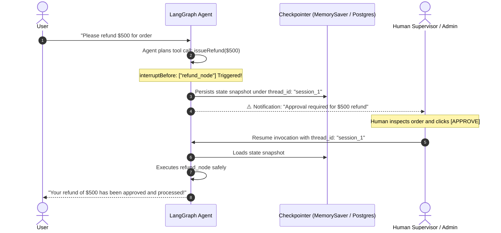
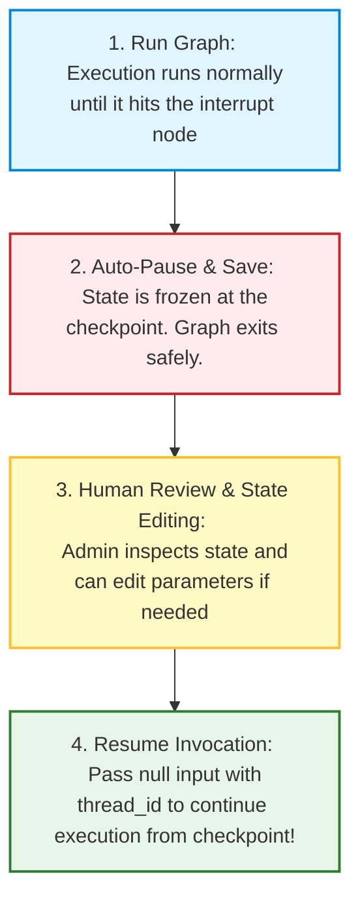

# 🤖 LangGraph.js: Human-in-the-Loop (HITL) and Checkpointing

## 📌 Overview

Imagine you build an AI agent for customer support, and give it the tool `issue_full_refund(amount)`. 

What happens if a user tricks the AI with a clever prompt into issuing a **$10,000 refund**? If the agent runs completely autonomously without oversight, your company loses money instantly!

To prevent catastrophes like this, production AI systems use **Human-in-the-Loop (HITL)**.

In LangGraph, Human-in-the-Loop allows you to **pause graph execution right before a sensitive action**, save the entire state to a database (**Checkpointing**), notify a human manager on Slack or a Web dashboard, and only **resume execution** once the human clicks "Approve" or modifies the state!



---

## 🎯 Why This Matters

1. **Enterprise Safety & Compliance**: Enforces mandatory human approval for financial transactions, database deletions, and external customer emails.
2. **State Time-Travel & Debugging**: Checkpointing saves a snapshot of the graph at every step, allowing you to rewind time and replay agent executions from any point.
3. **Long-Running Asynchronous Workflows**: An agent can pause execution for hours or days waiting for a human manager to return from vacation, without losing memory.

---

## 🧠 Prerequisites

- [19_LangGraph_Core_Nodes_and_Edges.md](./19_LangGraph_Core_Nodes_and_Edges.md): StateGraph basics.
- [20_LangGraph_Reducers_and_Routing.md](./20_LangGraph_Reducers_and_Routing.md): State reducers and tool nodes.

---

## 🔍 Deep Dive

### 1. The Core Mechanism: Checkpointers

A **Checkpointer** is a storage engine that saves the state snapshot at every graph step. 
- In development: `MemorySaver` (in-memory).
- In production: `PostgresSaver` or `MongoDBSaver` (persistent database).

Every conversation is identified by a unique **`thread_id`**:

```typescript
const checkpointer = new MemorySaver();
const app = workflow.compile({
  checkpointer: checkpointer,
  interruptBefore: ["execute_payment"], // Pause before running this node!
});
```

---

### 2. The 4-Step HITL Lifecycle



---

## 💡 Simple Example: The Dual-Key Nuclear Submarine

Think of Human-in-the-Loop like a **dual-key security system**:
- The AI officer prepares the target coordinates and puts its key into the lock (**Drafts Action**).
- The system will NOT fire until the human Captain turns their physical key (**Human Approval**).

---

## 🏗️ Real-World Example: Customer Email Blast Agent

In a marketing automation system:
1. Agent drafts a custom email promo for 50,000 customers.
2. Graph triggers `interruptBefore: ["send_blast_email"]`.
3. Marketing Director gets a preview on their dashboard.
4. Director edits a typo in the headline and clicks "Send".
5. Graph resumes and safely dispatches the 50,000 emails.

---

## ⚠️ Common Mistakes & Pitfalls

1. ❌ **Forgetting to provide `thread_id` in configuration**:
   - *Trap*: Calling `app.invoke(input)` without `{ configurable: { thread_id: "xyz" } }` will disable checkpointing and HITL.
2. ❌ **Using `MemorySaver` in Production**:
   - *Trap*: If your Docker container restarts, all paused workflows are lost. Always use `PostgresSaver` in production.

---

## 🔥 Important Points to Remember

- **HITL** pauses execution before high-risk actions to require human verification.
- **Checkpointers** (`MemorySaver`, `PostgresSaver`) save full state history.
- Use `interruptBefore: ["node_name"]` to create an approval breakpoint.
- Unique `thread_id` connects multi-turn and paused sessions.

---

## 💻 Code / Commands / Configuration

Here is a complete TypeScript script demonstrating **Interrupts and Human Approval** with LangGraph:

```typescript
// langgraph_hitl_demo.ts
// 1. Run: npm install @langchain/langgraph @langchain/core dotenv
// 2. Run: npx ts-node langgraph_hitl_demo.ts

import { StateGraph, START, END, Annotation, MemorySaver } from "@langchain/langgraph";

// 1. Define State
const PaymentState = Annotation.Root({
  customerName: Annotation<string>(),
  amount: Annotation<number>(),
  approved: Annotation<boolean>(),
  status: Annotation<string>(),
});

// 2. Node 1: Request Node
async function prepareRequest(state: typeof PaymentState.State) {
  console.log(`📋 [Step 1] Preparing payment request of $${state.amount} for ${state.customerName}...`);
  return { status: "Awaiting Human Approval" };
}

// 3. Node 2: Payment Execution Node (Sensitive!)
async function executePayment(state: typeof PaymentState.State) {
  console.log(`💳 [Step 2: HIGH STAKES] Processing $${state.amount} transaction!`);
  return { status: `Payment of $${state.amount} successfully transferred to ${state.customerName}!` };
}

async function runHITLDemo() {
  const checkpointer = new MemorySaver();

  // 4. Build Graph with Interrupt before 'payment' node
  const workflow = new StateGraph(PaymentState)
    .addNode("prepare", prepareRequest)
    .addNode("payment", executePayment)
    .addEdge(START, "prepare")
    .addEdge("prepare", "payment")
    .addEdge("payment", END);

  // Compile with Checkpointer and Breakpoint
  const app = workflow.compile({
    checkpointer: checkpointer,
    interruptBefore: ["payment"], // 🛑 Freeze execution right before 'payment'!
  });

  const config = { configurable: { thread_id: "transaction_thread_101" } };

  // Phase 1: User triggers payment
  console.log("🚀 --- PHASE 1: User Initiates Transfer ---");
  const step1State = await app.invoke(
    { customerName: "Alice Smith", amount: 1500, approved: false, status: "Started" },
    config
  );

  console.log("\n⏸️ Graph PAUSED automatically at breakpoint!");
  console.log("Current State:", step1State);

  // Phase 2: Human Review Gate
  console.log("\n👨‍💼 --- PHASE 2: Human Admin Reviews Request ---");
  console.log("Admin confirms Alice Smith is verified. Approving transfer...");

  // Phase 3: Resume Execution from Checkpoint
  console.log("\n▶️ --- PHASE 3: Resuming Graph Execution ---");
  // Pass null input with the same thread_id to continue from the saved checkpoint
  const finalState = await app.invoke(null, config);

  console.log("\n🏁 Final Graph State:");
  console.log("Status:", finalState.status);
}

runHITLDemo();
```

---

## 🎤 Interview Perspective

* **Q: How does LangGraph implement Human-in-the-Loop (HITL) without blocking server threads or keeping open connections?**
  * **Answer**: LangGraph decouples execution from server memory using state checkpointers (e.g. PostgreSQL). When an `interruptBefore` node is reached, the runtime serializes the complete graph state into the checkpointer under the specified `thread_id` and exits cleanly. When the human approves via an API endpoint, the server instantiates a fresh worker, loads the state snapshot by `thread_id`, and resumes execution seamlessly.
* **Q: What is State Time-Travel in LangGraph?**
  * **Answer**: Because checkpointers store a historical log of every transition state with versioned checkpoint IDs, developers can fetch past states (`app.getStateHistory(config)`), inspect intermediate values, modify state retroactively, and branch or replay the execution from any historical step.

---

## 🧩 Connection With Previous Concepts

- **Previous Lesson ([20_LangGraph_Reducers_and_Routing.md](./20_LangGraph_Reducers_and_Routing.md))**: Built autonomous ReAct routing loops.
- **Next Lesson ([22_LangGraph_Multi_Agent_Design.md](./22_LangGraph_Multi_Agent_Design.md))**: We will scale from single agents to **Multi-Agent Systems** using the Supervisor and Collaboration patterns!

---

Previous : [20_LangGraph_Reducers_and_Routing.md](./20_LangGraph_Reducers_and_Routing.md) | Index: [00_Index.md](./00_Index.md) | Next: [22_LangGraph_Multi_Agent_Design.md](./22_LangGraph_Multi_Agent_Design.md)
