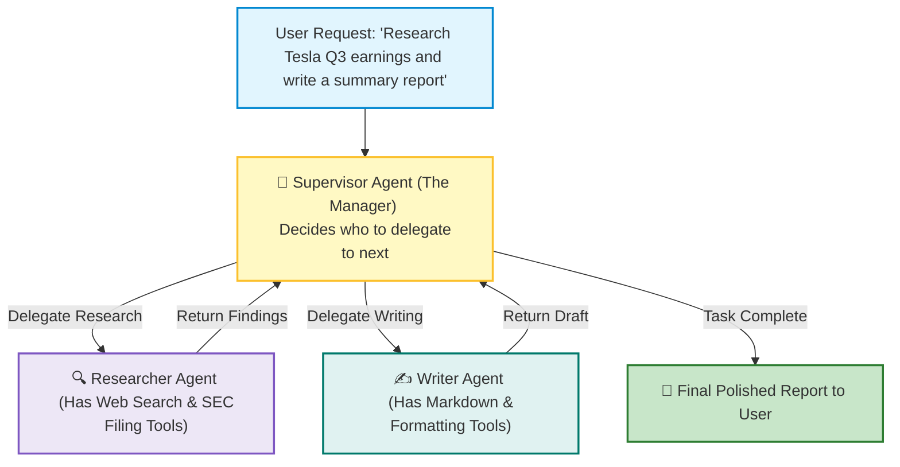
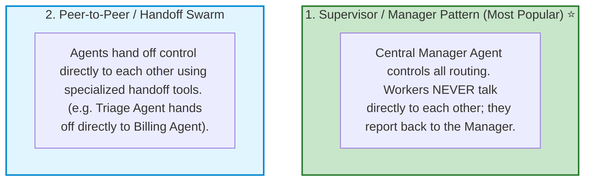
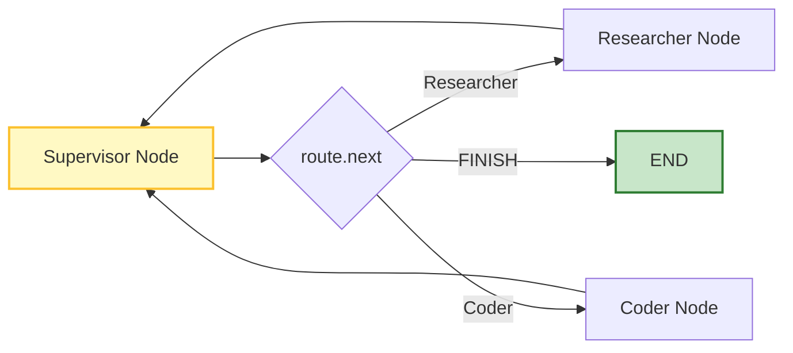

# 🤖 LangGraph.js: Multi-Agent Architectures and Supervisor Design

## 📌 Overview

What happens when you try to build a single "Super Agent" that can write code, search the web, analyze financial spreadsheets, generate legal contracts, and send emails?

It fails! Giving a single AI model 25 different tools and a 4-page system prompt causes **prompt confusion**, hallucinations, and missed tool calls.

In the software industry, we solve this by building **Multi-Agent Systems**. 

Instead of one overwhelmed generalist, you create a team of **specialized agents** (e.g. a Research Agent, a Coding Agent, and a Quality Assurance Agent) coordinated by a **Supervisor Agent** (the Manager) who delegates tasks and reviews work!



---

## 🎯 Why This Matters

1. **High Tool Reliability**: Each worker agent only has 1 or 2 tools, keeping accuracy near 100%.
2. **Modular & Maintainable**: You can upgrade the `Researcher` agent's prompt or tools without breaking the `Writer` or `Coder` agent.
3. **Simulates Real Engineering Teams**: Replicates how real-world companies operate: Product Manager $\to$ Frontend Dev $\to$ Backend Dev $\to$ QA Tester.

---

## 🧠 Prerequisites

- [19_LangGraph_Core_Nodes_and_Edges.md](./19_LangGraph_Core_Nodes_and_Edges.md): StateGraph architecture.
- [20_LangGraph_Reducers_and_Routing.md](./20_LangGraph_Reducers_and_Routing.md): Conditional routing and state reducers.

---

## 🔍 Deep Dive

### 1. Two Popular Multi-Agent Design Patterns



---

### 2. The Supervisor Routing State Machine

The Supervisor uses Structured Outputs to select the next worker:

```typescript
const routeSchema = z.object({
  next: z.enum(["Researcher", "Coder", "FINISH"]).describe("The next specialized agent to act"),
  instructions: z.string().describe("Specific instructions for the selected worker"),
});
```



---

## 💡 Simple Example: The Film Production Crew

Think of a Multi-Agent system like making a Hollywood Movie:
- **Supervisor**: The Film Director (coordinates the crew and shouts "Action!").
- **Agent 1 (Scriptwriter)**: Writes the screenplay lines.
- **Agent 2 (Cinematographer)**: Shoots the camera angles.
- **Agent 3 (Editor)**: Cuts the footage into the final movie.
- No single person does every job!

---

## 🏗️ Real-World Example: Enterprise Automated Code Reviewer

In a GitHub CI/CD pipeline:
1. **Supervisor**: Inspects the Pull Request diff.
2. **Security Agent**: Scans for leaked API keys, SQL injections, and buffer overflows.
3. **Performance Agent**: Scans for memory leaks and $O(N^2)$ algorithm bottlenecks.
4. **Style Agent**: Checks TypeScript naming conventions and linting rules.
5. **Supervisor**: Combines all 3 reviews into a single clean summary comment on GitHub!

---

## ⚠️ Common Mistakes & Pitfalls

1. ❌ **Infinite Ping-Pong Loops**:
   - *Trap*: Agent A asks Agent B a question, and Agent B asks Agent A back, looping forever.
   - *Fix*: Always have the Supervisor track step counts and enforce a hard max step limit.
2. ❌ **Bloating State with Full Agent Internal Monologues**:
   - *Fix*: Only return clean final summaries from worker nodes back to the Supervisor to keep the shared context window lean.

---

## 🔥 Important Points to Remember

- **Multi-Agent Systems** divide complex goals among specialized agents.
- **Supervisor Pattern**: A central coordinator decides which specialist runs next.
- Keep each worker's toolset small (1–3 tools max) for maximum reliability.
- Workers report results back to the Supervisor before final completion.

---

## 💻 Code / Commands / Configuration

Here is a complete TypeScript script implementing a **Supervisor Multi-Agent Team** with LangGraph:

```typescript
// multi_agent_supervisor_demo.ts
// 1. Run: npm install @langchain/langgraph @langchain/core @langchain/openai zod dotenv
// 2. Run: npx ts-node multi_agent_supervisor_demo.ts

import { StateGraph, START, END, Annotation } from "@langchain/langgraph";
import { ChatOpenAI } from "@langchain/openai";
import { HumanMessage, BaseMessage } from "@langchain/core/messages";
import { z } from "zod";
import * as dotenv from "dotenv";

dotenv.config();

// 1. Define Team State
const TeamState = Annotation.Root({
  messages: Annotation<BaseMessage[]>({
    reducer: (curr, update) => curr.concat(update),
    default: () => [],
  }),
  nextWorker: Annotation<string>({
    reducer: (curr, update) => update ?? curr,
    default: () => "Supervisor",
  }),
});

const model = new ChatOpenAI({ modelName: "gpt-4o-mini", temperature: 0.0 });

// 2. Supervisor Node (Decides who works next)
const SupervisorDecisionSchema = z.object({
  next: z.enum(["Researcher", "Coder", "FINISH"]).describe("The next worker to act or FINISH"),
  reasoning: z.string().describe("Why this worker was selected"),
});

async function supervisorNode(state: typeof TeamState.State) {
  console.log("👔 [Supervisor] Evaluating task progress...");

  const supervisorPrompt = `You are the team supervisor managing two workers:
1. 'Researcher': Researches facts, definitions, and technical specs.
2. 'Coder': Writes clean TypeScript code snippets.

Given the conversation below, decide who should act next. If the task is fully answered, select 'FINISH'.`;

  const structuredSupervisor = model.withStructuredOutput(SupervisorDecisionSchema);
  const decision = await structuredSupervisor.invoke([
    { role: "system", content: supervisorPrompt },
    ...state.messages,
  ]);

  console.log(`👉 Supervisor Decision: Next Worker -> [${decision.next}] (${decision.reasoning})`);
  return { nextWorker: decision.next };
}

// 3. Worker Node 1: Researcher
async function researcherNode(state: typeof TeamState.State) {
  console.log("🔍 [Researcher] Gathering technical details...");
  const prompt = "Summarize what a Redis cache is and why it makes APIs faster in 1 sentence.";
  const response = await model.invoke(prompt);
  return {
    messages: [new HumanMessage({ content: `[Research Data]: ${response.content}`, name: "Researcher" })],
  };
}

// 4. Worker Node 2: Coder
async function coderNode(state: typeof TeamState.State) {
  console.log("💻 [Coder] Writing TypeScript implementation...");
  const prompt = "Write a 3-line mock Redis get/set helper function in TypeScript.";
  const response = await model.invoke(prompt);
  return {
    messages: [new HumanMessage({ content: `[Code Snippet]:\n${response.content}`, name: "Coder" })],
  };
}

// 5. Assemble Multi-Agent StateGraph
async function runMultiAgentDemo() {
  const workflow = new StateGraph(TeamState)
    .addNode("supervisor", supervisorNode)
    .addNode("Researcher", researcherNode)
    .addNode("Coder", coderNode)
    .addEdge(START, "supervisor")
    .addConditionalEdges("supervisor", (state) => state.nextWorker, {
      Researcher: "Researcher",
      Coder: "Coder",
      FINISH: END,
    })
    .addEdge("Researcher", "supervisor") // Report back to supervisor!
    .addEdge("Coder", "supervisor");      // Report back to supervisor!

  const app = workflow.compile();

  console.log("🚀 Starting Multi-Agent Team Execution...\n");
  const result = await app.invoke({
    messages: [new HumanMessage("Please research Redis caching and write a TypeScript code sample for it.")],
  });

  console.log("\n🏁 Final Multi-Agent Output Log:");
  result.messages.forEach((msg) => {
    console.log(`\n--- ${(msg as any).name || "User"} ---:\n${msg.content}`);
  });
}

runMultiAgentDemo();
```

---

## 🎤 Interview Perspective

* **Q: What are the main trade-offs between a centralized Supervisor Multi-Agent pattern and a decentralized Peer-to-Peer (Handoff) pattern?**
  * **Answer**: The Supervisor pattern provides strong global control, easier debugging, strict policy enforcement, and prevents chaotic circular handoffs because all transitions pass through a central coordinator. However, the supervisor introduces an extra LLM call on every hop. The Peer-to-Peer pattern has lower token overhead for linear pipelines, but is harder to monitor and prone to infinite handoff loops if guardrails are weak.
* **Q: Why does decomposing a complex workflow into multiple specialized agents improve overall task accuracy?**
  * **Answer**: Decomposing reduces context clutter and cognitive load per model invocation. Each agent operates with a focused system prompt and a minimal set of tools (narrow action space), minimizing hallucinations and preventing the model from confusing instructions or misrouting tool calls.

---

## 🧩 Connection With Previous Concepts

- **Previous Lesson ([21_LangGraph_Human_in_the_Loop.md](./21_LangGraph_Human_in_the_Loop.md))**: Paused graphs for human approval.
- **Next Lesson ([23_RAG_Ingestion_and_Chunking.md](./23_RAG_Ingestion_and_Chunking.md))**: We dive deep into **Retrieval-Augmented Generation (RAG)**—mastering high-performance ingestion, semantic chunking, and metadata design!

---

Previous : [21_LangGraph_Human_in_the_Loop.md](./21_LangGraph_Human_in_the_Loop.md) | Index: [00_Index.md](./00_Index.md) | Next: [23_RAG_Ingestion_and_Chunking.md](./23_RAG_Ingestion_and_Chunking.md)
