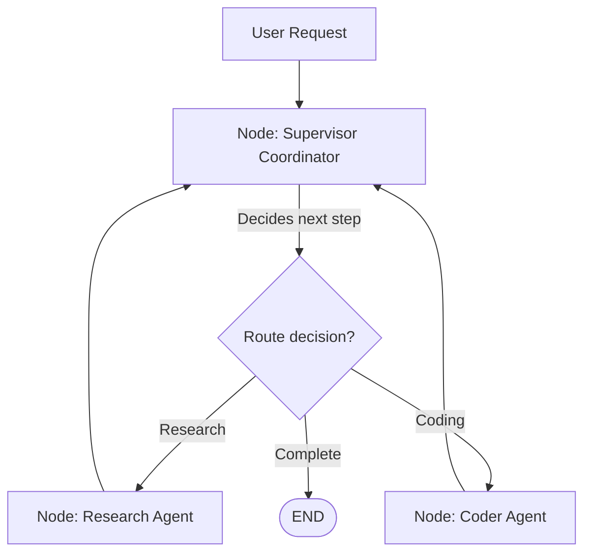

# Chapter 22: Multi-Agent Design Patterns

**Estimated Reading Time**: 25 minutes  
**Difficulty**: Expert  
**Prerequisites**: Chapters 1–21.  
**Learning Objectives**:
1. Compare Multi-Agent topologies (Supervisor, Collaboration, Reflection).
2. Design state schemas shared across multiple specialized agents.
3. Build a Supervisor Agent orchestrator in LangGraph.
4. Implement routing and coordination logic in TypeScript.

---

## Introduction

For simple tasks, a single agent with a few tools works fine. However, as task complexity grows, a single agent's prompt can become bloated with instructions, and tool selection accuracy drops.

**Multi-Agent Architectures** solve this by dividing the workload. We create a team of specialized agents, each with limited instructions and a focused set of tools, coordinated by a supervisor or structured routing rules.

In this chapter, we explore multi-agent design patterns and build a Supervisor Coordinator agent in TypeScript.

---

## Theory: Supervisor, Planner, and Reflection Patterns

We organize multi-agent systems using three primary patterns:

### 1. The Supervisor Pattern
A master coordinator agent evaluates user inputs, delegates tasks to specialized sub-agents, collects their outputs, and generates a final response. This is similar to a project manager delegating tasks to developers.

```text
               [Supervisor Agent]
                       │
         ┌─────────────┴─────────────┐
         ▼                           ▼
  [Coder Agent]              [Research Agent]
```

### 2. The Planner-Executor Pattern
* **Planner**: Takes a complex query and breaks it down into a list of sub-tasks (a DAG).
* **Executors**: Specialized agents execute the sub-tasks sequentially.

### 3. The Reflection Pattern
One agent drafts an output (e.g. code or an article), while a validator agent reviews the output and provides feedback. The first agent then refines the output based on the feedback. This loop runs until the validator approves the output.

---

## Real-World Analogy: The Software Development Team

Think of a software development agency:
* **The Product Manager is the Supervisor**: They receive requirements from the client, decide who should handle each task, assign the work to developers, and deliver the final product.
* **The Developer is the Coder Agent**: They focus on writing code and do not talk to the client directly.
* **The QA Tester is the Reflection Agent**: They review the code, find bugs, send feedback to the developer, and approve the code for release.

---

## Architecture Diagram: Multi-Agent Supervisor Design

This diagram maps out a multi-agent workflow coordinated by a supervisor node.



---

## Code Example: Multi-Agent Supervisor Graph (TypeScript)

Let's build a multi-agent supervisor graph in TypeScript where a coordinator agent delegates tasks to specialized `Coder` and `Researcher` sub-agents.

Create `multi_agent_supervisor.ts`:

```typescript
import { Annotation, StateGraph, START, END } from "@langchain/langgraph";

// 1. Define the Global Shared State Schema
const ProjectState = Annotation.Root({
  taskRequest: Annotation<string>({
    reducer: (x, y) => y ?? x,
    default: () => "",
  }),
  nextAssignee: Annotation<string>({
    reducer: (x, y) => y ?? x,
    default: () => "supervisor",
  }),
  coderReport: Annotation<string>({
    reducer: (x, y) => y ?? x,
    default: () => "",
  }),
  researchReport: Annotation<string>({
    reducer: (x, y) => y ?? x,
    default: () => "",
  }),
  finalOutput: Annotation<string>({
    reducer: (x, y) => y ?? x,
    default: () => "",
  })
});

// 2. Define the Agent Nodes

// Supervisor Node (Decides who should work next)
async function supervisorNode(state: typeof ProjectState.State) {
  console.log(`[Supervisor] Evaluating task request: "${state.taskRequest}"`);
  
  // Simple router logic (In production, replace with LLM completion)
  const isCodingTask = state.taskRequest.toLowerCase().includes("code") || state.taskRequest.toLowerCase().includes("function");
  
  if (isCodingTask && !state.coderReport) {
    console.log("[Supervisor] Assigning task to: Coder");
    return { nextAssignee: "coder" };
  } else if (!isCodingTask && !state.researchReport) {
    console.log("[Supervisor] Assigning task to: Researcher");
    return { nextAssignee: "researcher" };
  }

  console.log("[Supervisor] All tasks complete. Compiling final output...");
  const compiled = state.coderReport || state.researchReport || "Task complete.";
  return {
    nextAssignee: "end",
    finalOutput: `Project Complete. Details:\n${compiled}`
  };
}

// Coder Node (Specialist)
async function coderAgentNode(state: typeof ProjectState.State) {
  console.log("[Agent: Coder] Writing code...");
  const generatedCode = "const add = (a, b) => a + b;";
  return {
    coderReport: `Generated TypeScript code:\n\`\`\`ts\n${generatedCode}\n\`\`\``,
    nextAssignee: "supervisor" // Hand control back to supervisor
  };
}

// Researcher Node (Specialist)
async function researcherAgentNode(state: typeof ProjectState.State) {
  console.log("[Agent: Researcher] Conducting research...");
  const info = "PostgreSQL pgvector supports indexing vectors up to 2000 dimensions.";
  return {
    researchReport: `Research Report: ${info}`,
    nextAssignee: "supervisor" // Hand control back to supervisor
  };
}

// 3. Define the Routing Edge Logic
function routeTask(state: typeof ProjectState.State) {
  return state.nextAssignee;
}

// 4. Construct the Graph
const workflow = new StateGraph(ProjectState)
  .addNode("supervisor", supervisorNode)
  .addNode("coder", coderAgentNode)
  .addNode("researcher", researcherAgentNode)
  
  .addEdge(START, "supervisor")
  
  // Register the dynamic routing edge
  .addConditionalEdges("supervisor", routeTask, {
    coder: "coder",
    researcher: "researcher",
    end: END
  })
  
  // Route worker outputs back to supervisor
  .addEdge("coder", "supervisor")
  .addEdge("researcher", "supervisor");

const app = workflow.compile();

// 5. Test Simulation
async function runSimulation() {
  console.log("--- Run 1: Coding task request ---");
  const res1 = await app.invoke({
    taskRequest: "Write a function to add two numbers."
  });
  console.log("\nFinal Output:\n", res1.finalOutput);

  console.log("\n--- Run 2: Research task request ---");
  const res2 = await app.invoke({
    taskRequest: "Check the maximum dimensions for pgvector indexes."
  });
  console.log("\nFinal Output:\n", res2.finalOutput);
}

runSimulation();
```

Run this file:
```bash
npx tsx multi_agent_supervisor.ts
```

Observe how the supervisor node dynamically analyzes user intent, routes execution to the correct specialized sub-agent, compiles the final report, and exits the graph.

---

## Best Practices, Production & Security Considerations

### 1. Share Only Necessary State
In multi-agent systems, sharing massive data arrays across all agents can clutter their context prompts. Keep agent states modular and pass only the data needed for the current task.

---

## Common Mistakes

1. **Circular routing loops**: Forgetting to update state variables, causing the supervisor to route back to the same node indefinitely.

---

## Exercises & Mini Project

### Exercise 1: Supervisor validator
Extend the supervisor logic. If the coder node returns code containing compiler errors, force the supervisor to route back to the coder node with the error logs.

### Mini Project: Writer and Editor team
Build a graph containing a `Writer` node (drafts a paragraph) and an `Editor` node (replaces passive voice with active voice). Use conditional routing to run the editor node once before exiting.

---

## Interview Questions

1. **Q**: What is the Supervisor Pattern in Multi-Agent systems?
   * **A**: The Supervisor pattern uses a master coordinator agent to evaluate user queries, delegate tasks to specialized worker agents, collect their outputs, and compile the final response.
2. **Q**: What are the trade-offs of Multi-Agent systems compared to single-agent systems?
   * **A**: Multi-agent systems reduce prompt sizes, optimize tool selection accuracy, and make workflows modular. However, they increase token costs and introduce coordination latency due to multiple LLM API calls.

---

## Navigation

**Prev:** [Chapter 21: Human-in-the-Loop](./21_LangGraph_Human_in_the_Loop.md) | **Index:** [Course Overview](./00_Index.md) | **Next:** [Chapter 23: RAG Ingestion](./23_RAG_Ingestion_and_Chunking.md)
