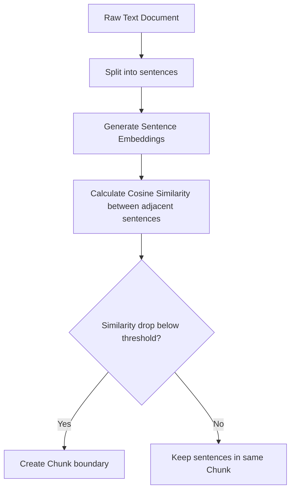

# Chapter 23: RAG Ingestion and Chunking

**Estimated Reading Time**: 20 minutes  
**Difficulty**: Intermediate to Advanced  
**Prerequisites**: Chapters 1–22.  
**Learning Objectives**:
1. Design document ingestion pipelines for RAG systems.
2. Select optimal text chunking sizes based on query styles.
3. Compare fixed-size chunking and semantic chunking.
4. Implement a semantic-similarity splitter programmatically in TypeScript.

---

## Introduction

Retrieval-Augmented Generation (RAG) is only as good as the data you feed it. If your ingestion pipeline splits documents poorly, your vector database will store fragmented text blocks, resulting in poor search matching and hallucinated answers.

**Chunking** is the process of splitting text into small, semantically rich blocks. In this chapter, we explore chunking strategies and build a semantic similarity text splitter in TypeScript.

---

## Theory: Chunking Strategies and Trade-offs

When choosing a chunking strategy, we balance detail against context size:

### 1. Fixed-size Chunking
Slices text by character counts (e.g. 500 characters) with a overlap (e.g. 100 characters).
* **Pros**: Simple to write and computationally fast.
* **Cons**: Cuts sentences or paragraphs in half, destroying semantic integrity.

### 2. Semantic Chunking
Splits text based on changes in meaning rather than character count:
1. Divide text into individual sentences.
2. Generate embeddings for each sentence.
3. Measure the cosine distance between adjacent sentences.
4. Split the text where the similarity score drops below a threshold, indicating a change in topic.

```text
Sentence A ──(Cosine Similarity: 0.95)──> Sentence B ──(Similarity: 0.30)──> [SPLIT HERE] ──> Sentence C
```

### 3. Document-Structure Chunking
Splits text based on markdown headers (`#`, `##`), HTML sections, or code blocks, keeping structured segments intact.

---

## Real-World Analogy: Cutting Film Reels

Imagine editing a movie:
* **Fixed-size Chunking**: You cut the film reel every 30 seconds exactly. You cut directly through a dialogue line or action sequence. The result is confusing.
* **Semantic Chunking**: You identify scene changes—such as moving from the kitchen to the garden—and cut where the scene breaks. Every clip tells a complete story.

---

## Architecture Diagram: Semantic Chunking Workflow

This diagram maps out the semantic chunking process, showing how sentences are vectorized and split based on similarity changes.



---

## Code Example: Semantic Similarity Splitter (TypeScript)

Let's implement a simplified semantic similarity splitter in TypeScript that measures word overlaps to simulate embedding distance and split paragraphs.

Create `semantic_splitter.ts`:

```typescript
// Helper: Calculate similarity between two text strings based on word overlaps
function getJaccardSimilarity(textA: string, textB: string): number {
  const wordsA = new Set(textA.toLowerCase().split(/\W+/).filter(w => w.length > 2));
  const wordsB = new Set(textB.toLowerCase().split(/\W+/).filter(w => w.length > 2));
  
  if (wordsA.size === 0 || wordsB.size === 0) return 0;

  const intersection = new Set([...wordsA].filter(x => wordsB.has(x)));
  const union = new Set([...wordsA, ...wordsB]);

  return intersection.size / union.size;
}

class SemanticSplitter {
  private similarityThreshold: number;

  constructor(threshold: number = 0.25) {
    this.similarityThreshold = threshold;
  }

  public splitText(documentText: string): string[] {
    // 1. Split document into individual sentences
    const sentences = documentText.match(/[^.!?]+[.!?]+/g) || [documentText];
    if (sentences.length <= 1) return sentences;

    const chunks: string[] = [];
    let currentChunk = sentences[0];

    // 2. Iterate and compare adjacent sentences
    for (let i = 1; i < sentences.length; i++) {
      const nextSentence = sentences[i];
      const similarity = getJaccardSimilarity(currentChunk, nextSentence);

      console.log(`[Metric] Similarity between sentences [${i-1} & ${i}]: ${similarity.toFixed(4)}`);

      if (similarity < this.similarityThreshold) {
        // Semantic break detected! Save chunk and start new one
        console.log(` -> Topic shift detected. Splitting chunk.`);
        chunks.push(currentChunk.trim());
        currentChunk = nextSentence;
      } else {
        // Keep in the same chunk
        currentChunk += " " + nextSentence;
      }
    }

    chunks.push(currentChunk.trim());
    return chunks;
  }
}

// Ingestion and Setup
const documentContent = 
  "Docker container systems decouple applications from infrastructure. " +
  "Containers virtualize the operating system, allowing microservices to run anywhere. " +
  "Kubernetes manages container scheduling and cluster nodes replication.\n" +
  "React updates web UIs using a Virtual DOM comparison. " +
  "Components render when props or state variables change. " +
  "Redux acts as a global state manager for complex React setups.";

const splitter = new SemanticSplitter(0.20);
const outputChunks = splitter.splitText(documentContent);

console.log(`\nSplit document into ${outputChunks.length} chunks:\n`);
outputChunks.forEach((c, idx) => {
  console.log(`--- Chunk ${idx + 1} ---`);
  console.log(c);
  console.log("-------------------\n");
});
```

Run this file:
```bash
npx tsx semantic_splitter.ts
```

Observe how the algorithm groups Docker/Kubernetes sentences together, and splits them from the React/Redux sentences due to the drop in semantic overlap.

---

## Best Practices, Production & Security Considerations

### 1. Write Robust Ingestion Catchers
Ingesting files with corrupt formats can crash background workers. Always wrap parser operations in error handling blocks and log failed imports without blocking the ingestion pipeline.

---

## Common Mistakes

1. **Ignoring chunk size limits**: Setting chunk sizes larger than your embedding model's input limits, causing embeddings to lose resolution.

---

## Exercises & Mini Project

### Exercise 1: Metadata Injector
Write a helper function that takes split chunks and adds structural metadata (such as parent document ID and chunk indices) to each chunk object.

### Mini Project: Semantic Markdown Ingester
Write a script that reads a markdown file, splits it by secondary headers (`##`), and generates an array of objects containing `{ header: string, content: string }`.

---

## Interview Questions

1. **Q**: What is the difference between fixed-size chunking and semantic chunking?
   * **A**: Fixed-size chunking splits text by character count, which is fast but can cut sentences in half. Semantic chunking vectorizes text and splits it based on changes in similarity between sentences, keeping semantic topics intact.
2. **Q**: How does chunk overlap improve retrieval quality?
   * **A**: Chunk overlap preserves context for information located on the boundaries of splits, preventing semantic loss during vector searches.

---

## Navigation

**Prev:** [Chapter 22: Multi-Agent Design](./22_LangGraph_Multi_Agent_Design.md) | **Index:** [Course Overview](./00_Index.md) | **Next:** [Chapter 24: RAG Advanced Retrieval](./24_RAG_Advanced_Retrieval.md)
