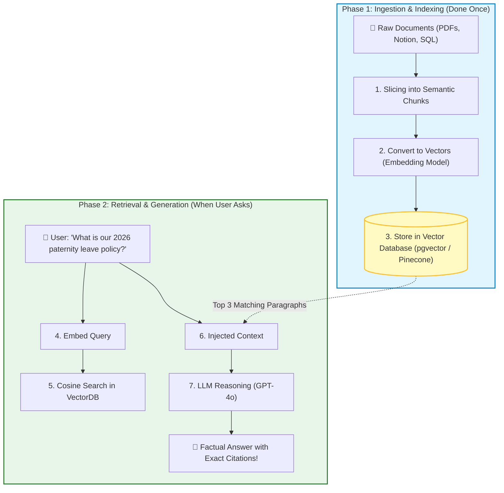
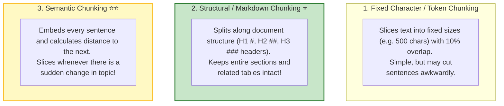
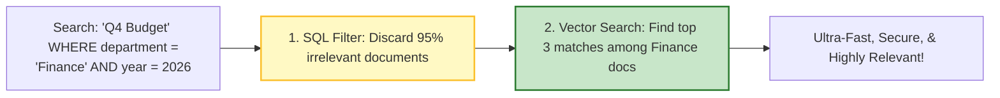

# 🤖 RAG: Ingestion, Chunking, and Vector Indexing

## 📌 Overview

Large Language Models are brilliant, but they have two fatal weaknesses:
1. **Knowledge Cutoff**: They know nothing about events or data created after their training date.
2. **Zero Access to Private Data**: They cannot read your company's internal HR policies, customer database, or private GitHub repos.

The industry-standard solution to this problem is **RAG (Retrieval-Augmented Generation)**.

Instead of retraining a billion-dollar model, RAG works like an **open-book exam**: 
When a user asks a question, your system first **retrieves** the most relevant paragraphs from your private database, pastes them into the prompt as reference **context**, and asks the AI to **generate** the answer based strictly on those facts!



---

## 🎯 Why This Matters

1. **Eliminates Hallucinations**: Grounding the AI in factual source documents guarantees accuracy.
2. **Instant Real-Time Updates**: Update your company policy in the database, and the AI knows the new rules immediately—no expensive model retraining needed.
3. **Enterprise Privacy & Security**: Your private company data stays safely inside your database; you only send small relevant snippets to the AI per query.

---

## 🧠 Prerequisites

- [04_Tokens_and_Tokenization.md](./04_Tokens_and_Tokenization.md): Understanding tokens and chunk lengths.
- [05_Embeddings_and_Vector_Search.md](./05_Embeddings_and_Vector_Search.md): Vectors and cosine similarity.
- [16_LangChain_Document_Loaders_and_Splitters.md](./16_LangChain_Document_Loaders_and_Splitters.md): Splitting documents with overlap.

---

## 🔍 Deep Dive

### 1. The 3 Chunking Strategies



---

### 2. The Power of Metadata Filtering

Never store raw text in a vector database without **Metadata**. 
Metadata allows you to perform **Hybrid Pre-Filtering** (combining SQL `WHERE` clauses with vector search):



Common metadata fields:
- `documentId`: Unique file identifier
- `source`: URL or filename
- `pageNumber`: Page in PDF
- `accessRole`: `['admin', 'employee', 'public']` (Enforces user permissions!)
- `updatedAt`: Date timestamp

---

## 💡 Simple Example: The Open-Book Exam

Think of RAG like a student taking a test:
- **Closed-Book Exam (Without RAG)**: The student tries to memorize everything. If asked a very specific fact from 2026, they might guess or make up a believable lie (hallucination).
- **Open-Book Exam (With RAG)**: The student looks up the exact chapter in the textbook (**Retrieval**), reads the specific formula, and writes a 100% correct answer (**Generation**).

---

## 🏗️ Real-World Example: Customer HR Portal

In an employee portal:
- Employee asks: *"How many sick days do I get in California?"*
- System filters metadata: `{ state: "CA", category: "Benefits" }`.
- Retrieves CA Employee Benefits section: *"California employees receive 5 paid sick days per year."*
- Generates answer: *"According to the California Employee Handbook (Section 4.2), you are entitled to 5 paid sick days annually."*

---

## ⚠️ Common Mistakes & Pitfalls

1. ❌ **Chunks Too Small or Too Big**:
   - *Too Small (50 tokens)*: Lacks context; model can't form a full thought.
   - *Too Big (3000 tokens)*: Embeddings get diluted; fills up context window quickly.
   - *Sweet Spot*: **300 to 800 tokens** with 10% overlap.
2. ❌ **Ignoring User Access Permissions (Security Leak)**:
   - *Danger*: An intern asking *"What are the executive salaries?"* must not retrieve CEO payroll documents! Always enforce role-based metadata filtering at the database layer.

---

## 🔥 Important Points to Remember

- **RAG** combines external retrieval with LLM generation for factual accuracy.
- **Phase 1 (Ingestion)**: Load $\to$ Chunk $\to$ Embed $\to$ Store in Vector DB.
- **Phase 2 (Query)**: Embed Query $\to$ Vector Search $\to$ Augment Prompt $\to$ Generate Answer.
- **Metadata** is crucial for security filtering, citation linking, and high retrieval precision.

---

## 💻 Code / Commands / Configuration

Here is a complete, standalone TypeScript script demonstrating an end-to-end **Mini RAG Pipeline**:

```typescript
// mini_rag_pipeline.ts
// 1. Run: npm install @langchain/core @langchain/openai @langchain/textsplitters dotenv
// 2. Run: npx ts-node mini_rag_pipeline.ts

import { ChatOpenAI, OpenAIEmbeddings } from "@langchain/openai";
import { RecursiveCharacterTextSplitter } from "@langchain/textsplitters";
import { Document } from "@langchain/core/documents";
import * as dotenv from "dotenv";

dotenv.config();

// Simple In-Memory Vector Store helper
interface VectorRecord {
  content: string;
  metadata: Record<string, any>;
  vector: number[];
}

function cosineSimilarity(a: number[], b: number[]): number {
  const dot = a.reduce((sum, val, i) => sum + val * b[i], 0);
  const normA = Math.sqrt(a.reduce((sum, val) => sum + val * val, 0));
  const normB = Math.sqrt(b.reduce((sum, val) => sum + val * val, 0));
  return dot / (normA * normB);
}

async function runRAGPipeline() {
  const embeddings = new OpenAIEmbeddings({ model: "text-embedding-3-small" });
  const model = new ChatOpenAI({ modelName: "gpt-4o-mini", temperature: 0.0 });

  // 1. Raw Corporate Knowledge
  const rawHandbook = `
ACME CORP INTERNAL IT POLICIES (UPDATED 2026)

Section 1: Password Requirements
All employee passwords must be at least 16 characters long and contain at least one special character. Passwords must be rotated every 90 days.

Section 2: Remote Work Hardware Allowance
Full-time remote engineers receive a one-time $1,500 home office hardware stipend upon hiring. Receipts must be submitted within 60 days of start date.

Section 3: VPN Access
All production database access requires connecting to the 'prod-vpn.acme.internal' gateway with multi-factor authentication (MFA).
`;

  console.log("📥 Phase 1: Ingestion & Vector Indexing...");
  
  // 2. Chunking with RecursiveCharacterTextSplitter
  const splitter = new RecursiveCharacterTextSplitter({ chunkSize: 180, chunkOverlap: 30 });
  const docChunks = await splitter.splitDocuments([
    new Document({ pageContent: rawHandbook, metadata: { source: "IT_Policy_2026.pdf" } })
  ]);

  // 3. Generate Embeddings and store in memory database
  const vectorDB: VectorRecord[] = [];
  for (const chunk of docChunks) {
    const vec = await embeddings.embedQuery(chunk.pageContent);
    vectorDB.push({ content: chunk.pageContent, metadata: chunk.metadata, vector: vec });
  }
  console.log(`✅ Indexed ${vectorDB.length} vector chunks into database.\n`);

  // 4. Online Phase: User Query
  const userQuestion = "How much money can I spend on my home office setup?";
  console.log(`👤 User Query: "${userQuestion}"`);

  // 5. Embed Query & Retrieve Top-K
  const queryVector = await embeddings.embedQuery(userQuestion);
  const searchResults = vectorDB
    .map(record => ({ ...record, score: cosineSimilarity(queryVector, record.vector) }))
    .sort((a, b) => b.score - a.score)
    .slice(0, 2); // Top 2 chunks

  const retrievedContext = searchResults.map(r => r.content).join("\n---\n");
  console.log("\n🔍 Retrieved Context:\n" + retrievedContext);

  // 6. Augmented Generation Prompt
  const ragPrompt = `You are ACME Corp's internal IT bot. 
Answer the user's question using ONLY the provided context. If the answer cannot be found in the context, say "I don't know".

Context:
${retrievedContext}

User Question: ${userQuestion}`;

  const finalResponse = await model.invoke(ragPrompt);

  console.log("\n🤖 Grounded AI Response:\n");
  console.log(finalResponse.content);
}

runRAGPipeline();
```

---

## 🎤 Interview Perspective

* **Q: What is the difference between RAG (Retrieval-Augmented Generation) and Fine-Tuning?**
  * **Answer**: 
    - **RAG** injects dynamic, external knowledge into the context window at query time. It is ideal for factual data retrieval, private documents, frequently changing information, and zero-hallucination citation requirements.
    - **Fine-Tuning** trains the model's internal weights on specific style, tone, format, or narrow domain terminology. Fine-tuning is poor for recalling precise factual data and is expensive to update.
    - **Best Practice**: Use RAG for knowledge; use Fine-Tuning for style, formatting, or behavior.
* **Q: What is the "Chunking Dilemma" in RAG?**
  * **Answer**: Smaller chunks maximize the precision of vector similarity search because the vector represents a narrow semantic idea, but they risk losing surrounding context. Larger chunks provide comprehensive context for generation, but their embeddings become diluted and include irrelevant noise. Solutions include Parent-Document Retrieval or Contextual Compression.

---

## 🧩 Connection With Previous Concepts

- **Previous Lesson ([22_LangGraph_Multi_Agent_Design.md](./22_LangGraph_Multi_Agent_Design.md))**: Covered Multi-Agent architectures.
- **Next Lesson ([24_RAG_Advanced_Retrieval.md](./24_RAG_Advanced_Retrieval.md))**: We will master **Advanced Retrieval Techniques**—including **Hybrid Search (Dense + Sparse/BM25)** and **HyDE (Hypothetical Document Embeddings)**!

---

Previous : [22_LangGraph_Multi_Agent_Design.md](./22_LangGraph_Multi_Agent_Design.md) | Index: [00_Index.md](./00_Index.md) | Next: [24_RAG_Advanced_Retrieval.md](./24_RAG_Advanced_Retrieval.md)
