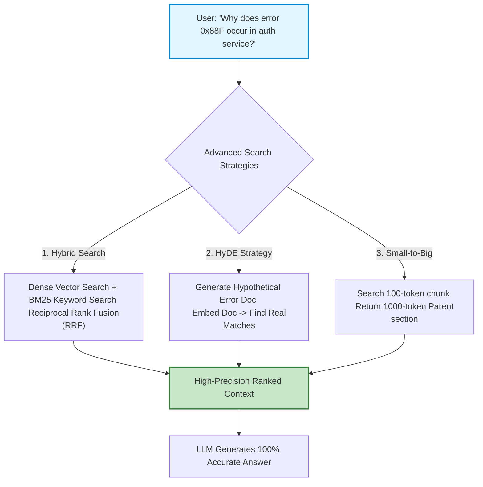
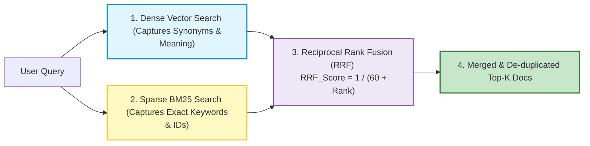
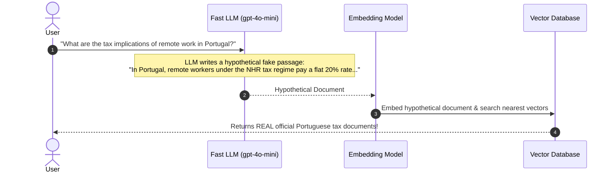
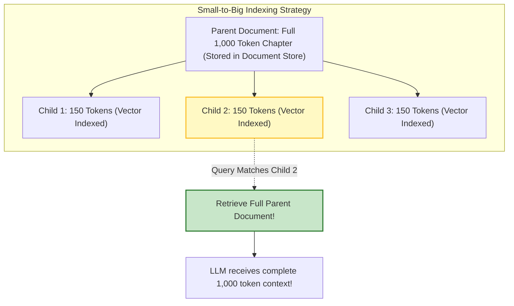

# 🤖 RAG: Advanced Retrieval, Hybrid Search, and HyDE

## 📌 Overview

In the previous chapter, we built a **Naive RAG** system using basic vector search.

In production, Naive RAG often fails in two common real-world scenarios:
1. **The Exact Keyword Problem**: When a user searches for an exact serial number (`"Error Code #ERR-404-X"`), vector embeddings fail because semantic search is looking for concepts, not exact letters!
2. **The Question-vs-Answer Mismatch**: A user's query is a short question (*"How to fix leaking pipe?"*), while the stored document is a long declarative statement (*"Turn the brass valve clockwise..."*). In vector space, questions and answers don't always land next to each other!

To solve this, industry-grade RAG systems use **Advanced Retrieval Techniques**:
- **Hybrid Search (Dense Vectors + Sparse BM25)**: Combines semantic search with exact keyword search.
- **HyDE (Hypothetical Document Embeddings)**: Uses an LLM to hallucinate a fake ideal answer, then embeds that answer to find the real document!
- **Parent-Document (Small-to-Big) Retrieval**: Searches tiny chunks for precision, but feeds the full parent paragraph to the LLM!



---

## 🎯 Why This Matters

1. **Finds Rare Codes, SKUs, and Names**: BM25 keyword matching guarantees you will never miss exact part numbers, API routes, or product IDs.
2. **Bridges Semantic Gap with HyDE**: Transforms short user queries into detailed technical paragraphs before searching, increasing retrieval accuracy by 25%+.
3. **No More Lost Context with Parent-Document**: Provides full surrounding paragraph context to the LLM without diluting the search index.

---

## 🧠 Prerequisites

- [05_Embeddings_and_Vector_Search.md](./05_Embeddings_and_Vector_Search.md): Dense vectors and cosine similarity.
- [23_RAG_Ingestion_and_Chunking.md](./23_RAG_Ingestion_and_Chunking.md): Ingestion and chunking fundamentals.

---

## 🔍 Deep Dive

### 1. Hybrid Search (Dense + Sparse BM25 with RRF)



**Reciprocal Rank Fusion (RRF)** formula:

$$RRF\_Score(d) = \sum_{m \in M} \frac{1}{k + r_m(d)}$$

Where $k \approx 60$, and $r_m(d)$ is the document's rank position in search method $m$.

---

### 2. HyDE: Hypothetical Document Embeddings

How HyDE works:



---

### 3. Parent-Document (Small-to-Big) Retrieval



---

## 💡 Simple Example: The Detective and the Sketch Artist

Think of **HyDE** like a police detective:
- **Direct Search**: The victim says *"Find the thief"*. The computer searches millions of photos with zero visual description. (Fails).
- **HyDE Approach**: The detective asks a sketch artist to draw what the suspect *probably* looks like (**Hypothetical Document**). Then, they run facial recognition on the sketch (**Vector Search**) to locate the real criminal!

---

## 🏗️ Real-World Example: Enterprise Technical Documentation

In a cloud developer portal:
- User queries: `"AWS_SDK_V3_CONNECT_TIMEOUT_504"`
- Pure vector search returns generic articles on timeout best practices.
- **Hybrid Search** matches the exact string `AWS_SDK_V3_CONNECT_TIMEOUT_504` via BM25, pulling the precise troubleshooting page to the #1 spot immediately.

---

## ⚠️ Common Mistakes & Pitfalls

1. ❌ **Using HyDE for Math or Exact Fact Retrieval**:
   - *Trap*: If a user asks for an exact phone number or address, the hypothetical document will hallucinate fake numbers, causing the search to steer in the wrong direction. Use Hybrid Search instead for exact facts.
2. ❌ **Blindly Normalizing Scores from Different Search Engines**:
   - *Trap*: Cosine similarity scores (0.0 to 1.0) and BM25 scores (0 to 50+) cannot be added directly. Always use **Reciprocal Rank Fusion (RRF)** to combine rankings safely.

---

## 🔥 Important Points to Remember

- **Hybrid Search** combines dense vectors (meaning) + BM25 (exact keywords).
- **Reciprocal Rank Fusion (RRF)** blends rankings fairly without score calibration issues.
- **HyDE** generates a hypothetical answer to bridge the question-to-document vector gap.
- **Parent-Document Retrieval** searches small child chunks but returns the full parent context.

---

## 💻 Code / Commands / Configuration

Here is a TypeScript script demonstrating the **HyDE (Hypothetical Document Embeddings)** technique:

```typescript
// hyde_retrieval_demo.ts
// 1. Run: npm install @langchain/core @langchain/openai dotenv
// 2. Run: npx ts-node hyde_retrieval_demo.ts

import { ChatOpenAI, OpenAIEmbeddings } from "@langchain/openai";
import * as dotenv from "dotenv";

dotenv.config();

// Simple In-Memory Vector Store simulation
interface DocRecord {
  title: string;
  text: string;
  vector: number[];
}

function cosineSimilarity(a: number[], b: number[]): number {
  const dot = a.reduce((sum, val, i) => sum + val * b[i], 0);
  const normA = Math.sqrt(a.reduce((sum, val) => sum + val * val, 0));
  const normB = Math.sqrt(b.reduce((sum, val) => sum + val * val, 0));
  return dot / (normA * normB);
}

async function runHyDEDemo() {
  const model = new ChatOpenAI({ modelName: "gpt-4o-mini", temperature: 0.7 });
  const embeddings = new OpenAIEmbeddings({ model: "text-embedding-3-small" });

  // 1. Real documents in database
  const knowledgeBase = [
    {
      title: "Portugal Digital Nomad Visa (D8)",
      text: "The Portugal D8 visa allows remote workers earning at least 4 times the national minimum wage (approx €3,280/month) to reside in Portugal. Applicants can benefit from favorable tax conditions.",
    },
    {
      title: "Spain Beckham Law",
      text: "Spain's Special Expats Regime (Beckham Law) allows foreign remote workers to pay a flat 24% tax rate on income earned in Spain up to €600,000 for 6 years.",
    },
  ];

  console.log("📚 1. Indexing real knowledge base...");
  const vectorDB: DocRecord[] = [];
  for (const doc of knowledgeBase) {
    const vec = await embeddings.embedQuery(doc.text);
    vectorDB.push({ ...doc, vector: vec });
  }

  // 2. User Query
  const userQuery = "Can I move to Lisbon as a software dev and pay less tax?";
  console.log(`\n👤 User Query: "${userQuery}"`);

  // 3. Step A: Generate Hypothetical Document using LLM
  console.log("\n🧠 Step A: Generating Hypothetical Document (HyDE)...");
  const hydePrompt = `Please write a short, formal paragraph that directly answers this question: "${userQuery}". Write as if you are an excerpt from an official immigration tax law document.`;
  
  const hypotheticalDoc = (await model.invoke(hydePrompt)).content as string;
  console.log(`\n[Hypothetical Generated Passage]:\n"${hypotheticalDoc}"\n`);

  // 4. Step B: Embed the Hypothetical Document
  console.log("⚡ Step B: Embedding Hypothetical Document & Searching Vector Store...");
  const hydeVector = await embeddings.embedQuery(hypotheticalDoc);

  // 5. Find nearest real document
  const results = vectorDB
    .map(doc => ({ ...doc, similarity: cosineSimilarity(hydeVector, doc.vector) }))
    .sort((a, b) => b.similarity - a.similarity);

  console.log("🏆 Top Retrieved Real Document via HyDE:");
  console.log(`Title: ${results[0].title} (Similarity: ${(results[0].similarity * 100).toFixed(2)}%)`);
  console.log(`Content: "${results[0].text}"`);
}

runHyDEDemo();
```

---

## 🎤 Interview Perspective

* **Q: Why does Hybrid Search (Dense + Sparse) outperform pure Vector Search in production?**
  * **Answer**: Dense vectors excel at fuzzy semantic matching, understanding synonyms, and abstract concepts, but struggle with precise keyword collisions (like product SKUs, exact error codes, and unique user IDs). Sparse search (BM25) provides exact token frequency matching. Combining both via Reciprocal Rank Fusion guarantees both broad semantic recall and high-precision exact keyword targeting.
* **Q: What is the primary limitation of Hypothetical Document Embeddings (HyDE)?**
  * **Answer**: HyDE introduces an additional LLM call at query time, increasing latency by 500–1000ms and adding API cost. Furthermore, for highly niche, proprietary internal facts (e.g. custom internal server hostnames), the model may generate misleading hypothetical content that steers vector retrieval toward incorrect clusters.

---

## 🧩 Connection With Previous Concepts

- **Previous Lesson ([23_RAG_Ingestion_and_Chunking.md](./23_RAG_Ingestion_and_Chunking.md))**: Covered basic ingestion and vector indexing.
- **Next Lesson ([25_RAG_Corrective_and_Self_RAG.md](./25_RAG_Corrective_and_Self_RAG.md))**: We will learn how to build self-healing RAG systems using **Corrective RAG (CRAG)** and **Self-RAG**!

---

Previous : [23_RAG_Ingestion_and_Chunking.md](./23_RAG_Ingestion_and_Chunking.md) | Index: [00_Index.md](./00_Index.md) | Next: [25_RAG_Corrective_and_Self_RAG.md](./25_RAG_Corrective_and_Self_RAG.md)
