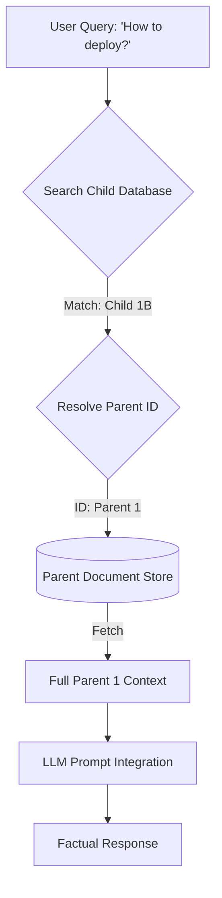

# Chapter 24: RAG Advanced Retrieval

**Estimated Reading Time**: 25 minutes  
**Difficulty**: Expert  
**Prerequisites**: Chapters 1–23.  
**Learning Objectives**:
1. Implement Parent-Child retrieval architectures.
2. Rewrite and expand queries using Multi-Query expansion.
3. Understand the math of reciprocal rank fusion (RRF) for hybrid search merging.
4. Build a Parent-Child retriever index in TypeScript.

---

## Introduction

Basic vector retrieval has limits. If you search for a short snippet, the vector database finds the chunk, but the chunk may lack context. If you search using a poorly phrased query, the search will fail to return relevant results.

**Advanced Retrieval** solves this by separating the text we search from the text we pass to the model.

In this chapter, we explore Parent-Child and Multi-Query retrieval architectures and build a Parent-Child database index in TypeScript.

---

## Theory: Parent-Child mapping and Query Expansion

We use two primary patterns to improve retrieval quality:

### 1. Parent-Child Retrieval
Instead of embedding large documents (which are wordy) or small chunks (which lack context), we divide documents into small Child Chunks (e.g. 100 tokens) linked to larger Parent Documents (e.g. 1,000 tokens).
* We search the small child chunks (which yield higher search precision because they have less semantic noise).
* When a match is found, we retrieve and feed the larger parent document to the LLM, giving it full context.

```text
   Search: Query ──> [Matches Child Chunk 1A]
                            │
                            └──> Retrieve & Send [Parent Document 1] to LLM
```

### 2. Multi-Query Expansion
Users write poor search queries. A Multi-Query system uses an LLM to rewrite a single user query into three or four variations (e.g. "Postgres indexing" $\to$ "DB performance tips", "slow SQL query optimization"). We retrieve documents for all variations, merge them, and remove duplicates.

---

## Real-World Analogy: Footnotes in a Book

Imagine researching tax law:
* **Basic Retrieval**: You find a index snippet pointing to a single footnote: *"See clause 12.4"*. You read only that footnote. It contains no explanation, so you don't understand the law.
* **Parent-Child Retrieval**: You find the footnote (Child). Instead of reading only that footnote, you read the entire chapter (Parent Context) to understand the background of the footnote.

---

## Architecture Diagram: Parent-Child Retrieval Pipeline

This diagram shows how child chunks are matched against search queries, while their associated parent documents are resolved and sent to the LLM.



---

## Code Example: Parent-Child Database Index (TypeScript)

Let's build a Parent-Child index matcher in TypeScript. We ingest a document, split it into small child sentences, link them to the parent, and resolve the parent document upon query matching.

Create `parent_child_retriever.ts`:

```typescript
interface ChildChunk {
  id: string;
  parentId: string;
  content: string;
}

interface ParentDoc {
  id: string;
  content: string;
}

class ParentChildIndex {
  private childStore: ChildChunk[] = [];
  private parentStore: Map<string, ParentDoc> = new Map();

  // Ingest document: creates 1 parent and multiple child sentences
  public ingest(docId: string, text: string) {
    // 1. Store parent document
    this.parentStore.set(docId, { id: docId, content: text });

    // 2. Split into sentences (Child chunks)
    const sentences = text.match(/[^.!?]+[.!?]+/g) || [text];
    
    sentences.forEach((sentence, idx) => {
      this.childStore.push({
        id: `${docId}_child_${idx}`,
        parentId: docId,
        content: sentence.trim()
      });
    });
  }

  // Simulated vector search returning matching child chunks
  private searchChildren(query: string): ChildChunk[] {
    const queryTerms = new Set(query.toLowerCase().split(/\W+/));
    
    // Sort child chunks by matching words (mock vector similarity)
    return [...this.childStore].sort((a, b) => {
      const scoreA = a.content.toLowerCase().split(/\W+/).filter(w => queryTerms.has(w)).length;
      const scoreB = b.content.toLowerCase().split(/\W+/).filter(w => queryTerms.has(w)).length;
      return scoreB - scoreA;
    });
  }

  // Retrieve: searches child chunks, returns parent document
  public retrieveParent(query: string): ParentDoc | null {
    console.log(`[Retriever] Searching child chunks for: "${query}"`);
    const matchedChildren = this.searchChildren(query);

    if (matchedChildren.length === 0) return null;

    const topMatch = matchedChildren[0];
    console.log(` -> Matched child chunk: "${topMatch.content}"`);
    
    const parent = this.parentStore.get(topMatch.parentId) || null;
    return parent;
  }
}

// Ingestion and Setup
const index = new ParentChildIndex();

// Ingest Postgres replication guide
index.ingest(
  "postgres_guide",
  "PostgreSQL database clustering requires setting up primary and replica nodes. " +
  "You must modify the postgresql.conf file and enable hot_standby configurations. " +
  "Use pg_basebackup to copy directories between servers. " +
  "This ensures secondary failover capabilities for production clusters."
);

// Run Search
const result = index.retrieveParent("How do I configure my postgresql.conf file?");

console.log("\n--- Resolved Parent Context ---");
if (result) {
  console.log(`Parent ID: ${result.id}`);
  console.log(`Parent Content: "${result.content}"`);
} else {
  console.log("No documents matched.");
}
```

Run this file:
```bash
npx tsx parent_child_retriever.ts
```

Observe how matching a single sentence returns the entire Postgres replication guide to provide the LLM with full context.

---

## Best Practices, Production & Security Considerations

### 1. Apply Metadata Filters at Ingest
Ensure that every child chunk inherits all metadata fields from its parent document. This allows you to restrict vector searches using metadata filters to enforce access permissions.

---

## Common Mistakes

1. **Returning child chunks directly to LLMs**: Feeding short sentences to the LLM without parent context, resulting in vague or incorrect answers.

---

## Exercises & Mini Project

### Exercise 1: Multi-Query generator
Write a TypeScript function that takes a query, calls an LLM to generate 3 query variations, and returns them in an array.

### Mini Project: Hybrid RRF Search
Write a script implementing Reciprocal Rank Fusion (RRF). Take two ranked lists of search results (one from vector search, one from keyword search) and merge them into a single sorted list.

---

## Interview Questions

1. **Q**: What is Parent-Child Retrieval, and what problem does it solve?
   * **A**: Parent-Child Retrieval splits documents into small chunks for vector search, but links them to larger parent documents. This provides high search precision (small chunks have less semantic noise) while giving the LLM full context.
2. **Q**: How does Multi-Query expansion improve retrieval quality?
   * **A**: Users write poor search queries. Multi-query uses an LLM to rewrite a query into multiple variations, retrieving documents for all variations and merging them to find more relevant matches.

---

## Navigation

**Prev:** [Chapter 23: RAG Ingestion](./23_RAG_Ingestion_and_Chunking.md) | **Index:** [Course Overview](./00_Index.md) | **Next:** [Chapter 25: Corrective RAG and Self-RAG](./25_RAG_Corrective_and_Self_RAG.md)
