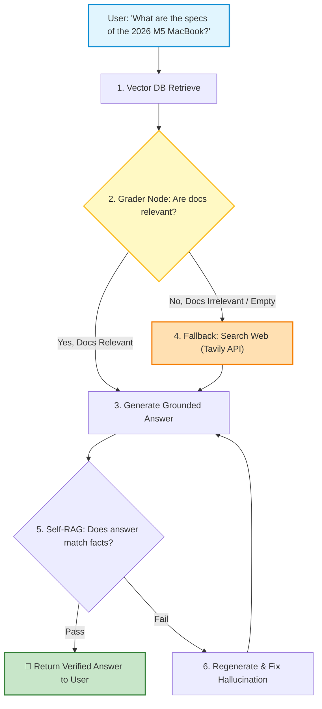
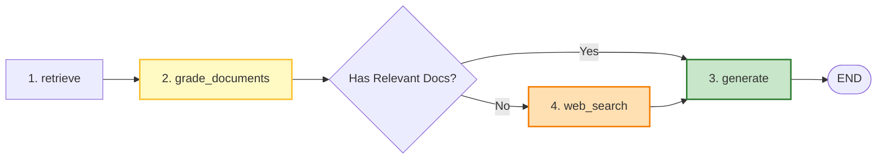
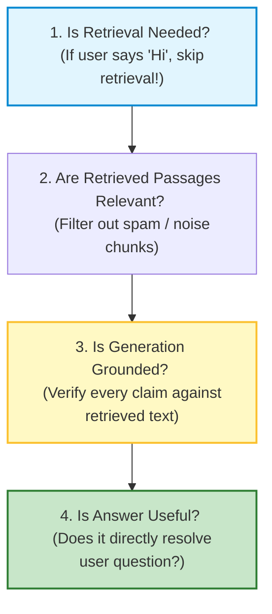

# 🤖 RAG: Corrective RAG (CRAG) and Self-RAG

## 📌 Overview

In standard RAG, if your vector database returns 3 completely useless or irrelevant documents, what happens? 

The LLM blindly reads the junk context and either hallucinates a fake answer or apologizes helplessly. This is called **Blind Retrieval**.

To solve this, advanced AI systems use **Self-Healing RAG**:
1. **CRAG (Corrective RAG)**: A dedicated "Grader" model inspects the retrieved documents. If they are irrelevant, it automatically triggers a **Fallback Web Search** or rewrites the user's query!
2. **Self-RAG (Self-Reflective RAG)**: The AI grades its own generated answer against the source documents to catch and eliminate hallucinations before the user ever sees them!



---

## 🎯 Why This Matters

1. **Zero Garbage-In, Garbage-Out**: Stops the LLM from generating nonsense answers when the internal database doesn't have the answer.
2. **Autonomous Fallbacks**: Seamlessly switches to live web search when private documentation is out of date.
3. **Automated Hallucination Detection**: Gives enterprise systems mathematical confidence that generated answers are 100% supported by retrieved facts.

---

## 🧠 Prerequisites

- [19_LangGraph_Core_Nodes_and_Edges.md](./19_LangGraph_Core_Nodes_and_Edges.md): Building state machines.
- [20_LangGraph_Reducers_and_Routing.md](./20_LangGraph_Reducers_and_Routing.md): Conditional routing.
- [23_RAG_Ingestion_and_Chunking.md](./23_RAG_Ingestion_and_Chunking.md): Standard RAG pipeline.

---

## 🔍 Deep Dive

### 1. Corrective RAG (CRAG) Architecture in LangGraph

CRAG is modeled as a LangGraph state machine with 4 key nodes:



---

### 2. The Document Grader (Structured LLM Judge)

The grader is a fast, lightweight LLM (like `gpt-4o-mini`) configured with a Zod schema that grades each document as either relevant or irrelevant:

```typescript
const GradeDocumentSchema = z.object({
  binaryScore: z.enum(["yes", "no"]).describe("Whether the document is relevant to the question"),
  reasoning: z.string().describe("Brief explanation for the score"),
});
```

---

### 3. The 3 Self-RAG Reflection Checks



---

## 💡 Simple Example: The Smart Research Assistant

Think of CRAG like an **executive research assistant**:
- You ask: *"Find me our contract with Company X"*.
- The assistant checks the file cabinet (**Vector Search**).
- The files found are for Company Y (**Document Grader detects mismatch**).
- Instead of giving you the wrong contract, the assistant searches the company email archive or Google (**Fallback Search**), finds the real document, and brings you the right answer!

---

## 🏗️ Real-World Example: Customer Support Helpdesk

In a tech company chatbot:
- User asks: *"Why is Stripe webhook failing with error 400?"*
- System searches internal knowledge base. No internal docs match error 400.
- Grader flags `relevance = 'no'`.
- System triggers a live search of official `stripe.com/docs`.
- Generates answer citing official Stripe documentation.

---

## ⚠️ Common Mistakes & Pitfalls

1. ❌ **Using Expensive Models for Document Grading**:
   - *Trap*: Using `gpt-4o` to grade 5 documents individually multiplies costs. Always use lightweight models like `gpt-4o-mini` or `gemini-1.5-flash` for grading.
2. ❌ **Allowing Endless Hallucination Loops**:
   - *Fix*: Limit hallucination retries to a maximum of 2 cycles before returning *"I could not verify this answer"*.

---

## 🔥 Important Points to Remember

- **CRAG** uses a Document Grader to evaluate retrieved chunks before generating.
- If documents are irrelevant, CRAG falls back to web search or query rewriting.
- **Self-RAG** grades generated answers against source facts to catch hallucinations.
- LangGraph is the optimal framework for building self-healing RAG graphs.

---

## 💻 Code / Commands / Configuration

Here is a TypeScript implementation of a **Corrective RAG (CRAG) Document Grader and Graph**:

```typescript
// crag_langgraph_demo.ts
// 1. Run: npm install @langchain/langgraph @langchain/core @langchain/openai zod dotenv
// 2. Run: npx ts-node crag_langgraph_demo.ts

import { StateGraph, START, END, Annotation } from "@langchain/langgraph";
import { ChatOpenAI } from "@langchain/openai";
import { z } from "zod";
import * as dotenv from "dotenv";

dotenv.config();

// 1. Define CRAG State
const CRAGState = Annotation.Root({
  question: Annotation<string>(),
  documents: Annotation<string[]>({
    reducer: (curr, update) => update ?? curr,
    default: () => [],
  }),
  webSearchNeeded: Annotation<boolean>({
    reducer: (curr, update) => update ?? curr,
    default: () => false,
  }),
  generation: Annotation<string>(),
});

const model = new ChatOpenAI({ modelName: "gpt-4o-mini", temperature: 0.0 });

// 2. Node: Document Grader
const GradeSchema = z.object({
  score: z.enum(["yes", "no"]).describe("Is the document relevant to the user question?"),
});

async function gradeDocumentsNode(state: typeof CRAGState.State) {
  console.log("🧐 [Grader Node] Evaluating retrieved document relevance...");
  const grader = model.withStructuredOutput(GradeSchema);

  const relevantDocs: string[] = [];
  let needsWeb = false;

  for (const doc of state.documents) {
    const result = await grader.invoke([
      { role: "system", content: "You grade whether a document is relevant to a user question. Answer 'yes' or 'no'." },
      { role: "user", content: `Question: ${state.question}\nDocument: ${doc}` },
    ]);

    if (result.score === "yes") {
      relevantDocs.push(doc);
    }
  }

  if (relevantDocs.length === 0) {
    console.log("⚠️ No relevant internal documents found! Triggering Web Search...");
    needsWeb = true;
  } else {
    console.log(`✅ Found ${relevantDocs.length} relevant internal documents.`);
  }

  return { documents: relevantDocs, webSearchNeeded: needsWeb };
}

// 3. Node: Fallback Web Search Simulator
async function webSearchNode(state: typeof CRAGState.State) {
  console.log("🌐 [Web Search Node] Querying live search API for:", state.question);
  const searchResult = "Live Web Result: PostgreSQL 17 introduces improved query optimization for JSONB and vector indexing.";
  return { documents: [searchResult], webSearchNeeded: false };
}

// 4. Node: Answer Generator
async function generateNode(state: typeof CRAGState.State) {
  console.log("✍️ [Generate Node] Generating answer grounded in verified context...");
  const context = state.documents.join("\n\n");
  const response = await model.invoke(
    `Answer the question based only on this context:\n${context}\n\nQuestion: ${state.question}`
  );
  return { generation: response.content as string };
}

// 5. Assemble the CRAG Graph
async function runCRAGDemo() {
  const workflow = new StateGraph(CRAGState)
    .addNode("grade_documents", gradeDocumentsNode)
    .addNode("web_search", webSearchNode)
    .addNode("generate", generateNode)
    .addEdge(START, "grade_documents")
    .addConditionalEdges("grade_documents", (state) => (state.webSearchNeeded ? "web_search" : "generate"), {
      web_search: "web_search",
      generate: "generate",
    })
    .addEdge("web_search", "generate")
    .addEdge("generate", END);

  const app = workflow.compile();

  // Test Case: Question with irrelevant retrieved context (Forces Web Search Fallback)
  console.log("🚀 Running CRAG Pipeline with Mismatched Internal Documents...\n");
  const result = await app.invoke({
    question: "What are the new features in PostgreSQL 17?",
    documents: ["Company Holiday Calendar: The office will be closed on Thanksgiving."], // Irrelevant doc!
  });

  console.log("\n🏁 Final Verified Output:\n", result.generation);
}

runCRAGDemo();
```

---

## 🎤 Interview Perspective

* **Q: How does Corrective RAG (CRAG) improve reliability over standard RAG pipelines?**
  * **Answer**: Standard RAG is an unvalidated pipeline where retrieved documents are passed directly to the generator regardless of relevance. CRAG introduces a self-correcting feedback loop: an evaluator grades document relevance. If relevance falls below a threshold, the system triggers query reformulation and web search fallback, eliminating hallucinations caused by irrelevant retrieval.
* **Q: How do you detect hallucinations programmatically in Self-RAG?**
  * **Answer**: We use an LLM-as-a-Judge or NLI (Natural Language Inference) model. We prompt the judge with the retrieved context as the "Premise" and the generated answer as the "Hypothesis", classifying the relationship as `Entailment`, `Neutral`, or `Contradiction`. If contradictions exist, the response is rejected and sent for regeneration.

---

## 🧩 Connection With Previous Concepts

- **Previous Lesson ([24_RAG_Advanced_Retrieval.md](./24_RAG_Advanced_Retrieval.md))**: Covered Hybrid Search and HyDE.
- **Next Lesson ([26_RAG_Reranking_and_Compression.md](./26_RAG_Reranking_and_Compression.md))**: We will learn how to boost search precision using **Cross-Encoder Rerankers (Cohere Rerank)** and **Contextual Compression**!

---

Previous : [24_RAG_Advanced_Retrieval.md](./24_RAG_Advanced_Retrieval.md) | Index: [00_Index.md](./00_Index.md) | Next: [26_RAG_Reranking_and_Compression.md](./26_RAG_Reranking_and_Compression.md)
