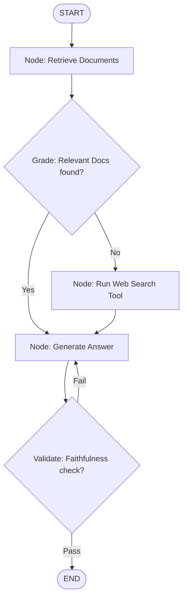

# Chapter 25: Corrective RAG (CRAG) and Self-RAG

**Estimated Reading Time**: 25 minutes  
**Difficulty**: Expert  
**Prerequisites**: Chapters 1–24.  
**Learning Objectives**:
1. Build self-correcting RAG loops using LangGraph state-machines.
2. Evaluate retrieved context relevance programmatically.
3. Implement Corrective RAG (CRAG) with web search fallback routing.
4. Implement Self-RAG loops to evaluate answer faithfulness.

---

## Introduction

Standard RAG pipelines are linear: they search, retrieve documents, and generate an answer. But what happens if the database search returns irrelevant documents? The model will hallucinate. What happens if the generated answer doesn't match the retrieved facts?

**Corrective RAG (CRAG)** and **Self-RAG** solve this by building validation loops. We evaluate the retrieved documents and generated answers, routing to search engines or regenerating text as needed.

In this chapter, we explore self-correcting RAG architectures and build a corrective search router node in TypeScript.

---

## Theory: Self-Correction Loops

### 1. Corrective RAG (CRAG)
CRAG adds a grader node after retrieval:
1. **Grade Documents**: Check if the retrieved documents are relevant to the query.
2. **Fallback Routing**: If similarity scores are below a threshold, the system flags the retrieval as failed and routes to a web search tool (e.g. Tavily/Google Search) to fetch current facts.

### 2. Self-RAG
Self-RAG adds a grader node after generation:
1. **Faithfulness Check**: Verify if the generated answer is supported by the retrieved context. If it contains claims not in the context, reject the answer and rewrite it.
2. **Answer Relevance**: Verify if the answer actually addresses the user's query.

```text
  Retrieve ──> [Grade Docs] ──(Low Score)──> [Web Search] ──> Generate
                      │                                          ▲
                      └────────(High Score)──────────────────────┘
```

---

## Real-World Analogy: Writing a Research Paper

Imagine writing a research paper:
* **Linear RAG**: You pull 3 random folders from a cabinet. Without checking if they are relevant, you copy paragraphs from them and hand in the paper.
* **Corrective RAG (CRAG)**: You pull the folders. You look inside and see they are empty or about the wrong topic. You put them away, go to the library, and look up current articles.
* **Self-RAG**: Once the paper is written, you double-check every sentence against your source folders. If you wrote a claim not supported by your sources, you rewrite it.

---

## Architecture Diagram: Self-Correcting RAG Graph

This diagram shows a state graph implementing document grading, fallback search routing, and generation validation loops.



---

## Code Example: Corrective Search Router Node (TypeScript)

Let's build a LangGraph workflow that grades retrieved documents and dynamically routes to a web search node if the database search returns no relevant results.

Create `corrective_rag.ts`:

```typescript
import { Annotation, StateGraph, START, END } from "@langchain/langgraph";

// 1. Define the RAG State Schema
const RagState = Annotation.Root({
  query: Annotation<string>({
    reducer: (x, y) => y ?? x,
    default: () => "",
  }),
  retrievedContext: Annotation<string>({
    reducer: (x, y) => y ?? x,
    default: () => "",
  }),
  documentScore: Annotation<number>({
    reducer: (x, y) => y ?? x,
    default: () => 0.0,
  }),
  answer: Annotation<string>({
    reducer: (x, y) => y ?? x,
    default: () => "",
  })
});

// 2. Define the Nodes

// Node A: Database Search
async function retrieveFromDb(state: typeof RagState.State) {
  console.log(`[Node: DB] Searching database for query: "${state.query}"`);
  
  // Simulating a database check. For test query "Kubernetes", we simulate a search failure
  if (state.query.toLowerCase().includes("kubernetes")) {
    return {
      retrievedContext: "",
      documentScore: 0.15 // Low similarity score
    };
  }
  
  return {
    retrievedContext: "PostgreSQL pgvector extension stores float embeddings.",
    documentScore: 0.88 // High similarity score
  };
}

// Node B: Web Search (Fallback)
async function searchWebFallback(state: typeof RagState.State) {
  console.log(`[Node: Web] Fallback triggered! Querying Google/Tavily for: "${state.query}"`);
  return {
    retrievedContext: "Kubernetes is an open-source container orchestration engine.",
    documentScore: 0.95
  };
}

// Node C: Generator Node
async function generateAnswerNode(state: typeof RagState.State) {
  console.log(`[Node: Generator] Generating answer using context: "${state.retrievedContext}"`);
  return {
    answer: `Resolved Answer: ${state.retrievedContext}`
  };
}

// 3. Define the Grader Routing Function
function routeContextCheck(state: typeof RagState.State) {
  const MIN_SCORE = 0.5;
  if (state.documentScore < MIN_SCORE) {
    console.log(`[Router] Context score too low (${state.documentScore}). Routing to Web Search...`);
    return "webSearch";
  }
  console.log(`[Router] Context score sufficient (${state.documentScore}). Routing to Generator...`);
  return "generate";
}

// 4. Construct Graph
const workflow = new StateGraph(RagState)
  .addNode("retrieve", retrieveFromDb)
  .addNode("webSearch", searchWebFallback)
  .addNode("generate", generateAnswerNode)
  
  .addEdge(START, "retrieve")
  
  // Register the grader router edge
  .addConditionalEdges("retrieve", routeContextCheck, {
    webSearch: "webSearch",
    generate: "generate"
  })
  
  .addEdge("webSearch", "generate")
  .addEdge("generate", END);

const app = workflow.compile();

// 5. Run Simulations
async function runSimulation() {
  console.log("--- RUN 1: Relational Query (DB Hit) ---");
  const res1 = await app.invoke({ query: "How does postgres store vectors?" });
  console.log(res1.answer);

  console.log("\n--- RUN 2: Unseen Query (DB Miss -> Fallback Web Search) ---");
  const res2 = await app.invoke({ query: "What is Kubernetes architecture?" });
  console.log(res2.answer);
}

runSimulation();
```

Run this file:
```bash
npx tsx corrective_rag.ts
```

Observe how the graph automatically routes to `webSearch` when the database search score falls below the threshold, and routes directly to the generator when the database search is successful.

---

## Best Practices, Production & Security Considerations

### 1. Log Retrieval Failures
Track and log instances where your RAG system triggers web search fallback. This tells you which documentation areas are missing from your vector store database.

---

## Common Mistakes

1. **Looping without constraints**: Creating self-RAG loops that regenerate text repeatedly when validation fails, without a maximum attempt limit.

---

## Exercises & Mini Project

### Exercise 1: Self-RAG validation addition
Add an `answerValidator` node. Check if the generated answer contains the context string. If it doesn't, route back to the generator node.

### Mini Project: Search agent with Tavily API
Replace the mock web search node in the code example with a real tool calling the Tavily Search API to retrieve live web results.

---

## Interview Questions

1. **Q**: What is the difference between standard RAG and Corrective RAG (CRAG)?
   * **A**: Standard RAG is linear and uses retrieved documents immediately. CRAG grades the relevance of retrieved documents first. If the score is too low, it routes to web search tools to retrieve current information.
2. **Q**: What is the purpose of Self-RAG loops?
   * **A**: Self-RAG checks if the generated answer is supported by the retrieved facts (faithfulness check) and addresses the query, preventing hallucinations.

---

## Navigation

**Prev:** [Chapter 24: RAG Advanced Retrieval](file:///d:/learning/theory/AI-tut/24_RAG_Advanced_Retrieval.md) | **Index:** [Course Overview](file:///d:/learning/theory/AI-tut/README.md) | **Next:** [Chapter 26: Reranking and Compression](file:///d:/learning/theory/AI-tut/26_RAG_Reranking_and_Compression.md)
