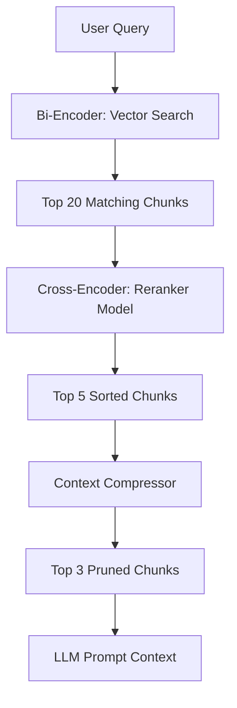

# Chapter 26: Reranking and Context Compression

**Estimated Reading Time**: 20 minutes  
**Difficulty**: Advanced  
**Prerequisites**: Chapters 1–25.  
**Learning Objectives**:
1. Compare Bi-Encoders and Cross-Encoders architectures.
2. Integrate Reranker models to optimize document rankings.
3. Apply Context Compression to prune noisy passages.
4. Implement a text overlap reranking utility in TypeScript.

---

## Introduction

Vector search is fast but can be imprecise. When you query a database for embeddings, the database performs a fast search over high-dimensional spaces. However, this search can miss semantic details, resulting in irrelevant documents ranking higher than relevant ones.

**Reranking** solves this by adding a secondary sorting step. We use a slower, highly precise model to evaluate the retrieved documents against the query.

In this chapter, we explore rerankers and build a text overlap reranking utility in TypeScript.

---

## Theory: Bi-Encoders, Cross-Encoders, and Compression

We split retrieval model architectures into two categories:

### 1. Bi-Encoders (Fast Retrieval)
Bi-Encoders generate embeddings for the query and documents independently. The vector database compares these pre-computed embeddings using cosine similarity.
* **Pros**: Sub-millisecond search times over millions of documents.
* **Cons**: Cannot capture deep token-level interactions between the query and documents.

### 2. Cross-Encoders (Precise Reranking)
Cross-encoders do not use pre-computed embeddings. They ingest the query and a document together, running self-attention across all tokens in both inputs simultaneously to calculate a precise relevance score.
* **Pros**: Highly accurate matching.
* **Cons**: Computationally slow.
* **Reranking Workflow**: Use a Bi-encoder (vector search) to retrieve the top 20 documents quickly, then use a Cross-Encoder (Reranker) to evaluate those 20 documents and select the top 3 to send to the LLM.

### 3. Context Compression
Before sending documents to the LLM, we prune them. We remove HTML tags, boilerplate text, and irrelevant sentences. This minimizes prompt sizes, saving token costs and reducing latencies.

---

## Real-World Analogy: Hiring a Candidate

Imagine hiring a software engineer:
* **The Bi-Encoder is the Resume Filter**: A software system scans 1,000 resumes for keywords like "Node.js" and filters them down to 20 candidates in milliseconds.
* **The Cross-Encoder is the Interviewer**: A senior engineer interviews the 20 candidates. The interviewer asks deep questions and evaluates their skills. This takes hours, but identifies the top candidate.

---

## Architecture Diagram: Reranking and Compression Pipeline

This diagram shows how documents flow from vector search, through a reranker and compressor, to the LLM.



---

## Code Example: Text Overlap Reranking Utility (TypeScript)

Let's build a mock reranking utility in TypeScript that evaluates retrieved chunks against a query using word overlaps and sorts them by relevance.

Create `reranker_utility.ts`:

```typescript
interface RetrievedChunk {
  id: string;
  text: string;
  score: number; // Original vector score
}

interface RerankedChunk extends RetrievedChunk {
  rerankScore: number;
}

class TextOverlapReranker {
  /**
   * Evaluates the relevance of a chunk to the query by calculating
   * word overlap (simulating a Cross-Encoder relevance score).
   */
  private calculateRelevance(query: string, text: string): number {
    const queryWords = new Set(query.toLowerCase().split(/\W+/).filter(w => w.length > 2));
    const textWords = text.toLowerCase().split(/\W+/);
    
    let overlaps = 0;
    textWords.forEach(word => {
      if (queryWords.has(word)) {
        overlaps++;
      }
    });

    // Score is normalized by query word count
    return overlaps / Math.max(queryWords.size, 1);
  }

  public rerank(query: string, chunks: RetrievedChunk[], limit: number = 2): RerankedChunk[] {
    console.log(`[Reranker] Evaluating ${chunks.length} candidate chunks against: "${query}"`);

    // 1. Calculate relevance scores for each chunk
    const scored = chunks.map(chunk => ({
      ...chunk,
      rerankScore: this.calculateRelevance(query, chunk.text)
    }));

    // 2. Sort by rerank score descending
    scored.sort((a, b) => b.rerankScore - a.rerankScore);

    console.log("\nReranking completed. Sorted candidate metrics:");
    scored.forEach((item, idx) => {
      console.log(`- Position ${idx + 1}: [ID: ${item.id}] Original Score: ${item.score.toFixed(2)} | Rerank Score: ${item.rerankScore.toFixed(2)}`);
    });

    return scored.slice(0, limit);
  }
}

// Ingestion and Setup
const query = "Configure Postgres configurations for database replication";

// Simulated raw vector search results (Bi-Encoder matches)
const rawMatches: RetrievedChunk[] = [
  { id: "chunk_1", text: "React state component values update on useState hook execution.", score: 0.72 },
  { id: "chunk_2", text: "PostgreSQL clustering requires database configurations setup.", score: 0.68 },
  { id: "chunk_3", text: "Database replication copy configurations are configured inside postgresql.conf settings.", score: 0.65 }
];

const ranker = new TextOverlapReranker();
const topResults = ranker.rerank(query, rawMatches, 2);

console.log("\n--- Top 2 Selected Reranked Results ---");
topResults.forEach((res, idx) => {
  console.log(`${idx + 1}. ID: ${res.id} | Content: "${res.text}"`);
});
```

Run this file:
```bash
npx tsx reranker_utility.ts
```

Observe how `chunk_3` jumps to position 1 after reranking because it shares more key context terms with the query, despite having a lower initial vector score due to embedding noise.

---

## Best Practices, Production & Security Considerations

### 1. Optimize API Calls
Rerankers (like Cohere Rerank) are host-billed APIs.
* **Production Rule**: Never run reranking over hundreds of documents. Restrict vector database query limits (e.g. `limit: 20`) to retrieve a small candidate set, and rerank only that set.

---

## Common Mistakes

1. **Relying solely on vector similarity**: Assuming that a high vector similarity score guarantees that a document is relevant, which can lead to irrelevant context being passed to the LLM.

---

## Exercises & Mini Project

### Exercise 1: Jaccard Rerank
Modify the reranker logic to use Jaccard Similarity ($A \cap B / A \cup B$) as the relevance metric and evaluate the performance difference.

### Mini Project: Cohere Rerank API Integration
Write a TypeScript script that integrates the official `@cohere-ai/sdk` and uses their Rerank endpoint to sort 5 text snippets against a search query.

---

## Interview Questions

1. **Q**: What is the difference between a Bi-Encoder and a Cross-Encoder?
   * **A**: A Bi-Encoder generates embeddings for queries and documents independently, allowing for fast similarity checks. A Cross-Encoder processes the query and document together, running self-attention across both inputs simultaneously to calculate a precise relevance score.
2. **Q**: Why do we use a two-stage retrieval pipeline (Vector Search + Reranking) in production RAG?
   * **A**: Vector search (Bi-Encoder) is fast and scales to millions of records, but can be imprecise. Reranking (Cross-Encoder) is precise but slow. Combining them gives us the speed of vector search and the accuracy of reranking.

---

## Navigation

**Prev:** [Chapter 25: Corrective RAG and Self-RAG](file:///d:/learning/theory/AI-tut/25_RAG_Corrective_and_Self_RAG.md) | **Index:** [Course Overview](file:///d:/learning/theory/AI-tut/README.md) | **Next:** [Chapter 27: Vector Databases Overview](file:///d:/learning/theory/AI-tut/27_Vector_Databases_Overview.md)
